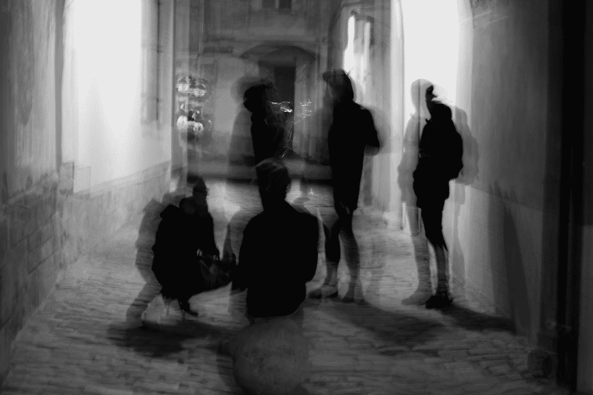

# 如何过滤 NSFW 图像并以编程方式模糊它们

> 原文：<https://itnext.io/how-to-filter-nsfw-images-and-programmatically-blur-them-2806f275daac?source=collection_archive---------3----------------------->



奥列西亚·耶梅茨在 [Unsplash](https://unsplash.com?utm_source=medium&utm_medium=referral) 上拍摄的照片

如果你正在创建一个用户可以上传图片的社交应用，那么内容审核应该是你的开发者最重要的任务。如果用户在你的平台上传任何令人不安的图片，可能会伤害他人的感情，或者在极端情况下，可能会成为法律问题。

因此，您最好删除或模糊违反内容政策的 NSFW 内容。在本教程中，我们将了解如何使用机器学习算法检测 NSFW 图像，然后自动模糊图像。

# 问题陈述

如果你有成千上万的用户，那就不可能手动检查每一张图片，然后用手模糊它们。这需要大量的人力和资金。

即使每天观看数百个令人不安的图像，一段时间后也会导致精神疾病。

# 我们的方法

在人工智能和机器学习的时代，我们可以利用人工智能技术为我们造福。通过使用人工智能，我们可以自动检测 NSFW 图像，并给它们一个 NSFW 分数。然后我们可以根据他们的 NSFW 分数有计划地模糊他们。这意味着开发者可以完全控制 NSFW 的内容。现在，你脑海中自然会出现这样的问题:我们如何自己制作一个人工智能模型？

显而易见的答案是你不需要。我们可以利用任何提供基于人工智能的解决方案的 SaaS(软件即服务)的 API。在本文中，我们使用[pix lab API](https://pixlab.io/cmdls)来自动检测 NSFW，并在图像超过某个 NSFW 极限时模糊图像。

# 文章的议程

在本文中，我们将制作一个 web 项目。在这个项目的帮助下，我向你们展示，

1.  如何检测在线图像的 NSFW 分数？
2.  如何检测局部图像的 NSFW 分数？
3.  如何根据 NSFW 分数模糊图像。

这是一篇长篇文章，我试图通过这篇文章给你尽可能多的实践机会。我相信，看完这篇文章后，你可以制作自己的 NSFW 检测系统。所以请喝杯咖啡，让我们开始我们的教程。

由于我在本教程中使用了 [Pixlab API 端点](https://pixlab.io/pricing)，请确保获得相同的 API 密钥。

# #需要代理服务器

Pixlab API 不支持 CORS(跨源资源共享)。为了避免安全问题，我们的浏览器不允许我们连接跨来源的网站。因此，我们需要一个代理服务器来绕过 CORS 限制。服务器没有 CORS 限制。

所以制作一个 Nodejs 和 Expressjs 服务器，并进行基本的设置。我们将所有的服务器代码都写在`server.js`文件中。

```
var express = require("express");
var cors = require("cors");
var fileUpload = require("express-fileupload");var app = express();// To parse application/json
app.use(express.json());// Enable cors on all request
app.use(cors());// File upload middleware
app.use(fileUpload());app.listen(5000, () => {
  console.log("Server is running in port 5000 and cors enable");
});
```

# #获取在线图片的 NSFW 评分

为了获得在线图像的 NSFW 分数，我们添加了一条到`/nsfw`的快速`GET`路线。我们使用 pexels 网站上的这张 NSFW 图片进行比较。

在`/nsfw`路径中，我们调用 Pixlab 的 [NSFW API 端点](https://pixlab.io/cmd?id=nsfw)。此端点需要两个参数。图像链接和 API 键。当 API 响应时，我们将响应直接发送给客户端。

```
app.get("/nsfw", (req, res) => {
  axios
    .get("https://api.pixlab.io/nsfw", {
      params: {
        img: "https://images.pexels.com/photos/2495905/pexels-photo-2495905.jpeg",
        key: process.env.PIXLAB_KEY,
      },
    })
    .then((resp) => res.json(resp.data))
    .catch((err) => console.log(err));
});
```

对于前端，通过制作一个`index.html`文件和一个名为`index.js`的 javascript 文件来创建一个新的 web 项目。链接 HTML 文件中的 javascript 文件。HTML 文件中的内容如下所示。

```
<!DOCTYPE html>
<html lang="en">
  <head>
    <meta charset="UTF-8" />
    <meta http-equiv="X-UA-Compatible" content="IE=edge" />
    <meta name="viewport" content="width=device-width, initial-scale=1.0" />
    <title>Pixlab NSFW</title>
  </head>
  <body>
    <script src="./index.js"></script>
  </body>
</html>
```

现在我们需要添加一个按钮来调用我们的 NSFW API 调用。

```
<button id="getscore">Get NSFW Score</button>
```

现在在`index.js`文件中，我们创建了一个函数`getnsfwscore()`。这个函数让我们调用代理服务器的`/nsfw`端点。

```
const getScore= document.getElementById("getscore");async function getnsfwscore() {
  try {
    let response =await fetch("http://localhost:5000/nsfw");
    console.log(await response.json());
  } catch (error) {
    throw error;
  }
}
```

作为响应，Pixlab NSFW API 返回一个 NSFW 分数。NSFW 分数从 0 到 1 不等。API 的典型响应如下所示。

```
{
  "score": 0.7187498807907104,
  "status": 200
}
```

现在你可以用这个分数来过滤上传的图片。

# 当地形象的 NSFW 评分

您也可以上传您的本地图像，以确定该图像的 NSFW 分数。这是一个分两步走的过程。首先，我们将这张图片上传到 Pixlab 的在线存储中，并获取该图片的在线链接。然后，我们可以使用 Pixlab 提供的在线图像 URL 来遵循前面的步骤。

为了上传我们的本地图像，我们使用 Pixlab 的 store API。我们在我们的 express 代理服务器中创建了一个`/upload`路由。为了支持图片上传，我们使用了 [express-fileupload](https://www.npmjs.com/package/express-fileupload) 插件。

为了将图像上传到商店 API，我们使用图像和 API 键发出一个`POST`请求。我们使用 FormData 对象来构造我们的查询。

```
app.post("/upload", (req, res) => {
  try {
    if (!req.files || Object.keys(req.files).length === 0) {
      return res.status(400).send("No files were uploaded.");
    }
    let image = req.files.image; const form = new FormData();
    form.append("file", image.data, image.name);
    form.append("key", process.env.PIXLAB_KEY); form.submit(
      {
        protocol: "https:",
        host: "api.pixlab.io",
        path: "/store",
        method: "POST",
        headers: {
          "Content-Type": `multipart/form-data; boundary=${form.getBoundary()}`,
        },
      },
      (err, resp) => {
        if (err) {
          res.status(503).send("File server is currently unavailable");
        }
        resp.pipe(res);
      }
    );
  } catch (error) {
    res.status(500).send(error);
  }
 }
);
```

上面的代码块发出请求，并将响应转发给前端。

在前端，我们使用一个文件输入来获取用户的本地图像。

```
<input type="file" id="localImage">
```

在我们的`index.js`文件中，我们使用`uploadToStore`函数将图像上传到我们的代理服务器。

```
async function uploadToStore(image) {
  const formData = new FormData();
  formData.append("image", image);
  try {
    let response = await fetch("http://localhost:5000/upload", {
      method: "POST",
      body: formData,
    });
    return await response.json();
  } catch (error) {
    throw "Fetch request give some error";
  }
}
```

现在我们监听文件输入中的任何变化。如果用户选择任何图像，我们称之为`uploadToStore`函数。

```
const localImage=document.getElementById("localImage");localImage.addEventListener("change",async(e)=>{
const  files=e.target.files;
  if (files.length >0){
    const file=files[0];
    let response= await uploadToStore(file);
    console.log(response);
  }
})
```

作为响应，我们获得本地图像的在线图像 URL。您可以使用这些 URL 在浏览器中查看图像。

```
{ ssl_link: "https://s3.amazonaws.com/media.pixlab.xyz/24p62f73c9583ec6.jpeg", 
  link: "https://s3.amazonaws.com/media.pixlab.xyz/24p62f73c9583ec6.jpeg", 
  id: "24p62f73c9583ec6.jpeg", 
  status: 200 
}
```

现在，为了计算这张图片的 NSFW 分数，你可以按照上一节的方法来计算一张在线图片的 NSFW 分数。

# 模糊图像编程

根据 NSFW 分数过滤图像后，我们模糊不合适的图像。为了模糊图像，我们使用 Pixlab 的[模糊 API 端点](https://pixlab.io/cmd?id=blur)。

我们在代理服务器中创建一个 GET `/blur`路由来调用 Pixlab 的 blur API。API 端点需要图像 URL、模糊半径、sigma 参数和您的 pixlab API 密钥。

```
app.get("/blur", (req, res) => {
  axios
    .get("https://api.pixlab.io/blur", {
      params: {
        img: "https://images.pexels.com/photos/2495905/pexels-photo-2495905.jpeg",
        radius: 50,
        sigma: 30,
        key: process.env.PIXLAB_KEY,
      },
    })
    .then((resp) => res.json(resp.data))
    .catch((err) => console.log(err));
});
```

您可以通过改变半径和西格玛参数来修改模糊过程。

在前端，我们做了一个`blurImage`函数。这个函数向代理服务器的`/blur`端点发出 GET 请求。

```
async function blurImage(){
  try {
    let response =await fetch("http://localhost:5000/blur");
    console.log(await response.json());
  } catch (error) {
    throw error;
  }
}
```

作为响应，Pixlab 服务器会返回您上传图像的模糊版本。您可以使用模糊图像 URL 来显示在您的前端。

```
{ ssl_link: "https://s3.amazonaws.com/media.pixlab.xyz/24p62f74006c5fa1.jpeg", 
  link: "https://s3.amazonaws.com/media.pixlab.xyz/24p62f74006c5fa1.jpeg", 
  id: "24p62f74006c5fa1.jpeg", 
  status: 200 
}
```

# 结论

您可以在我的 GitHub gist 中找到本教程的代码示例。如果你喜欢这个教程，可以在我的博客上阅读更多有趣的[教程。如果你有任何反馈，你可以在推特上找到我，我的名字是](https://hrishikeshpathak.com/blog) [@hrishikeshpathak](https://twitter.com/hrishikshpathak) 。

# 常见问题

## 我们可以不使用这些 API 来模糊我们的图像吗？

是的，你可以使用 CSS 模糊滤镜来模糊你网站上的任何图像。使用唯一的类、id 或 javascript 选择 HTML 图像元素，然后应用模糊滤镜。

```
filter: blur(4px);
```

在 [MDN 网站](https://developer.mozilla.org/en-US/docs/Web/CSS/filter-function/blur)上了解更多关于 CSS 模糊滤镜的信息。

## 使用代理服务器是强制性的吗？

不，我使用这个代理服务器只是为了演示。为此，您可以使用自己的生产服务器。我使用代理服务器只是为了绕过浏览器 CORS 的限制。