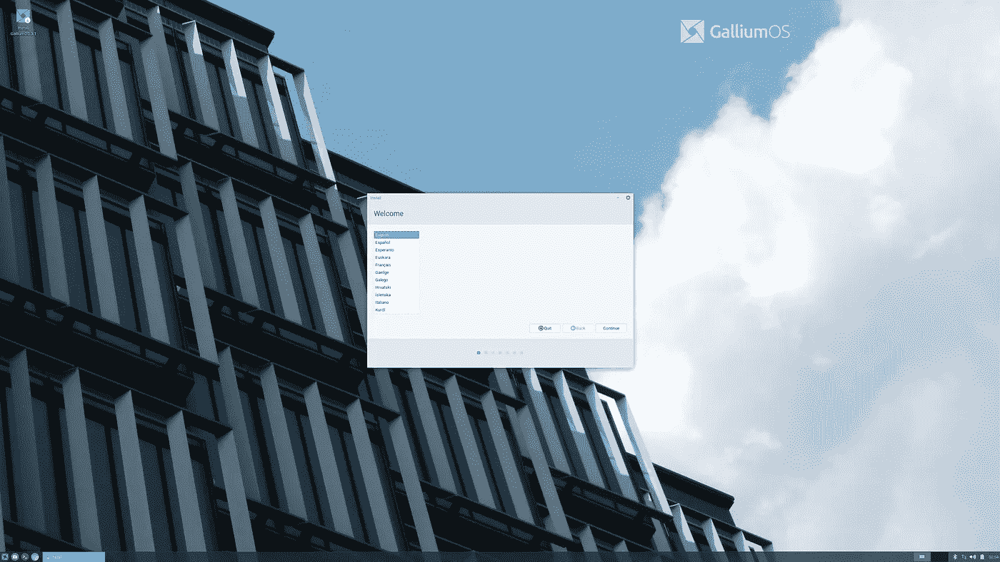

# 如何修复 Gulliam OS 3.1 中的(80%) HiDPI 问题

> 原文：<https://itnext.io/how-to-fix-80-hidpi-issues-in-gulliam-os-3-1-4723f18ad8a4?source=collection_archive---------3----------------------->



这就是 HiDPI 的样子。哈哈

2019 年，我买了一台 Chromebook(惠普 Chromebook 13 G1，2016 年发布)作为外出时的轻便笔记本电脑。我真的很喜欢用 Chrome 操作系统搭配面包丁，但是有一件事让我很困扰，那就是我不能运行容器。这就是为什么我决定尝试最新的镓操作系统，以在我的 Chromebook 中获得完整的 Linux 体验，但当我完成安装镓操作系统时，HiDPI 击中了我，我花了大量的时间来调查如何解决这个问题，但遗憾的是，我只能修复大约 60%的问题。为了节省可能遇到相同问题的人的时间，以下是我们所做的:

# 更新 xfce 配置

有一个名为`galliumos-hidpi`的包来修复 hidpi 问题，我检查了脚本，这个脚本是它的派生版本:

要执行这个 shell 脚本(比如说`fix-hidpi.sh`，您需要:

```
$ sh fix-hidpi.sh
```

# GTK3 秤

对于菜单中的小图标，您可以编辑`/etc/profile.d/gdkscale.sh`并添加以下几行:

```
export GDK_SCALE=2.875
export GDK_DPI_SCAL=0.38 # 1/2.875
```

# xfce 4-面板主题化

对于 xfce4-panel 中的电源管理器插件图标，创建`~/.config/gtk-3.0/gtk.css`并添加以下行:

```
#xfce4-power-manager-plugin * {
  -gtk-icon-transform: scale(0.38);
}
```

# 正在进行的工作

*   Lightdm
*   x 屏幕保护程序
*   扩展监视器(硬监视器)

希望它能帮助人们节省一些时间。(像 2 天。Lol)😃