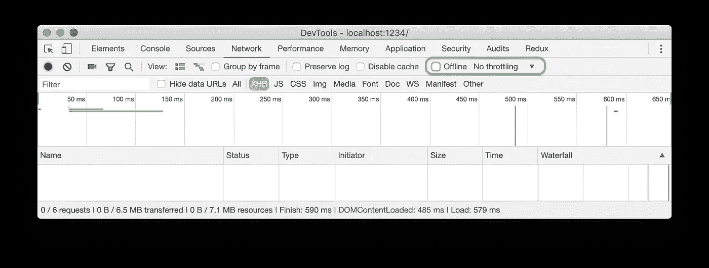
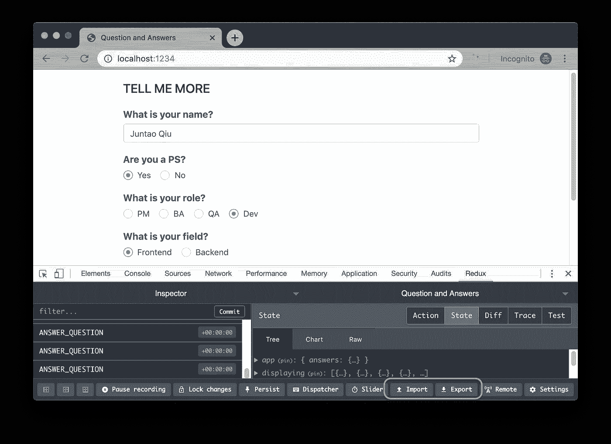
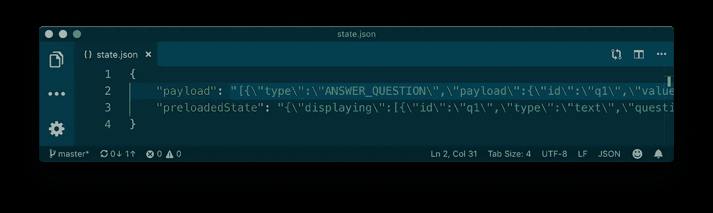
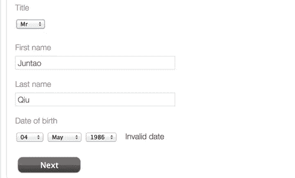
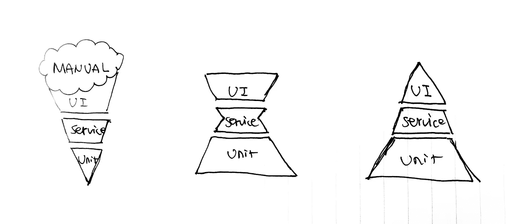

# 如何像老板一样修复缺陷

> 原文：<https://itnext.io/how-to-fix-a-defect-like-a-boss-7f5e3390c51d?source=collection_archive---------5----------------------->

> *如果我只有一个小时来修复产品中的一个缺陷，我会花 50 分钟写相应的测试，10 分钟修改代码。*

# 你确定这是缺陷吗？

QA 团队的 Santhosh 带着一张严峻而苍白的脸向你走来，甚至在他开口之前，你就知道出事了。他没有以“可爱的一天”或“怎么样了”之类的问候开始，而是直接向您描述重现“缺陷”的步骤，并告诉您 QA 团队中有人被阻止了。

您有点担心，试图深入代码并立即修复它。毕竟你是别人作品的依赖节点。我完全理解你想解决问题的心情，也不会妨碍其他人的工作，但是，在你启动 IntelliJ 之前，让我们仔细看看发生了什么，以及如何像老板一样处理这种情况。

# 开始之前

关键是要核实所有细节，以确保这是一个缺陷。作为修复缺陷的开发人员，您可以做的事情有:

*   缺陷是否发生在不受支持的浏览器中？
*   部署后缓存是否被清除？
*   他们是否有任何下游系统的计划内停机？
*   最近一次部署后验证了吗？(是否有机制检查哪个版本在 QA 环境上？)

有时候，检查完之后，你会发现你什么都不用做。桑托什会带着满意的表情愉快地离开，而你可以拿着你温暖的长黑继续浏览黑客新闻。

# 这是一个特点

无论 BA 如何仔细地分析需求，变化仍然是一些功能将会丢失。这可能类似于字段不匹配(下游提供一个字符串，但是前端将它用作一个数字)，或者在分析研讨会期间没有讨论的一些罕见的用户旅程。

如果`incorrect behaviour`对你来说听起来完全是新的，也许你应该和 BA 和 QA 一起谈谈，试着理解这是否是一个缺失的特性。如果是，一张新卡应该被放入待办事项列表中，并与其他卡一起优先处理。

# 如何再现？

一旦你确定这是一个缺陷，下一步就是尝试在本地重现它。不幸的是，这并不总是那么容易。

在实际项目中，您的应用程序可能有各种依赖关系:

*   它需要一个网络(快速)从远程获取数据
*   它需要浏览器功能来实现动画效果
*   它需要所有的后端服务正常工作

任何依赖关系失败都可能导致 UI 中的异常(有时是意外的和未处理的错误)——可能是一个空页面或带有大十字的弹出窗口`Something went wrong`。

# 网络故障

网络故障/问题是导致不同类型缺陷的最常见原因。有时，重现一个依赖于慢速网络或不可访问的 API 端点的缺陷是很复杂的。

然而，通过使用 Chrome 提供的一些方便的工具，你可以很容易地做到这一点。

想象一下，在加载指示器组件时有一个缺陷，它只发生在网络非常慢的时候，而在开发环境中，由于低延迟，dev 根本没有遇到这个问题。

然后你可以使用 Chrome 中的`throttling`工具模拟不同的网络情况，重现出来。

或者有时当网络完全不可访问时，您可能想要测试前端缓存系统是否按预期工作。只需勾选`offline`复选框并查看应用程序如何运行就很方便了。



在其他情况下，您可能只想阻止特定的 URL，并查看应用程序如何工作:


如您所见，一旦勾选了`Enable request blocking`，匹配的 url 将被阻止(状态栏显示`blocked:devtools`)。当你想模拟一些后台服务目前无法访问时，这非常方便。

# 类似向导的应用程序

在许多应用程序中，某处都有一个向导。几乎在每个应用程序中都可以看到收集用户个人信息或产品推荐问答的表单。

如果缺陷出现在 19 个步骤的最后一步，并且每个步骤都有 10 个强制输入字段，那么对于任何想要重现它的人来说，这绝对是一场灾难。

幸运的是，在一些扩展的帮助下，您可以跳过它，直接进入缺陷发生的地方。例如，如果应用程序是基于`React` + `Redux`的，
[Redux Devtools 扩展](https://github.com/zalmoxisus/redux-devtools-extension)支持`export`和`import`您的应用程序的状态，只需点击一下:



用代码设置它非常简单，就像:

```
const store = createStore(
    reducer, /* preloadedState, */
    window.__REDUX_DEVTOOLS_EXTENSION__ && window.__REDUX_DEVTOOLS_EXTENSION__()
);
```

`redux-dev-tools`将保存`initialise state`和应用程序启动以来发生的所有`events`。看起来像是:



对于使用不同前端框架的其他应用程序来说，表单自动填充程序可以以类似的方式帮助您。看看这样的扩展:[自动填充](https://chrome.google.com/webstore/detail/autofill/nlmmgnhgdeffjkdckmikfpnddkbbfkkk)，花几分钟学习如何定义规则，这会节省你很多时间。

# 找到根本原因

从我有限的经验来看，大部分的缺陷都与逻辑无关(`if-else`，`while`语句)，字段映射不正确或者代码中没有适当的保护就发现了一些空值。

# 无效数据

每个集成点都可能有这个问题，UI 到`BFF`，`BFF`到任何下游服务，甚至一个特性切换定义和使用它的地方。

```
features: {
    "ADVANCED_SEARCH": false
}
```

当代码使用这种切换时，人们可能会错误地使用不推荐的约定，如:

```
{
    features.TOGGLE_ADVANCED_SEARCH &&
    this.renderAdvancedSearchPanel()
}
```

将系统中的一个字段映射到另一个字段时，会出现另一个常见问题。因为不同的团队倾向于对同一件事使用不同的术语。例如，`Product`、`Item`、`Order`和`OrderItem`都可以指向`ShoppingCart`中的一个项目。而`User`、`Customer`、`Banker`和`Account`也可能指数据库中的同一个实体。

所以在处理积分时，要注意这个映射错误。

# 外部依赖性

一个应用程序可以有许多外部依赖项，日期/时间是其中最复杂的一个。

很多年前，我在做一些手工测试的时候遇到了一个很强的问题。这个系统似乎可以识别我输入的某个特定日期。



经过几个小时的调查，结果是由于世界上某些地区的昼间节约计划，验证逻辑将失败(这当然是比较逻辑的缺陷)。

如果你有管理员权限，很容易在操作系统中修改系统时区来模拟类似的情况(例如缓存过期)。

通过使用不同的工具和设置，也许再加上一些运气，您最终可以手动重现缺陷。是时候在代码层面修复了。

# 固定

最后，您找到了缺陷的根本原因，是时候对代码库进行一些更改了，看看效果如何。一个最常见的问题，尤其是对初学者来说，是人们倾向于直接进入代码，然后马上把它放到适当的位置。

但是相信我，这是你应该避免做的事情。一旦你相信你已经找到了缺陷的根本原因，有时候你必须抑制住这种冲动。

你首先应该做的是`write test(s) to reproduce it automatically`。

这样做有很多好处:

*   保护你或团队中的任何人在未来打破它
*   更有信心知道更改后它已修复
*   重塑测试金字塔的绝佳机会
*   使进一步的重构更加容易

…，这个列表可能会变得更长。

# 编写自动化测试

对于将数据映射到视图的简单行为，测试可能很简单，例如:

```
it('renders label', () => {
  const props = {
    label: 'Name'
  }

  const wrapper = shallow(<InputField {...props} />);
  expect(wrapper.find('h6').text()).toBe(props.label);
});
```

或者，可以通过以下方式测试下拉列表:

```
it('renders dropdown', () => {
  const props = {
    label: 'State',
    options: [
      { label: 'VIC', value: 'Victoria' },
      { label: 'WA', value: 'Western Australia' },
      { label: 'SA', value: 'Southern Australia' },
      { label: 'QLD', value: 'Queesland' },
      { label: 'NSW', value: 'New South Wales' }
    ]
  }; const wrapper = shallow(<Dropdown {...props} />);
  expect(wrapper.find('<Option>').length).toBe(props.options.length);
});
```

当然，并不是所有的缺陷都等同于这种简单程度，实际上，大多数缺陷都以某种方式与系统中的其他组件相关联。

例如，除了表示组件之外，`container`组件必须与远程 API 对话来获取数据。经常可以看到后端 API 在没有及时通知前端的情况下改变了它的模式。

在这些情况下，孤立的测试不会有帮助。我们需要某种程度的集成测试。它可能来自最高级别的测试，如端到端测试(由`selenium`或`cypress`进行)或覆盖 UI 和 BFF 之间契约的集成测试，有时两者都有。

一般来说，单元测试和集成测试会覆盖大多数情况。例如，您可以`mock`实际的网络请求/响应，通过使用 most 测试框架提供的`mock`和`stub`机制，只关注契约。

```
it('fetch data from remote', () => {
  axios.get = jest.fn().mockImplementation(() => Promise.resolve({data: books}));
});
```

在这种测试中，您可能需要模拟成功和失败的案例，并确保 UI 能够正确处理它们:

```
it('Fetch data with error', () => {
  axios.get = jest.fn().mockImplementation(() => Promise.reject({message: 'Something went wrong'}))
});
```

如果你真的需要以端到端的方式连接它们，可以使用[木偶师](https://github.com/GoogleChrome/puppeteer)或[柏树](https://www.cypress.io/)。两者都可以在浏览器中模拟最终用户的行为:

```
describe('Fancy Application', function() {
  it('Add new experience', function() {
    cy.visit('https://localhost:1234/experience'); cy.contains('Add').click();

    cy.get('.project').type('super')
    cy.get('.period').type('10 months')
    cy.get('.tech-stack').type('JavaScript') cy.get('h2').should('contain', 'Worked on project super for 10 months');
  });
});
```

请注意，在这一步中，您实际上是在自动地*重现缺陷*。它应该与手动步骤相同，但它会自动运行。一旦你有一个失败的测试，你就可以像你做 TDD 一样，简单地修复测试。

# 反思测试金字塔

虽然端到端对大多数开发人员来说是最有吸引力的，因为它是真实的，并且与后端(以及后端的下游)进行对话，但它可能对整体质量有害。

端到端的测试是昂贵的，当测试失败时，它是耗时且难以调试的。此外，在许多情况下，它比你想象的更脆弱。

在您在测试金字塔的最高层添加端到端测试之前，请确保您首先添加了足够的较低层测试，并使测试通过。通常，仅添加关键路径的端到端就足够了。

在修复缺陷时添加测试的另一件事是重构代码和测试。当实现发生变化时，删除多余的测试，重新构建测试的层次(添加新的`describe`块或对其中一些进行分组以使其更有意义)。

在每一步行动中，努力重塑测试金字塔，使其更接近理想状态。



# 防御性编程

在许多情况下，像`shoppingCart[0].item.name.toLowerCase()`这样的数据访问器可能会导致严重的缺陷。当然，你也不想写难看的保护代码，比如:

```
if(shoppingCart && shoppingCart.length > 0) {
    if(shoppingCart[0].item && shoppingCart[0].item.name) {
        return shoppingCart[0].item.name.toLowerCase();
    }
}
```

来自`lodash`的`_.get`能以一种更安全的方式简化你的代码:

```
_.get(cart, 'shoppingCart[0].item.name');
```

其他常用的技巧有:

```
axios.get().then(response => response.data.products || []);
axios.get().then(response => response.data.products || {});
```

只需编写一些回退单元测试，这样可以为您节省许多调试时间。

# 修复缺陷后

一般来说，当你修复了缺陷，就像你做了一个专题报道一样，你可以与 QA 和 BA 一起进行小型展示(桌面检查)。

我在各种项目中做的另一个常见实践是修复后知识共享，你可以与团队中的其他开发人员建立一个快速的经验和学习共享。只要确保其他人不会在类似的情况下犯同样的错误，最重要的是，在分享期间，你可以学到很多关于缺陷修复技术和修复它所需的知识。

此外，它帮助团队建立一个健康的失败和学习的文化，这对于交付高质量的代码和结果是至关重要的。

# 摘要

当你有一个缺点时，一开始不要惊慌。通过询问一些预先检查来尝试确定它是一个缺陷。通过正确使用 chrome 开发工具，你应该能够非常有效地复制它。一旦你可以手动复制它，写一些测试使它自动化。

在测试阶段，您可能还需要对测试和代码进行一些重构。一旦您运行了失败的测试，那么您就可以像对任何其他特性开发一样修复它。

在所有这些步骤完成后，代码将处于一个良好的状态，要么添加更多的新功能，要么修复一些其他缺陷。遵循这种方法的代码库工作人员可以在每次提交后使代码库变得越来越好。