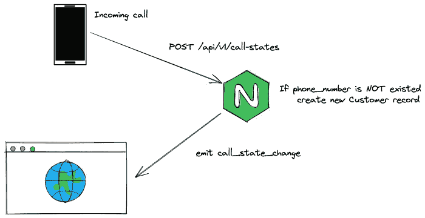
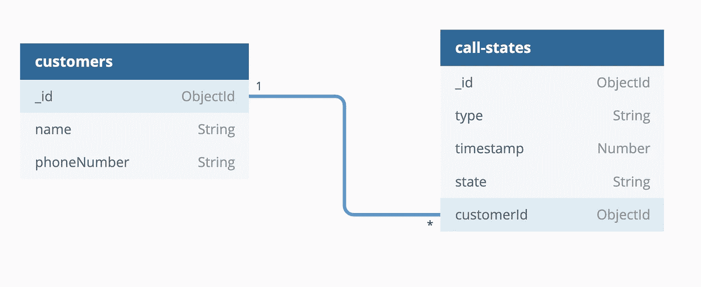
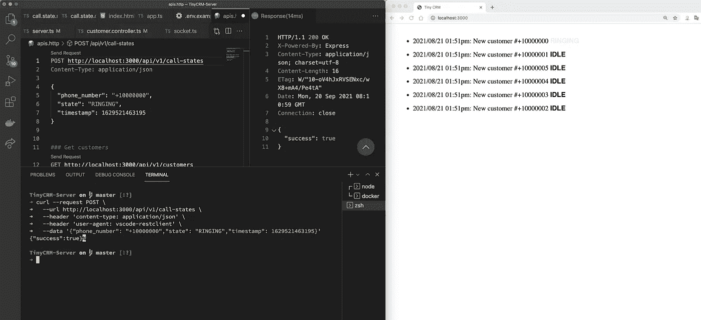
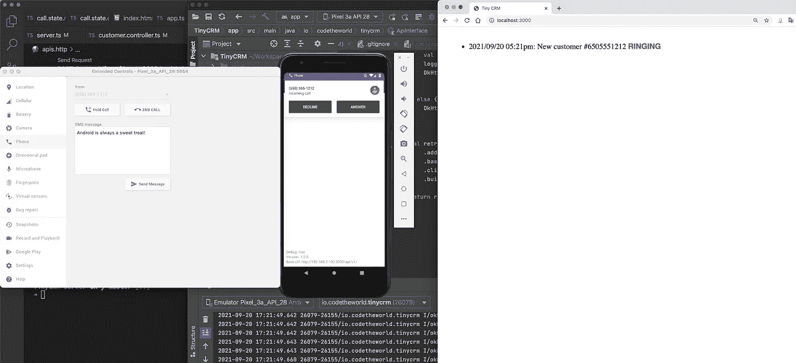

# 如何将 Android 设备的来电信息转发到 Web 端？第 2 部分:服务器端

> 原文：<https://itnext.io/how-to-forward-call-information-from-android-device-to-web-side-part-02-server-side-98f200fa888?source=collection_archive---------6----------------------->



系统概况

这个故事是该系列的下一部分——如何将来自 Android 设备的呼叫信息转发到 Web 端？在第 01 部分中，我们完成了一个 Android 应用程序的构建。

在这个故事中，我们将完成服务器端部分——处理来自应用程序的请求。

# 带有 Typescript 的初始服务器项目

在这个项目中，我使用 Nodejs v12.22.6。

初始节点项目:

```
$ npm init -y
```

安装依赖项包:

```
# dependencies
$ npm install dotenv express moment mongoose socket.io -S# dev dependencies
$ npm install @types/dotenv @types/express @types/moment @types/mongoose @types/socket.io ts-node-dev typescript
```

创建 Typescript 配置文件:

```
$ npx tsc --init
```

这是我的`tsconfig.json`文件:

```
{
  "compilerOptions": {
    "target": "ES2018",
    "module": "commonjs",
    "sourceMap": true,
    "outDir": "./dist",
    "rootDir": "./src",
    "strict": true,
    "esModuleInterop": true,
    "skipLibCheck": true,
    "forceConsistentCasingInFileNames": true
  }
}
```

现在，让我们用 expressjs 创建一个简单的 http 服务器:

```
// src/app.ts
import express from 'express';const app = express();
app.use(express.json());app.get('/', (req, res) => {
  res.json({ message: 'Hello World!' });
});export default app;
```

创建`server.ts`文件来启动服务器:

```
// src/server.ts
import * as http from 'http';
import dotenv from 'dotenv';
import app from './app';(async () => {
  dotenv.config(); // load environment variable from .env file const server = http.createServer(app); server.listen(process.env.PORT, () => {
    console.log(`listening on *: ${process.env.PORT}`);
  });
})();
```

用`.env`文件:

```
# .env
PORT=3000
```

在开发模式下启动服务器:

```
$ npx ts-node-dev src/server.ts[INFO] 15:39:41 ts-node-dev ver. 1.1.8 (using ts-node ver. 9.1.1, typescript ver. 4.3.5)
listening on *: 3000
```

为了确保它能工作，你可以用你的浏览器访问[http://localhost:3000](http://localhost:3000)URL。

# 定义猫鼬模型

我们定义了两个集合:`customers`和`call-states`。



数据库图表

`customers`收款商店客户信息:

`call-states`收集门店来电信息:

我们只处理`incomming`状态，那么`type`的值就是`incomming`

我使用 docker 启动一个 MongoDB 服务:

```
$ docker run -it --rm -p 27017:27017 mongo
```

更新`.env`文件以提供`MONGO_URI`值:

```
# .env
PORT=3000
MONGO_URI=mongodb://localhost:27017/tiny-crm
```

`tiny-crm`是数据库名称。

然后，在启动 http 服务器之前，更新`server.ts`文件以启动连接:

```
// src/server.ts
import * as http from 'http';
import dotenv from 'dotenv';
import app from './app';
import mongoose from 'mongoose';(async () => {
  dotenv.config(); const server = http.createServer(app); await mongoose.connect(process.env.MONGO_URI as string, {
    useNewUrlParser: true,
    useUnifiedTopology: true,
    useCreateIndex: true,
  }); server.listen(process.env.PORT, () => {
    console.log(`listening on *: ${process.env.PORT}`);
  });
})();
```

# 处理呼叫状态 API

我们需要一个 express handle 函数来处理来自 Android 应用程序的请求。

带有正文的请求`POST /api/v1/call-states`如下所示:

```
{
  "phone_number": "+199999999",
  "state": "RINGING",
  "timestamp: 1631952316686
}
```

让我们创建`call-state.controller.ts`文件:

尝试通过`phoneNumber`找到一个客户，如果该客户已经存在，只需为该客户创建`call-state`。

如果客户不存在，我们将用来电号码创建一个新客户，然后为新客户创建`call-state`。

向 http 服务器注册控制器功能。让我们更新`app.ts`文件:

```
// src/app.ts
import express, { Router } from 'express';
import callStateController from './controllers/call.state.controller';const app = express();
app.use(express.json());app.get('/', (req, res) => {
  res.json({ message: 'Hello World!' });
});const router = Router();
router.post('/call-states', callStateController.handleNewCallState);app.use('/api/v1', router);export default app;
```

尝试向新端点发送请求:

```
$ curl --request POST \
  --url [http://localhost:3000/api/v1/call-states](http://localhost:3000/api/v1/call-states) \
  --header 'content-type: application/json' \
  --data '{"phone_number": "+10000000","state": "RINGING","timestamp": 1629521463195}'# Response
{"success":true}# Verify document in mongodb
$ docker exec -it mongo_container_id bash
$ mongo
> use 'tiny-crm';
> db.customers.find()
{ "_id" : ObjectId("614838642532b817ddb167c6"), "phoneNumber" : "+10000000", "name" : "New customer", "__v" : 0 }
> db['call-states'].find()
{ "_id" : ObjectId("614838642532b817ddb167c8"), "type" : "incoming", "customerId" : ObjectId("614838642532b817ddb167c6"), "timestamp" : 1629521463195, "state" : "RINGING", "__v" : 0 }
```

# 用 Socket.io 向 Web 客户端通知呼叫状态事件

我们希望当 android 客户端应用程序向 http 服务器发送请求时，请求信息将被转发到我们的 web 客户端。

为此，我们将实现一个简单的 websocket 服务器。为了监听呼叫状态事件，客户端将订阅 websocket 服务器。客户端 web 将显示或更新呼叫状态信息。

用 socket.io 创建一个简单的 websocket 服务器

我们导出`emitCallStateChange`函数向订阅者发出`call_state_change`事件。

更新`server.ts`文件，用同一个 http 服务器实例启动 socket 服务器和 http 服务器。

现在，只需通过 socket 服务器向客户端发出新的呼叫状态信息:

最后一部分是 web 客户端:`public/index.html`

在简单的 HTML 页面上，我们使用默认设置连接到套接字服务器，并列出`call_state_change`事件。当我们收到事件时，如果客户的状态存在，只需删除旧状态并更新新状态。

更新 app.ts 文件以将 index.html 文件作为静态文件:

`.env`

```
PORT=3000
MONGO_URI=mongodb://localhost:27017/tiny-crm
PUBLIC_DIR=/Users/supercat/PetProjects/TinyCRM-Server/public # absolute path to the public folder
```

测试新的 HTML 页面和套接字服务器:



测试新页面

# 将 Android 应用程序与服务器连接

让我们更新 android 应用程序的`ApiInterface.kt`文件中的`BASE_URL`变量和`POST`装饰器:

```
...
[@POST](http://twitter.com/POST)("call-states")
fun postPhoneState([@Body](http://twitter.com/Body) body: RequestBody): Call<Any>companion object {
    private const val BASE_URL = "[http://192.168.2.100:3000/api/v1/](http://192.168.2.100:3000/api/v1/)"
...
```

用你的局域网 IP 地址替换`192.168.2.100`。



假电话

仅此而已！

# 结论

我们已经完成了应用程序的服务器端和 web 客户端。

在我们的项目中，android 应用程序是项目的重点。对我这个后端开发人员来说，这有点难，但这是一次有趣的经历。

希望我的故事能帮助你有一些思路来完成你的申请。

本文中使用的源代码发布在 Github 上:

*   [安卓应用](https://github.com/codetheworld-io/Tiny-CRM-Android)
*   [服务器](https://github.com/codetheworld-io/Tiny-CRM-Server)

感谢您的阅读！