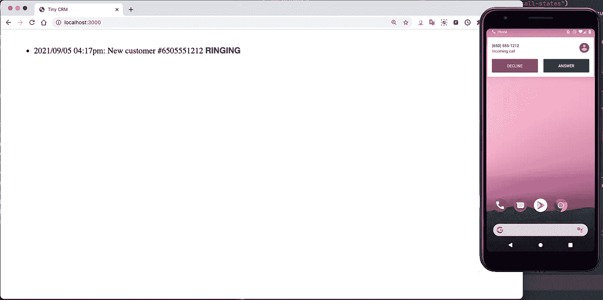
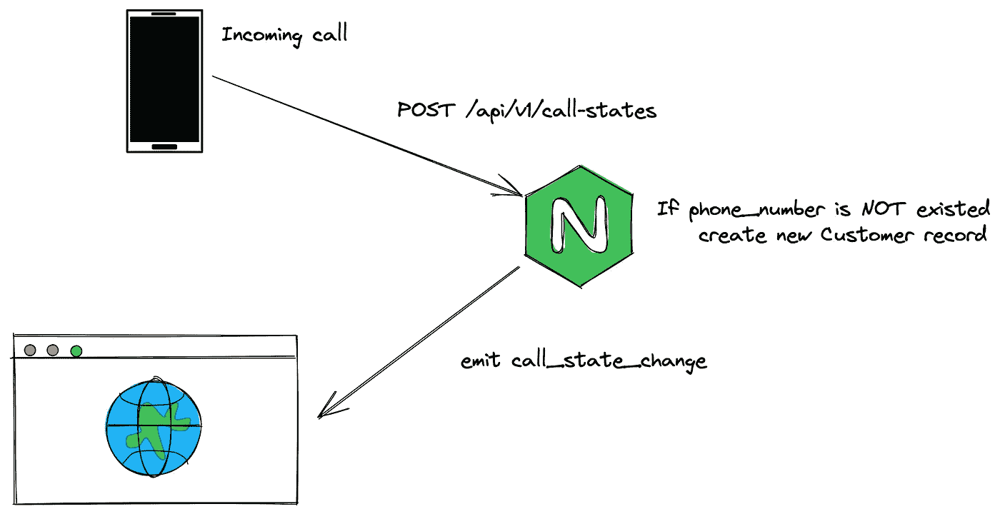
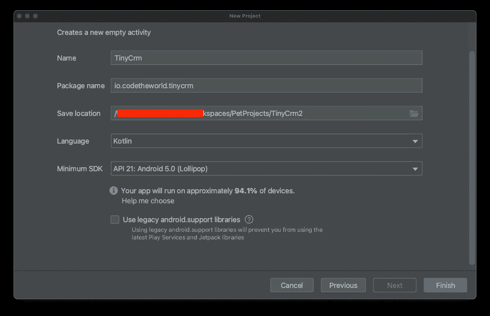
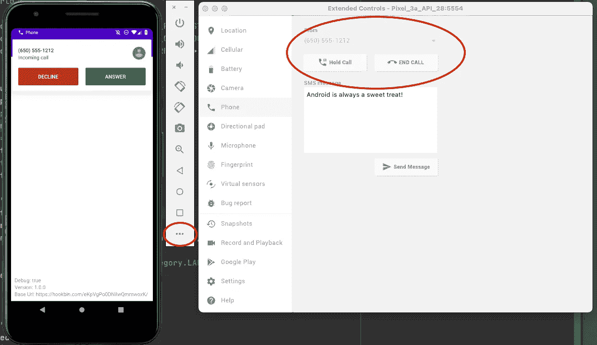
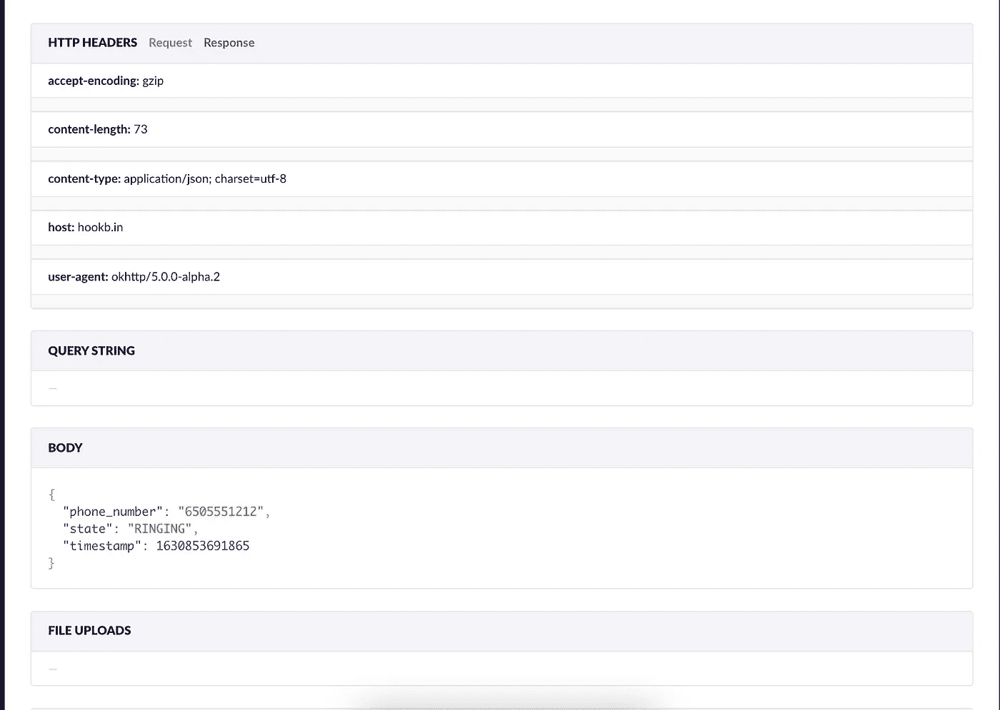

# 如何将 Android 设备的来电信息转发到 Web 端？第 1 部分:Android 应用程序

> 原文：<https://itnext.io/how-to-forwarding-a-call-information-from-android-device-to-web-side-part-01-android-application-6f2ddfba0291?source=collection_archive---------5----------------------->



振铃状态

在这个故事中，我们将学习如何通过 api 将 android 设备与我们的服务器连接起来，服务器通过 web socket 将数据发送到 web 客户端。转移呼叫状态就是一个很好的例子。当你想建立一个 CRM(客户关系管理)(或类似的东西)时，这是一个核心特性。当您接到客户的电话时，所有客户信息(姓名、订单、备注……)都会出现在 web 应用程序上。

这个故事需要一些关于 Android，NodeJS 开发的知识。我们不会深入探讨如何创建一个 android 应用程序，以及带有 Mongo 数据库的 NodeJS 服务器。这是我们将达到的目标列表:

*   Android 应用:开发环境有 Android studio，Kotlin，BroadcastReceiver，调用 http api 有改造…
*   NodeJS 服务器:Typescript，express，socket.io，mongo，mongose…

这个故事包括两部分，你正在阅读的是第一部分——构建 android 应用程序。

# 概观



系统概述。通过[https://excalidraw.com/](https://excalidraw.com/)创建

我们的服务器是 http 服务器，它提供了一个 api — `POST /api/v1/call-states`。Android 应用程序将通过这个 api 发送通话数据。

它也是一个套接字服务器，一个 web 客户端可以连接到服务器并等待关于`call_state_change`事件的消息。

# Android 应用程序

让我们用 android studio 创建一个简单的 Android 应用程序。您可以创建一个`No Activity`应用程序，因为在这个故事中一个活动是多余的。



新项目

我们在项目中使用 Kotlin，并选择 API 21 作为最低 SDK 版本。

接下来是一个 http 客户端库，这是可选部分。你可以使用你最喜欢的图书馆，这取决于你。[改造](https://square.github.io/retrofit/)是我最喜欢的库。

将此代码片段添加到 app gradle 文件的依赖关系块中

```
// app/build.gradle...
dependencies **{
    ...** // Network
    implementation 'com.squareup.retrofit2:retrofit:2.9.0'
    implementation(platform("com.squareup.okhttp3:okhttp-bom:4.9.1"))
    implementation('com.squareup.okhttp3:okhttp:5.0.0-alpha.2')**}** ...
```

创建一个 Kotlin 文件来创建一个改型实例和函数来调用 api。

```
// ApiInterface.kt
import okhttp3.OkHttpClient
import okhttp3.RequestBody
import retrofit2.Call
import retrofit2.Retrofit
import retrofit2.http.Body
import retrofit2.http.POST

interface ApiInterface {

    // *TODO: Update api path @POST("call-states")* @POST(".")
    fun postPhoneState(@Body body: RequestBody): Call<Any>

    companion object {
        // *TODO: Update base url value* private const val BASE_URL = "[https://hookbin.com/eKpVgPo0DNilwQmmwoxK](https://hookb.in/eKpVgPo0DNilwQmmwoxK/)/"

        fun retrofit(): ApiInterface {
            val okHttpClient = OkHttpClient.Builder()
                .build()

            val retrofit = Retrofit.Builder()
                .baseUrl(BASE_URL)
                .client(okHttpClient)
                .build()

            return retrofit.create(ApiInterface::class.*java*)
        }
    }
}
```

我们有一个静态函数，它返回一个改型实例— `retrofit`。

`@POST(“.”)`向`BASE_URL`提出发布请求。

此时，我们使用[https://hookbin.com/](https://hookbin.com/)服务来检查来自我们应用程序的 http 请求。

现在我们进入这个故事的主要部分——创建一个`BroadcastReceiver`。`onReceive`该类的功能将在电话有呼入或呼出时执行。呼出将被忽略，我们只处理呼入。

`currentState`是一个静态变量，它用于检测一个呼出。如果电话状态从`IDLE`变为`OFFF_HOOK` = >呼出。

`onReceive`当手机状态改变时，将执行该功能。我们将电话号码和状态传递给一个私有函数— `postStateToServer`。在这个函数中，我们将所有逻辑放在一个 try/catch 块中，以忽略所有意外的异常。try/catch blook 确保应用程序在出错时仍能运行。

`postStateToServer`只需创建一个 http 请求。它创建一个 json 对象，该对象包含`phone_number`、`state`和`timestamp`属性。然后将 json 对象传递给`ApiInterface.retrofit().postPhoneState`。在 android 应用程序中，我们不关心 api 响应。

我们已经有一个`BroadcastReceiver`，现在，我们必须为 android 系统注册它。更新`AndroidManifest.xml`文件:

第 5、6、7 行定义了所需的权限:

*   `READ_CALL_STATE`进入手机的通话状态。
*   `READ_CALL_LOG`获取来电号码。
*   `INTERNET`调用我们的 api。

第 28 到 35 行将我们的类— `CallReceiver`注册为接收者，其动作是`PHONE_STATE`。

现在，让我们在 android 手机上构建我们的应用程序。你可以使用一个虚拟设备，我们可以创建一个虚假的来电设备。



打个假电话

然后刷新 hookbin.com 的链接，我们可以看到一些类似这样的内容:



Http 请求内容

仅此而已！

# 结论

我们已经完成了 android 应用程序。如果你是一个 android 开发者，这将是非常容易的。但我希望它足够简单，让你们都能理解。

在下一个故事中，我们将创建一个 http 服务器来处理电话状态请求，并将电话状态转发给一个简单的 web 客户端。

应用源代码没有完成，那么我会在下一个故事里上传到 Github。

感谢您的阅读！