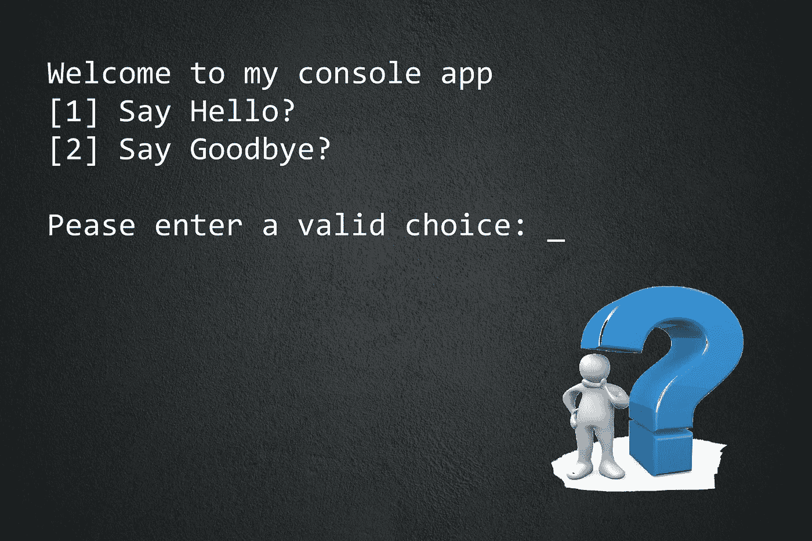
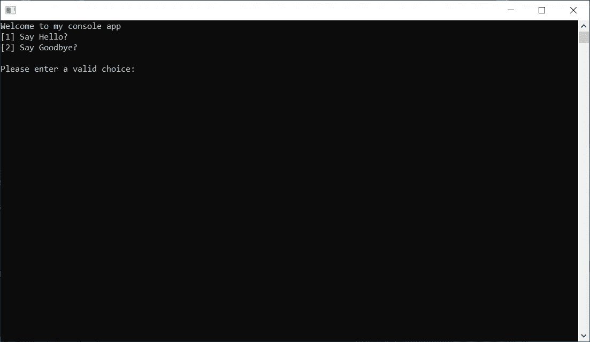
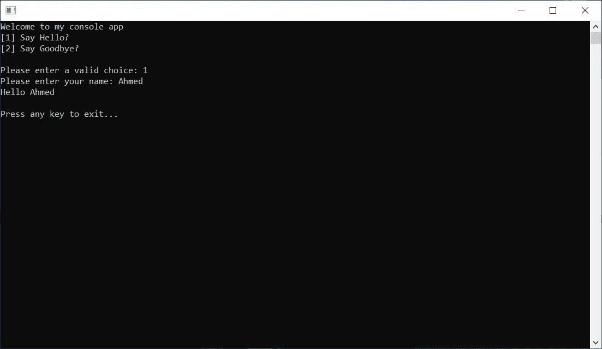
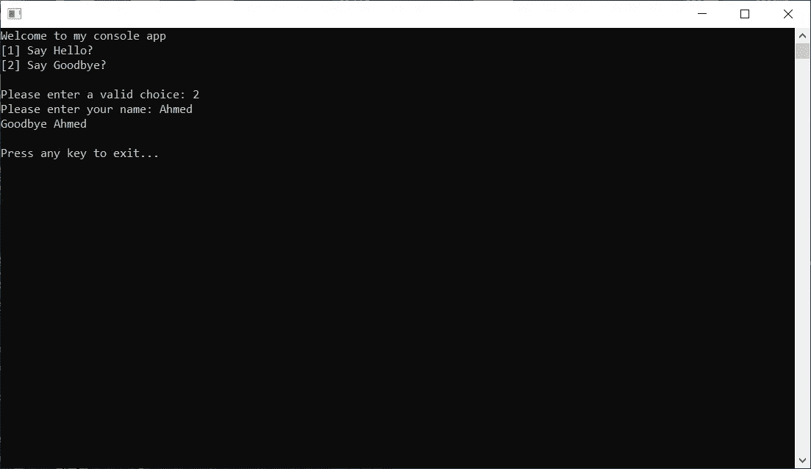

# 如何全面覆盖。带有单元测试的. NET C#控制台应用程序

> 原文：<https://itnext.io/how-to-fully-cover-net-c-console-application-with-unit-tests-446927a4a793?source=collection_archive---------1----------------------->

## 单元测试

## 使用测试驱动开发(TDD)、依赖注入(DI)、控制反转(IoC)和 IoC 容器实现 100%覆盖率的最佳实践。

由[安妮·斯普拉特](https://unsplash.com/@anniespratt?utm_source=unsplash&utm_medium=referral&utm_content=creditCopyText)在 [Unsplash](https://unsplash.com/?utm_source=unsplash&utm_medium=referral&utm_content=creditCopyText) 拍摄，由[艾哈迈德·塔里克](https://medium.com/@eng_ahmed.tarek)修改

我的一些同事抱怨说，有时他们不能应用 TDD 或者为一些模块或应用程序编写单元测试，控制台应用程序**就是其中之一。**

当输入通过按键传递，输出显示在屏幕上时，我该如何测试控制台应用程序？！！

实际上，这种情况时有发生，你会发现自己试图为一些你似乎无法控制的事情编写单元测试。

 [## 订阅艾哈迈德的时事通讯？

### 订阅艾哈迈德的时事通讯📰直接获得最佳实践、教程、提示、技巧和许多其他很酷的东西…

medium.com](https://medium.com/subscribe/@eng_ahmed.tarek) 

照片由 [Unsplash](https://unsplash.com/) 上的[sanga Rima Roman Selia](https://unsplash.com/@sxy_selia?utm_source=unsplash&utm_medium=referral&utm_content=creditCopyText)拍摄

# 误解

事实是，你没抓住重点。你不需要测试“控制台”应用，你要测试的是它背后的**业务逻辑**。

当你在构建一个控制台应用的时候，你在构建一个给某人使用的应用，他期望传递一些输入并得到一些相应的输出，**而这才是你真正需要测试的**。

您不想测试`System.Console`静态类，这是一个内置类，包含在。NET 框架，在这一点上你必须信任微软。

现在，您需要考虑如何将这两个领域分成单独的组件或模块，这样您就可以开始为您想要的一个编写测试，而不会干扰另一个，这就是我要向您解释的…

马克·弗莱彻·布朗在 [Unsplash](https://unsplash.com/?utm_source=unsplash&utm_medium=referral&utm_content=creditCopyText) 上的照片

# 这个想法

首先，让我们想出一个愚蠢的简单的控制台应用程序的想法，并将其作为一个例子来应用。

首先，你有这个简单的菜单。

图片由 [Ahmed Tarek](https://medium.com/@eng_ahmed.tarek)

当您选择选项 **1** 并输入**您的姓名**时，您会得到如下图所示的 **Hello** 消息。按回车键将关闭应用程序。

图片由[艾哈迈德·塔里克](https://medium.com/@eng_ahmed.tarek)拍摄

当您选择选项 **2** 并输入**您的姓名**时，您会得到如下图所示的**再见**消息。按回车键将关闭应用程序。

图片由[艾哈迈德·塔里克](https://medium.com/@eng_ahmed.tarek)拍摄

太简单了吧？是的，我同意你。然而，让我们假设 UI、字符串、字符和你在屏幕上看到的一切都是需求的一部分。

这意味着，如果您要编写单元测试，这也应该以一种方式来涵盖，即产品代码中单个字符的微小变化应该会触发失败的单元测试。

由[布雷特·乔丹](https://unsplash.com/@brett_jordan?utm_source=unsplash&utm_medium=referral&utm_content=creditCopyText)在 [Unsplash](https://unsplash.com/?utm_source=unsplash&utm_medium=referral&utm_content=creditCopyText) 上拍摄的照片

## 这是我们的计划:

1.  以传统的糟糕方式构建控制台应用程序。
2.  看看我们能不能写出自动化的单元测试。
3.  以良好的方式重新实现控制台应用程序。
4.  写一些单元测试。

照片由[迈赫迪](https://unsplash.com/@messrro?utm_source=unsplash&utm_medium=referral&utm_content=creditCopyText)在 [Unsplash](https://unsplash.com/?utm_source=unsplash&utm_medium=referral&utm_content=creditCopyText) 上拍摄

# 不好的方式

简单地说，在一个地方做所有的事情。

我们在这里可以注意到:

1.  一切都在一个地方。
2.  我们直接使用静态的`System.Console`类。
3.  不撞上`System.Console`就无法测试业务逻辑。

照片由[布雷特·乔丹](https://unsplash.com/@brett_jordan?utm_source=unsplash&utm_medium=referral&utm_content=creditCopyText)在 [Unsplash](https://unsplash.com/?utm_source=unsplash&utm_medium=referral&utm_content=creditCopyText) 上拍摄

# 尝试编写单元测试

真的吗？您真的希望能够为该代码编写单元测试吗？

## 挑战如下:

1.  依赖于像`System.Console`这样的静态类。
2.  无法定义和隔离依赖关系。
3.  不能用模仿或存根替换依赖关系。

如果你能为此做些什么，你就是一个英雄…相信我。

照片由[沃尔坎·奥尔梅斯](https://unsplash.com/@volkanolmez?utm_source=unsplash&utm_medium=referral&utm_content=creditCopyText)在 [Unsplash](https://unsplash.com/?utm_source=unsplash&utm_medium=referral&utm_content=creditCopyText) 上拍摄

# 好方法

现在，让我们将我们的解决方案分成更小的模块。

## 控制台管理器

这是负责从控制台提供我们需要的功能的模块…任何控制台。

该模块将由两部分组成。抽象概念。
2。实现。

因此，我们将有以下内容:

1.  这是定义我们对任何控制台管理器的期望的界面。
2.  `ConsoleManagerBase`:这是实现`IConsoleManager`的抽象类，提供所有控制台管理器之间的任何通用实现。
3.  `ConsoleManager`:这是默认的控制台管理器实现，它包装了`System.Console`，实际上在运行时使用。

我们在这里可以注意到:

1.  现在我们有了`IConsoleManager`。
2.  在编写单元测试时，我们可以使用 Mocks 和 Stubs 来代替`IConsoleManager`。
3.  对于通用基类`ConsoleManagerBase`，我们没有提供任何通用实现供孩子使用。
4.  我知道这不是最好的做法，但是，我这样做只是为了提醒你，这个选项是存在的，你可以在任何需要的时候使用它。

## 程序管理器

这是负责提供主要应用程序功能的模块。

这个模块将由两部分组成:
1。抽象概念。
2。实现。

因此，我们将有以下内容:

1.  这是定义我们对任何项目经理的期望的界面。
2.  `ProgramManagerBase`:这是实现`IProgramManager`的抽象类，提供所有程序管理器之间的任何公共实现。
3.  `ProgramManager`:这是运行时实际使用的默认程序管理器实现。这也要看`IConsoleManager`了。

我们在这里可以注意到:

1.  现在我们已经很好地定义了`ProgramManager`对`IConsoleManager`的依赖关系。
2.  我们有`IProgramManager`,在编写单元测试时，我们可以使用 mocks 和 stubs 来代替`IProgramManager`。
3.  对于通用基类`ProgramManagerBase`,我们没有提供任何通用实现供孩子使用。
4.  我知道这不是最好的做法，但是，我这样做只是为了提醒你，这个选项是存在的，你可以在任何需要的时候使用它。

照片由 [Goh Rhy Yan](https://unsplash.com/@gohrhyyan?utm_source=unsplash&utm_medium=referral&utm_content=creditCopyText) 在 [Unsplash](https://unsplash.com/?utm_source=unsplash&utm_medium=referral&utm_content=creditCopyText) 上拍摄

# 放弃

`ProgramManager`级可以分成更小的部分。这将使跟踪和覆盖单元测试变得更加容易。然而，这是我留给你去做的事情。

# 控制台应用程序

这是主要应用。

这里我们将使用 [**Ninject**](http://www.ninject.org/) 作为我们的 IoC 容器。它使用简单，你可以随时查看他们的在线文档。

在主控制台应用程序项目上，我们将创建`NinjectDependencyResolver.cs`文件。该文件如下所示。

我们在这里可以注意到:

1.  `NinjectDependencyResolver`类继承了`NinjectModule`。
2.  我们正在覆盖`void Load()`方法，在这里我们按照预期设置我们的绑定。

现在，在`Program.cs`上:

我们在这里可以注意到:

1.  我们就靠`IProgramManager`了。
2.  我们通过`var kernel = new StandardKernel();`创建了 IoC 容器。
3.  然后我们通过`kernel.Load(Assembly.GetExecutingAssembly());`将依赖关系加载到 IoC 容器中。这指示 Ninject 从当前程序集/项目中继承`NinjectModule`的所有类中获取其绑定。
4.  这意味着绑定将来自我们的`NinjectDependencyResolver`类，因为它继承了`NinjectModule`并位于当前的程序集/项目中。
5.  为了获得`IProgramManager`的实例，我们使用 IoC 容器，如下所示`kernel.Get<IProgramManager>();`。

现在，让我们看看这个设计和我们到目前为止所做的工作是否已经解决了我们的问题。

由[马库斯·温克勒](https://unsplash.com/@markuswinkler?utm_source=unsplash&utm_medium=referral&utm_content=creditCopyText)在 [Unsplash](https://unsplash.com/?utm_source=unsplash&utm_medium=referral&utm_content=creditCopyText) 上拍摄

# 斗牛中的最后一剑

所以，现在的问题是，我们能用单元测试覆盖我们的控制台应用程序吗？为了回答这个问题，让我们试着写一些单元测试…

## 存根或模拟

如果你有一些单元测试的经验，你应该知道我们有存根和模拟来代替我们的依赖。

只是为了好玩，我在这里的例子中使用存根。

因此，我将把`ConsoleManagerStub`定义为`IConsoleManager`的存根，如下所示:

最后，单元测试如下:

由[大卫·格里菲斯](https://unsplash.com/@itscakefortea?utm_source=unsplash&utm_medium=referral&utm_content=creditCopyText)在 [Unsplash](https://unsplash.com/?utm_source=unsplash&utm_medium=referral&utm_content=creditCopyText) 上拍摄

# 最后

现在我们已经能够用单元测试覆盖我们的控制台应用程序。然而，您可能认为这对于像我们这里这样的简单应用程序来说太多了。这不是矫枉过正吗？

其实要看你想覆盖什么。例如，在我们的简单应用程序中，我将 UI 上的每个字符都作为单元测试应该涵盖的需求来处理。所以，如果你改变了主实现的一个字符，单元测试就会失败。

也许你的情况会有所不同。然而，即使是最小的字符，你知道如何做也总是好的。

# 希望这些内容对你有用。如果您想支持:

如果您还不是**中**会员，您可以使用 [**我的推荐链接**](https://medium.com/@eng_ahmed.tarek/membership) ，这样我就可以从**中**获得您的一部分费用，您无需支付任何额外费用。订阅 [**我的简讯**](https://medium.com/subscribe/@eng_ahmed.tarek) 将最佳实践、教程、提示、技巧和许多其他有趣的东西直接发送到您的收件箱。

# 其他资源

还有其他有用的资源，你可能会感兴趣。

 [## 中的协方差和逆变。NET C#

### 很难理解吗？让我为你简化它。

levelup.gitconnected.com](https://levelup.gitconnected.com/covariance-and-contravariance-in-net-c-c2b8576b2155)  [## 中设计界面的最佳实践。NET C#

### 定义 imi interface<t>够了吗？我也需要 IMyInterface 吗？</t>

levelup.gitconnected.com](https://levelup.gitconnected.com/a-best-practice-for-designing-interfaces-in-net-c-2c6ebdb4f1c1)  [## 分页/分区—简化这一过程的主要等式

### 最后，这是您理解分页/分区主要等式并学习如何在代码中应用它们的机会。

levelup.gitconnected.com](https://levelup.gitconnected.com/paging-partitioning-main-equations-to-make-it-easy-44fe89d5290b) 

就这样，希望你觉得读这个故事和我写它一样有趣。