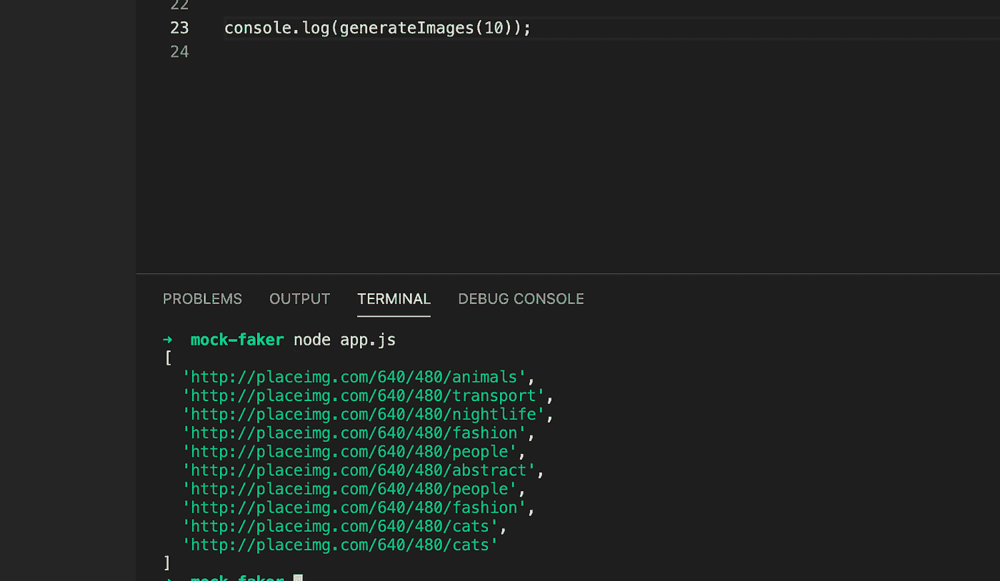
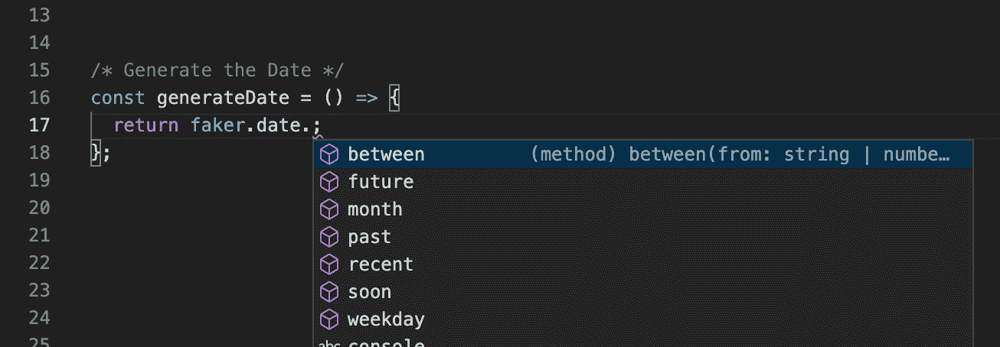
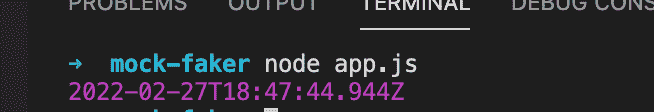
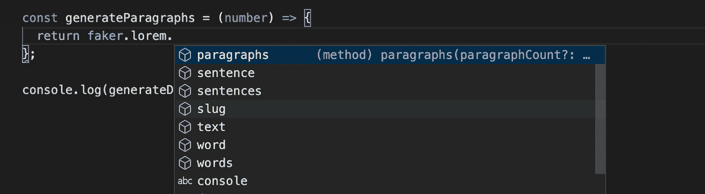
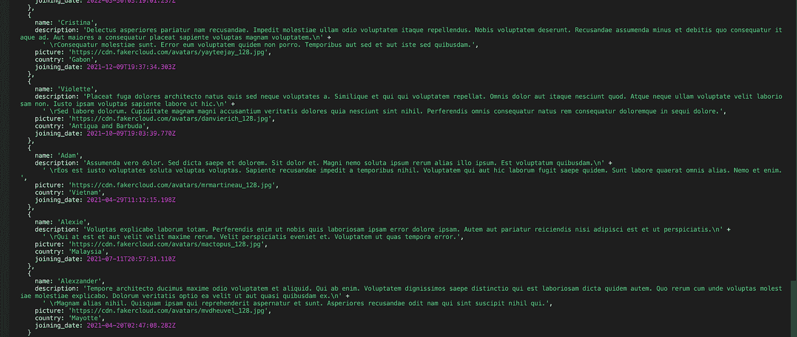
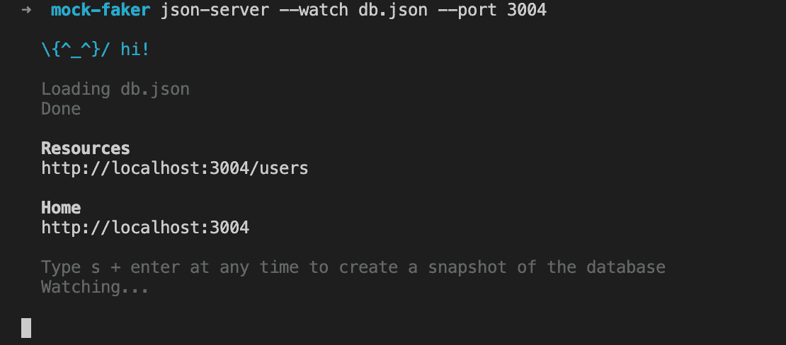

# 如何使用 Faker.js 和 JSON server 创建模拟服务器

> 原文：<https://itnext.io/how-to-generate-mock-data-using-faker-js-and-json-server-1d17007a08e4?source=collection_archive---------0----------------------->


*这个帖子是针对前端工程师*的。*在本文结束时，你将能够使用 faker.js 和 JSON-server 创建一个模拟服务器，你可以在任何应用程序中使用和消费它。假定您对 javascript 有基本的了解。*

# 问题

作为前端工程师，我们经常会遇到这样的情况:我们想要开始开发一个特性，但是却被提供 API 的后端团队阻止了。或者，也许我们只是想开始前端原型，还没有准备好后端。如果这引起了你的共鸣，要知道我也经历过。读完这篇文章后，你将能够设置一个模拟服务器作为后端，所以你可以马上开始构建。

# 我们要用的是

# Faker.js


> [*骗子。js*](http://marak.github.io/faker.js/) *是一个生成假数据的 JavaScript 库。虚假数据可以包括图像、各种格式的文本、姓名等。*

# JSON 服务器


> 一旦我们使用 faker.js 创建了我们的假数据，我们将需要一种方法来托管我们的数据，以便我们的应用程序(前端)能够开始消费它。这是由 [json 服务器](https://www.npmjs.com/package/json-server)提供的

# 设置

**步骤 1:初始化 npm 项目**

```
npm init
```

提供以下详细信息

*   *项目名称(模拟服务器)*
*   *版本(1.0.0)*
*   *描述*
*   *入口点(app.js)*

这将创建包含上述所有细节的 **package.json** 文件。现在，创建 **app.js** 文件，这是项目的入口点。

**第二步:安装依赖项**

```
npm i faker
```

以上命令将在项目中安装 **faker 库**。

```
npm install -g json-server
```

这将全局安装 **JSON-server** ，这样您就可以使用 CLI 控制服务器。

**步骤 3:生成假数据**

现在，我们可以开始使用 faker.js 库为我们生成模拟数据。你可以在官方[网站](http://marak.github.io/faker.js/)上找到使用 faker 可以生成的东西的列表。作为一个例子，让我们用它来生成图像、颜色和段落。

# 使用 Faker 生成图像

我们将首先创建一个文件 app.js。

```
const faker=require('faker');/* Generate Images */
const generateImages = (number) => {
  const images = [];
  while (number !== 0) {
    const value = faker.image.image();
    images.push(value);
    number--;
  }
  return images;
};
```

这个函数将数字作为参数，生成这么多的图像。生成的图像是随机图像。或者，您可以在`faker.image`上使用`imageUrl(width, height)`方法来生成特定宽度和高度的图像。

运行上述代码会产生以下输出



# 生成日期

```
const faker=require("faker");/* Generate the Date */
const generateDate = () => {
  return faker.date.future();
};
```

为了生成日期，我们将使用 faker 提供的 date 实用程序。我们可以选择生成过去、未来、两个日期之间等不同的日期。



为了这个例子，我将使用`future`方法生成一个未来的日期。这是输出的样子。



太好了！！类似地，我们现在将看到如何使用 faker 中的`lorem`方法生成文本段落。

# 生成段落、句子、行

```
const generateParagraphs = (number) => {
  return faker.lorem.paragraphs(number);
};
```

上述方法用于生成文本段落。注意，我们在 faker 中使用了`paragraphs(number)`方法。类似于生成段落，我们也可以生成句子、线条、文本等。



# 生成模拟用户数据

现在我们已经知道了如何使用 faker，我们可以开始使用 faker 生成模拟数据了。让我们用下面的模式为 20 个用户创建模拟数据

```
{
	"id":number
	"name":<String>,
	"description":<String(paragraph)>,
	"country":<String(country)>,
	"picture":<String (Profile image url)>,
	"joining_date":<Date>
}
```

**代码**

```
// Code to generate User Mock data
const generatePersonsData = (number) => {
  const persons = [];
  while (number >= 0) {
    persons.push({
			id:number,
      name: faker.name.firstName(),
      description: faker.lorem.paragraphs(2),
      picture: faker.image.avatar(),
      country: faker.address.country(),
      joining_date: faker.date.future(),
    });
    number--;
  }
  return persons;
};
```

运行上面的代码会产生以下结果

```
node app.js
```



正如我们从图像中看到的，我们能够生成用户详细信息。但是等等，我们需要一种方法从我们的前端应用程序中使用它，但是我们还没有做到。为此，我们将利用之前安装的`json-server`。让我们看看它是如何工作的。

# JSON 服务器如何服务我们的数据？

json-server 实用程序的工作方式非常简单。安装完成后，我们需要创建一个 JSON 文件，作为我们前端使用的数据库。

让我们创建一个 db.json 文件，存储我们想要提供的用户信息。

```
{
"users": [{
"id":1,
"name": "Rupert",
"description":"Some description",
"picture":"
<https://cdn.fakercloud.com/avatars/andysolomon_128.jpg>",
"country": "Malaysia",
"joining_date": "2021-11-11T06:58:41.548Z"
},
{
"id":2,
"name": "Lester",
"description":"Some description",
"picture": "<https://cdn.fakercloud.com/avatars/jamiebrittain_128.jpg>",
"country": "Bouvet Island (Bouvetoya)",
"joining_date": "2021-08-07T18:40:37.096Z"
},
{
"id":3,
"name": "Florencio",
"description":"Some description",
"picture": "<https://cdn.fakercloud.com/avatars/cocolero_128.jpg>",
"country": "Singapore",
"joining_date": "2022-03-24T23:44:34.413Z"
},
{
"id":4,
"name": "Margret",
"description":"Some description",
"picture": "<https://cdn.fakercloud.com/avatars/akashsharma39_128.jpg>",
"country": "Jamaica",
"joining_date": "2021-04-18T17:01:03.477Z"
},
{
"id":5,
"name": "Rachelle",
"description":"Some description",
"picture": "<https://cdn.fakercloud.com/avatars/victor_haydin_128.jpg>",
"country": "Cameroon",
"joining_date": "2022-03-15T16:15:56.038Z"
}]
}
```

一旦创建了文件，我们就可以输入下面的命令。

```
json-server --watch db.json --port 3004
```

这将开始在 localhost:3004 上提供 db.json 文件中的数据。



我们可以在浏览器中访问以下路线来查看结果

`[http://localhost:3004/users](http://localhost:3004/users)`

# 最后一步

现在，让我们对 app.js 文件进行更改，以便在服务器运行时生成一个 db.json 文件。

```
const faker = require("faker");
const fs = require("fs");const generatePersonsData = (number) => {
  const persons = [];
  while (number >= 0) {
    persons.push({
      id: number,
      name: faker.name.firstName(),
      description: faker.lorem.paragraphs(2),
      picture: faker.image.avatar(),
      country: faker.address.country(),
      joining_date: faker.date.future(),
    });
    number--;
  }
  return persons;
};fs.writeFileSync(
  "./db.json",
  JSON.stringify({ users: generatePersonsData(20) })
);
```

这段代码将生成包含我们的用户详细信息的 db.json 文件，以用户作为键。对于我们的例子，我只是添加了一个属性，但是我们总是可以回到这个文件，用不同的模式创建属性。

现在，让我们在 bash 中编写一个脚本来运行这段代码并启动 json-server。

**mock_server.sh**

```
#!/bin/bash
node app.js
json-server --watch db.json --port=3004
```

大概就是这样。您已经准备好在端口`3004`上使用模拟数据。

注意，您可以在模拟服务器上进行所有的 CRUD 操作，就像您通常对实际数据库所做的那样。

# 例子

# 获取特定用户的详细信息

我们可以使用以下格式从用户的数组中获取特定用户的详细信息

`GET <http://localhost:3004/users/{id}` >

*卷曲请求示例*

```
curl --location --request GET 'localhost:3004/users/1' \\
--header 'Content-Type: application/json'
```

# 删除特定用户

我们可以使用以下格式从用户数组中删除特定用户

`DELETE <http://localhost:3004/users/{id}` >

*示例卷曲请求*

```
curl --location --request DELETE 'localhost:3004/users/1'
```

# 更新特定用户

我们可以使用用户对象上的 id 字段对特定用途进行更改

`PUT <http://localhost:3004/users/{id}` >

卷曲请求示例

```
curl --location --request PUT 'localhost:3004/users/16' \\
--header 'Content-Type: application/json' \\
--data-raw '{
    "id": 16,
    "name": "Harry"
}'
```

# 结论

在本教程中，我们已经看到了如何使用 faker 库和 json-server 来创建一个模拟服务器，我们可以用它来快速原型化我们的前端应用程序。伟大的软件工程师需要在如何将自己从依赖中解放出来方面具有创造性。如果这句话能引起你的共鸣，也许你会像我一样在创建世界一流的应用程序中获得很多乐趣。谢谢你一直读到最后。如果这篇文章对你有任何帮助，请给我一个掌声，这会让我有动力继续写下去:)