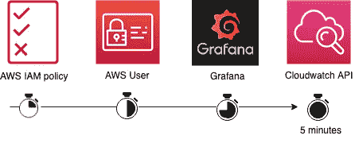
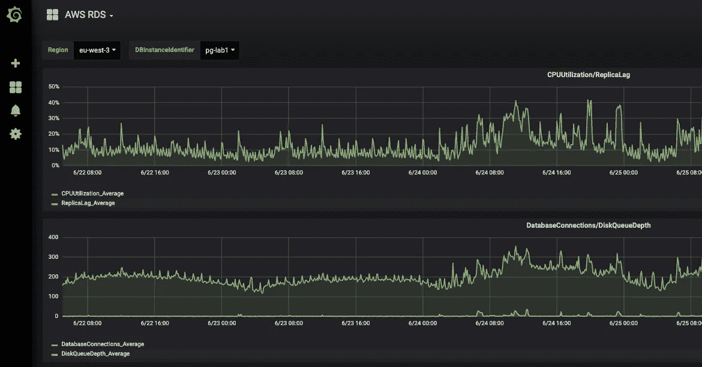

# 如何在 5 分钟内获得 Grafana 中的 AWS 指标？

> 原文：<https://itnext.io/how-to-get-aws-metrics-in-grafana-in-a-minute-bc623b7bf6fb?source=collection_archive---------1----------------------->

AWS 提供 [AWS Cloudwatch 仪表盘](https://docs.aws.amazon.com/AmazonCloudWatch/latest/monitoring/CloudWatch_Dashboards.html)来构建您自己的服务指标仪表盘。

这是一个良好的开端，但这一解决方案并不是最好的扩展方案，因为 AWS Cloudwatch 仪表盘存在许多棘手问题:

*   AWS 资源标识符在仪表板中是硬编码的
*   您必须为每个地区和每个 AWS 帐户复制仪表板
*   Cloudwatch 仪表盘收费 3 美元/仪表盘/月(见[定价](https://aws.amazon.com/cloudwatch/pricing/))

幸运的是，Grafana 已经与 AWS Cloudwatch 进行了内置集成，您可以使用它来进一步利用 Grafana 社区来使用现有的仪表板。



在这篇博文中，我将在几分钟内展示如何在 Grafana 中集成 Cloudwatch 指标。

# AWS 设置

Grafana 需要 AWS 权限来获取 Cloudwatch 指标。出于安全目的，我们将创建一个专用于 Grafana 的 AWS 用户，并有自己的政策。

创建具有 Cloudwatch 只读权限的`CustomerGrafana`策略:

```
cat > /tmp/policy.json << EOF
{
    "Version": "2012-10-17",
    "Statement": [
        {
            "Sid": "AllowReadingMetricsFromCloudWatch",
            "Effect": "Allow",
            "Action": [
                "cloudwatch:ListMetrics",
                "cloudwatch:GetMetricStatistics",
                "cloudwatch:GetMetricData"
            ],
            "Resource": "*"
        },
        {
            "Sid": "AllowReadingTagsInstancesRegionsFromEC2",
            "Effect": "Allow",
            "Action": [
                "ec2:DescribeTags",
                "ec2:DescribeInstances",
                "ec2:DescribeRegions"
            ],
            "Resource": "*"
        },
        {
            "Sid": "AllowReadingResourcesForTags",
            "Effect" : "Allow",
            "Action" : "tag:GetResources",
            "Resource" : "*"
        }
    ]
}
EOFaws iam create-policy \
--policy-name CustomerGrafana \
--policy-document file:///tmp/policy.json \
--description "Used by Grafana to fetch Cloudwatch metrics"rm /tmp/policy.json
```

创建一个名为`service_grafana`的 AWS 用户，然后附加先前创建的策略，最后生成一个 AWS API 密钥:

```
AWS_USERNAME=service_grafana
AWS_ACCOUNT_ID=$(aws sts get-caller-identity | jq -r .Account)
AWS_POLICY_ARN=arn:aws:iam::$AWS_ACCOUNT_ID:policy/CustomerGrafana# Create AWS user
aws iam create-user --user-name $AWS_USERNAME# Attach IAM policy to user
aws iam attach-user-policy --policy-arn $AWS_POLICY_ARN --user-name $AWS_USERNAME# Generate AWS access key
aws iam create-access-key --user-name $AWS_USERNAME
```

将`service_grafana` API 关键信息保存在以下变量中:

```
GRAFANA_AWS_ACCESS_KEY_ID=<AWS ACCESS KEY ID>
GRAFANA_AWS_SECRET_ACCESS_KEY=<AWS SECRET ACCESS KEY>
GRAFANA_AWS_DEFAULT_REGION=<YOUR MAIN AWS REGION>
```

现在我们已经为 Grafana 配置做好了准备！

# 格拉夫纳构型

让我们使用 Docker 启动一个 Grafana 实例:

```
docker run \
  --detach \
  --publish 3000:3000 \
  --name=grafana \
  --env "GF_SECURITY_ADMIN_PASSWORD=secret" \
  grafana/grafana
```

Grafana 可在 [http://localhost:3000](http://localhost:3000) 获得(凭证:admin/secret)。

为了更快地部署，我们将使用 Grafana API 来创建数据源和导入仪表板。定义以下环境变量:

```
GRAFANA_USERNAME="admin"
GRAFANA_PASSWORD="secret"
GRAFANA_HOST="[http://localhost:3000](http://localhost:3000)"
```

在 Grafana 中创建 AWS Cloudwatch 数据源:

```
# Generate datasource configuration
cat > /tmp/datasource.json << EOF
{
  "name":"cloudwatch1",
  "type":"cloudwatch",
  "access":"proxy",
  "jsonData": {
    "authType": "keys",
    "defaultRegion": "$GRAFANA_AWS_DEFAULT_REGION"
  },
  "secureJsonData":{
    "accessKey":"$GRAFANA_AWS_ACCESS_KEY_ID",
    "secretKey":"$GRAFANA_AWS_SECRET_ACCESS_KEY"
  }
}
EOF# Create Grafana datasource
curl -v -k $GRAFANA_HOST/api/datasources \
-u "$GRAFANA_USERNAME:$GRAFANA_PASSWORD" \
-H "Content-Type: application/json" \
-H "Accept: application/json" \
-d [@](http://twitter.com/datasource)/tmp/[datasource](http://twitter.com/datasource).jsonrm /tmp/datasource.json
```

Grafana 现在已经连接到 AWS Cloudwatch 了，让我们来创建仪表盘吧！

# Grafana 仪表板

[监测艺术家](https://monitoringartist.com)在他们的 Github 账户上分享了 AWS Cloudwatch 指标的 Grafana 仪表盘[。](https://github.com/monitoringartist/grafana-aws-cloudwatch-dashboards)

由于大约有 20 个仪表板，我们将创建一个“AWS”目录:

```
GRAFANA_DIRECTORY_ID=$(curl -s -k \
$GRAFANA_HOST/api/folders \
-u "$GRAFANA_USERNAME:$GRAFANA_PASSWORD" \
-H "Content-Type: application/json" \
-H "Accept: application/json" \
-d '{"title":"AWS"}' | jq .id)
```

使用以下命令可以直接导入仪表板:

```
dashboards=(1516 677 139 674 590 659 758 623 617 551 653 969 650 644 607 593 707 575 1519 581 584 2969 8050);for dashboard_id in "${dashboards[@]}"; do
  echo "Processing dashboard: $dashboard_id" # Get dashboard content
  content=$(curl -s -k -u "$GRAFANA_USERNAME:$GRAFANA_PASSWORD" $GRAFANA_HOST/api/gnet/dashboards/$dashboard_id | jq .json) # Override dashboard configuration
  cat > /tmp/dashboard.json << EOF
  {
    "dashboard": $content,
    "overwrite": true,
    "folderId": $GRAFANA_DIRECTORY_ID,
    "inputs":
      [{
        "pluginId": "cloudwatch",
        "name": "DS_CLOUDWATCH",
        "type": "datasource",
        "value": "cloudwatch1"
      }]
  }
EOF # Publish dashboard on Grafana
  curl -s \
  $GRAFANA_HOST/api/dashboards/import \
  -u "$GRAFANA_USERNAME:$GRAFANA_PASSWORD" \
  -H "Content-Type: application/json" \
  -H "Accept: application/json" \
  -d [@](http://twitter.com/datasource)/tmp/dashboard.json
  echo "" rm /tmp/dashboard.json
done
```

就是这样！您可以在 Grafana 仪表板中看到您的 AWS 指标:[http://localhost:3000/dashboards](http://localhost:3000/dashboards)



关于 AWS RDS 的 Grafana 仪表板

查看[https://grafana.com/dashboards](https://grafana.com/dashboards)上提供的其他 Grafana 仪表盘。