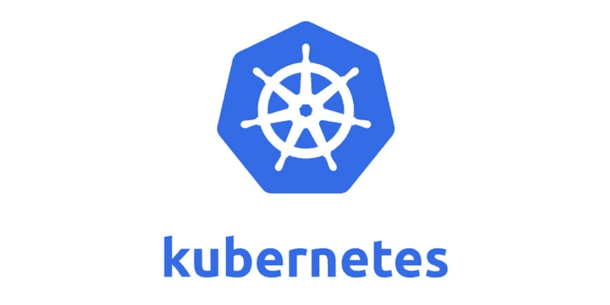

# 如何获取你的 Kubernetes 集群服务主体，并使用它访问其他 Azure 服务？

> 原文：<https://itnext.io/how-to-get-your-kubernetes-cluster-service-principal-and-use-it-to-access-other-azure-services-637f185a5112?source=collection_archive---------0----------------------->



所以，你在 Azure 上有一个 [Kubernetes 集群(AKS)](https://docs.microsoft.com/azure/aks/?WT.mc_id=medium-blog-abhishgu) 需要访问其他 Azure 服务，比如[Azure Container Registry(ACR)](https://azure.microsoft.com/services/container-registry/?WT.mc_id=medium-blog-abhishgu)？为此，您可以使用 AKS 群集服务主体。

你所需要做的就是将对所需 Azure 资源的访问委托给服务主体。只需使用`[az role assignment create](https://docs.microsoft.com/cli/azure/role/assignment?view=azure-cli-latest&WT.mc_id=medium-blog-abhishgu)`创建一个角色分配，执行以下操作:

*   指定特定范围，如资源组
*   然后分配一个角色，该角色定义服务主体对资源拥有的权限

它看起来像这样:

```
az role assignment create --assignee $AKS_SERVICE_PRINCIPAL_APPID --scope $ACR_RESOURCE_ID --role $SERVICE_ROLE
```

> *请注意，这里的* `*--assignee*` *只不过是服务主体，您将需要它。*

当你[在 Azure 门户](https://docs.microsoft.com/azure/aks/kubernetes-walkthrough-portal?view=azure-cli-latest&WT.mc_id=medium-blog-abhishgu)中创建一个 AKS 集群，或者从 Azure CLI 中使用`[az aks create](https://docs.microsoft.com/cli/azure/aks?view=azure-cli-latest&WT.mc_id=medium-blog-abhishgu#az-aks-create)`命令，Azure 可以自动生成一个服务主体。或者，您可以使用`[az ad sp create-for-rbac --skip-assignment](https://docs.microsoft.com/cli/azure/ad/sp?view=azure-cli-latest&WT.mc_id=medium-blog-abhishgu#az-ad-sp-create-for-rbac)`自己创建一个，然后使用`--service-principal`中的服务主体`appId`和`az aks create`命令中的`--client-secret`(密码)参数。

您可以在`[az aks show](https://docs.microsoft.com/cli/azure/aks?view=azure-cli-latest&WT.mc_id=medium-blog-abhishgu#az-aks-show)`命令中使用一个方便的小查询来快速定位服务主体！

```
az aks show --name $AKS_CLUSTER_NAME --resource-group $AKS_CLUSTER_RESOURCE_GROUP --query servicePrincipalProfile.clientId -o tsv
```

这将服务校长`appId`！您可以使用它来授予权限。例如，如果您希望 AKS 与 ACR 合作，您可以授予`acrpull`角色:

```
az role assignment create --assignee $AKS_SERVICE_PRINCIPAL_APPID --scope $ACR_RESOURCE_ID --role acrpull
```

## 以下是供您参考的命令列表:

*   `[az aks create](https://docs.microsoft.com/cli/azure/aks?view=azure-cli-latest&WT.mc_id=medium-blog-abhishgu#az-aks-create)`创建 AKS 集群
*   `[az role assignment create](https://docs.microsoft.com/cli/azure/role/assignment?view=azure-cli-latest&WT.mc_id=medium-blog-abhishgu)`将服务特定的角色分配给服务主体
*   `[az aks show](https://docs.microsoft.com/cli/azure/aks?view=azure-cli-latest&WT.mc_id=medium-blog-abhishgu#az-aks-show)`获取有关您的 AKS 集群的信息

如果你觉得这篇文章有帮助，请喜欢并关注！很高兴通过 Twitter 获得反馈或发表评论:-)

[](https://twitter.com/abhi_tweeter) [## 阿布舍克

### Abhishek 的最新推文(@abhi_tweeter)。云开发者🥑@Microsoft @azureadvocates |…

twitter.com](https://twitter.com/abhi_tweeter)