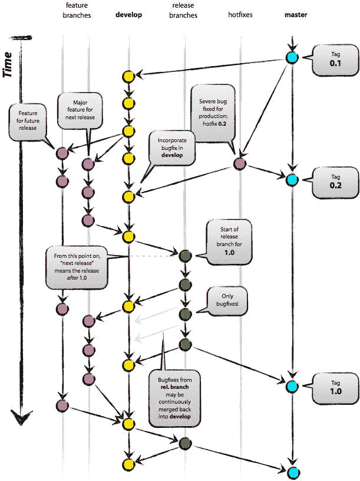
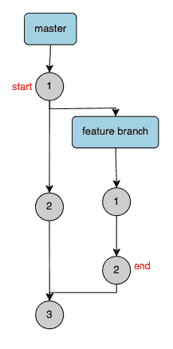
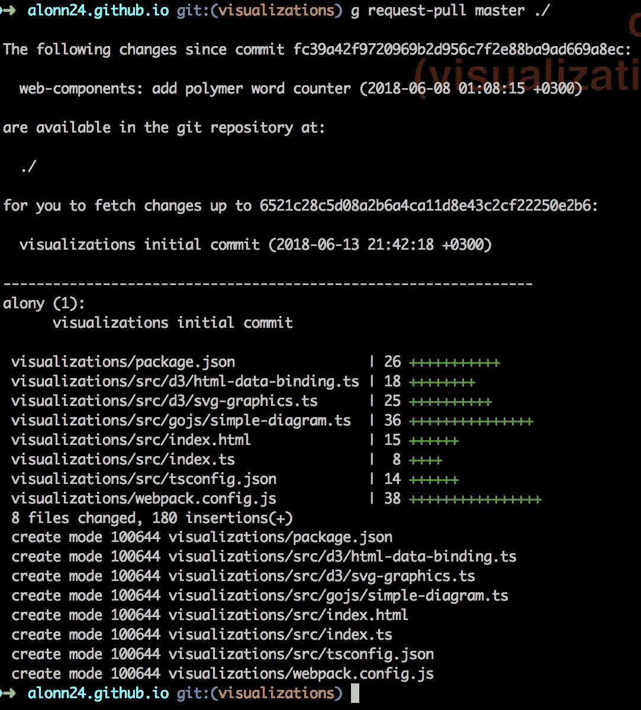

# 如何从命令行获取 PR

> 原文：<https://itnext.io/how-to-git-pr-from-the-command-line-a5b204a57ab1?source=collection_archive---------0----------------------->

Git 是一个免费的开源分布式版本控制系统，旨在快速高效地处理从小型到大型项目的所有事情——https://git-scm.com/。Git 是当今最常用的版本控制软件，因为它不同于其他的源代码控制软件。它最大的优点是它是分布式的，这意味着每个合作者都有一个完整的存储库克隆，并且可以使用像 rebase an 等 uniq 算法与远程存储库一起合并变更。如果您想了解更多关于 git 的知识，这里的是一个很好的起点。

我们使用 git 作为命令行来创建存储库和进行更改，合并到上游存储库等等。在 git 之上构建了很多工具，其中之一就是 Github。Github 是一个允许最大化不同用户之间协作的软件，在 git 之上提供了许多功能，如 issues、wiki 等等。Git 允许社区努力为开源项目服务。包括功能分支管理和拉请求，这就是这篇文章的全部内容。

Pull Request (PR)是 Github 的一个特性，允许用户更好地合作。通常在源代码控制软件中有一个描述产品的主分支——在 git 中是主分支。用户可以创建一个特性分支，并在那里进行更改，然后向主分支发布一个 PR，让其他人审阅、批准或拒绝更改，并最终合并到主分支。讨论潜在的改进对于编写和维护高质量的存储库至关重要。

现在 PR 是 Github 的特性，但是它依赖于名为`request-pull`的 git 特性。Git 通过提供一个特性来支持 PRs，该特性允许您从不同的分支或不同的存储库中请求从一个工作集到另一个工作集的 pull。该命令允许您查看包含所有将要合并的提交和变更的特性分支的摘要。使用 PRs 时，建议在特征分支中工作，而不是在主分支中工作，并向主分支发送 PRs。我将只展示描述最佳实践的例子。“请求拉”命令行工具允许您查看您在功能分支上所做的所有更改，

`request-pull`命令行参数并不那么直接。`git request-pull --help`将向您展示该命令的完整用法和规格。

基本签名是`git request-pull [-p] <start> <url> [<end>]`

*   [-p] —不使用该选项运行请求-拉将输出已更改文件的摘要。-p 更详细，将输出从分割提交到结束提交所做的所有更改。
*   <start>—是要合并到的起点。大多数时候我们会给它主分支，git 会自己计算开始提交。开始提交是特征分支从中分离出来的共同祖先。</start>
*   <url>—是要比较的存储库。它可以是本地存储库，也可以是远程存储库。</url>
*   <end>—我们想要停止比较的终点。通常我们不会声明 end commit，因为我们希望合并所有最近的更改。为了简单起见，我们不展示这种用法。</end>

为了将最新的特征分支变更合并到主分支，首先我们要确保我们在特征分支上，因为这是从特征分支到主分支的合并请求。用`git checkout -b [branch-name]`转到特征分支。然后我们可以运行`git request-pull master ./`来运行从特性分支到主特性的比较。请注意，我们将主数据库作为开始数据库，将本地存储库作为比较对象，因此为了获得准确的结果，我们需要从最新的主数据库中提取数据。

让我们检查这样一个输出:

我们可以将命令输出分成两部分:

1.  提交细节——我们可以看到计算的开始提交(SHA1 +描述)和结束提交(SHA1 +描述),之后是中间的所有提交。在我们的例子中，只有一个提交“可视化初始提交”。
2.  已更改的文件—我们可以看到有 8 个文件发生了更改，插入了 180 个内容。如果我们运行带有-p 标志的命令，我们还会看到更改，而不仅仅是摘要。

在 Github PR request 页面中，我们可以看到显示的更改细节与我们在这里看到的完全一样，只是做了一些小的修改。要查看 PR 的所有更改，我们可以使用`-p`运行上面的示例，但是要查看每次提交的更改，我们必须运行另一个命令，给出确切的提交`gif diff [SHA1] [SHA1]^`。

到目前为止，我们只使用 git 特性，这意味着 pull 请求是一个 git 术语，CLI 支持 UI 实现中显示的一切，如 Github。现在，要在 Github 中发布一个真正的 PR 请求，我们需要使用 Github 公共 API。 [HUB](https://hub.github.com/) 是一个很棒的工具，可以让你与 Github API 进行交互，并从命令行对资源库进行更改，例如你可以通过运行`hub pull-request`在 Github 中创建一个 PR。

就这样，从现在开始，我只从命令行执行我的 PRs。

