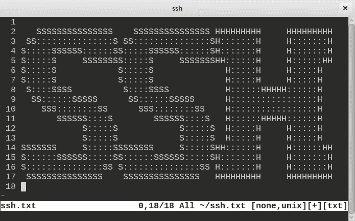

# 如何用 GitLab 处理多个 SSH 密钥

> 原文：<https://itnext.io/how-to-handle-multiple-ssh-keys-with-gitlab-27f7cf2e77ed?source=collection_archive---------0----------------------->



图片由 beehosting.pro 提供

故事是这样的。你有自己的 GitLab 用于个人项目，也有一个用于工作。这看起来很酷，直到你开始在这两个方面下功夫。

我个人喜欢在电脑上把工作和私人物品分开。多个 GitLab 帐户的问题是你不能在两个帐户上使用同一个 SSH 密钥。例如，您有一个与 GitLab 帐户关联的个人电子邮件地址，以及与另一个帐户关联的商务电子邮件地址。这是区分个人工作和业务的一个很好的方法，但它也带来了一些挑战。

正如我提到的，不同的电子邮件地址的 GitLab 帐户不能有相同的 SSH 密钥，所以解决这个问题的好方法是为个人和商业项目创建单独的 SSH 密钥。尽管这看起来是一个很难解决的任务，但是一旦你理解了基础知识，它就很简单了。那么如何才能解决这个问题呢？

第一件事是创建两个 SSH 密钥，您可以在终端中使用下面的命令来完成，但是一定要按照您想要的方式命名您的密钥，直到名称不同为止，因为我们将在后面的过程中使用它。我让默认值为私有 SSH 密钥，并将业务 SSH 密钥命名为: ***work_rsa***

```
ssh-keygen -t rsa -C "your_email@example.com"
```

你把你的业务和私人电子邮件地址的每一个关键。现在，如果输入下面的命令(基本意思是，转到~/。ssh 文件夹并列出所有文件)

```
cd ~/.ssh && ll
```

你可以看到你有两把*的钥匙。pub* 扩展和一个没有。

```
-rw-------  1 sasa  staff   419B Jan 19 11:24 work_rsa
-rw-r--r--  1 sasa  staff   106B Jan 19 11:24 work_rsa.pub
```

不同的是*。pub* 是一个公钥，这个密钥用于在 GitHub 或 GitLab 等服务上存储它。一旦您尝试连接 SSH，这个密钥将与您的私有本地密钥(没有扩展名的相同名称)进行核对，如果它们匹配，则一切正常，您可以进行推送、克隆、获取、拉取等操作。

接下来，一个很好的做法是在本地分离您的项目，例如，您可以将您的个人项目放在不同的文件夹中:

```
~/Private
~/Work
```

所以你可以有~/Private/TennisApp，或者~/Work/ACME，这样你可以为你所有的项目设置不同的键。您可以通过编辑位于以下位置的 ***gitconfig*** 来完成此操作:

```
~/.gitconfig
```

*(不要把这个文件和~/混淆。ssh/config)*

你可以编辑。gitconfig 是这样的:

```
[includeIf "gitdir:Work/"]
    path = .gitconfig-work
```

所以这意味着如果你的项目位于~/Work 中，将使用电子邮件为' sasa.fister@work.net '的用户，以及 SSH 密钥' work_rsa '。否则，如果您的项目位于~/Private 文件夹(该文件夹位于您的计算机上)，则将使用电子邮件“sashafishter@gmail.com”和 id_rsa 密钥。

现在，创造。git config-工作文件

```
touch ~/.gitconfig-work
```

并将项目放入其中，如下所示:

```
[user]
    email = "[y](mailto:sasa.fister@serapion.net)ourgitlabemail@example.com"
[core]
   sshCommand = "ssh -i ~/.ssh/work_rsa"
```

这将为你设置好一切，所以你可以做所有的 git 操作，它将为你的每个项目使用单独的 SSH 密钥和电子邮件。

希望这能帮助你配置你的多个 GitLab 账户。