# 如何在图形数据库中处理数百亿威胁情报数据

> 原文：<https://itnext.io/how-to-handle-tens-of-billions-of-threat-intelligence-data-in-a-graph-database-4dc5cb173541?source=collection_archive---------2----------------------->


# 为什么是图形数据库？

传统的关系数据库在处理复杂数据的关系操作时表现不佳。随着数据量和关系深度的增加，关系数据库不能有效地处理计算。

因此，企业需要一个能够将关系信息存储为实体的数据库，以更好地反映数据之间的关系，并灵活地扩展数据模型。图形数据库是他们所需要的。

与传统的关系数据库相比，图数据库有以下两个优点:

一是图形数据库可以表示数据之间的关系。

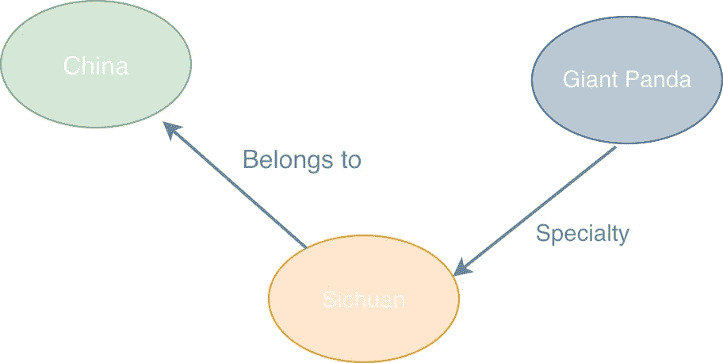

从上图所示的图表模型中，您可以看到图表数据库旨在基于图表模型以直观的方式反映关系。它基于实体间关系的模型表达使得图形数据库具有可解释性。

另一个是图形数据库可以处理数据之间的关系。

*   **高性能**:JOIN 操作主要处理传统关系数据库中的关系数据。随着数据量和关系深度的增加，由于多表连接和外键的限制，会给传统的关系数据库带来很大的额外开销，从而严重降低其性能。图形数据库的底层适应图形模型的数据结构，可以加快数据查询和数据分析。
*   **灵活性**:图形数据库支持灵活的数据模型。用户可以调整他们的数据模型以适应他们的业务需求，例如添加或删除顶点和/或边，以及扩展或收缩图形模型。图形数据库使用户能够频繁地改变数据模式。
*   **敏捷**:图形数据库支持的图形模型直观。图模型支持测试驱动的开发。每次构建图形数据库时，都可以进行功能测试和性能测试，这符合敏捷开发方法，有助于提高生产和交付效率。

由于这些优势，图数据库可以广泛应用于金融反欺诈、公共安全、刑事调查、社交网络、知识图、数据谱系、IT 资产的运维以及威胁情报等领域。

快手威胁情报团队旨在整合由移动客户端、Web 客户端、云客户端、广告联盟数据和小程序组成的整个链条中的安全数据，使公司拥有统一的基础安全能力，从而赋能公司的业务。

威胁情报的特点是实体的多样性、关系的复杂性、数据标签的丰富性等。因此，使用图形数据库来存储威胁情报数据是最合适的。

# 为什么是星云图？

通过需求收集和研究，快手威胁情报团队最终决定使用 NebulaGraph 数据库作为其在生产环境中的图形数据库解决方案。

# 收集需求

写和查询数据是为快手选择图形数据库解决方案的主要重点。

1.  关于写数据:离线+在线

*   数据库必须支持每天生成的所有数据的批量离线导入。在该平台上，每天可能会产生数百亿条关系数据，所有数据必须在数小时内写入数据库。
*   数据库需要支持实时数据写入。弗林克消耗卡夫卡的数据。数据经过处理后，将直接从 Flink 实时导入图形数据库。成千上万的 QPS 需要支持。

2.关于查询数据:数据库需要支持毫秒级的在线实时查询。五万 QPS 需要支援。

*   按属性过滤和查询顶点和边
*   查询关系的多跳

3.一些基本的图形数据分析功能

*   寻找从一个顶点到另一个顶点的最短路径的算法，等等。

总之，为大数据架构选择的图形数据库解决方案需要具备三个基本能力:实时和离线写入数据、在线查询图形数据和基本 OLAP 能力，这要求图形数据库支持基本 OLAP 和在线、并发、低延迟 OLTP。

# 选择一个解决方案

基于上述需求，在选择图形数据库解决方案时，我们主要考虑以下因素:

*   图形数据库能够处理的数据量必须足够大，因为企业级应用通常会产生数百亿甚至数千亿的图形数据。
*   群集必须是可扩展的，因为有必要在不停止生产环境中的服务的情况下在线横向扩展群集。
*   查询必须以毫秒为单位执行，因为数据库需要满足在线服务的性能要求，图形数据量的增加不应该降低查询性能。
*   该数据库需要与 HDFS 和 Spark 等大数据解决方案轻松连接，稍后可以基于它构建图形计算平台。

# 星云图的特征


1.  高性能:在毫秒内读写数据。
2.  可伸缩性:支持缩放和存储超大尺寸的图形。
3.  引擎架构:计算和存储的分离。
4.  图形数据模型:顶点和边。支持对顶点或边的属性建模。
5.  图形查询语言:nGQL，一种类似 SQL 的查询语言，并且易学易用。它可以满足复杂的业务需求。
6.  为导入和导出数据提供多样化的工具。
7.  星云图社区非常活跃。
8.  NebulaGraph 在查询性能上优于 JanusGraph 和 HugeGraph。

NebulaGraph 的所有这些特性准确地回答了我们的需求，这些场景使我们最终决定在我们的生产环境中使用 NebulaGraph。

# 威胁情报的图形数据建模

如下图所示，从情报角度来看，分层防御的自下而上的对策难度增加。

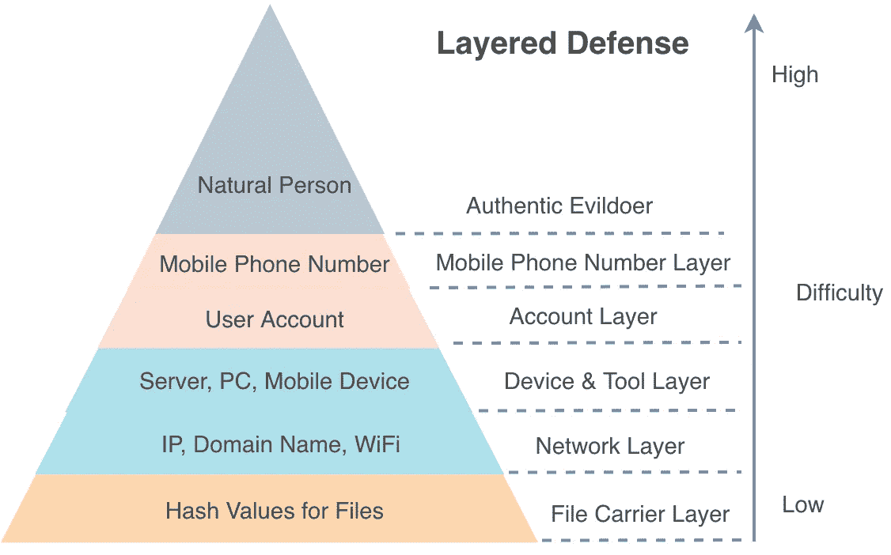

攻击者和防御者先前在每一层上都处于单独的对抗行动中。现在，在应用了图形数据库之后，每一层上的实体 id 都可以通过特定的关系链接在一起，形成一个三维的层次网络。通过使用这样的网络，公司可以迅速掌握攻击方法、作弊工具、团伙特征等信息。

因此，基于安全数据的图建模可以将原来的二维平面识别变成三维识别，可以帮助我公司更加清晰准确地识别攻击和风险。

# 基本图形模型

威胁情报的图建模的主要目的是不仅通过其状态和属性，而且通过从网络角度考虑维度来识别维度的风险，这意味着异构图和同构图中的数据关系应该用于识别维度的风险。

以设备风险为例。设备可能涉及网络层、设备层、帐户层和用户层。在每一层上，设备可以由一个实体 ID 来表示。在图形数据库的帮助下，我们可以完成一个设备的三维风险识别，这对风险识别非常有帮助。

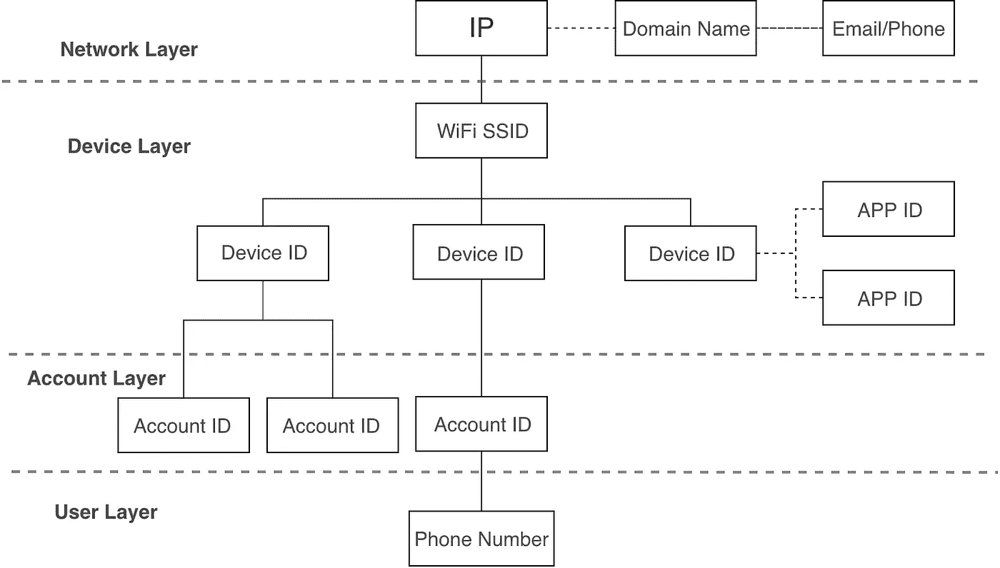

上图显示了威胁情报数据的基本图形建模。它构成了一个基于威胁情报的知识图。

# 动态图模型

除了基本图模型中的元素，我们还需要考虑每个关系都是时间敏感的，即在区间 A 中存在的关系在区间 b 中可能不再存在。因此，我们希望用于威胁情报的图数据库能够真实地反映跨不同时间区间的现实世界关系。

这意味着数据库必须能够根据查询时间间隔返回不同图模型的数据，我们称之为动态图模型。

为了对动态数据建模，出现了一个问题:根据查询时间间隔，应该返回什么边类型？


如上图所示，在查询时间间隔 B、C 或 D 中，应返回指定的边，但在查询时间间隔 A 或 E 中，不应返回此边。

# 加权图结构

为了检测地下经济犯罪的团伙或作恶者，经常会出现这种情况:一个设备可能会关联许多帐户，其中一些帐户经常被犯罪分子自己使用，其他帐户则被他们购买用于非法直播。为了配合公安或法律事务部门打击非法活动，我们需要准确区分哪些账户是犯罪分子常用的，哪些是他们为非法行为购买的正义账户。

这也是为什么账户和设备的关系要加权的原因:如果一个账户通常使用一个设备，说明这个账户和这个设备是强关联的，所以关系的权重更高；如果一个帐户使用该设备进行地下经济犯罪或进行直播，则意味着该帐户与该设备的联系较弱，相应地，这种关系的权重较低。

因此，我们的边不仅具有时间属性，还具有权重。

总之，最终为威胁情报数据创建了加权时间演化图模型。

# 基于图数据库的威胁情报服务体系结构及优化

下图显示了威胁情报服务的整体架构。

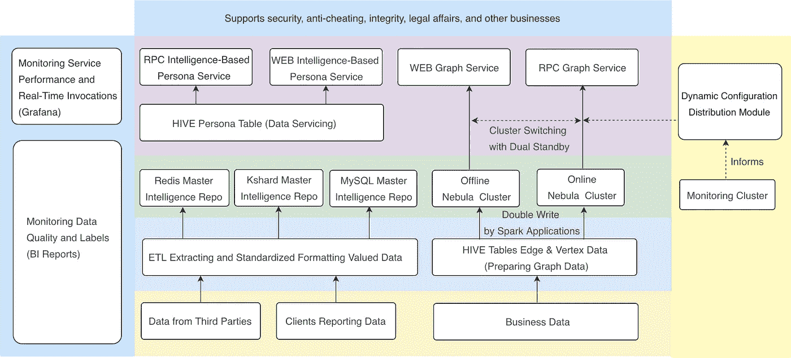

威胁情报服务的整体架构

该架构具有基于图形数据库的集成智能查询平台。其架构如下图所示。

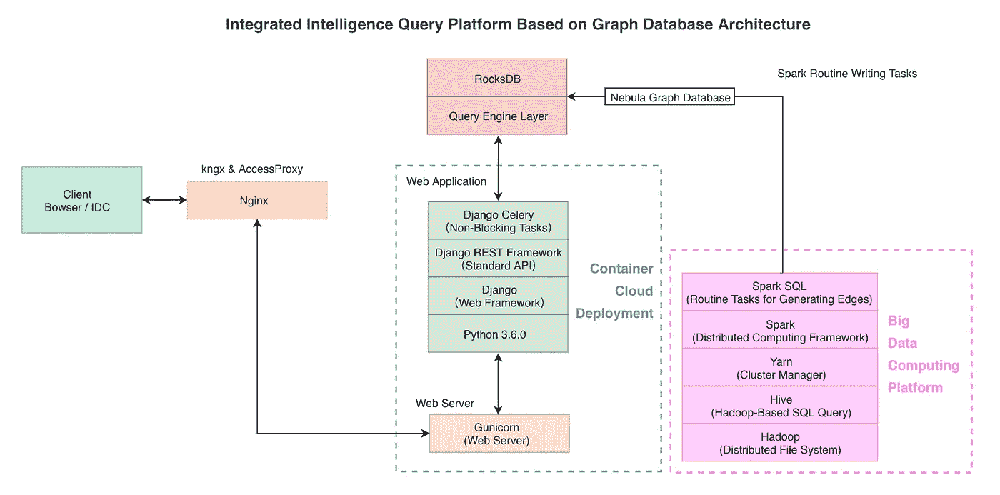

综合智能查询平台的总体架构

注意:AccessProxy 用于从企业专用网络访问 IDC，kngx 用于在 IDC 内部直接调用。

# 离线写数据的优化

我们需要构建的关系数据可能每天都在数十亿次地更新。要保证这么大的数据量能在几个小时内写完，数据异常能被感知，数据不会丢失，这是一个非常具有挑战性的任务。优化集中在失败重试、脏数据发现和导入失败警报策略上。

在数据导入过程中，脏数据、服务器弹跳、nebula-graphd 进程崩溃、写入数据过快等各种因素都可能导致批量写入数据失败。通过使用同步客户端 API、多级重试和失败后退出策略，我们解决了由于服务器端反弹或重启而导致的写入失败或批量写入不完整的问题。

# 双集群的高可用性和切换

在快手，部署了两个图形数据库集群，一个用于在线，另一个用于离线。采用同步双写技术向两个集群写入数据。线上集群提供在线 RPC 服务，线下集群提供案例分析和 WEB 查询服务。两个集群相互独立。

此外，状态监控模块和动态配置分发模块是连接在一起的，即当一个集群出现慢速查询或故障时，动态配置分发模块将无缝完成集群切换。

# 4.3 集群稳定性

我们的数据架构团队已经完成了对 NebulaGraph 社区版的研究、维护和改进。

NebulaGraph 采用计算和存储分离的设计。它由三个服务组成:元、图形和存储。他们分别负责元数据管理、计算和存储。

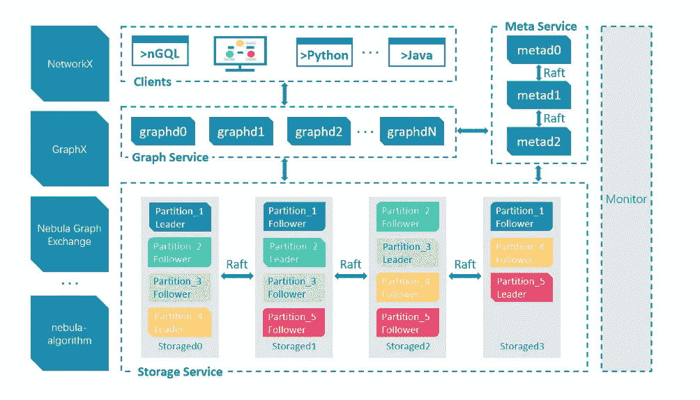

NebulaGraph 的整体架构

NebulaGraph 的存储层是图形数据库引擎的基础。它支持多种商店类型。我们采用经典的实现，RocksDB 用 C++实现，用于 KV 存储和 Raft 共识机制，这使得集群能够动态地伸缩。

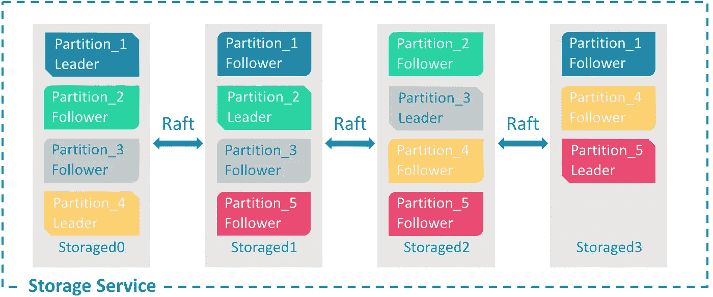

存储层架构

我们对存储层进行了充分的测试，改进了它的代码，优化了它的参数，包括优化 Raft 心跳机制，改进了 leader 选举机制和 log offset 实现，调优了 Raft 参数，提高了单个集群的故障恢复时间。我们还优化了客户端的失败重试机制。所有这些使我们的图形数据库更加用户友好。例如，在优化之前，中断可能是由故障引起的，但是现在数据库可以在故障后几毫秒内恢复。

关于监控和报警系统，我们已经对集群的多个级别实施了监控。总体监控架构如下图所示。

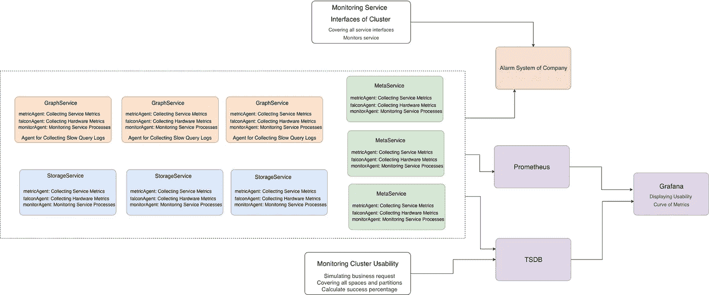

集群监控架构

监控以下指标:

1.  硬件:CPU 忙、磁盘工具、内存、网络等等。
2.  群集中元服务、存储服务和图形服务的接口，以及分区领导者的在线状态和分布。
3.  从用户的角度评估集群的可用性。
4.  收集和监视群集中的元、存储、RocksDB 和图形的指标
5.  缓慢的查询。

# 超级节点查询的优化

在现实世界的图模型中，顶点的出度一般符合幂律分布的特征，所以图遍历过程中的超级节点(出度数百万甚至数千万的顶点)会造成明显的查询缓慢。如何稳定在线查询的时间消耗，避免极其耗时的情况发生，是我们需要解决的问题。

图遍历中超节点问题的解决方案是在可接受的业务条件下减少规模。下面是它的实现方式:

1.  使用适当的限制子句截断结果。
2.  以指定的比率对边缘进行采样。

现在，让我们看看如何优化超级节点查询。

## 使用限制

**先决条件**

从商业角度来看，使用 LIMIT 来截断每个跃点查询的结果是可以接受的。以下面的查询为例。

```
# Executing the LIMIT clause until the end. 
go from hash('x.x.x.x') over GID_IP REVERSELY where (GID_IP.update_time >= xxx and GID_IP.create_time <= xxx) yield GID_IP.create_time as create_time, GID_IP.update_time as update_time, $^.IP.ip as ip, $$.GID.gid | limit 100 # Executing the LIMIT clause on the query result first, and then executing the next query.
go from hash('x.x.x.x') over GID_IP REVERSELY where (GID_IP.update_time >= xxx and GID_IP.create_time <= xxx) yield GID_IP._dst as dst | limit 100 | go from $-.dst ..... | limit 100
```

**优化前**

在存储层，遍历从一个顶点出发的所有外出有向边，在图层，执行 LIMIT 子句，直到结果返回给客户端，其中大量耗时的操作是不可避免的。另外，虽然 NebulaGraph 支持在存储层级别(`max_edge_returned_per_vertex`)配置一个顶点扫描的最大出度，但是不支持在查询语句级别灵活指定限制，在多跳查询多个顶点的出度时，无法在语句级别进行精确限制。

**如何优化**

单跳 GO 遍历分两步执行:

*   步骤 1:扫描一个顶点(srcVertex)的所有向外有向边(destVertex)，获得边的性质。
*   步骤 2:获取所有 destVertex 的属性值。

对于多跳 GO 遍历，每个跳查询可以在两种情况下执行:

*   案例 1:只执行步骤 1。
*   情况 2:执行步骤 1 和步骤 2。

步骤 2 花费了整个查询的大部分时间。例如，需要一个 RocksDB 迭代器操作来查询 destVertex 的每个属性，如果没有发生缓存命中，这需要 500 μs。因此，对于那些具有大量向外有向边的顶点，在步骤 2 之前执行 LIMIT 子句是关键。此外，执行步骤 1 中的 LIMIT 子句对超级节点有更大的好处。

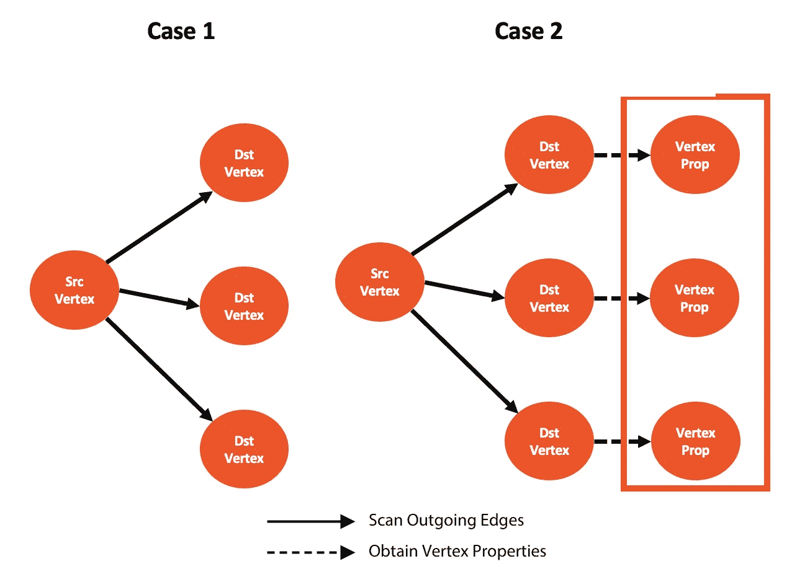

下表列出了使用 LIMIT 子句优化查询的情况及其好处。

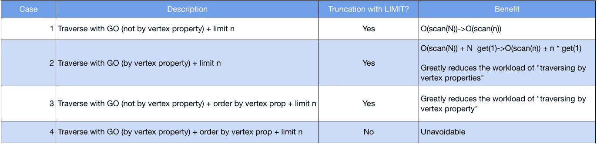

注意:N 代表一个顶点的出度；n 代表极限 n；scan 表示扫描出度的消耗；get 表示获取顶点属性的消耗。

**测试结果**

从上表可以看出，通过优化 LIMIT 子句，案例 1 或案例 2 中的查询可以得到很大的改进。案例 2 适用于安全业务查询。例如，下表显示了在部署在三台机器上的集群上的情况 2 中针对限制 100 的测试结果，每台机器都配备了 900 GB 数据存储容量的单个磁盘(在没有发生 RocksDB 缓存命中的情况下)。

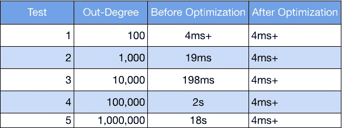

测试结果表明，优化后超级节点查询的时间消耗大大降低。

## 采样边缘

我们可以使用储层采样算法来解决无法使用优化限制子句的情况。NebulaGraph 支持配置星云存储进程级别上每个顶点的最大出度，并启用油藏采样算法。基于这些特性，我们决定让图形数据库支持以下特性:

1.  当储层采样算法为星云存储过程启用时，`max_iter_edge_for_sample`可配置为指定要扫描的边数。默认情况下，将扫描所有边缘。
2.  图表服务支持在 GO 查询的每一跳对边进行采样。
3.  `enable_reservoir_sampling`和`max_edge_returned_per_vertex`的配置可以在会话级有效。

有了这些特性，业务端可以更灵活地调整采样比例，以控制遍历规模，实现在线服务的流畅。

# 改进和优化查询客户端

开源的 NebulaGraph 有自己的客户。我们通过以下两种方式改进和优化了这些客户端，使其适合快手的项目:

*   **连接池**:nebula graph 提供的客户端底层接口需要创建并初始化一个连接，执行查询，并为每个查询关闭连接。在高频查询场景中，频繁地创建和关闭连接对系统的性能和稳定性是有害的。在实践中，我们采用连接池技术对客户端进行重新封装，并监控每个连接的整个生命周期，以重用和共享连接，提高了业务的稳定性。
*   **自动故障转移**:通过定期检测和监控连接创建、初始化、查询和销毁阶段的异常，实现了图形数据库集群中故障节点的实时发现和自动移除。如果整个集群不可用，服务可以在几秒钟内迁移到备份集群，这降低了集群故障对在线服务可用性的潜在影响。

# 可视化和下载查询结果

对于那些固定关系的查询(使用固定的 nGQL 语句)，前端会在自定义的图形界面中显示返回的结果，如下图所示。

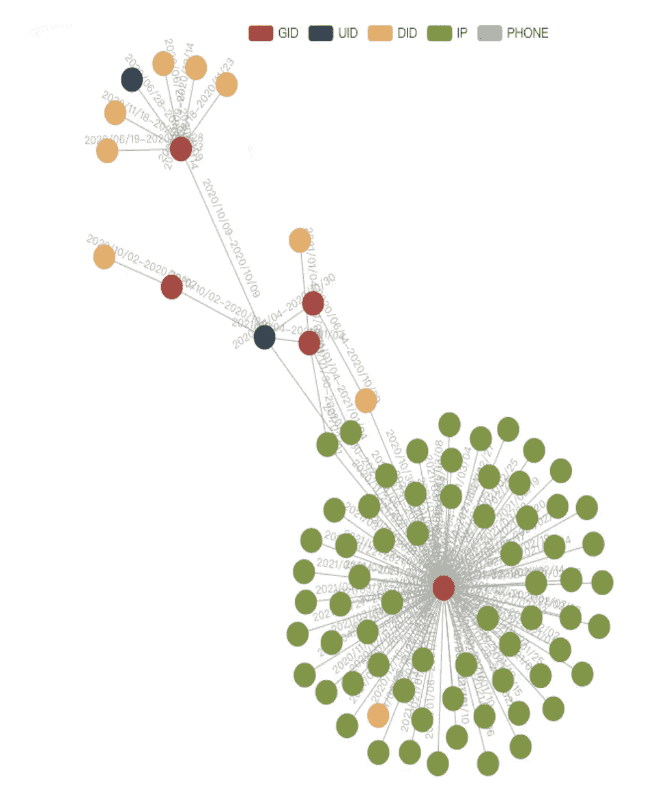

如上图所示，前端采用 ECharts 显示图形数据，在加载和显示数据方面做了一些优化。

**问题 1** :关系图需要能够显示每个顶点的细节，但是 ECharts 提供的图表只能显示数值。解决方案:修改源代码，通过添加一个模态来显示更多细节，从而为每个顶点添加一个单击事件。

**问题二**:点击事件触发后，关系图会长时间处于旋转状态，可能无法识别点击的是哪个节点。解决方法:在图形第一次渲染时获取窗口中每个顶点的位置，在 click 事件触发后固定每个顶点的位置。

**问题 3** :如果一个图包含很多顶点，那么它们会以拥挤的方式显示。解决方案:使用户能够使用鼠标以图形方式缩放、平移和漫游图形。

对于那些灵活关系的查询(使用灵活的 nGQL 语句)，我们部署了 NebulaGraph Studio 来可视化结果，如下图所示。

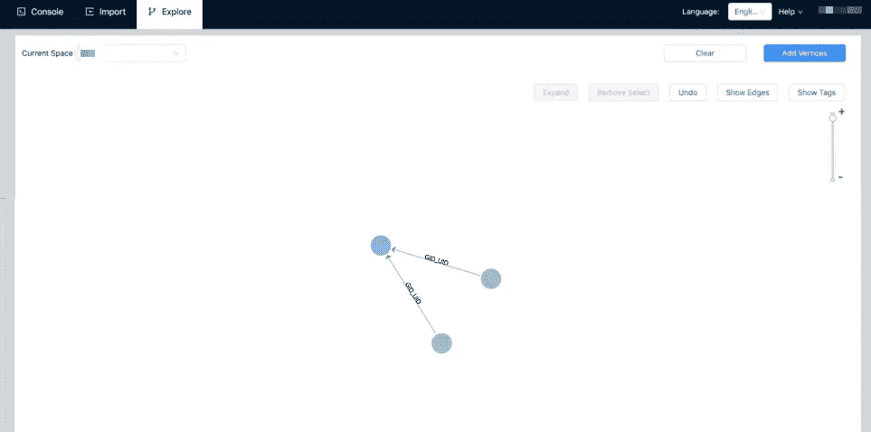

# 图形数据库在威胁情报中的应用

基于图形数据库的架构和优化，我们提供了 Web 和 RPC 两种访问方式，在快手主要支持以下服务:

*   追踪追查，打击线下违法行为，快手安全地下经济犯罪分析。
*   商业安全的风险控制与反欺诈

例如，群控设备的图形数据所代表的特性不同于普通设备的特性，如下图所示。

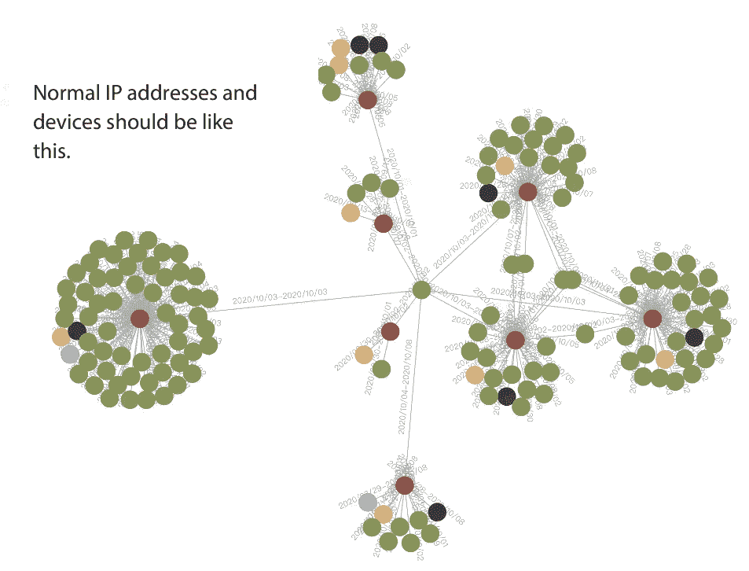

正常的 IP 地址和设备应该是这样的。

下图显示了如何在图形中表示成组控制的设备。

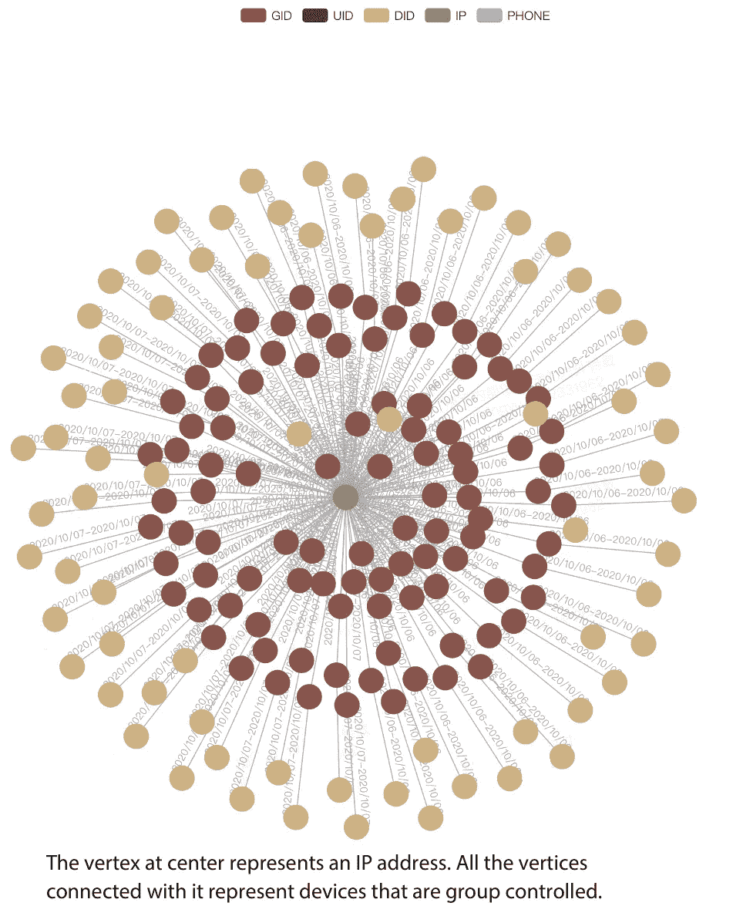

中间的顶点代表一个 IP 地址。与之相连的所有顶点都代表受组控制的设备。

# 结论和期望

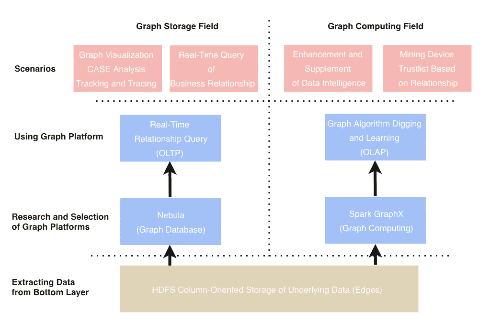

*   **保证和提高稳定性**:实现 HA 集群跨可用区的实时同步和自动接入切换，保证 99.99%的 SLA。
*   **提升性能**:计划更新 RPC 和 AEP 的硬件存储解决方案，优化查询执行计划
*   **使图形计算平台能够与图形查询引擎通信**:构建图形计算、图形学习和图形查询的集成平台。
*   **支持实时检测**:编写实时关系，识别实时风险。

加入 NebulaGraph [Slack](https://join.slack.com/t/nebulagraph/shared_invite/zt-7ybejuqa-NCZBroh~PCh66d9kOQj45g) 频道，了解更多关于图形数据库的信息！