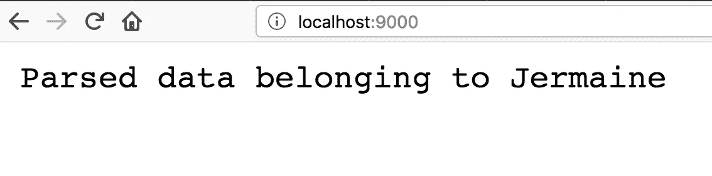

# 如何在不使用框架的情况下处理 Dart 中的 POST 请求主体

> 原文：<https://itnext.io/how-to-handle-the-post-request-body-in-dart-without-using-a-framework-c56f12744fd2?source=collection_archive---------3----------------------->

## 了解如何处理对服务器的 POST 请求


在这篇与几个月前我在 Node.js 上写的文章相关的文章中，我将展示我们如何在 Dart 中处理 POST 请求的有效负载。这里假设这个有效负载的`Content-Type`是`application/x-www-form-urlencoded`，它本质上描述了格式化为查询字符串的数据。

# 1.创建我们的服务器

创建一个`main.dart`文件，并输入下面的代码片段:

```
**import 'dart:io'**;void **main**() **async** {
  var **server** = **await HttpServer.bind**('localhost', 9000); **await for (HttpRequest req in server) {**
    **req.response**
      ..**headers.set**('Content-Type', 'text/html')
      ..**write**('''
        <!doctype html>
        <html>
        <body>
          <form action="/" method="post">
            <input type="text" name="fname" /><br />
            <input type="number" name="age" /><br />
            <input type="file" name="photo" /><br />
            <button>Save</button>
          </form>
        </body>
        </html>
      ''')
      ..**close()**;
  **}** }
```

这将引导我们的服务器，并在向`http://localhost:9000`发出请求时用一个表单进行响应。该代码片段从导入`dart:io`库开始，因为它包含了创建服务器所需的类。整个引导过程发生在一个`main()`函数中，运行我们的 Dart 应用程序需要这个函数。

要运行该文件，请在终端中键入以下命令:

```
dart main.dart
```

您应该会在浏览器中看到一个表单:


在 http://localhost:9000 提供的 html

# 2.捕获发布的有效负载

现在让我们确保我们正在处理一个 POST 请求:

```
...
...await for (HttpRequest req in server) {
  **if (req.method == 'POST') {**
   **// deal with the payload**  
  **} else {**
    req.response
      ..headers.set('Content-Type', 'text/html')
      ..write('''
        <!doctype html>
        <html>
        <body>
          <form action="/" method="post">
            <input type="text" name="fname" /><br />
            <input type="number" name="age" /><br />
            <input type="file" name="photo" /><br />
            <button>Save</button>
          </form>
        </body>
        </html>
      ''')
      ..close();
  **}**
}
```

对服务器的请求被视为一个`Stream`，这意味着我们可以使用请求的`transform`方法来解码内容。

```
if (req.method == 'POST') {
  var content = **await req.transform().join()**;
} ...
```

这不会马上生效，因为`transform`方法需要一个`StreamTransformer`。一个`StreamTransformer`包含一个`bind`方法，允许它以某种方式操作流数据。我们需要一个来将我们的流数据转换成可读的格式，然后使用`join`方法来组合我们的*转换后的*块。

在我们的`dart:io`导入下，我们需要`dart:convert`库:

```
import 'dart:io';
**import 'dart:convert';**
```

并将`Utf8Decoder`用作我们的变压器:

```
var content = await req.transform(**Utf8Decoder()**).join();
```

如果您在表格中填写了相关的详细信息，打印出的`content`将会给出以下结果:

```
fname**=**John**&**age=30**&**photo**=**file.jpg
```

然而，我们仍然需要从查询字符串中提取信息的键/值对。幸运的是，我们在核心 Dart SDK 中有一个`Uri`类:

```
var content = await req.transform(Utf8Decoder()).join();
var queryParams = **Uri(query: content).queryParameters**;
```

# 3.回复帖子

现在让我们发回一个响应:

```
var content = await req.transform(Utf8Decoder()).join();
var queryParams = Uri(query: content).queryParameters;**req.response
  ..write('Parsed data belonging to ${queryParams['fname']}')
  ..close();**
```

**更新 20/10/2018**:[to be O](https://medium.com/u/fc8b5cd1b260?source=post_page-----c56f12744fd2--------------------------------)(*创建者* [*天使*](https://github.com/angel-dart/angel) )有用的指出了使用`splitQueryString`静态方法提取查询参数:

```
// var queryParams = Uri(query: content).queryParameters;
**var queryParams = Uri.splitQueryString(content);**
```

我们的查询参数作为一个`Map`对象返回，允许我们像这样提取我们的值:

```
queryParams['fname'];
queryParams['age'];
queryParams['photo'];
```



我们发布请求的响应

以下是完整的解决方案:

完成的代码🎯

# 最后…

与相关的文章一样，如果有效负载内容类型是`application/x-www-form-urlencoded`，这种方法是可行的，如果解析其他内容类型，则需要不同的方法。我们将在以后的文章中讨论这个问题。

**订阅**[**Youtube 频道**](https://www.youtube.com/channel/UCHSRZk4k6e-hqIXBBM4b2iA?view_as=subscriber) **了解 Dart** 上即将推出的视频。谢谢！

**喜欢，分享，关注我**😍有关 Dart 的更多内容。

# 进一步阅读

1.  [Dart 中的 Hello world 服务器](https://www.dartlang.org/tutorials/dart-vm/httpserver#run-the-hello-world-server)
2.  [在 Dart 中创建流](https://www.dartlang.org/articles/libraries/creating-streams)
3.  [**egghead . io 上的免费飞镖截屏**](https://egghead.io/instructors/jermaine-oppong)