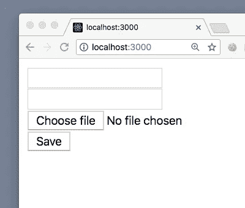
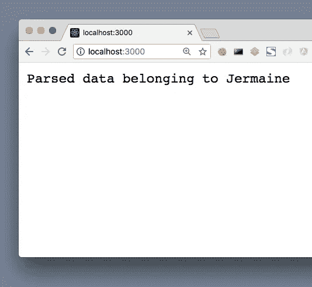

# 不使用框架如何处理 Node.js 中的 POST 请求体

> 原文：<https://itnext.io/how-to-handle-the-post-request-body-in-node-js-without-using-a-framework-cd2038b93190?source=collection_archive---------0----------------------->


*照片由* [*塞巴斯蒂安*](https://unsplash.com/photos/dHOgx7fEByA?utm_source=unsplash&utm_medium=referral&utm_content=creditCopyText) *上* [*下*](https://unsplash.com/search/photos/programming?utm_source=unsplash&utm_medium=referral&utm_content=creditCopyText)

这篇文章重点介绍了一个尝试，试图了解在 post 请求体中发送的数据的原始格式，以及如何解析它。像 Express 的 **body-parser** 这样的包为我们做了这些，所以这篇文章仅仅是为了学习。我不会建议在生产中使用这种解决方案。

当通过 HTML 表单提交向服务器发出 post 请求时，发送到后端的数据通常配置有以下媒体类型之一:**application/x-www-form-urlencoded**、 **multipart/form-data** 或 **text/plain** 。在这个例子中，我正在查看**application/x-www-form-urlencoded**。

# 创建我们的服务器

让我们使用下面的代码片段来设置一个:

```
const http = require('http');const server = http.createServer((req, res) => {
    res.end(`
        <!doctype html>
        <html>
        <body>
            <form action="/" method="post">
                <input type="text" name="fname" /><br />
                <input type="number" name="age" /><br />
                <input type="file" name="photo" /><br />
                <button>Save</button>
            </form>
        </body>
        </html>
    `);
});server.listen(3000);
```

这应该会在 [http://localhost:3000](http://localhost:3000) 上旋转一个带有 web 表单的页面:



填充字段并点击“保存”会将结果提交到包含预期数据字段的根路径。这将使用默认的媒体类型**application/x-www-form-urlencoded**。这意味着**它将创建一个查询字符串，使用字段名作为关键字，使用其数据作为值**。

# 捕获发布的数据

要设置场景来捕获这些数据，我们必须首先检查它是一个 POST 请求:

```
const http = require('http');const server = http.createServer((req, res) => {
    **if (req.method === 'POST') {** // Handle post info...
    **}
    else {** res.end(`
        <!doctype html>
        <html>
        <body>
            <form action="/" method="post">
                <input type="text" name="fname" /><br />
                <input type="number" name="age" /><br />
                <input type="file" name="photo" /><br />
                <button>Save</button>
            </form>
        </body>
        </html>
      `);
    **}**
});server.listen(3000);
```

假设发送到后端的请求是一个 [*可读的* *流*](https://nodejs.org/dist/latest-v8.x/docs/api/stream.html#stream_readable_streams) ，[*event emitter API*](https://nodejs.org/api/events.html#events_class_eventemitter)用作从该流中读取数据的手段(*我们不需要在这里导入“events”模块，因为请求对象扩展了 EventEmitter* ):

```
...if (req.method === 'POST') {
    **let body = '';
    req.on('data', chunk => {
        body += chunk.toString();** // convert Buffer to string **});
    req.on('end', () => {
        console.log(body);
        res.end('ok');
    });**
}
...
```

填写表格并点击“保存”会将此信息记录到控制台:

```
fname=Jermaine**&**age=29**&**photo=jermaine-photo.png
```

表单中的每个字段由&字符分隔，键和值由等号分隔。

# 解析数据

为了方便访问每个键/值对，我们将使用节点的内置 **querystring** 模块将数据转换为对象:

```
// At the top of the file
**const { parse } = require('querystring');**
...
...if (req.method === 'POST') {
    let body = '';
    req.on('data', chunk => {
        body += chunk.toString();
    });
    req.on('end', () => {
        console.log(
            **parse(**body**)**
        );
        res.end('ok');
    });
}
...
```

这将记录以下结果:

```
{
    fname: 'Jermaine',
    age: '29',
    photo: 'jermaine-photo.jpg'
}
```

为了更好地整理这一点，让我们创建一个实用函数来简化上面的内容:

```
**function collectRequestData(request, callback) {**
    const FORM_URLENCODED = 'application/x-www-form-urlencoded'; if(request.headers['content-type'] === FORM_URLENCODED) {
        let body = '';
        request.on('data', chunk => {
            body += chunk.toString();
        });
        request.on('end', () => {
            callback(parse(body));
        });
    }
    else {
        callback(null);
    }
**}**
```

我们将这样使用我们的函数:

```
...
if(req.method === 'POST') {
    **collectRequestData(req, result => {**
        console.log(result);
        res.end(`Parsed data belonging to ${result.fname}`);
    **});**
}
...
```

填写表单并提交时，应显示以下消息:



以下是完整的解决方案:

# 限制

您可能已经注意到，上传文件只将文件名发送到后端，而不是文件本身。这是对**应用程序/x-www-form-urlencoded** 媒体类型的限制。使用**多部分/形式数据**将发送原始文件及其元数据。也许在以后的文章中，我们会看看如何做到这一点！同时，这里的 [**介绍了如何在不使用框架**](/how-to-handle-the-post-request-body-in-dart-without-using-a-framework-c56f12744fd2) 的情况下处理 Dart 中的 POST 请求正文。

我希望这是一个大开眼界，关于原始数据格式如何发送到后端，以及我们将如何处理这一点。

*有趣的是*，我经营着一个 [**YouTube 频道**](https://youtube.com/c/CreativeBracket) 教用户用 Dart 语言及其生态系统构建全栈应用。 [**今天就订阅**](https://youtube.com/c/CreativeBracket) 和我一起踏上这段旅程。

一如既往，欢迎您的反馈。先谢过了。

# 进一步阅读

*   [HTTP 事务的剖析](https://nodejs.org/en/docs/guides/anatomy-of-an-http-transaction/)
*   [Node.js Streams:你需要知道的一切](https://medium.freecodecamp.org/node-js-streams-everything-you-need-to-know-c9141306be93)
*   [MDN 上的 MIME 类型](https://developer.mozilla.org/en-US/docs/Web/HTTP/Basics_of_HTTP/MIME_types)