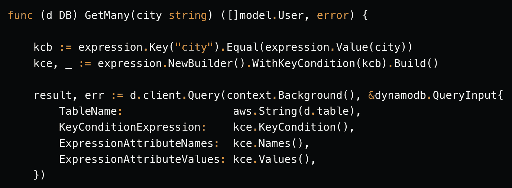
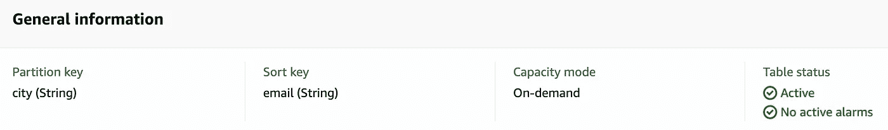
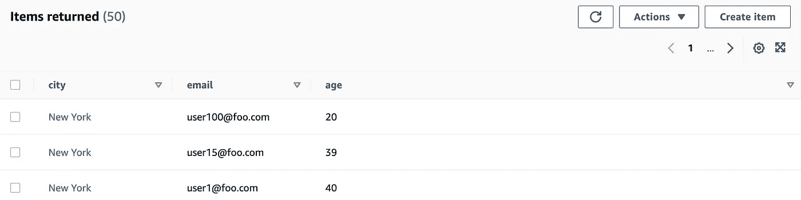

# 如何用 DynamoDB Go SDK 处理类型转换

> 原文：<https://itnext.io/how-to-handle-type-conversions-with-the-dynamodb-go-sdk-ea3529b64e?source=collection_archive---------1----------------------->



DynamoDB Go SDK

## 通过实用的代码示例学习

`DynamoDB`提供了一组[丰富的数据类型](https://docs.aws.amazon.com/amazondynamodb/latest/developerguide/HowItWorks.NamingRulesDataTypes.html)，包括`String` s、`Number` s、`Set` s、`List` s、`Map` s 等。在用于 DynamoDB 的 [Go SDK 中，](https://pkg.go.dev/github.com/aws/aws-sdk-go-v2/service/dynamodb)[类型](https://pkg.go.dev/github.com/aws/aws-sdk-go-v2/service/dynamodb/types)包包含这些数据类型的 Go 表示，而 [attributevalue](https://pkg.go.dev/github.com/aws/aws-sdk-go-v2/feature/dynamodb/attributevalue) 模块提供了处理 Go 和`DynamoDB`类型的函数。

这篇博客文章将展示如何在你的应用程序和`DynamoDB`中处理 Go 类型之间的转换。我们将从简单的代码片段开始，介绍一些 API 构造，并以一个示例结束，说明如何在一个完整的应用程序的上下文中使用这些 Go SDK 特性(包括代码遍历)。

> *可以参考* [*GitHub*](https://github.com/abhirockzz/dynamodb-go-sdk-type-conversion) 上的完整代码

首先，看几个例子。

> *请注意，为了保持简洁，下面的代码片段中特意省略了错误处理。*

# 从 Go 类型转换到 DynamoDB 类型

[Marshal](https://pkg.go.dev/github.com/aws/aws-sdk-go-v2/feature/dynamodb/attributevalue#Marshal) 系列函数负责这一点。它与基本标量(`int`、`uint`、`float`、`bool`、`string`)、`map`、`slice`和`struct`一起工作。

要处理标量类型，只需使用(generic) `Marshal`函数:

```
func marshalScalars() {
 av, err := attributevalue.Marshal("foo")
 log.Println(av.(*types.AttributeValueMemberS).Value)

 av, err = attributevalue.Marshal(true)
 log.Println(av.(*types.AttributeValueMemberBOOL).Value)

 av, err = attributevalue.Marshal(42)
 log.Println(av.(*types.AttributeValueMemberN).Value)

 av, err = attributevalue.Marshal(42.42)
 log.Println(av.(*types.AttributeValueMemberN).Value)
}
```

`Marshal`将 Go 数据类型转换为[属性值](https://pkg.go.dev/github.com/aws/aws-sdk-go-v2/service/dynamodb/types#AttributeValue)。但是`AttributeValue`本身只是一个`interface`，需要你将其转换成具体的类型，比如 [AttributeValueMemberS](https://pkg.go.dev/github.com/aws/aws-sdk-go-v2/service/dynamodb/types#AttributeValueMemberS) (对于`string`)、[AttributeValueMemberBOOL](https://pkg.go.dev/github.com/aws/aws-sdk-go-v2/service/dynamodb/types#AttributeValueMemberBOOL)(对于`boolean`)等。

> *如果你试图转换不兼容的类型，SDK 会给出一个有用的错误消息。例如* `*panic: interface conversion: types.AttributeValue is *types.AttributeValueMemberN, not *types.AttributeValueMemberS*`

使用`slice` s 和 `map` s 时，最好使用特定的函数，如[编组列表](https://pkg.go.dev/github.com/aws/aws-sdk-go-v2/feature/dynamodb/attributevalue#MarshalList)和[编组映射](https://pkg.go.dev/github.com/aws/aws-sdk-go-v2/feature/dynamodb/attributevalue#MarshalMap):

```
func marshalSlicesAndMaps() {
 avl, err := attributevalue.MarshalList([]string{"foo", "bar"})

 for _, v := range avl {
  log.Println(v.(*types.AttributeValueMemberS).Value)
 }

 avm, err := attributevalue.MarshalMap(map[string]interface{}{"foo": "bar", "boo": "42"})

 for k, v := range avm {
  log.Println(k, "=", v.(*types.AttributeValueMemberS).Value)
 }
}
```

上面的例子让您了解了如何孤立地处理简单的数据类型。在现实世界的应用程序中，您将利用*复合*数据类型来表示您的领域模型——它们很可能是 Go `struct`的形式。所以让我们看几个例子。

# 使用 Go 结构

这里有一个简单的例子:

```
type User struct {
 Name string
 Age  string
}

func marshalStruct() {
 user := User{Name: "foo", Age: "42"}

 av, err := attributevalue.Marshal(user)

 avm := av.(*types.AttributeValueMemberM).Value
 log.Println("name", avm["Name"].(*types.AttributeValueMemberS).Value)
 log.Println("age", avm["Age"].(*types.AttributeValueMemberS).Value)

 avMap, err := attributevalue.MarshalMap(user)

 for name, value := range avMap {
  log.Println(name, "=", value.(*types.AttributeValueMemberS).Value)
 }
}
```

> *注意在处理 Go 结构时使用* `*MarshalMap*` *(而不是* `*Marshal*` *)是多么的方便，尤其是当你的应用程序不知道所有的属性名的时候。*

到目前为止，看起来我们可以处理简单的用例。但是我们可以做得更好。这个例子有一个同质的数据类型，即`struct`只有`string`类型，这使得迭代结果`map`并将值转换为`*types.AttributeValueMemberS`变得容易——如果不是这样，你将不得不迭代每一个属性值类型并将它转换为适当的 Go 类型。这在与其余的`DynamoDB`API 一起工作时会很明显。例如， [GetItem](https://pkg.go.dev/github.com/aws/aws-sdk-go-v2/service/dynamodb#Client.GetItem) 调用的结果( [GetItemOutput](https://pkg.go.dev/github.com/aws/aws-sdk-go-v2/service/dynamodb#GetItemOutput) )包含一个`map[string]types.AttributeValue`。

SDK 为我们提供了一种使这变得更加容易的方法！

# 从 DynamoDB 转换到 Go 类型

`Unmarshal`系列函数负责这一点。这是另一个例子:

```
type AdvancedUser struct {
 Name         string
 Age          int
 IsOnline     bool
 Favourites   []string
 Contact      map[string]string
 RegisteredOn time.Time
}

func marshalUnmarshal() {
 user := AdvancedUser{
  Name:         "abhishek",
  Age:          35,
  IsOnline:     false,
  Favourites:   []string{"Lost In Translation, The Walking Dead"},
  Contact:      map[string]string{"mobile": "+919718861200", "email": "abhirockzz@gmail.com"},
  RegisteredOn: time.Now(),
 }

 avMap, err := attributevalue.MarshalMap(user)

 var result AdvancedUser
 err = attributevalue.UnmarshalMap(avMap, &result)

 log.Println("\nname", result.Name, "\nage", result.Age, "\nfavs", result.Favourites)
}
```

使用`MarshalMap`，我们将`AdvancedUser` struct 的一个实例转换成了`map[string]types.AttributeValue`(假设您得到的是对`GetItem` API 调用的响应)。现在，我们不用迭代单个的`AttributeValue`，而是简单地使用`[UnmarshalMap](https://pkg.go.dev/github.com/aws/aws-sdk-go-v2/feature/dynamodb/attributevalue#UnmarshalMap)`将其转换回 Go `struct`。

还有呢！像`UnmarshalListOfMaps`这样的实用功能可以方便地与多个`slice`一起工作。

```
type AdvancedUser struct {
 Name         string
 Age          int
 IsOnline     bool
 Favourites   []string
 Contact      map[string]string
 RegisteredOn time.Time
}

func marshalUnmarshal() {
 user := AdvancedUser{
  Name:         "abhishek",
  Age:          35,
  IsOnline:     false,
  Favourites:   []string{"Lost In Translation, The Walking Dead"},
  Contact:      map[string]string{"mobile": "+919718861200", "email": "abhirockzz@gmail.com"},
  RegisteredOn: time.Now(),
 }

 avMap, err := attributevalue.MarshalMap(user)

 var result AdvancedUser
 err = attributevalue.UnmarshalMap(avMap, &result)

 log.Println("\nname", result.Name, "\nage", result.Age, "\nfavs", result.Favourites)
}
```

# 使用 struct 标记进行自定义

`Marshal`和`Unmarshal`函数支持`dynamodbav` struct 标签来控制 Go 类型和`DynamoDB`T21 之间的转换。考虑以下`struct`:

```
type User struct {
 Email string `dynamodbav:"email" json:"user_email"`
 Age   int    `dynamodbav:"age,omitempty" json:"age,omitempty"`
 City  string `dynamodbav:"city" json:"city"`
}
```

`dynamodbav`派上用场的几个常见场景。

**自定义属性名称**

比方说，我们有一个以 email 作为分区键的表。如果没有`dynamodbav:"email"`标签，当我们封送`User`结构并试图保存在表中时，它将使用`Email`(大写)作为属性名- `DynamoDB`将不接受这一点，因为[属性名区分大小写](https://docs.aws.amazon.com/amazondynamodb/latest/developerguide/HowItWorks.NamingRulesDataTypes.html#HowItWorks.NamingRules) - *“所有名称必须使用 UTF-8 编码，并且区分大小写。”*

> *注意，我们也组合了* [*json 标签*](https://cs.opensource.google/go/go/+/go1.19:src/encoding/json/encode.go;l=157) *(这是完全有效的)——它不是由* `*DynamoDB*` *使用，而是在编码和解码数据时由 json 库使用*

**处理缺失的属性**

`DynamoDB`是一个 NoSQL 数据库，表没有固定的模式(除了`partition`键和一个可选的`sort`键)。例如，用户项目可能*而不是*包括年龄属性。通过使用`dynamodbav:"age,omitempty"`，如果`Age`字段丢失，它将不会被发送到`DynamoDB`(它将被忽略)

> *在没有这个标签的情况下，我们的* `*DynamoDB*` *记录将把* `*Age*` *属性设置为*`*0*`*——取决于您的用例，这可能是也可能不是*

要查看这个 struct 标签的所有使用模式，请参考 [Marshal API 文档](https://pkg.go.dev/github.com/aws/aws-sdk-go-v2/feature/dynamodb/attributevalue#Marshal)。

如前所述，让我们探索如何将所有这些 API 用于一个…

# …端到端示例

我们将看一个公开带有几个端点的 REST API 的 Go 应用程序。它结合了 CRUD API(`PutItem`、`GetItem`等)。)以及上面提到的所有函数/API。

## 尝试应用程序

在我们看到代码之前，让我们快速回顾和测试应用程序公开的端点。您需要安装 Go，克隆应用程序并切换到正确的目录。

```
git clone https://github.com/abhirockzz/dynamodb-go-sdk-type-conversion
cd dynamodb-go-sdk-type-conversion
```

首先，创建一个`DynamoDB`表(您可以将其命名为 users)。使用城市作为`Partition`键，电子邮件作为`Sort`键。



DynamoDB 表(图片由作者提供)

你需要一些测试数据。您可以手动这样做，但是我已经包含了一个简单的实用程序，用于在应用程序启动期间播种一些测试数据。要使用它，只需在应用程序启动时设置`SEED_TEST_DATA`变量:

```
export SEED_TEST_DATA=true

go run main.go
# output
started http server...
```

这将创建`100`项目。检查`DynamoDB`表以确认:



DynamoDB 表格数据(图片由作者提供)

您的应用程序应该在端口`8080`可用。您可以使用`curl`或任何其他`HTTP`客户端来调用端点:

```
# to get all users
curl -i http://localhost:8080/users/

# to get all users in a particular city
curl -i http://localhost:8080/users/London

# to get a specific user
curl -i "http://localhost:8080/user?city=London&email=user11@foo.com"
```

为了更好地理解如何使用上述 API，让我们简要回顾一下代码的关键部分:

## 代码遍历

**向 DynamoDB 表添加新项目**

从添加一个`User`的 HTTP 处理程序开始:

```
func (h Handler) CreateUser(rw http.ResponseWriter, req *http.Request) {
 var user model.User

 err := json.NewDecoder(req.Body).Decode(&user)
 if err != nil {// handle error}

 err = h.d.Save(user)
 if err != nil {// handle error}

 err = json.NewEncoder(rw).Encode(user.Email)
 if err != nil {// handle error}
}
```

首先，我们将`JSON`有效载荷转换成一个`User`结构，然后将它传递给`Save`函数。

```
func (d DB) Save(user model.User) error {

 item, err := attributevalue.MarshalMap(user)

 if err != nil {// handle error}

 _, err = d.client.PutItem(context.Background(), &dynamodb.PutItemInput{
  TableName: aws.String(d.table),
  Item:      item})

 if err != nil {// handle error}

 return nil
}
```

注意如何使用`MarshalMap`将`User`结构转换成`PutItem` API 可以接受的`map[string]types.AttributeValue`:

**从 DynamoDB 中获取单品**

由于我们的表有一个复合主键(`city`是`partition`键，`email`是`sort`键)，我们需要提供这两个键来定位一个特定的用户项:

```
func (h Handler) FetchUser(rw http.ResponseWriter, req *http.Request) {

 email := req.URL.Query().Get("email")
 city := req.URL.Query().Get("city")

 log.Println("getting user with email", email, "in city", city)

 user, err := h.d.GetOne(email, city)
 if err != nil {// handle error}

 err = json.NewEncoder(rw).Encode(user)
 if err != nil {// handle error}
}
```

我们从`HTTP`请求的查询参数中提取出`email`和`city`，并将其传递给数据库层(`GetOne`函数)。

```
func (d DB) GetOne(email, city string) (model.User, error) {

 result, err := d.client.GetItem(context.Background(),
  &dynamodb.GetItemInput{
   TableName: aws.String(d.table),
   Key: map[string]types.AttributeValue{
    "email": &types.AttributeValueMemberS{Value: email},
    "city":  &types.AttributeValueMemberS{Value: city}},
  })

 if err != nil {// handle error}

 if result.Item == nil {
  return model.User{}, ErrNotFound
 }

 var user model.User

 err = attributevalue.UnmarshalMap(result.Item, &user)
 if err != nil {// handle error}

 return user, nil
}
```

我们调用`GetItem` API 并以`map[string]types.AttributeValue`的形式获取结果(通过`GetItemOutput`中的`Item`属性)。使用`UnmarshalMap`将其转换回 Go ( `User`)结构。

> *注意，* `*GetItemInput*` *中的* `*Key*` *属性也接受一个* `*map[string]types.AttributeValue*` *，但是我们不用* `*MarshalMap*` *来创建它*

**获取多个项目**

我们可以选择查询特定城市中的所有用户——这是一个非常有效的访问模式，因为“T4”是“T5”键。

HTTP 处理函数接受城市作为路径参数，并将其传递给数据库层。

```
func (h Handler) FetchUsers(rw http.ResponseWriter, req *http.Request) {
 city := mux.Vars(req)["city"]
 log.Println("city", city)

 log.Println("getting users in city", city)

 users, err := h.d.GetMany(city)

 if err != nil {
  http.Error(rw, err.Error(), http.StatusInternalServerError)
  return
 }

 err = json.NewEncoder(rw).Encode(users)
 if err != nil {
  http.Error(rw, err.Error(), http.StatusInternalServerError)
  return
 }
}
```

从那以后，`GetMany`函数做所有的工作:

```
func (d DB) GetMany(city string) ([]model.User, error) {

 kcb := expression.Key("city").Equal(expression.Value(city))
 kce, _ := expression.NewBuilder().WithKeyCondition(kcb).Build()

 result, err := d.client.Query(context.Background(), &dynamodb.QueryInput{
  TableName:                 aws.String(d.table),
  KeyConditionExpression:    kce.KeyCondition(),
  ExpressionAttributeNames:  kce.Names(),
  ExpressionAttributeValues: kce.Values(),
 })

 if err != nil {
  log.Println("Query failed with error", err)
  return []model.User{}, err
 }

 users := []model.User{}

 if len(result.Items) == 0 {
  return users, nil
 }

 err = attributevalue.UnmarshalListOfMaps(result.Items, &users)
 if err != nil {
  log.Println("UnmarshalMap failed with error", err)
  return []model.User{}, err
 }

 return users, nil
}
```

注意两件事:

*   如何使用`KeyConditionExpression`(这来自`expressions`包)
*   更有趣的是，使用`UnmarshalListOfMaps`函数直接将一个`[]map[string]types.AttributeValue`(dynamo db 中的`slice`项)转换成一个`User` struct 的`slice`。如果不是这个函数，我们将需要从结果中提取每个项目，即一个`map[string]types.AttributeValue`并为每个项目调用`UnmarshalMap`。所以这很方便！

**终于——什么都有了！**

`GetAll`函数使用`Scan`操作来检索`DynamoDB`表中的所有记录。

> *`*Scan*`*操作遍历整个表(或二级索引),很有可能最终会消耗掉一大块所提供的吞吐量，尤其是在表很大的情况下。应该是你最后的手段——检查* [*查询 API*](https://docs.aws.amazon.com/amazondynamodb/latest/APIReference/API_Query.html) *(或者*[*BatchGetItem*](https://docs.aws.amazon.com/amazondynamodb/latest/APIReference/API_BatchGetItem.html)*)是否对你的用例有效。**

```
*func (d DB) GetAll() ([]model.User, error) {

 result, err := d.client.Scan(context.Background(), &dynamodb.ScanInput{
  TableName: aws.String(d.table),
 })

 if err != nil {
  log.Println("Scan failed with error", err)
  return []model.User{}, err
 }

 users := []model.User{}

 err = attributevalue.UnmarshalListOfMaps(result.Items, &users)

 if err != nil {
  log.Println("UnmarshalMap failed with error", err)
  return []model.User{}, err
 }

 return users, nil
}*
```

# *包裹*

*我希望你觉得这很有用，现在你已经知道了`DynamoDB` Go SDK 中的 API 可以处理简单的 Go 类型以及`struct`、`map`、`slice`等。我鼓励你探索一些其他的细微差别，比如如何分别使用[marshalwithpoptions](https://pkg.go.dev/github.com/aws/aws-sdk-go-v2/feature/dynamodb/attributevalue#MarshalWithOptions)和[unmarshalwithpoptions](https://pkg.go.dev/github.com/aws/aws-sdk-go-v2/feature/dynamodb/attributevalue#UnmarshalWithOptions)定制`Marshal`和`Unmarshal`特性。*