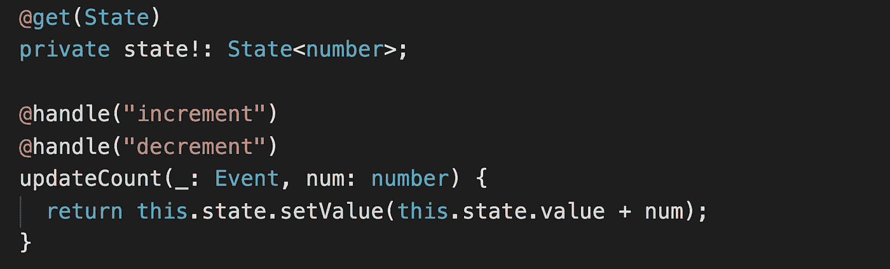

# 如何在托梁中“驾驭”自己

> 原文：<https://itnext.io/how-to-handle-yourself-in-joist-fa4b52b2b085?source=collection_archive---------8----------------------->

不久前，我介绍了一个新的框架，叫做“托梁 T2”。正如在那篇介绍中指出的，托梁更独特的特性之一是“处理程序”的概念，正因为如此，我认为深入研究什么是处理程序以及可以用它们做什么是值得的。

注意:如果你还没有阅读介绍，我建议你这样做。

托梁中的处理程序允许用户将一个或多个类方法映射到一个“动作”，并将一个或多个动作映射到单个类方法。更简单地说，一个动作可以触发一个或多个方法被调用。把它想象成一个事件系统。

在上面的简单例子中，很难看出这有什么用，因为直接调用这些方法要简单得多。为了说明如何从处理程序中获益，让我们来讨论一下动作本身应该是什么样子。动作名称应该描述正在发生的事情。例如，我们可以说“inc_btn_clicked”，而不是“increment”。这准确地解释了发生了什么相互作用。如果我们将这种命名方法与单个方法处理多个动作的能力结合起来，我们上面的例子可能看起来像这样。

现在，我们的代码更明确地告诉我们，当单击减量按钮或增量按钮时，我们将更新现有的计数。这有助于我们看到组件中正在发生什么，我们可以看到发生了什么动作以及以什么顺序发生。这是一个有助于调试的有用工具。

托梁处理程序也可以基于正则表达式进行匹配。例如，您可能决定要匹配任何以“btn_clicked”结尾的操作，或者在下面的代码中，我们可以创建一个调试函数，监视任何和所有操作并将其注销。

你们中的一些人可能会开始认为这类似于如何调试用 flux 或 redux 构建的应用程序，我们缺少的部分是看到我们的状态如何变化，我们可以看到动作流入，但看不到我们的状态流出。

有几种方法可以处理查看状态更新。我们可以直接监听注入的状态对象的变化，但是我们必须自己关联哪个动作导致哪个状态更新。更直接的方法是利用托梁的`onComplete`回调。托梁处理程序能够返回一个承诺，所以托梁知道所有的回调已经完成。

使用处理程序允许我们将模板代码与组件代码完全隔离开来。这让你可以定义非常清晰的组件代码，而不需要关心模板中有什么，你的组件只需要监听动作和设置状态，它可以不太关心表示层。

这是对托梁中处理程序概念的简要介绍。处理程序给了我们一些有趣的功能，你能想到我在这里没有提到的功能吗？让我知道，给托梁一个旋转！

[https://github.com/joist-framework/joist](https://github.com/joist-framework/joist)