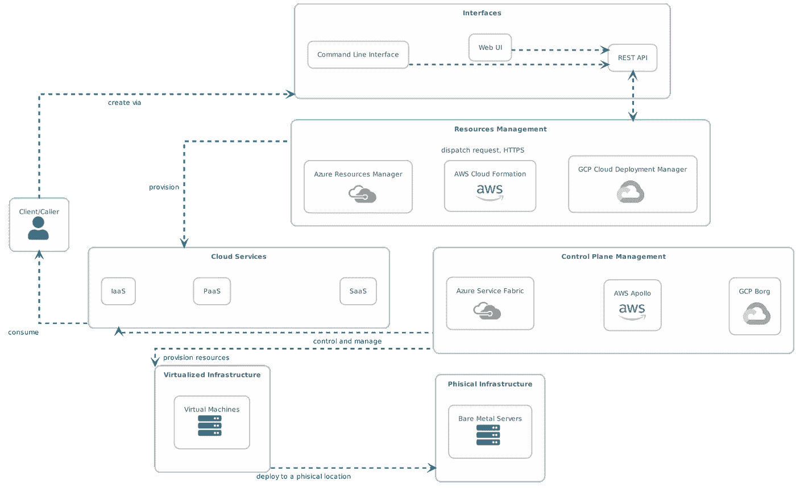
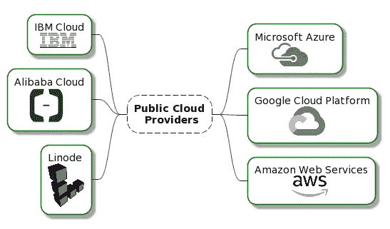
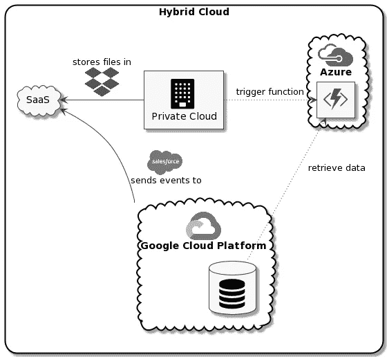
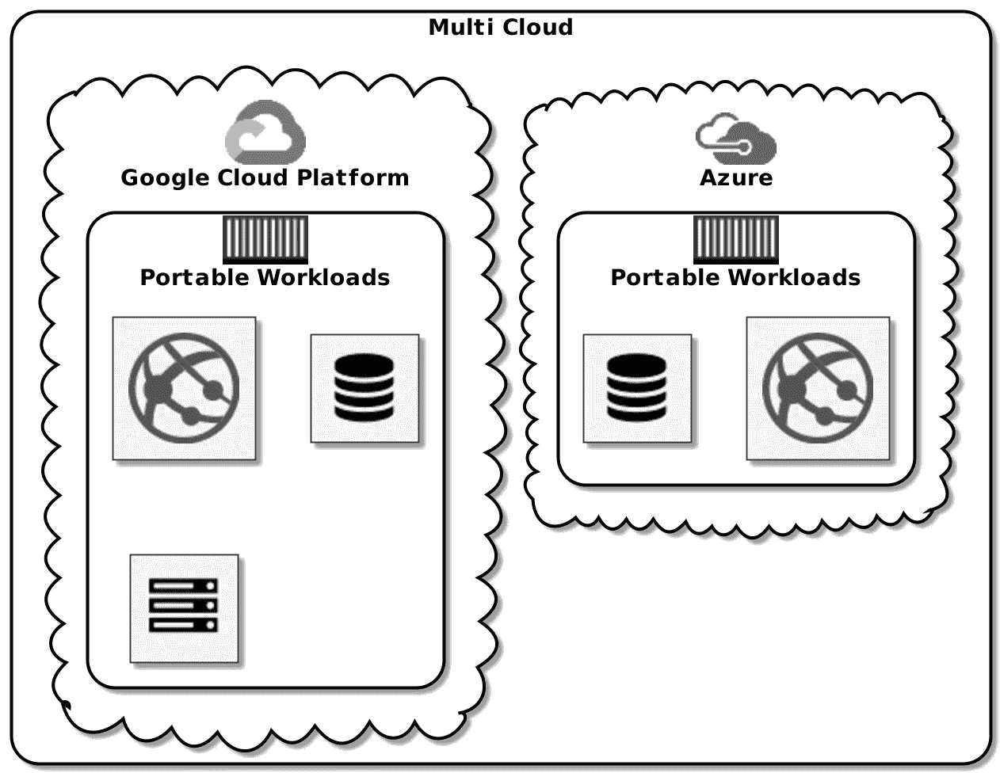

# 如何利用云计算的力量

> 原文：<https://itnext.io/how-to-harness-the-power-of-cloud-computing-d0bd73a34f7b?source=collection_archive---------5----------------------->

美国宇航局在 [Unsplash](https://unsplash.com/?utm_source=unsplash&utm_medium=referral&utm_content=creditCopyText) 拍摄的照片

## 第 1 部分:导言

## 介绍

云计算、云原生、公有云、私有云、混合云、多云、Azure、AWS、GCP、IBM、Linode、阿里巴巴、FaaS、CaaS、SaaS、PaaS、IaaS、DaaS……已经迷茫了？在这个博客系列中，我们将努力澄清这些话题。

选择合适的云计算设置来最好地满足我们的需求的方法和决策过程是什么？该系列中的每个博客都将围绕特定的需求，并使用行业最佳实践来提出合适的解决方案。

## 定义

几乎每个云提供商的工作方式都非常相似。下图显示了 3 个“超大规模”(AWS、Google Cloud 和 Azure)覆盖的主要组件和具体实现

来源:作者

让我们从定义与云相关的概念词汇开始，这些概念在我们后面的分析中会很有用。定义基于微软和 RedHat 网站。

> 云计算

云计算的官方定义有点过时，但仍然相关:

云计算是通过互联网(“云”)交付**计算资源**和**计算服务** —包括服务器、存储、数据库、网络、软件、分析和智能，以提供更快的创新、灵活的资源和规模经济。

*示例:微软 Office 365、数据湖、Gmail*

**云计算以不同的形式交付给消费者:**

> IaaS —基础设施即服务

云计算服务的最**基础品类**。借助 IaaS，您可以从云提供商那里以现收现付的方式租赁 IT 基础架构，包括服务器和虚拟机(VM)、存储、网络、操作系统。

> 平台即服务

平台即服务指的是云计算服务，**为开发、测试、交付和管理软件应用提供按需环境**。

> FaaS —功能即服务(或更广泛的无服务器计算)

无服务器计算专注于**构建应用功能**而无需以任何方式管理底层基础设施。无服务器架构是高度可扩展和事件驱动的，仅在特定功能或触发发生时使用资源。

> CaaS —容器即服务

这种类型的云服务使用基于容器的抽象帮助**管理和部署应用** (docker，build packs)。由于容器化工作负载的性质，基于 CaaS 的方法非常适合多云和混合云场景。

> SaaS —软件即服务

软件即服务是一种通过互联网按需交付软件应用的方法，通常基于**订阅**。用户通过互联网连接到该应用程序，通常在他们的手机、平板电脑或 PC 上使用 web 浏览器。

还有其他更“奇特”的 XaaS 形式(任何东西即服务)，例如 DaaS 数据库即服务等。

> 边缘计算

边缘计算指的是一种模型，即**在必要时将计算资源**分配到网络的“边缘”,同时在可能的情况下继续将资源集中在云模型中。这是一个解决问题的方案，需要根据时间敏感的数据快速提供可操作的见解，如物联网场景。

*示例:自动驾驶汽车、交通管理、远程数据中心*

> 公共云

公共云由第三方云服务提供商拥有和运营，他们通过互联网提供其**计算资源**和**计算服务**，包括服务器、存储、数据库、网络、软件、分析和智能。

受欢迎的公共云提供商列表

> 私有云

私有云是指由单个企业或组织专门使用的云计算资源**。私有云在物理上可以位于公司的现场数据中心。一些公司还向第三方服务提供商付费来托管他们的私有云。私有云是在私有网络上维护服务和基础架构的云。**

> 混合云

混合云**将多个云结合在一起，通常是公共云和私有云的混合**，通过允许数据和应用程序在它们之间共享的技术结合在一起。混合云需要某种形式的工作负载协调或集成。

如下所示，混合云场景需要集成和协调所有组件。在这里，工作负载分布在多个云中，但从业务角度来看，最终形成了一个完整的解决方案。混合云推动了边缘计算的新兴趋势，我们将在后面探讨。

混合云示例

> 多重云

多重云是一种云方法，由**使用来自不同公共云或不同私有云的一个或多个云服务**组成。云之间没有明确的工作负载编排或集成。

以下示例显示了在两个独立的公共云供应商中部署可移植工作负载的多云场景。该场景侧重于使用云提供商通过创建高度可移植的工作负载来减少供应商锁定。

多云示例

## 来源

如果您对该主题感兴趣，这些白皮书值得进一步研究。

*   [英特尔的多云白皮书](https://www.intel.com/content/dam/www/public/us/en/documents/white-papers/enterprise-and-government-purposeful-multicloud-whitepaper.pdf)
*   【Juniper Networks 云架构师的多云技术指南
*   [来自 IBM 的多云指南](https://www.ibm.com/cloud/learn/multicloud)
*   [RedHat 文档](https://www.redhat.com/en/topics/cloud-computing/what-is-hybrid-cloud)
*   [微软文档](https://azure.microsoft.com/en-us/overview/what-is-cloud-computing/)

# 摘要

所提供的定义和示例将为进一步的探索奠定基础。您是否对希望阅读的特定云相关主题感兴趣？请在评论中告诉我。

敬请关注本系列的下一部分，我们将讨论如何利用 multi cloud paradigm 和 Kubernetes 的工作负载可移植性，最大限度地避免供应商锁定特定的云提供商。