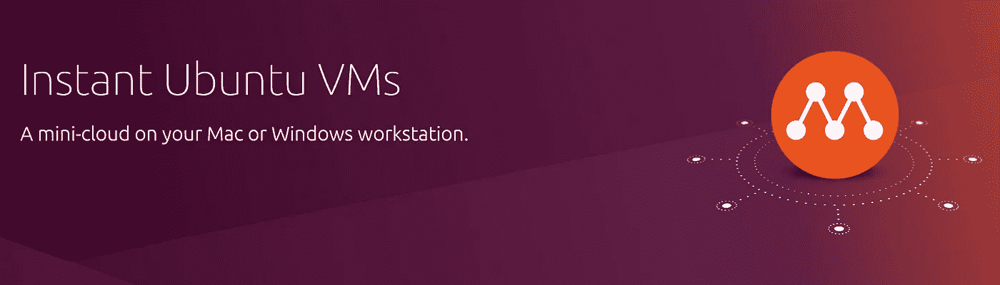
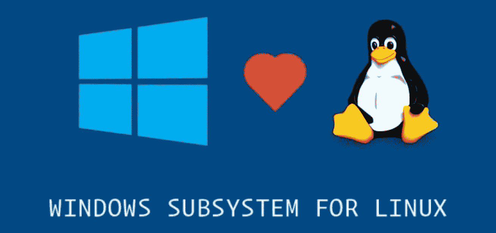
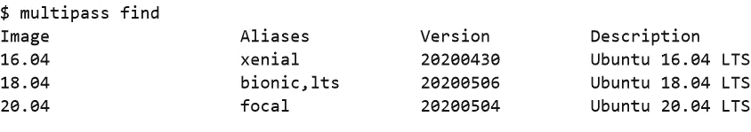
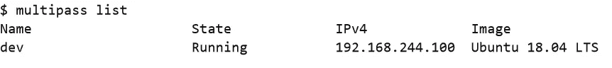
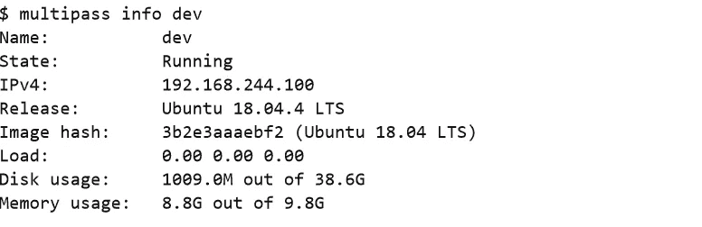
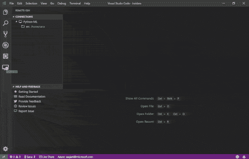

# 如何在 Linux、Mac 或 Windows 上使用 Multipass 拥有一个像 WSL 2 一样干净的开发环境

> 原文：<https://itnext.io/how-to-have-a-clean-dev-environment-like-wsl-2-using-multipass-on-linux-mac-or-windows-6828a78b87d7?source=collection_archive---------0----------------------->

## 保持您的开发人员笔记本电脑整洁的指南



我相信你已经听说过 [Windows 10 的 **WSL** 功能](https://docs.microsoft.com/en-us/windows/wsl/about)，我相信这个功能将会改变微软吸引开发者的游戏规则。最近，通过在 [**WSL 2**](https://docs.microsoft.com/en-us/windows/wsl/wsl2-about) 中引入一种新的架构，微软决定改进这一特性，使其更快，对开发者更友好。在 WSL 2 中，微软在 VM 内部使用真正的 Linux 内核，而不是在其上的兼容层。

对我来说，作为一名开发人员，WSL 2 非常棒，因为我可以在一个真正的 Linux 内核上开发，同时拥有一台 windows 笔记本电脑并利用两者的优势。除此之外，我有一个独立的虚拟机，因此可以在 Windows 10 和该虚拟机之间轻松共享项目文件。另一个好处是，我不需要为我想参与的每个项目安装一堆 SDK，我可以保持我的计算机干净，并为每个项目创建几个使用 WSL 2 的虚拟机，例如，我不需要在我的机器上安装 rust SDK 和编译器，只需运行一个测试应用程序或基准测试，或者安装一个本地 Kubernetes，而不会损坏我的机器。另一方面，有几个项目只能在 Linux 上运行，如果你想运行它们，你需要一台 Linux 机器。



问题是 WSL 2 对 windows 用户来说是一个特殊的特性，在本文中，我将向您展示我们如何在 Linux、Mac 甚至 Windows 上建立一个看起来像 WSL 2 的开发环境(但不是完全像 WSL 2 )!

为此，我们将使用这些程序:

*   [**Multipass**](https://multipass.run/) (一个跨平台的轻量级 VM 管理器)
*   [**Ubuntu 服务器**](https://ubuntu.com/download/server)
*   [**Cloud-init**](https://cloud-init.io/) (可选)
*   [**VS**](https://code.visualstudio.com/)同 [**远程开发扩展**](https://marketplace.visualstudio.com/items?itemName=ms-vscode-remote.vscode-remote-extensionpack) (可选)

想象一下你讨厌 Java，不想在你的机器上安装一堆 SDK 和库(像 Maven 和 JDK)来测试一个基于 Java 的项目，或者你没有 Linux 机器来安装一个只在 Linux 操作系统上安装的程序( [Docker](https://www.docker.com/) 、 [Kubernetes](https://kubernetes.io/) 或者 [Kurento](https://www.kurento.org/) )。在这些情况下，使用虚拟机是有帮助的，你只需在虚拟机中克隆那个项目，测试一些东西并完成，你不需要在你的 Mac(或任何其他操作系统)上安装 JDK 或 Maven。

## 可用的解决方案

除了在 windows 上使用 WSL 之外，对于这种类型的场景还有其他几种解决方案，例如，您可以使用 [**VirtualBox**](https://www.virtualbox.org/) 来创建和管理虚拟机，或者在更高级别上使用[](https://www.vagrantup.com/)**来创建、配置和供应虚拟机。对我来说，VirtualBox 很重，它有几个特性是我作为后端开发者不需要的。我喜欢流浪，并使用它，但我发现它沉重和缓慢，我发现它对我个人的使用太多。因为这些原因，我尝试用一个手工制作(但不完整)的方案来完成我的个人旅程。**

# **我们开始吧**

**第一步，我们需要在一个轻量级虚拟机中安装一个全功能的 Linux，这样我们就可以使用 ssh 轻松地连接到它。 **Multipass** 是一个跨平台的虚拟机管理器，它允许我们通过针对每个操作系统的快速虚拟机管理程序技术轻松创建和管理 **Ubuntu 服务器**。默认情况下，Multipass 在 Linux 上使用 **KVM** ，在 Windows 上使用 **Hyper-V** ，在 macOS 上使用 **HyperKit** 作为驱动程序。Multipass 增加了对 [VirtualBox](https://www.virtualbox.org/) 和 [libvirt](https://libvirt.org/) 的支持，您可以通过使用`set`命令将它们用作驱动程序:**

```
multipass set local.driver=virtualbox
```

**您可以使用`get`命令检查您当前的驱动程序:**

```
multipass get local.driver
```

## **快速创建您的第一个虚拟机**

**您可以通过`launch`命令创建一个 Ubuntu 虚拟机，但是在创建 VM 之前，您应该使用`find`命令查看可用映像的列表:**

```
multipass find
```

****

**多通道查找输出**

**现在，您可以通过选择其中一个映像并指定 RAM、CPU 和磁盘的数量来创建您的第一个虚拟机:**

```
multipass launch bionic -n dev -c 4 -m 1G -d 20G --cloud-init  projects/cloud-init.yaml
```

**在`multipass launch`之后的所有选项都是可选的，你可以在没有任何参数的情况下运行`multipass launch`，然后 multipass 将为你创建一个带有默认值的 VM(甚至是默认名称！)，但如果想对资源有更好的控制，还是用那些选项比较好。**

**如果您不使用`cloud-init`选项，multipass 将为您创建一个 ssh 密钥，并将其公钥作为授权密钥添加到创建的 VM 中，但是我更喜欢使用一个`cloud-init.yaml`文件，并在其中添加我自己的公钥:**

```
ssh_authorized_keys:
  - ssh-rsa **key_content***
```

**当然，你可以使用 [cloud-init 标准](https://cloud-init.io/)做更多的事情(供应、预装软件，以及……)，你可以在这里了解更多关于 cloud-init 标准[。](https://cloudinit.readthedocs.io/en/latest/)**

**几秒钟后，你将在一个虚拟机中拥有一个全功能的 Ubuntu 服务器。您可以通过运行`multipass list`或`multipass ls`命令获得您的虚拟机列表:**

****

**您还可以通过运行`multipass info dev`命令获得关于虚拟机的更多信息:**

****

## **使用 SSH 连接到虚拟机**

**使用 multipass 创建了 Ubuntu server VM 之后，就可以使用 multipass `shell`命令连接到该 VM 了:**

```
multipass shell devormultipass sh dev
```

**multipass `shell`命令是对`ssh`命令的包装，无论您是否使用了`clould-init`文件，`shell`命令都将使用`ssh`命令在您创建的虚拟机内部打开一个 shell，但是如果您使用了`clould-init`文件，您可以通过`ssh`命令直接轻松连接到您的虚拟机:**

```
ssh -i ~/.ssh/multipass ubuntu@192.168.244.100
```

**如果您想了解更多关于 Multipass 及其特性的信息，如如何删除虚拟机或如何将数据共享或复制到虚拟机，我建议您阅读 [multipass 文档](https://multipass.run/docs)。**

## **下一步是什么？**

**现在只需运行一个命令，你就拥有了一个全功能的 **Ubuntu 服务器**，你可以轻松地在上面安装任何你想要的东西(Docker、Kubernetes、Kurento、SDK 等等)。您还可以创建另一个 VM 来创建一个真正的**集群**或类似的东西。**

**如果您对 [cloud-init](https://cloud-init.io/) 有足够的了解，您可以使服务器的配置过程自动化并可重复。通过 cloud-init 和 multipass，您可以快速创建一个带有预安装程序和配置的虚拟机。**

## **开始在虚拟机内部编码**

**让我们回到我们的例子。你讨厌 Java，不想在你的机器上安装相关的库和 SDK，但是你需要运行(或编写)一个 Java 程序。不要担心，您可以通过 multipass 在您创建的 VM 中开始开发，并使用 ssh 连接到它。**

**首先，我们使用`shell`命令(`multipass sh dev`)连接到我们的开发服务器，并安装 JDK 和 Maven。(我更喜欢用 [SDKMAN 安装这种 SDK！](https://sdkman.io/))。也许你需要安装`git`来获得 java 源代码，或者通过`multipass mount`命令从你的主机上共享已经存在的项目文件夹。**

**如果你熟悉`vim`，你可以使用`shell`命令连接到 VM，并在 VM 内部使用`vim`开始编码，但是如果你不熟悉`vim`(像我一样)你可以使用 [VS 代码远程开发扩展](https://marketplace.visualstudio.com/items?itemName=ms-vscode-remote.vscode-remote-extensionpack)，它有一个很棒的特性叫做 Visual Studio 代码远程 SSH。通过使用带有远程开发扩展的 VS 代码，您不需要在您的主机操作系统上安装 JDK、Maven 或任何其他 SDK 和库，您只需要在 VS 代码中创建一个新的远程 ssh 连接(`ssh -i ~/.ssh/multipass ubuntu@192.168.244.100`)到您的多通道虚拟机并开始开发:**

****

**visual Studio Code Remote SSH extension 有几个很棒的特性，比如**端口转发**，这对 VM 内部的 web 开发非常有用。你可以从本教程中了解更多关于 Visual Studio 代码远程 SSH 的知识。**

# **结论**

**通过从 WSL 2 中获得灵感，并将 **Multipass** 、 **Cloud-init** 和 **Visual Studio 代码**与远程 SSH 扩展相结合，我们试图在一个轻量级 VM 中创建一个开发环境，但是这种手工制作的方法有一些缺点:**

*   **有时，多通道会更改创建的虚拟机的 IP。我不确定多通道是否会更改 IP 或底层虚拟机管理程序。**
*   **现在 multipass 没有备份和恢复命令！**
*   **没有直接的方法来增加或减少虚拟机的内存、磁盘或 CPU(但通过一些欺骗和接受风险是可能的)**
*   **如果将项目文件夹从主机操作系统共享到虚拟机，磁盘相关操作的性能将会降低。**