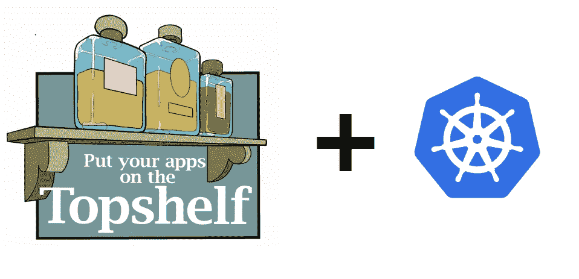

# 如何在 Kubernetes 对您的 TopShelf 服务进行健康检查

> 原文：<https://itnext.io/how-to-health-check-your-topshelf-service-in-kubernetes-d1ad5459304a?source=collection_archive---------7----------------------->



最近，我致力于将一个遗留的 TopShelf 服务从 VM 迁移到 Kubernetes。

该服务非常不稳定，并且不时地转换到中断状态，必须手动重启，这不太理想。

然而，将服务转移到 Kubernetes 本身并不能解决问题，因为无论在*部署*中定义了多少个 pod，它们最终都会由于死锁、无限循环等而一个接一个地失败，而且 Kubernetes 永远不会知道，因为这些流程看起来仍然在愉快地运行。

# Kubernetes 的健康检查

为了补救这种情况，我们可以使用 Kubernetes 的一个健康检查工具 *liveness probe* ，它将向 Kubernetes 发出您的服务是死是活的信号。另一个是*就绪探测器*，它告诉 Kubernetes 容器何时准备好接受流量。在这篇文章中，我将重点讨论前者。

有 3 种类型的活性探测器:

*   超文本传送协议
*   传输控制协议（Transmission Control Protocol）
*   命令

我将展示如何设置和使用最流行的 HTTP 类型。

它是做什么的？

该探测器对 pod 规范中指定的 pod 的 IP 地址、端口和路径执行 HTTP GET 请求。如果探头收到 2xx 或 3xx HTTP 响应代码，则认为该 pod 是健康的。如果服务器返回一个> = 400 的错误响应代码，或者如果它根本没有响应，则认为探测失败，pod 将重新启动。

# 自宿主 TopShelf

因为默认情况下，TopShelf 不是一个 HTTP 服务器，所以我们必须使用 OWIN (Open Web Interface for。网)。

为此，我使用了 [TopShelf。Owin](https://github.com/dennisroche/TopShelf.Owin) NuGet 包。

首先安装软件包:

`Install-Package Topshelf.Owin`

然后更改您的启动代码，并将 OWIN 端点配置为在`8080`端口上运行:

```
HostFactory.Run(configure =>
{
    configure.Service<MyHeadacheService>(service =>
    {
        service.ConstructUsing(s => new MyHeadacheService());
        service.WhenStarted(s => s.Start());
        service.WhenStopped(s => s.Stop());

        service.OwinEndpoint(app =>
        {
            app.Domain = "*";
            app.Port = 8080;
        });
    });
});
```

现在，创建一个新文件`HealthcheckController`,并为健康检查定义 API 控制器。我使用的是`Route("")`，这意味着健康检查端点将在`localhost:8080`运行。

只要静态属性`HealthCheckStatus.IsHealthy`为`true`，健康检查端点就会假设我们的服务是健康的。

这种检查的一个问题是，它可能不会验证服务的响应性，因此检查以与依赖服务类似的方式执行其任务是很重要的。另一方面，它不应该检查它的依赖项，因为它是我前面提到的*就绪探测*任务。

出于测试目的，我们将添加一个额外的端点，这将使我们的服务进入一种人为的中断状态，因此健康检查将返回`500`状态代码，而不是`200`。请注意，我使用的是一个`Serilog`记录器，它会在每次点击端点时输出到控制台。

```
public class HealthcheckController : ApiController
{
    [HttpGet, Route("")]
    public IHttpActionResult Healthcheck()
    {
        Log.Information("Healthcheck invoked using User-Agent: {UserAgent}", Request.Headers.UserAgent?.ToString());
        return HealthCheckStatus.IsHealthy ? Ok() : (IHttpActionResult) InternalServerError(new Exception("I'm not healthy. Restart me."));
    }

    [HttpGet, Route("break")]
    public IHttpActionResult Break()
    {
        Log.Information("Ups!");
        HealthCheckStatus.IsHealthy = false;
        return Ok();
    }
}

public static class HealthCheckStatus
{
    public static bool IsHealthy { get; set; } = true;
}
```

# 定义活性探测器

我们的 facelifted TopShelf 服务现已准备好为 Kubernetes 探针提供服务。现在我们必须让 Kubernetes 知道在哪里检查我们的服务。

在 pod 规范中，我们添加了一个部分来告诉 Kubernetes 在 pod 的路径`/`和端口`8080`上执行活性探测:

```
livenessProbe:
  httpGet:
    path: /
    port: 8080
  initialDelaySeconds: 5
  periodSeconds: 5
```

*   `initialDelaySeconds` -这是告知 kubelet(节点代理)在执行第一次探测之前等待 5 秒钟的延迟
*   `periodSeconds` -指定 kubelet 应该每 5 秒执行一次活性探测。

探测请求的默认和最小超时是 1 秒，可以使用`timeoutSeconds`进行配置。

要查看其他配置选项，请查看官方[文档](https://kubernetes.io/docs/tasks/configure-pod-container/configure-liveness-readiness-startup-probes/#configure-probes)。

现在，我们可以在集群上部署我们的 pod，并查看发送到 pod 的探测器。

```
kubectl logs -f podname[20:25:41 INF] Healthcheck invoked using User-Agent: kube-probe/1.15
```

有了我们的中断端点(`:8080/break/`)，我们现在可以模拟一个人工中断状态。

让我们进入一个运行舱:

`kubectl exec -it podname cmd`

和触发故障:

`curl -v localhost:8080/break`

等待足够长的时间，以便探测器有机会执行并在 pod 事件中查看失败的探测器:

`kubectl describe pod podname`

```
 Liveness probe failed: HTTP probe failed with statuscode: 500
```

通过列出 pod 来验证它是否已重新启动:

`kubectl get pod podname`

```
NAME      READY   STATUS    RESTARTS   AGE
podname   1/1     Running   1          1h
```

您可以看到“重新启动”列正好显示了这一点。

# 结论

通过自托管 TopShelf 服务并向其添加健康检查端点，您可以利用 Kubernetes 活跃度探测器，这可以极大地提高服务的健壮性和弹性。