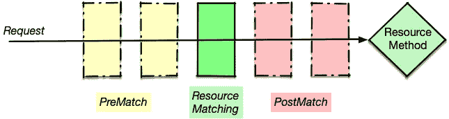
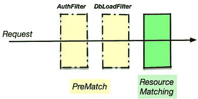
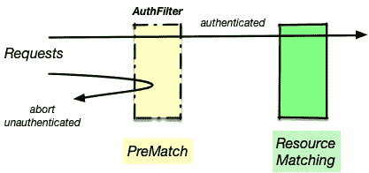

# 如何实现 JAX-RS 认证过滤器

> 原文：<https://itnext.io/how-to-implement-a-jax-rs-authentication-filter-3eee64b34b99?source=collection_archive---------0----------------------->

如果你正在用 Java 创建 REST-API，你可能已经听说过 JAX-RS。虽然 JAX-RS 可以在 Servlets 之上实现，但并不要求这样做。这也意味着您可能无法使用特定于 Servlet 的东西，如 ServletFilters。


但是不要害怕——JAX-RS 提供了一个很好的替代方案，我将向您展示如何通过这种方式轻松实现认证过滤器。接口是[*javax . ws . RS . container . container request Filter*](https://jax-rs.github.io/apidocs/2.0/javax/ws/rs/container/ContainerRequestFilter.html)，这里我们需要实现 filter()方法，下面我们就来做。我们要做的另一项工作是决定它在(可能的)过滤器链中的应用位置。让我们看一下请求流程:



通过过滤器的请求流

中间部分是*资源匹配*(绿色)，引擎在@Path 和@GET 注释的帮助下从请求 url 和方法中决定调用哪个*资源方法*。当您创建一个没有进一步限定的请求过滤器时，它将是一个*后匹配*过滤器(红色)。如果您想要 *PreMatch* (黄色)，那么您需要在您的类上提供@PreMatch 注释。

## 什么时候使用预赛和赛后？

为了说明这一点，我实现了一个/test 端点，我用一次预匹配和一次后匹配来调用我的身份验证过滤器(不传递身份验证信息)。我们先来看看赛后(默认):

```
**$** curl -i  http://localhost:8080/test
HTTP/1.1 **401** Unauthorized

**$** curl -i  http://localhost:8080/bad-path
HTTP/1.1 **404** Not Found# Now with auth header
**$** curl -i  -Hx-auth:`cat cred.txt` http://localhost:8080/test
HTTP/1.1 **200** OK
```

您可以看到，默认情况是首先运行资源匹配，然后通过返回 404 Not Found for /bad-path 来运行我们的请求过滤器。同样，如果我指定了 resource 方法不支持的可接受的媒体类型，引擎将返回 406 代码。根据您的使用情况，可能不希望将此类信息泄露给未经身份验证的用户。

现在我们来看看赛前的情况(上图中的黄色):

```
**$** curl -i  [http://localhost:8080/test](http://localhost:8080/test)
HTTP/1.1 **401** Unauthorized**$** curl -i  [http://localhost:8080/bad-path](http://localhost:8080/bad-path)
HTTP/1.1 **401** Unauthorized
```

我们的过滤器在两种情况下都检测到授权失败，并使用 401 响应提前中止请求:请求甚至没有达到我们想要的资源匹配(绿色)。

## 滤波器排序呢？

如第一张图所示，可以部署多个过滤器。虽然有时排序并不重要，但大多数时候却很重要。例如，采用两个过滤器，它们首先检查身份验证，然后从数据库加载一些关于已验证用户的数据。



过滤器排序

为了定义排序，我们可以使用@Priority 注释。

```
@Priority(**1**)
@PreMatching
@Provider
public class AuthFilter .. {..}

@Priority(**2**)
@PreMatching
@Provider
public class DbLoadFilter .. {..}
```

过滤器按优先级值的升序排序。

## 废话少说——给我看看代码

好，我们开始:-)

```
@PreMatching             // **(1)**
@Provider                // **(2)** 
public class IncomingRequestFilter implements ContainerRequestFilter {

  @Override
  public void **filter**(ContainerRequestContext requestContext) throws IOException {

    String xAuth = requestContext.getHeaderString("x-auth");

    // No auth - abort
    if (xAuth == null || xAuth.isEmpty()) {      // **(3)**
      requestContext.abortWith(Response.*status*(
              Response.Status.*UNAUTHORIZED*).build());
      return;    // **(4)**
    }
```

如上所述，我们需要一个预匹配滤波器(1)。JAX-RS 引擎需要@Provider 注释(2)来找到我们的过滤器，并将其正确连接到过滤器链中。在 *filter()* 方法中，我们检索 auth 头并检查它是否存在并且不为空(3)。如果报头不存在或为空，我们用 *401 未执行*状态中止上下文。



如果验证头不存在或不正确，则中止请求

最后，我们需要直接返回(4)，因为仅仅调用*request context . abort with()*并不能为我们做到这一点，代码流仍然会运行到下面的代码中。

```
// Now that we are sure that there is a header, we can use it.
    Optional<XId> xid = HeaderHelper.*getXIdFromString*(xAuth); // **(5)**
    if (xid.isPresent()) {
      // header was good, so now create the security context
      XId xIdentity = xid.get();                              // **(6)**
      SecurityContext sctx = new XIdSecurityContext(xIdentity);
      requestContext.setSecurityContext(sctx);
    } else {
      // Header was present, but not correct            // **(7)**
      requestContext.abortWith(Response.*status*(
             Response.Status.*UNAUTHORIZED*).build());
    }
  }
}
```

既然头部已经存在，我们可以解析它了(5)。如果解析成功，我们可以创建一个 javax . ws . RS . core . security context，并将其粘贴到请求(6)中，以便资源方法稍后可以通过头注入来检索它，以便进一步处理。构造 SecurityContext 还将在其中设置调用者主体以供以后使用。
如果解析失败，我们再次使用 401 响应中止流程。

## 如何使用 SecurityContext？

我们的身份验证头还提供了额外的信息，比如当前用户名，这在后面的处理中可能会用到。

在我们的资源方法中，我们可以以两种方式使用它:

```
@Path("/test")
@RequestScoped
public class TestService {

  // Needed to retrieve the user
  @Context SecurityContext **ctx**;   // **(7)**

  @Path("/")
  @GET
  public String test(@Context SecurityContext **ctx2**) { // **(8)**

    System.*out*.println(**ctx**.getUserPrincipal().getName());
    System.*out*.println(**ctx2**.getUserPrincipal().getName());
```

我们既可以为整个类注入 SecurityContext)，也可以在每个方法的基础上注入 SecurityContext)，例如从其中检索调用主体。

当然还有改进的空间:我们可以直接使 Princpial 可用于注入，这样我们就不需要从 SecurityContext 中取出它。因为你可以在 GitHub 上看看我的[incomrequestfilter](https://github.com/RedHatInsights/policies-ui-backend/blob/master/src/main/java/com/redhat/cloud/policies/app/auth/IncomingRequestFilter.java)和相关类的完整代码。