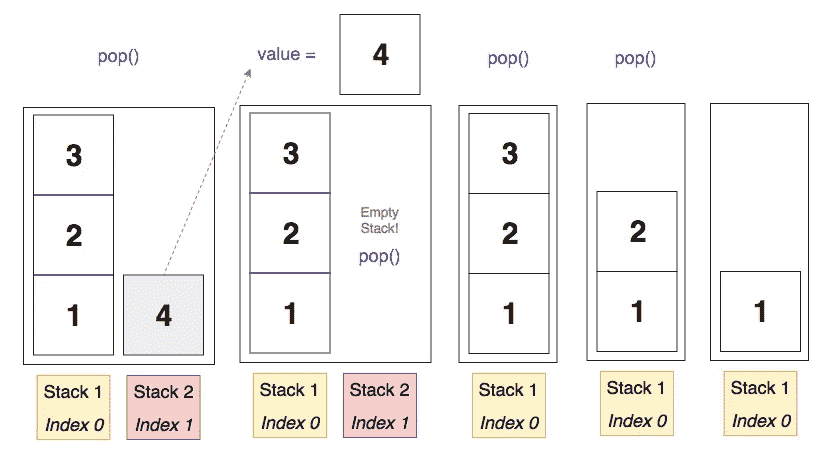
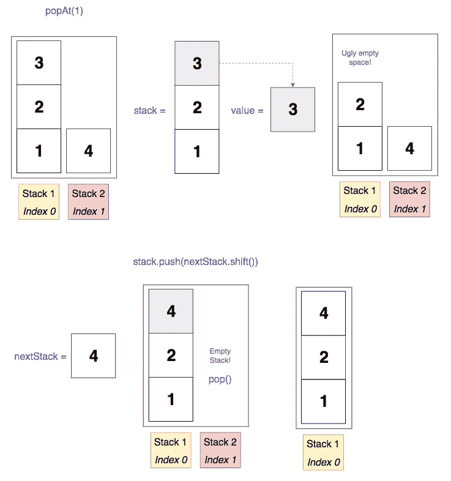

# 如何:在 Javascript 中实现一组堆栈

> 原文：<https://itnext.io/how-to-implement-a-set-of-stacks-in-javascript-6fcfd19adda?source=collection_archive---------2----------------------->


在 [Unsplash](https://unsplash.com?utm_source=medium&utm_medium=referral) 上由 [Baher Khairy](https://unsplash.com/@baher366?utm_source=medium&utm_medium=referral) 创作的“粉色、绿色、棕色和黄色杏仁饼”

*问题:*创建一个堆栈数据结构，如果前一个堆栈超过了特定的大小，它将创建额外的堆栈。

从这个堆栈中推入和弹出应该像在常规堆栈中那样正常工作。也就是说，push()应该将一个值放在最后一个堆栈的末尾，pop()应该返回最后一个堆栈中的最后一个值。

*奖励:*创建一个 popAt()方法，该方法从一个特定的堆栈返回一个弹出的值，并移动其余的值，这样就没有间隙了。

# 行动（或活动、袭击）计划

所以我们知道，我们至少需要用一个空的主栈**来开始，当我们积累输入的时候，我们最终会把更多的栈放进去。我们可能还需要一个**变量来存储用户可以传入的最大堆栈大小**。**

我们的 push()方法需要**找到最后一个堆栈，并将一个值推入其中**。它还需要**检查该堆栈是否超过最大大小**，因为如果超过，它将需要将另一个空堆栈推入我们的主堆栈。

我们的 pop()方法**同样需要找到最后一个堆栈，并从中弹出最后一个值**。它还需要**检查最后一个堆栈的长度**，如果没有剩余，就从主堆栈中弹出它，这样我们就不会有空堆栈了。

我们的 popAt()方法将是最复杂的。它将接受一个对应于我们要弹出一个值的堆栈的数字。首先，我们应该**根据堆栈长度**检查这个数字，因为我们知道如果这个数字等于堆栈的数量，我们可以运行常规的 pop 方法，因为它只是从最后一个堆栈中弹出最后一个值。

我们还应该**检查数字是否超出界限**，比如它是否为 0 或者它是否大于我们拥有的筹码数量。如果是这样，那将是一个错误。

最后，我们需要找到有问题的堆栈，从该堆栈中弹出值，然后以不留下剩余空间的方式移动其余的堆栈。这个问题的解决方案可能不会马上显现出来，但是我们会看到它实际上比你想象的要简单。

# 步骤 1:初始化我们的数据结构

```
class StackSet {
  constructor(maxSize) {
   if (arguments.length < 1) {
    throw new Error (‘Woops, maxSize is required!’)
   }

   this.stacks = [[]]
   this.maxSize = maxSize
  }
}
```

因为我们知道我们最终会有多个堆栈，所以我们可以从嵌套数组开始。这使得事情更容易开始。

此外，我们需要存储最大大小，因为这将决定我们何时创建新的堆栈。

# 步骤 2:我们的 push()方法

```
push(value) {
  if (this.stacks[this.stacks.length - 1].length === this.maxSize) { this.stacks.push([])
  }

  this.stacks[this.stacks.length - 1].push(value) 
}
```

首先，我们用一个**值**参数创建我们的 push()方法，因为我们想要向堆栈中添加一个值。然后我们将做一个快速检查，看看主堆栈中的最后一个堆栈是否等于上面传递给我们的构造函数的最大大小。如果是这样，我们知道我们的主堆栈中需要另一个堆栈，因为我们无法在当前堆栈中容纳更多的堆栈，所以让我们推一个空堆栈。

最后，我们将把我们的值放入最后一个堆栈。

注意:记住这一点。length 返回数组的*实际*长度，而不是索引的数量。这就是为什么我们需要减去 1。

假设我们的 maxSize = 3。这是正在发生的事情的形象化描述:


# 步骤 3:我们的 pop()方法

```
pop() {
  const value = this.stacks[this.stacks.length - 1].pop()

  if (this.stacks.length > 1 &&
this.stacks[this.stacks.length - 1].length === 0) {      this.stacks.pop()
  }

  return value
}
```

在我们的 pop()方法中，我们将找到最后一个堆栈，并简单地从中弹出()最后一个值。

我们将它存储在一个变量中，因为接下来我们必须检查刚刚弹出的堆栈的长度。如果里面什么都没有，我们需要从主栈中弹出空栈。我们还检查主堆栈中的堆栈数量是否大于 1，因为如果我们从第一个(索引 0)堆栈中弹出，然后它是空的，我们希望它保持我们在构造器中初始化它时的状态，作为嵌套数组。否则，我们会弹出嵌套的数组，它只是一个普通的空数组，这会把事情弄糟！

最后，我们将返回值，这样我们就可以看到弹出了什么。



# 步骤 4:我们的 popAt()方法

```
popAt(number) {
  // checks
  if (number < 1 || number > this.stacks.length) {
    throw new Error ('Whoa, that number is either too small or too  large for our stack.')
  }

  if (number === this.stacks.length) {
    return this.pop()
  }

  let stack = this.stacks[number - 1]
  let value = stack.pop()
  let nextStack = []

  for (let i = number; i < this.stacks.length; i++) {
    nextStack = this.stacks[i]
    nextStack.reverse()
    stack.push(nextStack.pop())
    nextStack.reverse()
    stack = nextStack
  }

  if (this.stacks.length > 1 && this.stacks[this.stacks.length - 1].length === 0) {
    this.stacks.pop()
  }

    return value;
}
```

记住这个方法只需要**在传入的数字处从堆栈中取出一个值**。**我们需要移动堆栈，这样就没有任何空间了**。

在顶部，我们可以从一些初步检查开始。如果这个数字是 0 或者大于栈的数量，那么它对我们来说是没有用的，所以我们应该让用户知道。

接下来，如果数字与最后一个堆栈相同，那么我们可以运行一个常规的 pop()。没问题。

如果我们没有通过任何一项初步检查，现在是时候开始工作了。

首先，让我们通过从 number param 中减去 1 来获得我们需要的堆栈索引。很好，现在让我们弹出我们最终想要从堆栈中返回的值。

我们快到了，现在我们只需要清理我们的堆栈。

为了进行移位，我们将在栈上运行一个 for 循环，从对应于 numbers 参数的栈开始(我们不关心前面的栈，因为它们不受 pop 的影响)。

基本上，我们要做的是 1)在我们选择的堆栈之后获取堆栈*，2)弹出该堆栈的第一个值，3)将弹出的值添加到我们选择的堆栈中，因为我们之前弹出最终值的地方有一个空白点。我们可以用类似 pop()的 [shift()](https://developer.mozilla.org/en-US/docs/Web/JavaScript/Reference/Global_Objects/Array/shift) 方法轻松地做到这一点，但是是在数组的*开头*而不是结尾。*

> 注意:记住 Javascript 中的数组和对象是由引用指定的，这意味着当你给一个数组或对象指定一个变量时，它指向实际的对象，而不是创建一个副本。这意味着当我们修改“stack”和“nextStack”时，我们也在修改主堆栈中的堆栈。

之后，我们将把 Stack 赋给 nextStack 中剩余的部分，这样，如果我们的循环还有迭代，它可以在下一个 stack 上运行相同的过程，直到一切都在正确的位置。

最后，我们将运行与在 pop()中相同的检查，看看在我们完成所有工作后，最后一个堆栈是否为空。如果是，那就把它去掉吧。然后我们将最终返回弹出的值，这样用户就可以看到它是什么了。



# 最终代码

这是我们的数据结构的样子。我在最后添加了一些日志，向您展示每种方法的输出。如果你注意到任何错别字，让我知道！

```
class StackSet {
  constructor(maxSize) {
    if (arguments.length < 1) {
      throw new Error ('Woops, maxSize is required!')
    }

    this.stacks = [[]]
    this.maxSize = maxSize
  }

  push(value) {
    if (this.stacks[this.stacks.length - 1].length === this.maxSize) {
      this.stacks.push([])
    }

    this.stacks[this.stacks.length - 1].push(value) 
  }

  pop() {
   const value = this.stacks[this.stacks.length - 1].pop()

   if (this.stacks.length > 1 && this.stacks[this.stacks.length - 1].length === 0) {
    this.stacks.pop()
   }

    return value
  }

  popAt(number) {
    if (number < 1 || number > this.stacks.length) {
      throw new Error ('Whoa, that number is either too small or too large for our stack.')
    }

    if (number === this.stacks.length) {
      return this.pop()
    }

    let stack = this.stacks[number - 1]
    let value = stack.pop()
    let nextStack = []

    for (let i = number; i < this.stacks.length; i++) {
      nextStack = this.stacks[i]
      stack.push(nextStack.shift())
      stack = nextStack
    }

    if (this.stacks.length > 1 && this.stacks[this.stacks.length - 1].length === 0) {
    this.stacks.pop()
   }

    return value;
  }
}// initialize new StackSet object
const myStack = new StackSet(3)// to test if it works
myStack.push(1)
myStack.push(2)
myStack.push(3)
myStack.push(4)
myStack.push(5)
myStack.push(6)
console.log(myStack.stacks) // [ [ 1, 2, 3 ], [ 4, 5, 6 ] ]console.log(myStack.pop()) // 6
console.log(myStack.stacks) // [ [ 1, 2, 3 ], [ 4, 5 ] ]console.log(myStack.popAt(1)) // 3
console.log(myStack.stacks) // [ [ 1, 2, 4 ], [ 5 ] ]
```