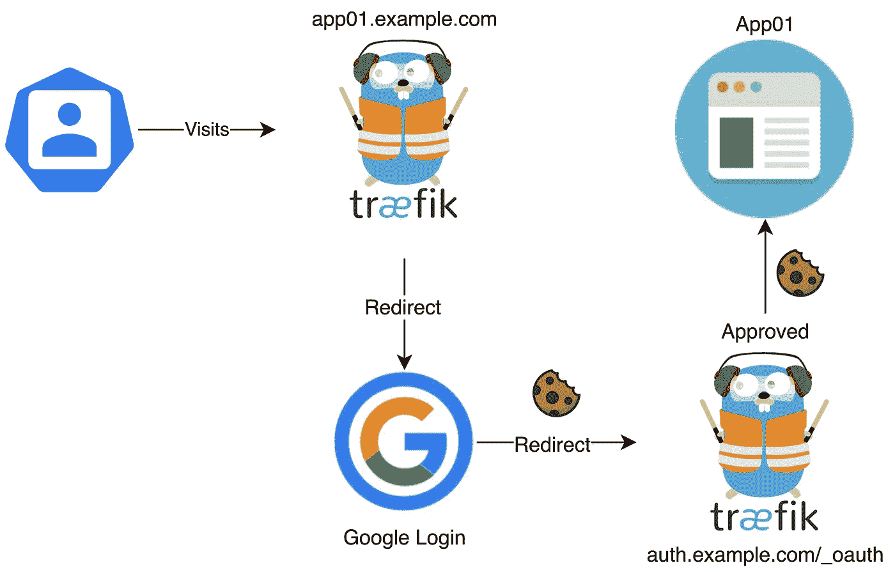
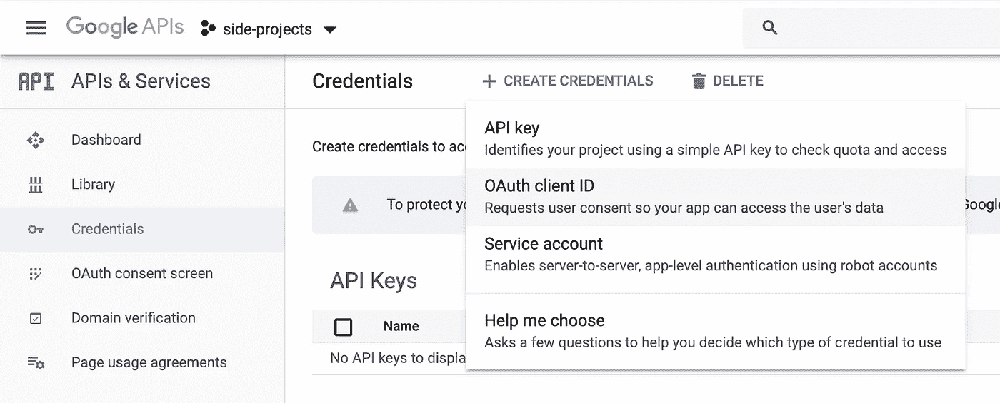
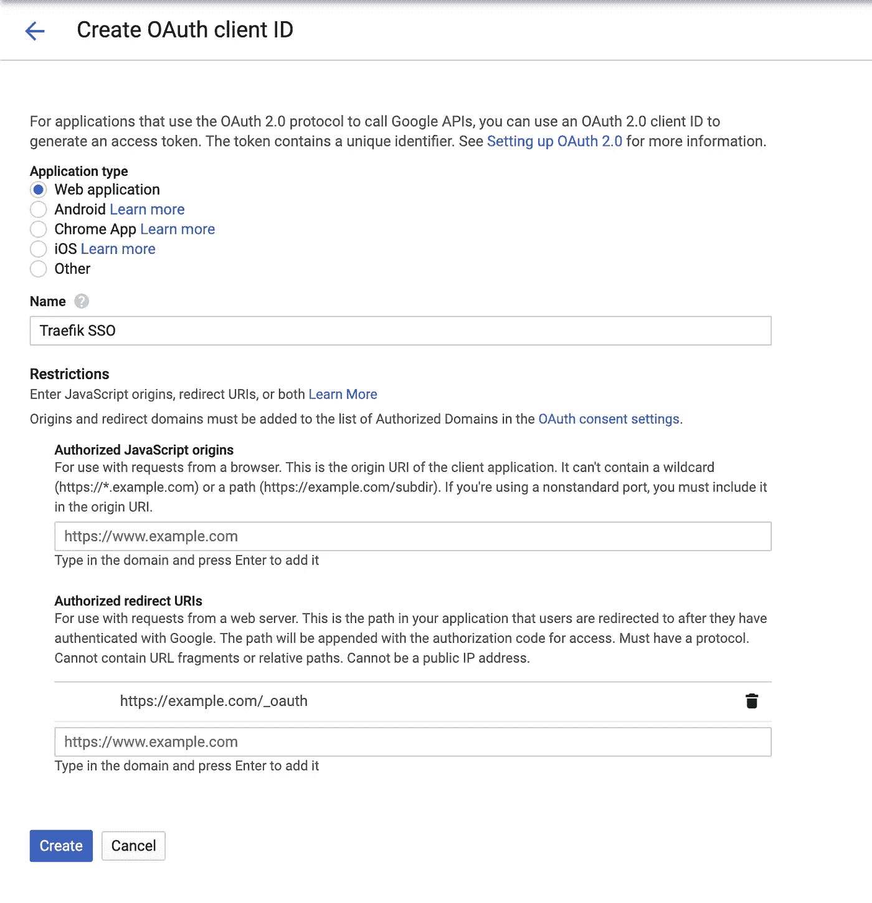
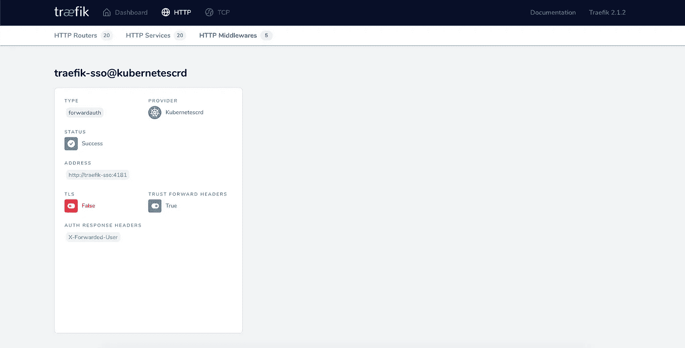
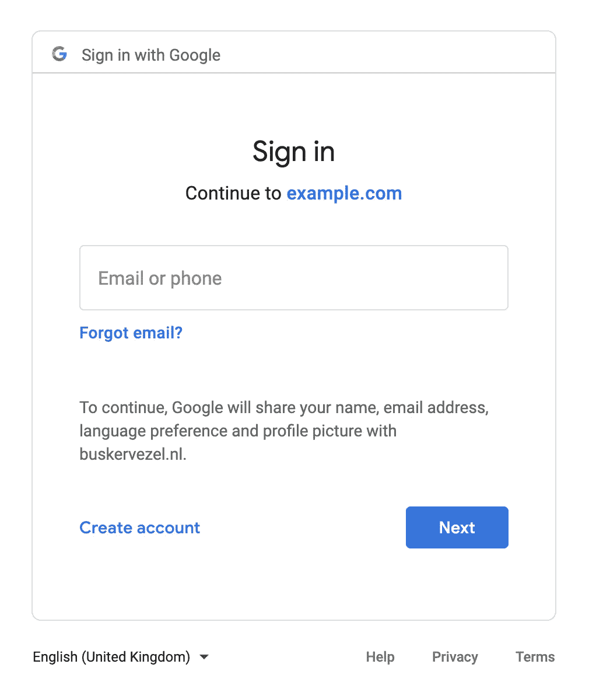

# 如何在 Kubernetes 上用 Traefik V2 实现单点登录

> 原文：<https://itnext.io/how-to-implement-a-sso-middleware-for-traefik-v2-on-kubernetes-dcd9d45cc875?source=collection_archive---------2----------------------->

厌倦了每次访问 Traefik V2 负载均衡器后的应用程序都必须登录？我有好消息告诉你。在本文中，我将解释如何为 Traefik 代理背后的一切实现单点登录(SSO ),这样您就再也不用重复输入您的凭证了！

# 概观

为此，我们将在 Thom Seddon 的 [Traefik Forward Auth 的帮助下使用 Google OAuth(感谢他)](https://github.com/thomseddon/traefik-forward-auth)

为了更好地理解如何协同工作，我画了一个简单的授权流程图:



图一。授权流程的可视化表示。

1.  用户访问我们 Traefik 负载平衡器背后的 app01.example.com
2.  请求被重定向到用户登录的 Google OAuth。
3.  如果授权成功，用户将被重定向回 auth.example.com/_oauth.上的 Traefik。该服务然后根据 cookie 检查请求属于哪个应用程序，并将其重定向。
4.  请求完成

现在，在谷歌登录请求的有效期内，你将能够访问你的服务，而不必再看到一个登录屏幕！很酷吧？

# 履行

现在是有趣的部分，在我们的 Kubernetes 环境中实现 SSO。

## 先决条件

*   谷歌账户或 G-suite 环境
*   在 Kubernetes 环境中运行的 Traefik V2
*   Traefik 中已配置的证书解析程序
*   一些空闲时间

## 创建我们的谷歌证书

首先，访问 [Google 开发者控制台](https://console.developers.google.com/)并创建一个新项目(或者使用一个现有的项目)。在主页上，选择凭据→创建凭据→ OAuth 客户端 ID，如下所示:



图二。创建您的 OAuth 客户端 ID 和密码

如果您之前没有设置 OAuth，它会要求您首先设置一个同意屏幕。选择外部并填写这两个字段:
**应用名称:** Traefik SSO
**授权域:**example.com(用您的域替换 example.com)

现在，您将能够在 Credentials 选项卡中获得您的 OAuth 客户端 ID。选择 Web 应用程序，输入名称，将授权的 JavaScript 源留空，并输入您的域(替换 example.com ),包括如下所示的`/_oauth`路径:



图 3。创建您的 OAuth 客户端 ID 和密码

谷歌将显示你的客户端 id 和秘密，保存这些地方保存，并前往下一步。

## Kubernetes 部署

在我们开始部署我们的 ForwardAuth 之前，我们需要创建一个包含我们从 Google 的开发者控制台获得的信息的 secret，其中 Secret 应该是一个随机字符串(即由`openssl rand -hex 16`生成):

```
kubectl create secret generic traefik-sso \
--from-literal=clientid=XXX.apps.googleusercontent.com \
--from-literal=clientsecret=XXX \
--from-literal=secret=SomEtHingRandom
```

接下来，复制。yaml 文件，并至少更改以下环境变量以满足您的需要:

**COOKIE _ DOMAIN:**yourdomain.com**AUTH _ HOST:**auth.yourdomain.com **白名单:**youremailaddress@gmail.com

此外，查看 IngressRoute 以确保它也包含您自己的 certificateresolver(在我的例子中是 Cloudflare)和域。

应用。yaml 文件并访问您的 Traefik 仪表板，它现在应该包含一个新的中间件



图 4。创建新的中间件

但是，目前没有应用程序使用这个新的中间件。将新创建的中间件添加到您的 IngressRoute:

```
apiVersion: traefik.containo.us/v1alpha1
kind: IngressRoute
metadata:
  name: app01
spec:
  entryPoints:
    - websecure
  routes:
  - match: Host(`app01.example.com`)
    kind: Rule
    services:
    - name: app01
      port: 8080
 **middlewares:
      - name: traefik-sso@kubernetescrd**
  tls:
    certResolver: cloudflare
    domains:
      - main: "*.example.com"
    options: {}
```

应用更新的 IngressRoute，您就可以开始了！:)

# SSO 正在运行

如果一切顺利，当您现在访问您的应用程序时，您会注意到重定向到一个 Google 登录页面。输入您的白名单谷歌地址，如果您设置正确，您的授权是成功的，您将被重定向到您的应用程序！



图 5。SSO 正在运行

# 结束了。

如果您对您的应用程序前面的新 SSO 满意，请让我知道；爱听你们的经历:)。如果以上有什么不清楚或者对你没有用，请告诉我，我很乐意帮助你！