# 如何使用 Netmaker 在 Wireguard 虚拟网络中实施访问控制

> 原文：<https://itnext.io/how-to-implement-access-controls-in-wireguard-virtual-networks-with-netmaker-149b5c7097bc?source=collection_archive---------0----------------------->

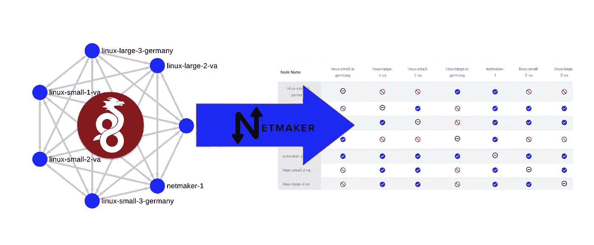

组织正在转向 [WireGuard](https://www.wireguard.com/) 。为什么？

*   它非常快
*   效率很高
*   它被嵌入了 Linux 内核

这使得 WireGuard 成为物联网和 Kubernetes 等分布式系统以及远程访问的理想网络层。

然而，在大规模设置 WireGuard 虚拟网络时仍然存在许多挑战。特别是配置管理和访问控制。

[Netmaker](https://github.com/gravitl/netmaker) 自动化 WireGuard 配置，降低管理跨许多设备的 WireGuard 所需的复杂性。

在 v0.12.0 中，Netmaker 引入了[访问控制列表](https://docs.netmaker.org/acls.html)，允许运营商管理细粒度的 ACL。简而言之，这创建了一个简单的系统来控制哪台机器可以与哪台机器对话。

在本文中，我们将快速演示如何使用 Netmaker 管理 WireGuard 访问控制。

# 设置

我们的设置包括一台 Netmaker 服务器和 6 台运行在 AWS 中的机器:4 台在 us-east-1，2 台在 eu-central-1。所有机器都运行 Linux。所有机器都已添加到 Netmaker 网络 acl-net-1 中。

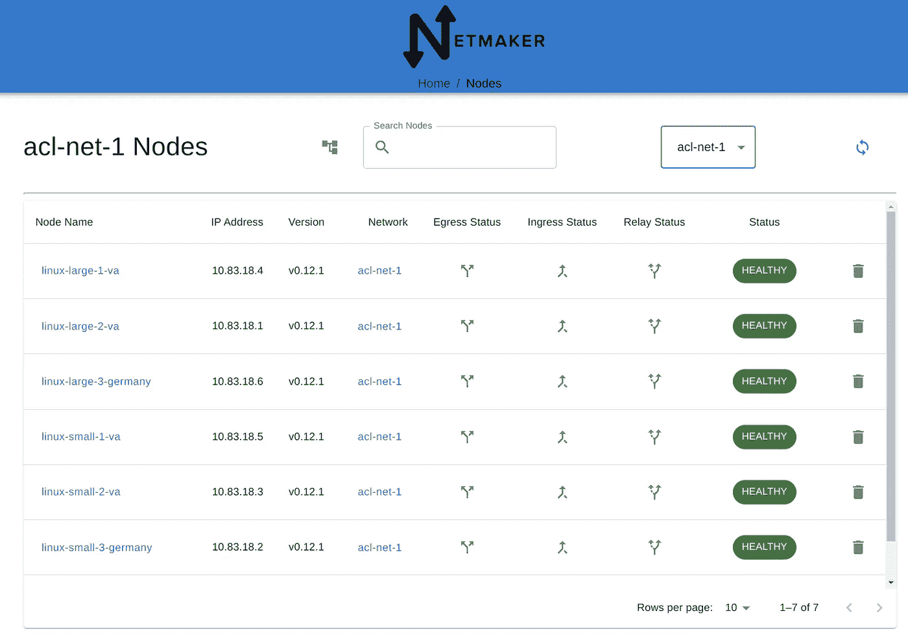

默认情况下，Netmaker 创建一个“全网状”P2P 网络，这意味着每台机器都可以连接到其他机器。我们可以在图形可视化中看到这一点:

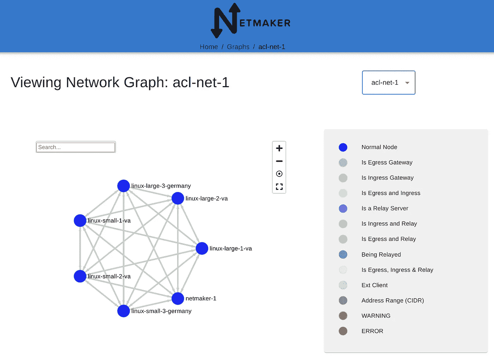

通过在本地查看“wg show”的输出可以确认这一点:

```
root@linux-large-3-germany:~# wg show nm-acl-net-1
interface: nm-acl-net-1
  public key: xxxxxxxxxxxxxxxxxxxx
  private key: (hidden)
  listening port: 34314peer: xxxxxxxxxxxxxxxxxxxx
  endpoint: (hidden):42953
  allowed ips: 10.83.18.5/32
  latest handshake: 1 minute, 48 seconds ago
  transfer: 1.13 KiB received, 1.27 KiB sent
  persistent keepalive: every 20 secondspeer: xxxxxxxxxxxxxxxxxxxx
  endpoint: (hidden):53856
  allowed ips: 10.83.18.4/32
  latest handshake: 1 minute, 48 seconds ago
  transfer: 1.30 KiB received, 928 B sent
  persistent keepalive: every 20 secondspeer: xxxxxxxxxxxxxxxxxxxx
  endpoint: (hidden):44417
  allowed ips: 10.83.18.3/32
  latest handshake: 1 minute, 48 seconds ago
  transfer: 340 B received, 272 B sent
  persistent keepalive: every 20 secondspeer: xxxxxxxxxxxxxxxxxxxx
  endpoint: (hidden):54572
  allowed ips: 10.83.18.2/32
  latest handshake: 1 minute, 48 seconds ago
  transfer: 340 B received, 272 B sent
  persistent keepalive: every 20 secondspeer: xxxxxxxxxxxxxxxxxxxx
  endpoint: (hidden):37150
  allowed ips: 10.83.18.1/32
  latest handshake: 1 minute, 48 seconds ago
  transfer: 1.02 KiB received, 1.02 KiB sent
  persistent keepalive: every 20 secondspeer: xxxxxxxxxxxxxxxxxxxx
  endpoint: (hidden):51822
  allowed ips: 10.83.18.254/32
  latest handshake: 1 minute, 50 seconds ago
  transfer: 124 B received, 340 B sent
  persistent keepalive: every 20 seconds
```

ping 测试确认连通性:

```
root@linux-large-3-germany:~# ping 10.83.18.3
PING 10.83.18.3 (10.83.18.3) 56(84) bytes of data.
64 bytes from 10.83.18.3: icmp_seq=1 ttl=64 time=89.0 ms
64 bytes from 10.83.18.3: icmp_seq=2 ttl=64 time=89.1 ms
64 bytes from 10.83.18.3: icmp_seq=3 ttl=64 time=89.0 ms
64 bytes from 10.83.18.3: icmp_seq=4 ttl=64 time=89.1 ms
^C
--- 10.83.18.3 ping statistics ---
4 packets transmitted, 4 received, 0% packet loss, time 3003ms
rtt min/avg/max/mdev = 89.016/89.083/89.143/0.057 m
```

现在，让我们用 ACL 限制这个网络。

# 美国学术团体委员会

在 Netmaker 用户界面的 ACL 页面中，您可以获得网络中所有 P2P 连接的完整列表。您可以通过单击来禁用任何一对连接。

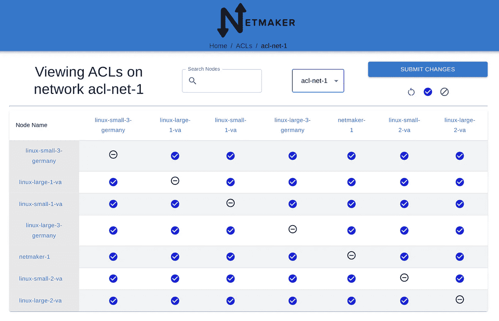

如您所见，默认情况下，所有连接都是启用的。让我们使德国的节点无法与弗吉尼亚的节点通信。

您可以单击单个节点来限制其连接:

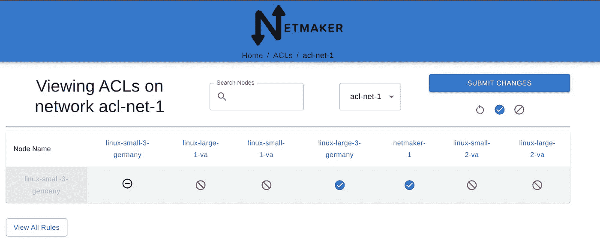

您也可以从主屏幕更改规则:

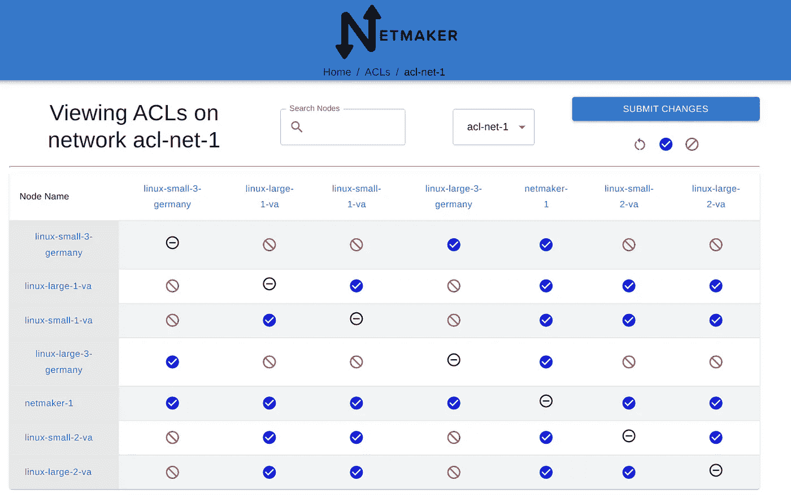

单击“提交更改”后，节点将立即收到通知，并更新其本地设置。

这也会传播到图表视图，其中显示了更新:

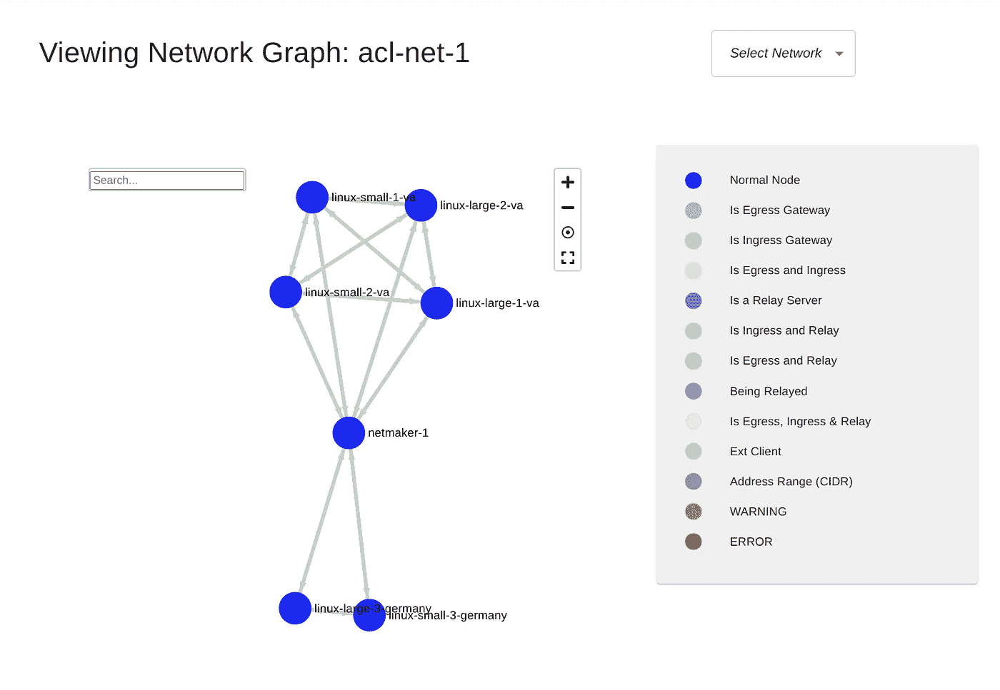

我们通过再次查看对等体列表在本地确认这一变化。例如，在我们位于德国的机器上，它只显示了位于德国的另一台机器，以及 Netmaker 服务器:

```
root@linux-large-3-germany:~# wg show nm-acl-net-1
interface: nm-acl-net-1
  public key: xxxxxxxxxxxxxxxxxxxxxxxx
  private key: (hidden)
  listening port: 34314peer: xxxxxxxxxxxxxxxxxxxxxxxx
  endpoint: (hidden):54572
  allowed ips: 10.83.18.2/32
  latest handshake: 22 seconds ago
  transfer: 956 B received, 456 B sent
  persistent keepalive: every 20 secondspeer: xxxxxxxxxxxxxxxxxxxxxxxx
  endpoint: (hidden):51822
  allowed ips: 10.83.18.254/32
  latest handshake: 24 seconds ago
  transfer: 308 B received, 956 B sent
  persistent keepalive: every 20 seconds
```

德国的此节点不再能够 ping 通弗吉尼亚的节点，该节点以前是可用的:

```
root@linux-large-3-germany:~# ping 10.83.18.3
PING 10.83.18.3 (10.83.18.3) 56(84) bytes of data.
From 10.83.18.6 icmp_seq=1 Destination Host Unreachable
ping: sendmsg: Required key not available
From 10.83.18.6 icmp_seq=2 Destination Host Unreachable
ping: sendmsg: Required key not available
From 10.83.18.6 icmp_seq=3 Destination Host Unreachable
ping: sendmsg: Required key not available
^C
--- 10.83.18.3 ping statistics ---
3 packets transmitted, 0 received, +3 errors, 100% packet loss, time 2052ms
```

我们已经成功分割了网络。

这很好，但是反过来呢？如果默认情况下，任何机器都不能访问任何其他机器，那该怎么办？在这种情况下，您希望手动批准每台机器的访问权限。

# **默认拒绝**

我们可以通过创建一个具有“默认拒绝”策略的网络来实现这一点。任何进入网络的机器都没有对等点，也没有连接。让我们创建一个启用了此设置的网络:

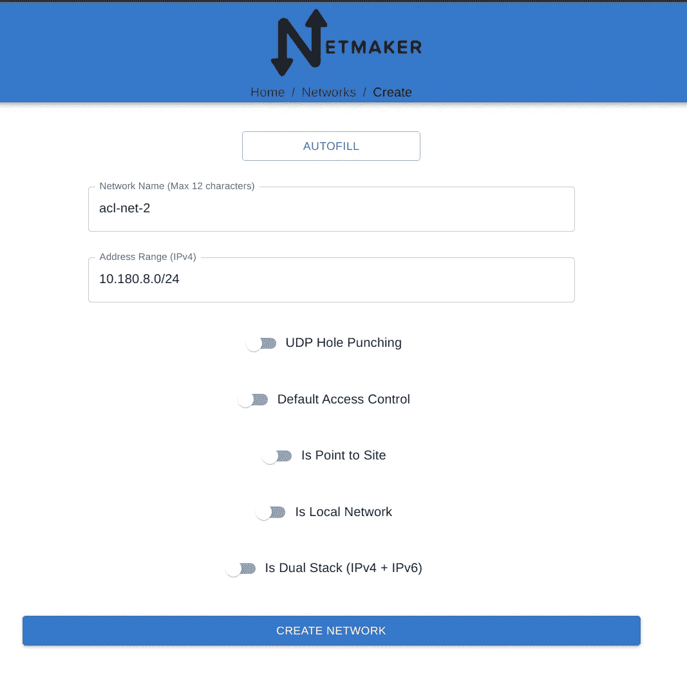

注意“**默认访问控制**被关闭。这就是将默认策略更改为“拒绝”的原因

创建后，我们将所有节点加入新网络。

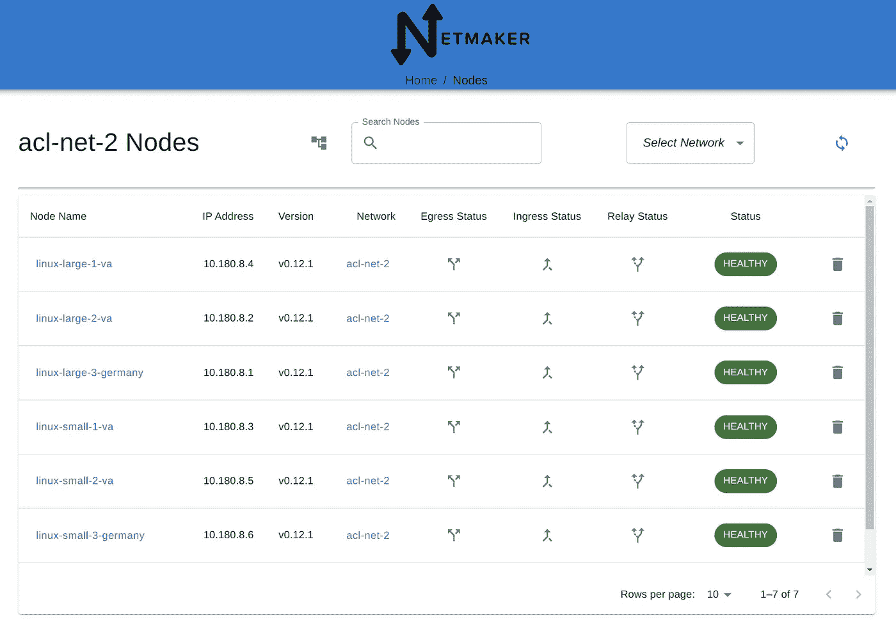

从图中可以看出，没有连接:

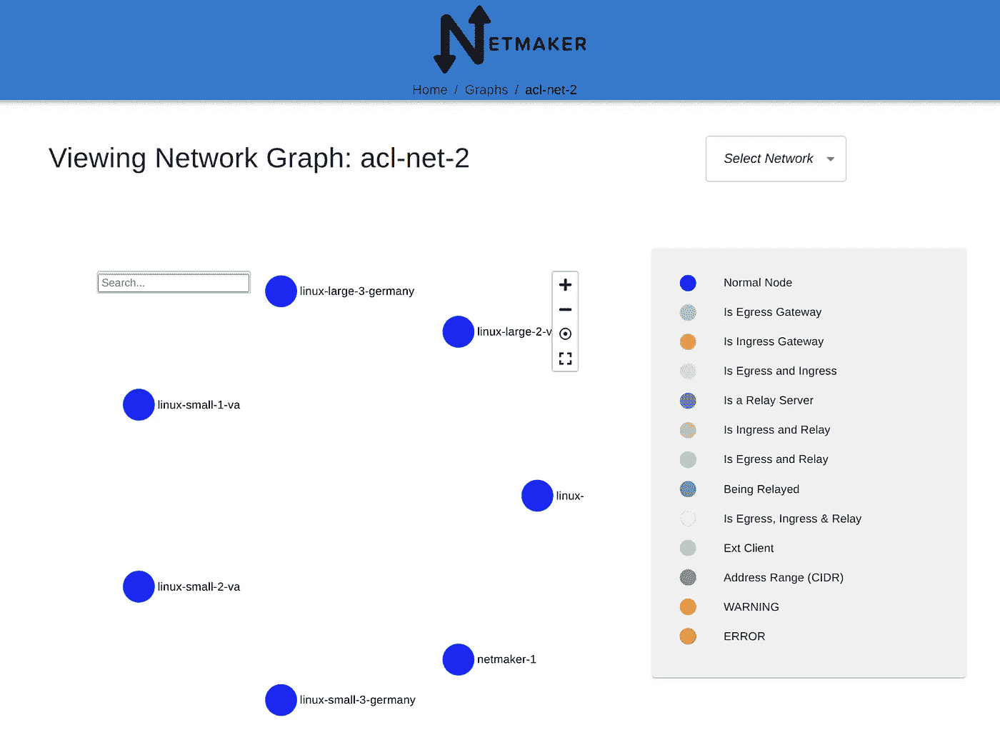

通过再次检查 WireGuard 接口，我们在本地确认了这一点，我们看到没有对等体:

```
root@linux-large-3-germany:~# wg show nm-acl-net-2
interface: nm-acl-net-2
  public key: xxxxxxxxxxxxxxxxxxxxxxxxxxx
  private key: (hidden)
  listening port: 51821
```

这使我们能够使用 UI 从零开始“构建”我们的网络:

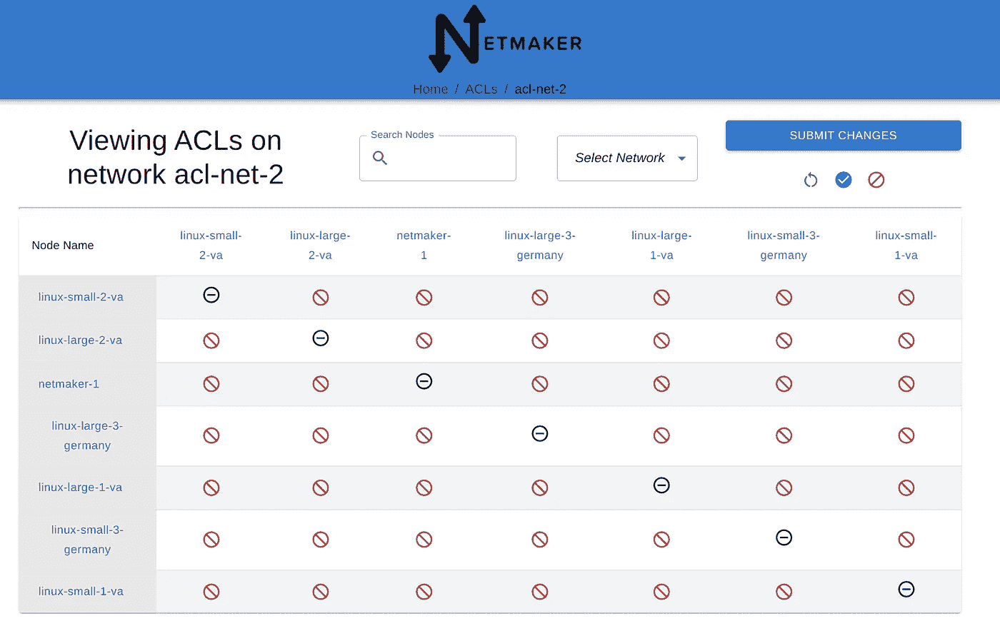

这一次，我们让所有的小机器能够互相对话:

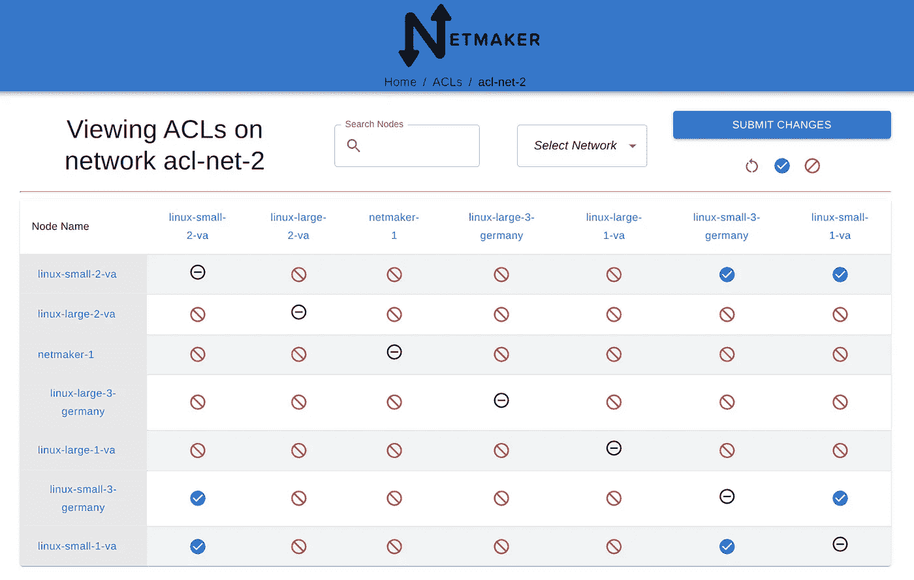

同样，这在提交后填充到 UI 中:


我们通过在本地检查 WireGuard 对等点来确认:

```
root@linux-large-3-germany:~# wg show nm-acl-net-1
interface: nm-acl-net-1
  public key: xxxxxxxxxxxxxxxxxxxxxxxxxxxxxx
  private key: (hidden)
  listening port: 34314peer: xxxxxxxxxxxxxxxxxxxxxxxxxxxxxx
  endpoint: (hidden):54572
  allowed ips: 10.83.18.2/32
  latest handshake: 22 seconds ago
  transfer: 956 B received, 456 B sent
  persistent keepalive: every 20 secondspeer: xxxxxxxxxxxxxxxxxxxxxxxxxxxxxx
  endpoint: (hidden):51822
  allowed ips: 10.83.18.254/32
  latest handshake: 24 seconds ago
  transfer: 308 B received, 956 B sent
  persistent keepalive: every 20 seconds
```

## *关于默认拒绝的重要说明

在这个场景中，我们还关闭了 UDP 打洞。为什么？UDP 打洞依赖于客户端与服务器节点的连接。如果禁用此选项，连接将会中断。或者，我们可以打开 UDP 打洞，然后确保在 ACL 页面中手动启用每个节点到服务器的连接。

# 结论

我们用 [Netmaker](https://www.netmaker.org/) 在 WireGuard 网络上实现 ACL 的快速演示到此结束。这适用于许多用例，从物联网到 Kubernetes，再到远程访问。请继续关注其他教程，在那里我们会看到一些特定的用例。

***免责声明:****[*wire guard*](https://wireguard.com/)*是 Jason A. Donenfeld 的注册商标。**