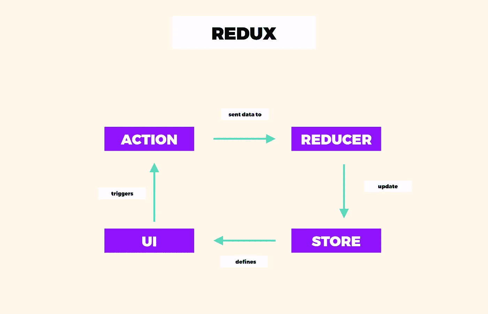
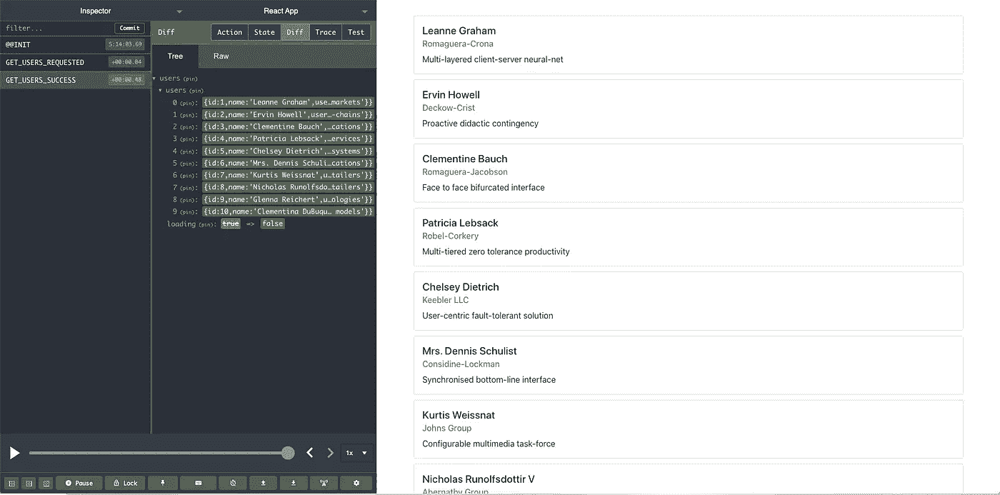

# 如何用 ReactJS 和 Redux 实现 Redux Saga？

> 原文：<https://itnext.io/how-to-implement-redux-saga-with-reactjs-and-redux-d6116efcc90?source=collection_archive---------2----------------------->


[如何用 ReactJS 和 Redux 实现 Redux Saga？](https://www.blog.duomly.com/implement-redux-saga-with-reactjs-and-redux/)

本文原载于[https://www . blog . duomly . com/implement-redux-saga-with-react js-and-redux/](https://www.blog.duomly.com/implement-redux-saga-with-reactjs-and-redux/)

# Redux 设置教程简介

很多时候，你可以听到前端应用程序的状态，但是它到底是什么呢？让我解释一下。

前端应用程序中的状态表示给定时间内存储在应用程序中的所有数据。它可以以不同的格式存储，如对象或字符串。基于状态的值，我们可以个性化应用程序，显示和隐藏某些元素。

为了管理现代前端框架中的状态，我们可以使用不同的库，如 Redux、MobX 或 NgRx。最常见的是 Redux，它主要用于 ReactJS 应用程序，尽管它也可以用于 Angular。

使用 Redux，应用程序的状态保存在存储中，我们可以从应用程序中的每个组件访问存储。Redux 由存储、reducers 和动作组成。

在本文中，我想告诉您更多关于 Redux 库的信息，并创建一个简单的 ReactJS 项目，在这里我将一步一步地设置 Redux。

开始吧！

# Redux 是如何工作的？

Redux 基于 flux 架构，它支持单向数据流。这意味着应用程序中的数据一次又一次地经历相同的生命周期，这使得状态中发生的所有事情都更加可预测。

让我们来看看这个简单的图形，它展示了数据在 Redux 应用程序中的生命周期。



在上图中，您可以从 UI 中看到，我们触发了一个将数据传递给 reducer 的操作。接下来，reducer 更新存储，这是我们的应用程序的状态。商店定义了用户界面。

让我们想想使用 Redux 能给我们的开发带来什么好处。

# 使用 Redux 的好处

当您构建应用程序时，您或多或少知道需要在应用程序内部管理多少数据。在大多数情况下，前端应用程序有一些功能，非常罕见的只是静态网站。通常，我们保存一些用户数据、表单数据等。在应用程序状态中，然后使用一个工具来管理状态是非常有用的。

ReactJS 应用程序中最流行的解决方案是 Redux。这种解决方案的流行有一些重要的好处。让我们一个一个来看看。

*   **可预测状态**—Redux 中的状态是可预测的，因为减速器功能是纯的；因此，如果我们传递相同的状态和相同的动作，它需要返回相同的结果。Redux 状态也是不可变的；它不能被改变或修改。
*   **易于维护**——考虑到它是可预测的，并且对 Redux 应用程序的结构非常严格，任何了解 Redux 的人都会理解它，并且很容易使用它。
*   **易于调试** — Redux 允许我们使用可用的开发工具记录行为，使调试更加容易。
*   **可用的开发者工具** — Redux 拥有令人惊叹的开发者工具，可以在浏览器中使用它们来查看后端发生了什么。
*   **服务器端渲染** — Redux 通过允许管理初始渲染来支持服务器端渲染。Redux 将应用程序的状态发送给服务器，并对服务器的请求做出响应。

上面我列出了使用 Redux 管理前端应用程序状态的一些好处。现在，我想转到实用部分，我们将使用 ReactJS 应用程序设置一个 Redux。

# 创建 ReactJS 项目并安装 Redux

是时候开始这篇文章的实践部分了。我必须创建一个新的 ReactJS 应用程序，这将是我们项目的基础。然后，我将安装 Redux 包，以便能够在我们新创建的应用程序中设置它。

打开控制台，并转到您想要创建项目的位置。使用`create-react-app`。因此，让我们用下面的命令创建一个应用程序。

```
npx create-react-app redux-app
```

接下来，让我们使用`yarn`或`npm`来启动应用程序。

```
cd redux-app
yarn start
```

当您的应用程序正常工作时，我们必须使用您为项目选择的包管理器安装`redux`包和`react-redux`包。

```
yarn add redux
yarn add react-redux
```

如果一切都完成了，我们就可以进入应用程序的代码并设置 Redux 文件结构。

# 设置冗余结构

现在，我必须为我们的 Redux 文件建立结构。我决定在`src`文件夹中为`redux`创建一个单独的文件夹。在那里我创建了两个文件夹，一个用于`actions`，一个用于`reducers`，我创建的最后一个元素是`store.js`文件。

```
└── src
    |── redux
    │   ├── actions
    │   ├── reducers
    │   |── store.js
```

当我们的 Redux 文件的结构准备好时，我们可以将 ReactJS 应用程序的主文件与存储连接起来。

让我们打开`index.js`文件，并按照下面的代码更新它。

```
import React from 'react';
import ReactDOM from 'react-dom';
import './index.css';
import App from './App';
import * as serviceWorker from './serviceWorker';
import { Provider } from 'react-redux';
import store from 'redux/store.js';ReactDOM.render(
  <Provider store={store}>
    <React.StrictMode>
      <App />
    </React.StrictMode>
  </Provider>,
  document.getElementById('root')
);serviceWorker.unregister();
```

在上面的代码中，我从`react-redux`导入了`<Provider>`组件，用于将 Redux 存储传递给 ReactJS 应用程序。

此时，我们需要做的下一件事是定义我们的商店。让我们打开`store.js`文件，并编写下面的代码。

```
import { createStore } from 'redux';
import rootReducer from './reducers/index.js';const store = createStore(rootReducer);export default store;
```

如您所知，在`store.js`文件中，我导入了需要创建的`rootReducer`。
在该文件中，我将使用`combineReducers`方法，该方法将用于将减速器组合成一个单独的减速器，并将其传递给商店。之所以使用它，是因为为了创建和组织状态，我们通常会使用多个缩减器，但是我们只能将一个缩减器传递给`createStore`方法，这就是为什么我们使用`combineReducer`。

让我们打开`redux`文件夹，在那里创建一个`index.js`文件。在新创建的文件中，让我们使用下面的代码。

```
import { combineReducers } from 'redux';
import users from './users';const rootReducer = combineReducers({
  users: users,
});export default rootReducer;
```

在上面的代码中，我还没有传递任何缩减器，因为我没有创建任何缩减器，但是我们将更新这个文件。现在，让我们创建一个动作和减速器。

# 创建动作和减速器

在这一步中，我将创建一个缩减器和一个动作。在我们的应用程序中，我们将使用 JSONPlaceholder 来获取数据。我们将创建一个用户配置文件列表。这就是为什么我们首先要创建一个用户缩减器。

让我们转到`reducers`文件夹，创建`users.js`文件。在文件内部，让我们添加以下代码。

```
import * as type from '../types';const initialState = {
  users: [],
}export default function users(state = initialState, action) {
  switch (action.type) {
    case type.GET_USERS:
      return {
        ...state,
        users: action.payload
      }
    default:
      return state
  }
}
```

在这个文件中，我们设置了用户缩减器，我们还设置了初始状态并导入了将要使用的动作类型。不，我们必须创建`types.js`文件并在那里创建类型。所以，让我们转到`redux`文件夹，创建一个文件`types.js`，并把它放在下面的代码中。

```
export const GET_USERS = 'GET_USERS';
```

现在，我们必须创建一个动作来获取用户。让我们转到`actions`文件夹，并创建`users.js`文件，我们将在其中放置操作。

在文件内部，我们将使用以下代码定义`getUsers`动作。

```
import * as type from '../types';export function getUsers(users) {
  return { 
    type: type.GET_USERS,
    payload: users,
  }
}
```

在上面的代码中，我创建了一个获取用户并将他们保存在 reducers 中的动作。现在，我们需要一些 UI 来调度动作并显示来自应用程序商店的数据。

# 调度操作并从 Redux 存储中获取数据

让我们从创建一个新组件开始，我们将在其中构建 UI 来显示来自商店的数据。首先，让我们添加允许我们使用 Bootstrap 5 的 CDN。在`public\index.html`文件中，在 head 元素中添加以下代码。

```
<!-- CSS only -->
<link rel="stylesheet" href="https://stackpath.bootstrapcdn.com/bootstrap/5.0.0-alpha1/css/bootstrap.min.css" integrity="sha384-r4NyP46KrjDleawBgD5tp8Y7UzmLA05oM1iAEQ17CSuDqnUK2+k9luXQOfXJCJ4I" crossorigin="anonymous">
```

现在，让我们为我们的组件创建一个新文件夹，在新创建的`components`文件夹中创建两个文件，`UsersComponent.jsx`和`CardComponent.jsx`。在`CardComponent.jsx`文件中，我们添加以下代码。

```
import React from 'react';const Card = (props) => {
  return (
    <div className="card">
      <div className="card-body">
        <h5 className="card-title">{props.user.name}</h5>
        <h6 className="card-subtitle mb-2 text-muted">{props.user.company.name}</h6>
        <p className="card-text">{props.user.company.catchPhrase}</p>
      </div>
    </div>
  )
}
```

此代码用于创建包含用户名、公司名称和公司短语的用户卡。

接下来，让我们打开`UsersComponent.jsx`文件，并把下面的代码放在那里。

```
import React, { useEffect } from 'react';
import { useSelector, useDispatch } from 'react-redux';
import { getUsers } from '../redux/actions/users';
import Card from './CardComponent';const Users = () => {
  const dispatch = useDispatch();
  const users = useSelector(state => state.users.users); useEffect(() => {
    dispatch(getUsers([
      {
        id: 1,
        name: 'Leanne Graham',
        company: {
          name: "Romaguera-Crona",
          catchPhrase: "Multi-layered client-server neural-net",
        }
      }
    ]));
  }, []) return (
    <>
      {users.length > 0 && users.map((user) => (
        <Card key={user.id} user={user} />
      ))}
      {users.length === 0 && <p>No users available!</p>}
    </>
  )
}export default Users;
```

我们使用了来自`react-redux`和`useEffect()`的钩子，我在这段代码中调度动作。当我们运行应用程序时，动作被分派，用户数据被传递给存储。

我们仍然需要将 UsersComponent 添加到`App.js`文件中，以显示它并更改一些样式。我们先打开`App.js`，确定它看起来像下面的代码。

```
import React from 'react';
import Users from './components/UsersComponent';
import './App.css';function App() {
  return (
    <div className="App">
      <Users />
    </div>
  );
}export default App;
```

而且让我们现在就打开`App.css`文件；接下来，删除其中的所有样式，并放置如下代码。

```
.App {
  margin: 5%;
}
.card {
  margin: 10px;
}
```

为了能够检查 Redux 中发生了什么，我们可以使用`redux-dev-tools`，我们将在下一点中打开它。

# 添加冗余开发工具

`redux-dev-tools`是一个工具，它允许我们检查应用程序状态中发生了什么，调度了哪些操作，以及存储了哪些数据。

让我们打开我们的`store.js`文件，用下面的代码更新它。

```
import { createStore, compose } from 'redux';const store = compose(
  window.devToolsExtension && window.devToolsExtension(),
)(createStore)(rootReducer);
```

现在，当你在 Google Chrome 中打开开发者工具并找到 Redux 选项卡时，你将能够看到关于商店和 Redux 中发生的动作的所有信息。

# 设置 Redux 中间件

首先，让我解释一下什么是中间件。代码可以放在发送请求的框架和生成响应的框架之间。中间件的最大优势是我们可以在一个项目中结合一些第三方中间件。

那么，为什么 Redux 中需要中间件呢？action 和 reducer 之间的数据流按照一个非常清晰的模式工作，但是当我们必须与 API 通信或者做一些其他副作用类型的动作时。中间件有助于执行副作用，而不会阻止应用程序的状态更新。

在本文中，我想更深入地了解我们必须通过 Redux 与 API 通信的情况。这就是为什么我想告诉你更多关于两个流行的用于异步 API 调用的中间件解决方案，Redux-Thunk 和 Redux-Saga。

## 重复思维

Redux Thunks 是一个第三方库，允许在 Redux 应用程序内部创建异步 API 调用。它允许我们编写名为 thunk 的函数，该函数发出 Ajax 请求，并使用响应数据调用动作创建器。

现在，让我解释一下 thunk 是什么。Thunk 是一个延迟表达式求值的包装函数。

Redux Thunks 在 ReactJS 和 Redux 环境的初学者中非常常见，因为它非常容易使用和设置。

但是，我们不会为我们的 API 调用选择这个解决方案。

Redux 中的中间件有一个不同的流行解决方案，它被称为 Redux-Saga。现在让我们更仔细地看看这个话题。

## Redux 传奇

中间件的下一个解决方案是 Redux-Saga。Redux-Saga 使用 ES6 生成器而不是函数。它允许我们轻松地测试、编写和读取 Redux 中的异步调用。

使用 Redux-Saga 而不是 Redux-Thunk 的最大优点是避免了回调地狱，并且操作保持纯净，因此异步代码非常容易测试。
在我们的应用中，我们将使用 Redux-Saga 作为中间件来创建 API 调用。来实施吧！

## 实现中间件

为了实现我们的`redux-saga`,让我们从使用 yarn 或 npm 安装它开始。

```
yarn add redux-saga
```

现在，让我们在`redux`文件夹中创建`saga`文件夹。在新创建的文件夹中，创建两个文件，`index.js`和`userSaga.js`。在`userSaga.js`文件中，我们将创建一个 API 调用和我们的 sagas 来获取用户数据。

```
import { call, put, takeEvery } from 'redux-saga/effects'const apiUrl = `https://jsonplaceholder.typicode.com/users`;
function getApi() {
  return fetch(apiUrl, {
      method: 'GET',
      headers: {
          'Content-Type': 'application/json', }
  }).then(response => response.json())
    .catch((error) => {throw error})
}function* fetchUsers(action) {
   try {
      const users = yield call(getApi);
      yield put({type: 'GET_USERS_SUCCESS', users: users});
   } catch (e) {
      yield put({type: 'GET_USERS_FAILED', message: e.message});
   }
}function* userSaga() {
   yield takeEvery('GET_USERS_REQUESTED', fetchUsers);
}export default userSaga;
```

太好了，准备好之后，让我们打开`index.js`文件，我们必须创建一个对象来组合我们的传奇，因为我们可能有不止一个。

```
import { all } from 'redux-saga/effects'
import userSaga from './userSaga'export default function* rootSaga() {
  yield all([
    userSaga(),
  ])
}
```

下一步是应用中间件并在`store.js`文件中运行我们的 rootSaga。

```
import { createStore, applyMiddleware, compose } from 'redux';
import createSagaMiddleware from 'redux-saga';
import rootReducer from './reducers/index.js';
import rootSaga from './sagas/index';const sagaMiddleware = createSagaMiddleware();
const store = compose(
  applyMiddleware(sagaMiddleware),
  window.devToolsExtension && window.devToolsExtension(),
)(createStore)(rootReducer);sagaMiddleware.run(rootSaga);export default store;
```

很好，现在，我们可以在我们的 reducer 中做一些改变来监听动作的结果，但是首先，让我们在我们的`types.js`文件中改变和添加新的类型。

```
export const GET_USERS_REQUESTED = 'GET_USERS_REQUESTED';
export const GET_USERS_SUCCESS = 'GET_USERS_SUCCESS';
export const GET_USERS_FAILED = 'GET_USERS_FAILED';
```

打开`reducer\user.js`文件，让我们更新减速器和初始状态。

```
const initialState = {
  users: [],
  loading: false,
  error: null,
}export default function users(state = initialState, action) {
  switch (action.type) {
    case type.GET_USERS_REQUESTED:
      return {
        ...state,
        loading: true,
      }
    case type.GET_USERS_SUCCESS:
      return {
        ...state,
        loading: false,
        users: action.users
      }
    case type.GET_USERS_FAILED:
      return {
        ...state,
        loading: false,
        error: action.message,
      }
    default:
      return state
  }
}
```

现在，我们的 reducer 中有错误和加载属性。当 API 调用开始时，我们可以打开加载器，让用户知道发生了什么。

让我们转到 actions 文件夹中的`user.js`文件，更改动作的类型。

```
export function getUsers() {
  return {
    type: type.GET_USERS_REQUESTED,
  }
}
```

由于这些变化，我们需要在我们的`UsersComponent.jsx`文件中应用一些变化。

```
const Users = () => {
  const dispatch = useDispatch();
  const users = useSelector(state => state.users.users);
  const loading = useSelector(state => state.users.loading);
  const error = useSelector(state => state.users.error); useEffect(() => {
    dispatch(getUsers());
  }, []) return (
    <>
      {users.loading && <p>Loading...</p>}
      {users.length === 0 && !loading && <p>No users available!</p>}
      {error && !loading && <p>{error}</p>}
      {users.length > 0 && users.map((user) => (
        <Card key={user.id} user={user} />
      ))}
    </>
  )
}
```

太好了，让我们看看应用程序是否正常工作！

# 结果

当您打开应用程序和开发人员工具时，您将看到请求动作首先被启动，然后 reducer 将加载更改为真。当呼叫准备好时，应该发生成功动作，并且数据应该显示在屏幕上。

这是它给我的样子。



# 结论

恭喜你！您刚刚使用 Redux 和 sagas 中间件创建了一个 ReactJS 应用程序。

在本文中，您可以了解什么是应用程序状态，为什么状态管理库在某些情况下是一个好的解决方案，以及如何在 ReactJS 应用程序中设置 Redux。除此之外，您还可以了解什么是中间件，以及为什么我们需要使用 ReactJS 和 Redux。我们也对比了`redux-thunks`和`redux-saga`。

请告诉我们你更喜欢你的应用中的哪种解决方案。


[Duomly —编程在线课程](https://www.duomly.com)

感谢您的阅读，
安娜