# 如何提高自己应用的 DDDness？

> 原文：<https://itnext.io/how-to-improve-the-dddness-of-your-application-3db2e0536ad7?source=collection_archive---------1----------------------->

或者换句话说，如何通过封装构建意图揭示 API，一本实用指南。

这篇博文中的所有代码都可以在[这里](https://github.com/VisualBean/Improve-DDDness)找到。

[前言:](#0eee)
∘ [通信和意图](#036b)
[代码气味:公共设置程序等于没有办法强制执行一致性](#e827)
∘ [修复:使类不可变](#3cd7)
[代码气味:【当我们记住时有效】模式](#233b)
∘ [IsValid vs 永远有效](#87e3)
∘ [修复:将验证逻辑移至构造函数](#af0a)
[代码气味](#d2d0)
[代码气味:通过命名来沟通关系](#6384)
∘ [修复:将其封装在一个类(ValueObject)](#585e)
[代码气味:公开列表 API](#78cb)
∘ [修复:封装列表并公开一个 IEnumerable](#799e)
[代码气味:无丰富行为](#6e8a)
∘ [修复:使用无处不在的语言](#b92b)
[封装逻辑](#5a9f)
[提示](#75cb)

# 前言:

对我来说，DDD 完全是关于构建意图揭示 API 的(如果我们超越所有组织和领域发现的东西)。这是关于将商业概念和规则封装在对象中，也就是所谓的老式面向对象编程。

在这篇文章中，我将介绍一些可以帮助你“更好地”封装领域逻辑的代码味道和模式。我们将通过重构这些类来做到这一点；

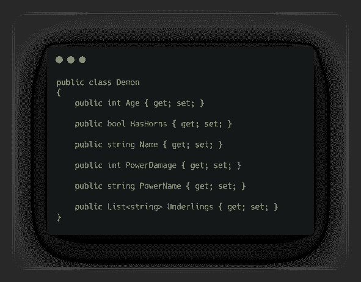

恶魔阶级

第一类是`Demon`类，这是我们大多数人大概都用过，也见过很多次的。没有封装，只有由消费代码设置的属性。

这段代码通常由类似于

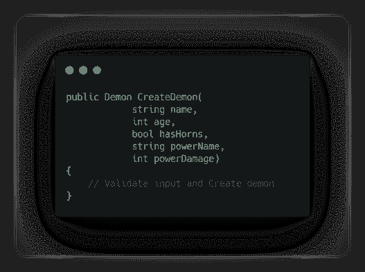

带有某种工厂方法的 DemonService 类。

`DemonService`类将有一个工厂方法，用于封装创建，最好的情况是对输入进行一些验证。

## 沟通和意图

那么我们和这些类交流什么呢？

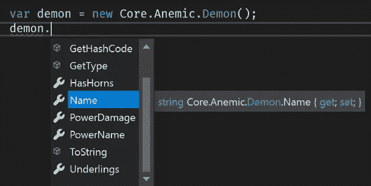

从 API 来看，不是很多。我阅读的意图是，所有这些属性都是可选的，并且允许随时更改。

对于`DemonService`级来说，情况非常相似。我们在这里面临的问题是，开发人员必须知道工厂方法的存在，以便获得一个“有效的”demon 实例。拥有公共设置器也鼓励 hacky 代码修复 bug“让我们快速改变它，然后继续前进”。

# 代码味道:公共设置器等于没有办法加强一致性

如果你再看一下 Demon 类，你会看到所有的属性都有公共的 getters 和 setters，这意味着我们没有办法在一个实例的生命周期内保持一致性。它随时都可能被改变。

## 修复:使类不可变

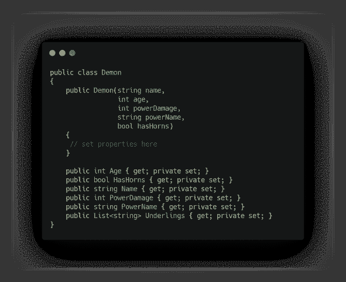

这样，至少我们知道一个恶魔在它的一生中都是一致的，因为属性不会改变。

# 代码气味:“记忆时有效”模式

还记得工厂方法的`DemonService`类吗？

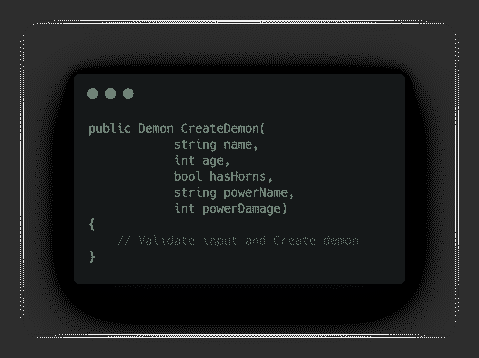

将验证和创建逻辑从类中分离出来，可能看起来不错，这是关注点的分离..对吗？..对吗？不..
这将再次留给黑客代码，其中“我们只需要一个有名字的恶魔”或类似的语义将在代码库中被抛出。问题是；这不是一个有效的`Demon`。

## IsValid vs Always Valid

IsValid 是指当我们的类中有一个检查有效性的方法时(当我们调用它时)。
**永远有效**是一个实例应该永远是一个有效实例的想法。这样，我们知道如果我们得到一个实例，它将总是“正确的”。

## 修复:将验证逻辑移到构造函数中

将验证逻辑从工厂方法移到`Demon`类的构造函数中。我们现在**永远有效**。

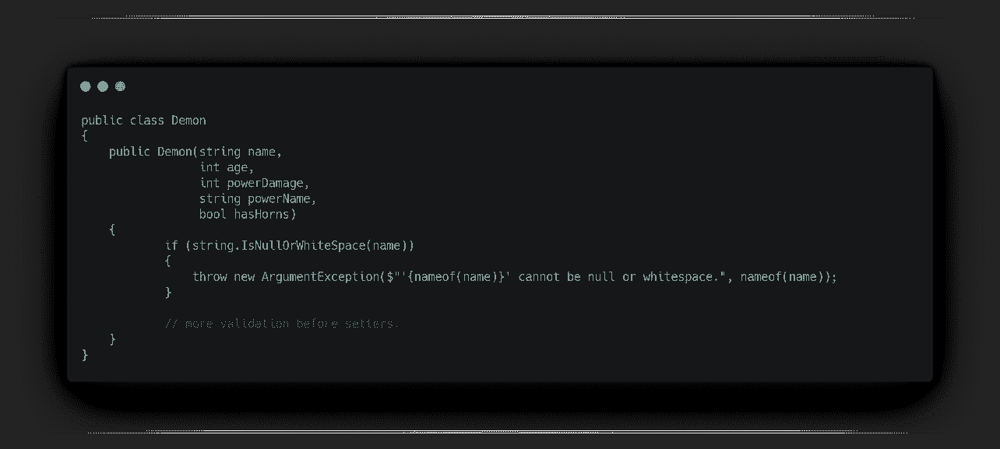

# 代码气味:原始痴迷

再看一次妖类；

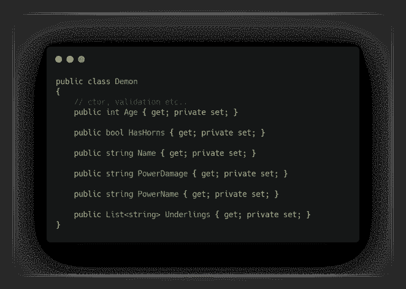

注意我们是如何使用原语的吗？`int`的和`string`的到处都是。

原语的问题在于，它们的不变量可能比你实际接受和想要的要多得多。让我们以`List<string> Underlings`为例。
一个`string`有多少个不变量？什么是“有效的”下属？尤其是当我们把一个`List`作为参数的时候。我们如何验证条目？

## 修复:将其封装在一个类中(ValueObject)

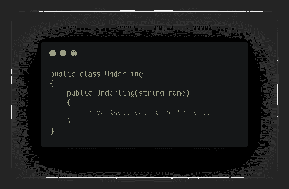

太好了！现在我们可以验证一个下属是它自己的事情，我们肯定会有一个“有效”的实例，因为我们遵循的规则是**永远有效**。

# 代码气味:关系是通过命名来交流的

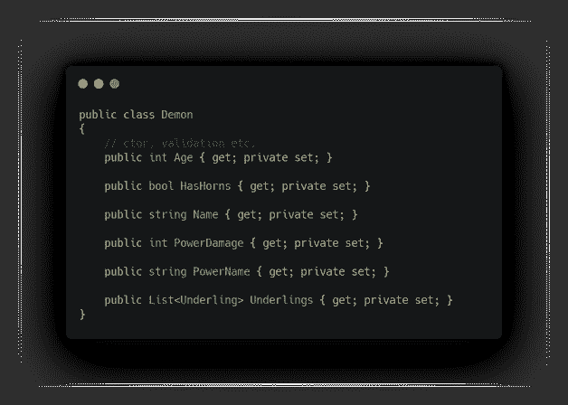

这种码味与[原始执念](#d2d0)密切相关。看一下`PowerDamage`和`PowerName`，它们似乎在它们之间传递某种形式的关系，但是没有任何东西强制执行它，当然可以通过构造器中的验证来强制执行，但是消费者呢？我们如何更好地沟通这种关系？

## 修复:将其封装在一个类中(ValueObject)

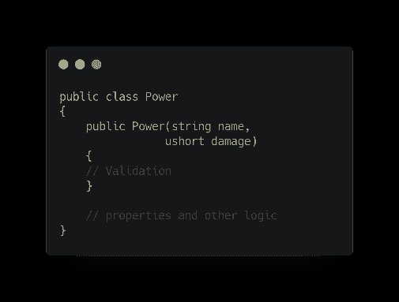

现在它是一个自己的对象，可以这样使用，**永远有效**和一切…
并且在`Demon`构造函数中

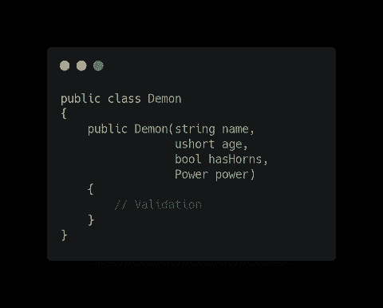

# 代码味道:公开列表 API

如果你注意到在`Demon`类中，我们可能已经为`Underlings`设置了私有的 setter，但是因为它是一个`List`类型，我们公开了`List` API。

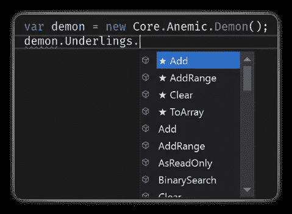

有时，这可能是我们想要的，但不是在这种情况下。

## 修复:封装列表并公开一个`IEnumerable`

通过封装列表并只公开一个`IEnumerable`，我们停止公开`List` API。与此同时，我们将使用我们的恶魔领域中无处不在的语言来制作新的`Underling`。因为我们将验证逻辑移到了`Underling`类，所以我们可以安全地“新建”它。

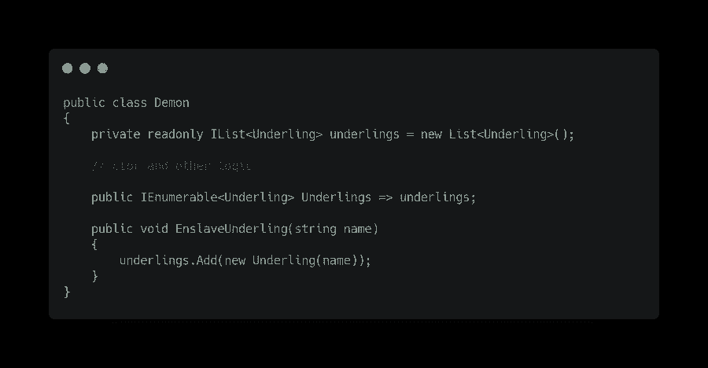

# 代码气味:没有丰富的行为

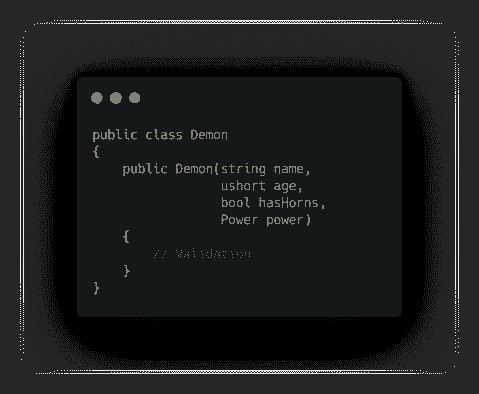

如果我们仔细观察我们的`Demon`类，我们会注意到我们实际上没有任何丰富的行为。然而，我们确实有一些关于`Demon`角的领域规则。在我们的领地里，一只`Demon`只能长角，不能蜕角，也不是“天生”就有的。

## 修复:使用通用语言封装逻辑

我们简单地将这个逻辑封装在一个方法`GrowHorns()`中。这样，消费代码总是可以给我们的`Demon`实例添加角。域名是完整的！

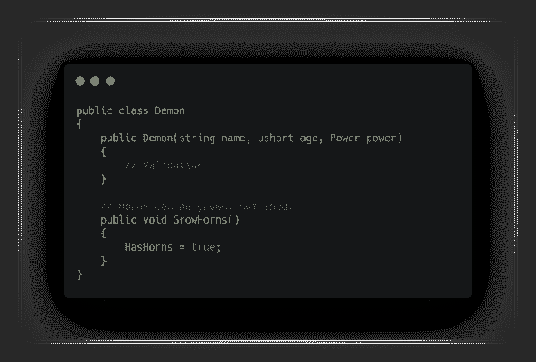

行为应该只对它封装的状态进行操作。这意味着 Demon 类内部的行为应该只改变 Demon 类及其封装的类的状态。—然而这可能有点棘手，将由设计者和领域专家来决定是`Demon`应该直接改变`underling`还是`Underling`应该封装这个逻辑，而`Demon`只是简单地调用那个逻辑。

# 创作模式

如果我们看一下`Demon`类，构造函数是用来创建一个新实例的。这通常没问题，但是有一些方法可以让它变得更普遍。

## 私有构造函数+静态工厂方法

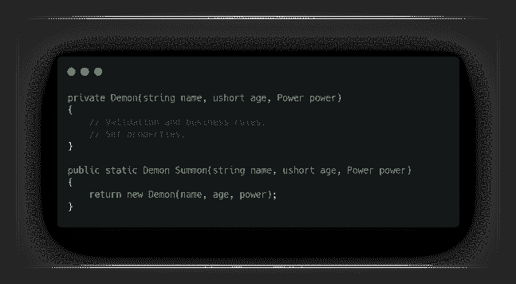

这意味着对消费者隐藏构造函数，并拥有一个调用构造函数的静态方法。注意遍在语的使用。

## 私有构造函数+静态实例

看看`Power`类，我们可能不希望消耗代码来简单地创造新的能力。我们可以强迫他们使用现有的权力。

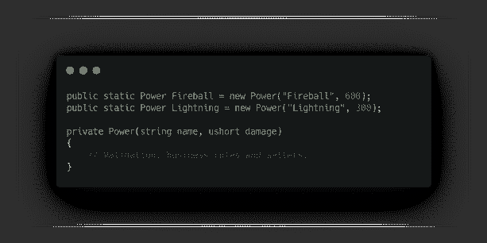

# 我们最终交流的是什么？

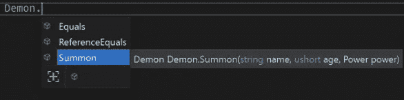

现在浏览 API，实例化一个`Demon`的唯一方法就是调用静态工厂方法`Summon()`。

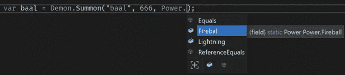

只有两种力量。

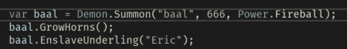

我们有效地沟通什么是被允许的，以及我们领域中无处不在的语言。

你可以在这里找到所有的代码

# 技巧

1.  记住总是覆盖相等比较方法和`GetHashCode`或者简单地使用新添加的`[record](https://docs.microsoft.com/en-us/dotnet/csharp/whats-new/tutorials/records)`类型。
2.  将您的领域模型放在它自己的项目中。这使得推理什么应该与什么对话，以及哪些项目应该依赖于哪些项目变得容易得多。
3.  存储库接口和域事件应该存在于域项目中。而不是存储库实现。—参见 4。
4.  领域模型不关心存储。
5.  不要使用`IAggregateRoot`、`IEntity`和`IValueObject`接口。有些人喜欢这些，但我发现它们弊大于利。M [arker 接口](https://docs.microsoft.com/en-us/previous-versions/visualstudio/visual-studio-2010/ms182128(v=vs.100)?redirectedfrom=MSDN)是非常情境化的，在 DDD 方面使用它们的一个副作用是你强迫自己将一个对象视为给定的类型，使你偏向那个方向。DDD 的这些概念也纯粹是为了解释它们之间的等级和依赖关系。可能有理由为 AggregateRoot 提供一个接口，存储库将使用该接口来确保只有`IAggregateRoot`对象被从数据库发送回来。你也可以维护一个`Entity` **基类**(不是一个接口)，比如 [this](https://enterprisecraftsmanship.com/posts/entity-base-class/) 来强制使用好的和合理的缺省值进行相等比较，并强制它拥有一个`Id`。
6.  AggregateRoot“只是”顶级实体。可以说它不是一个实体。