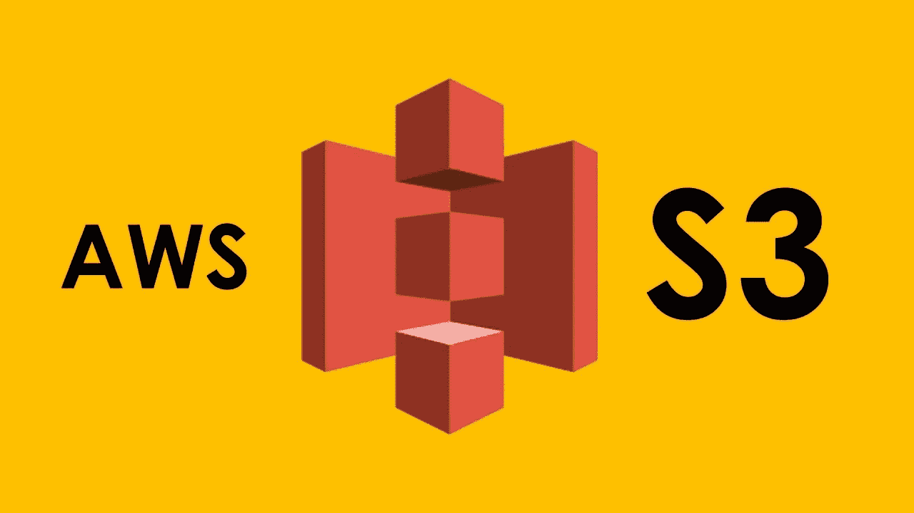

# 如何改进你的节点应用中的社交网络认证过程？

> 原文：<https://itnext.io/how-to-improve-the-social-network-auth-process-in-your-node-application-48ac5791131f?source=collection_archive---------10----------------------->

在本文中，我将描述对用户系统的小而有用的增强。这有助于更有效地创造新用户注册社交网络。

## 任务的核心

任务是实现存储用户配置文件图像的能力。这是关于注册社交网络的用户。例如谷歌或脸书。

# 可能的解决方案

有多种方法可以解决这个子任务。

**解决方案 1。**最简单的是将社交网络提供的用户图片 URL 存储到你的数据库中。这是一个容易实现的解决方案，但它有很多副作用。首先，存储一个外部链接不是最好的解决方案，因为链接可以在你的应用程序之外改变，而之前存储在你的应用程序中的链接就变得无效了。

**方案二。**解决该任务的另一种方法是不仅存储链接，还存储与该链接一起提供的图像。在服务器上存储图像不是最好的主意，使用特殊的文件存储服务要好得多。在我的实践中最受欢迎的是 AWS S3(简单存储服务)。

上传到 s3 存储桶的映像通过公共链接变得可用(在一些附加文件访问配置之后)。S3 提供的链接将存储在数据库中，并在必要时发送给客户端。

看起来几乎像解决方案 1，但我们有一个巨大的区别——可靠性。除了 S3 存储所有者以外，任何人都不能删除文件或更改指向文件的链接。所以存储的链接将是实际的全部时间。
所以存储图像的算法过程看起来如下:

*   注册过程中从社交网络获取用户图像 URL
*   将图像从 URL 存储到服务器文件系统
*   将图像上传到 S3 存储器
*   疼痛 S3 图像链接到一个数据库
*   从文件系统中删除临时映像

这种方法还不错，但不是最好的解决方案。下一个解决方案描述了如何更正确、更快地做同样的事情。

**方案三。**这与上一步中的算法几乎相同，只有一个关键的区别——我不会将图像存储到服务器文件系统中。增强的思想是将图像文件存储到一个临时缓冲区，然后从这个缓冲区上传到 S3 存储器。

为什么这种方式应该工作得更快？—因为文件操作非常耗时。因此，如果我避免它们，我可以避免一些额外的时间成本。

理论上看起来不错，让我们在下一节继续练习。

# 实践

所以我将这种方法的实现分为三个功能。

*   第一个“loadimagefromrurltobuffer”—接受文件 URL，将其下载到缓冲区中，并作为执行结果返回一个文件。
*   第二个“storebufferedimagetos 3”——接受文件缓冲，上传数据到 S3，并返回 S3 文件链接。
*   第三个是“storeSocialNetworkImageToS3”，它只是一个包装器，提供前面两个函数之间的交互。

一个代码示例中所有实现

对于这个功能，我使用了两个额外的 npm 包，这简化了程序员的许多工作=)

“AWS-SDK”——JavaScript 的官方 AWS SDK。

“请求”——简单而强大的 HTTP 客户端。

此外，在上传到 S3 之前，还可以对缓冲文件进行预处理、调整大小、压缩或其他一些操作。

# 结论

在本文中，我描述了一种有趣的优化方法，在注册过程中为节点应用程序的用户系统执行一个常见任务。
它也可以针对特定需求进行修改，我只是分享一下核心思想。

如果这篇文章对你来说有趣或有用，请随意在左侧面板留下一些掌声。

