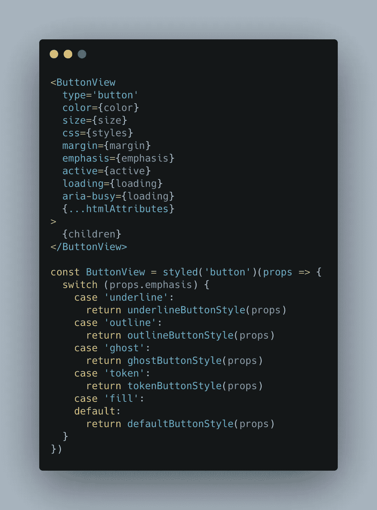
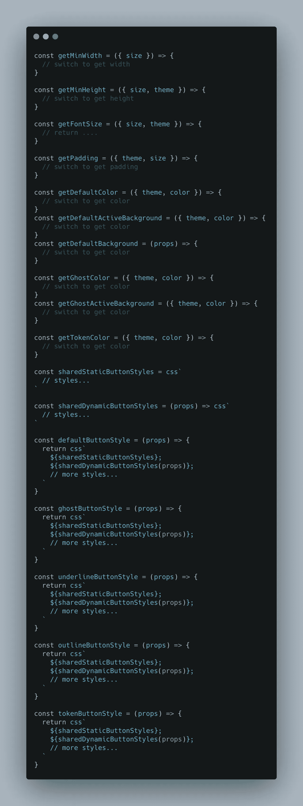
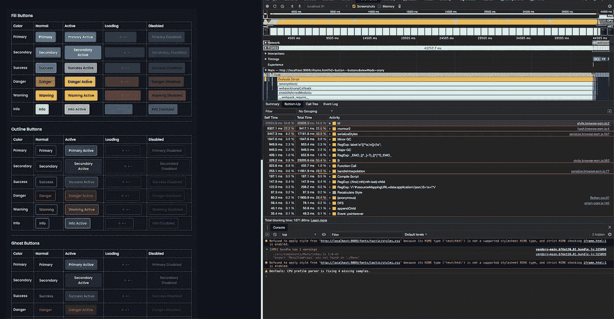
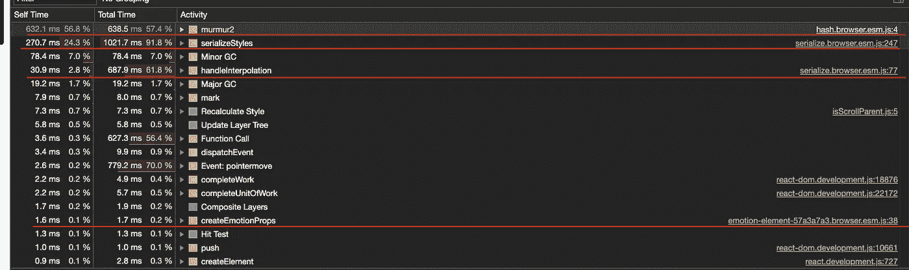
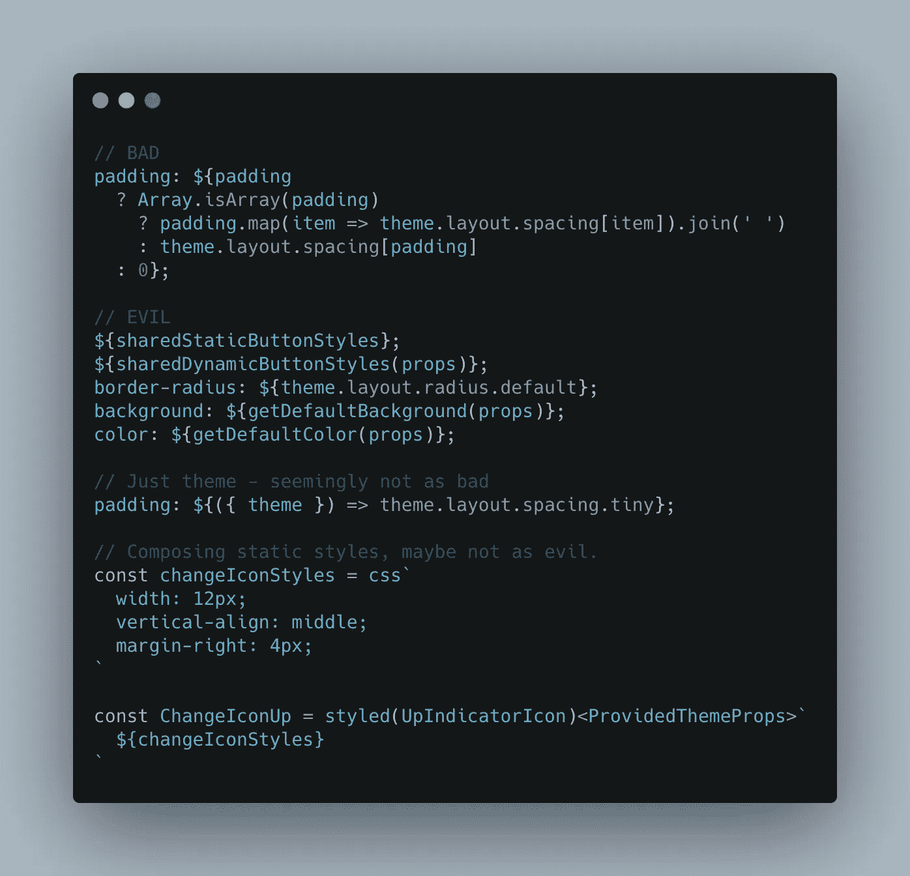
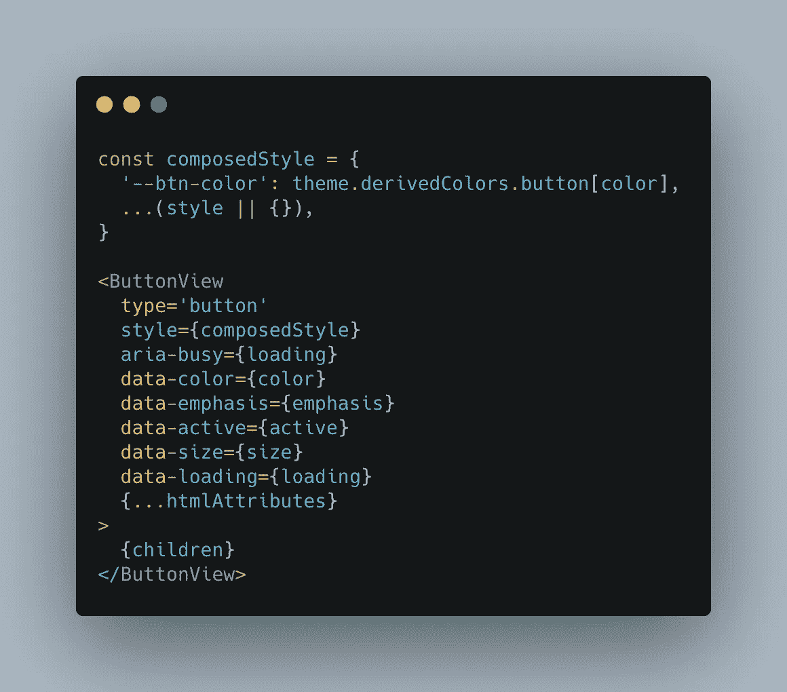
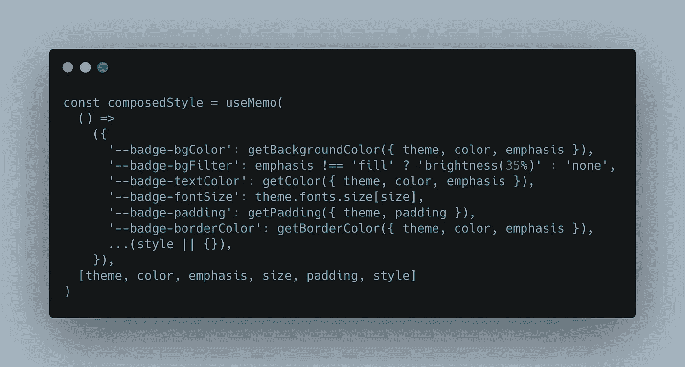
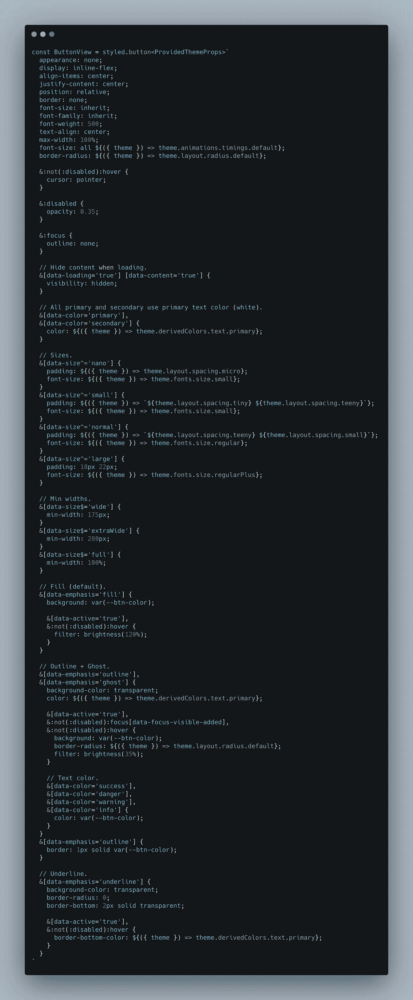
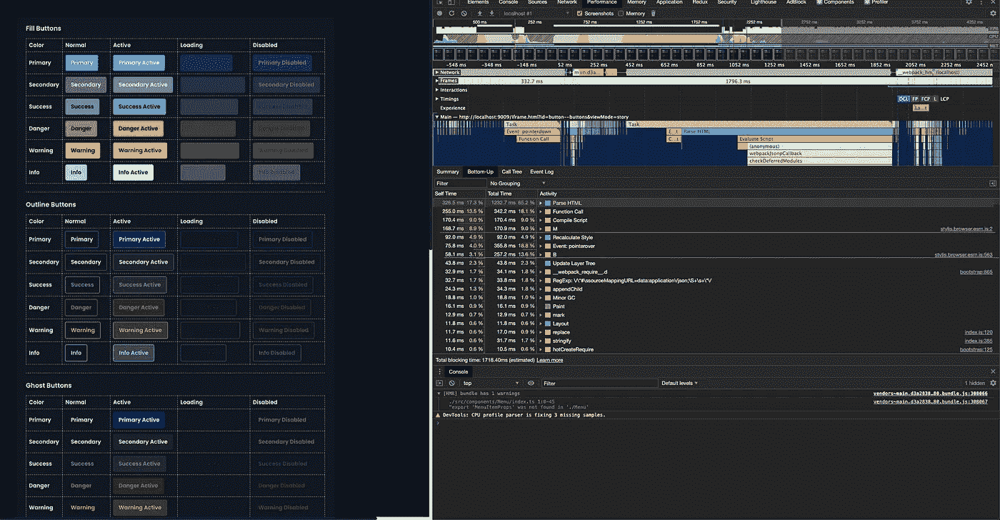

# 如何将 CSS-in-JS 性能提高 175 倍

> 原文：<https://itnext.io/how-to-increase-css-in-js-performance-by-175x-f30ddeac6bce?source=collection_archive---------0----------------------->

我喜欢 CSS-in-JS 的便利性，尤其是在使用第三方组件时能够协同定位样式并提高易用性。但是我不相信一些事情:

1.  散列类是“必须的”,而不是命名空间类，当需要从第三方组件、营销和测试套件中选择元素时，散列类甚至可能是一个障碍。
2.  在你的 CSS 中使用逻辑必然更好或者更可读，这也是一个**性能杀手**(下面将详细介绍)。
3.  向 10kb NPM 组件添加 25kb 以上的小型 JavaScript 是一个好主意(不过对于应用程序来说没什么大不了的)。
4.  它可能会引入新的问题，例如因为 Storybook 使用另一个版本的 emotion 而中断，从 UI 库导入时主题提供程序中断，SSR 中断，浏览器规则中断(在正文中插入

起初，你可以尽情享受，不会注意到这些“极快”的运行时 CSS 解决方案的任何性能问题。直到你在[故事书](https://storybook.js.org/)的一页上写了一堆。

让我们看看无处不在的按钮组件，因为它有各种样式和选项:

然后我们有一堆简单快速的函数来组成样式。我们甚至优化了静态 css，使其成为自己的块(sharedStaticButtonStyles):

我们的按钮组件拥有 Storybook 中最动态的函数调用和最多的元素。让我们看看它如何执行加载。

这大约花费了 **36 秒**在情感解析上(见红色下划线)。性能工具使其长度增加了 2 到 3 倍，但仍然太长了。

# 情况变得更糟了

我最初指责工具提示组件显示缓慢，后来意识到只有当它附加到按钮上时才出现。就在那时，我意识到 Emotion 在悬停时再次解析 CSS，我猜是因为工具提示导致重新渲染，并在工具提示显示之前冻结主线程大约 900 毫秒。

您可能会想“我的组件并没有那么复杂或缓慢”。即使在一个页面上有许多组件的大型应用程序上，它们的速度是我的两倍，在 CSS 解析时花费 1-2 秒不必要的加载冻结时间也是不可接受的。尤其是在我开发的那种高度动态并且每秒接收很多更新的应用上(由于基于道具的风格的动态特性，这种情绪在每次渲染时都会重新解析**就像在悬停时一样)。**

# **那么，我们如何快速制作和保存东西呢？**

**首先，如果你要开始一个新项目，你可能要考虑编译时 CSS-in-JS 解决方案:**

** [## 大西洋实验室/编译

### 阅读文档→安装⚠️工作正在重新编写/设计一个新的巴别塔插件。在你自己的夜晚使用…

github.com](https://github.com/atlassian-labs/compiled)  [## 调用堆栈/linaria

### JS 库中的零运行时 CSS。在 GitHub 上创建一个帐户，为 callstack/linaria 开发做贡献。

github.com](https://github.com/callstack/linaria)  [## vanilla-extract-Zero-runtime styles-in-TypeScript。

### 零运行时样式表-在类型脚本中。

零运行时样式表-in-type script . vanilla-extract . style](https://vanilla-extract.style/) 

如果你仍然想要一些动态的东西，你可以考虑 Goober，它要小得多(1kb gzip)并且速度快两倍，或者是介于这两个选项之间的 Stitches:

 [## 克里斯蒂安博特/古伯

### 🥜goober，不到 1KB🎉带有熟悉 API 的 css-in-js 替代方案

github.com](https://github.com/cristianbote/goober)  [## GitHub-modulz/stitches:CSS-in-JS 具有接近零的运行时间、SSR、多变体支持和一个…

### CSS-in-JS 具有接近零的运行时、SSR、多变体支持和一流的开发人员体验。针芯…

github.com](https://github.com/modulz/stitches) 

但是如果不担心的话，你可以通过使你的 CSS 更加静态来提高现有样式的性能达 175 倍。

已经有一些关于使用 props 主题化如何通过特设包装器来丰富您的应用程序的文章—[https://calendar . perf planet . com/2019/the-unseen-performance-cost-of-CSS-in-js-in-react-apps/](https://calendar.perfplanet.com/2019/the-unseen-performance-costs-of-css-in-js-in-react-apps/)

如果我开始一个新的项目，我会使用 CSS 变量来进行主题化，我已经写了如何做:[https://medium . com/@ Dominic Tobias/is-it-time-to-ditch-your-react-theme provider-e 8560 dad 2652](https://medium.com/@dominictobias/is-it-time-to-ditch-your-react-themeprovider-e8560dad2652)

# 但这不是您的性能瓶颈

您的性能瓶颈在于 css 中的嵌套函数调用，这些调用接受主题以外的道具。

我没有深入研究运行时 CSS 代码，但是看起来如果你调用一个函数，它基本上是在说“我不知道这个函数会返回什么，所以我会在每次渲染时重新计算它”。

# 数据属性和 CSS 变量来拯救

让我们改变按钮组件的工作方式:

这里有趣的事情是 CSS 变量的使用，这也允许我们大幅减少我们需要编写的静态 CSS 的数量。

这里有一个重构，我保留了旧的函数来获得颜色和大小，但是以几乎 1:1 的重构将它们从情感 CSS 移动到 CSS 变量:

这个函数在大约 0.002 毫秒后第一次执行。不管怎样，让我们看看按钮 CSS 现在是什么样子:

还记得花了 **36 秒**的解析时间吗？现在让我们看看:

是的，现在解析 CSS 花费了超过 200 毫秒的时间。请记住，关闭性能记录后，这些数字将会减少 2 到 3 倍。

所以总而言之:

*   在新项目中使用 CSS 变量进行主题化。
*   保持你的 CSS 尽可能的静态变化(最重要的优化)。
*   或者考虑在新项目中使用编译时 CSS(上面有链接)。需要注意的是，设置它们可能会更麻烦，CSS-in-JS 确实提供了无与伦比的开发者体验。**