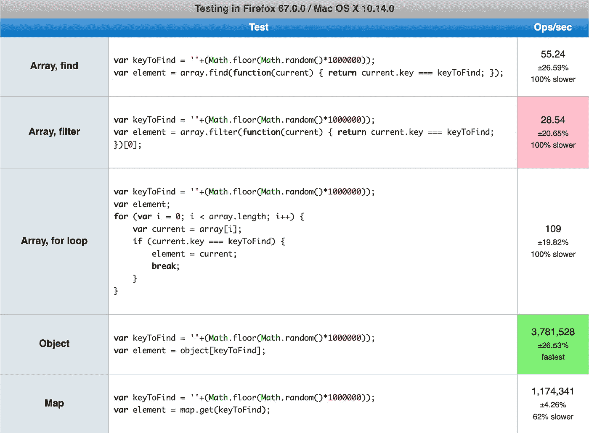
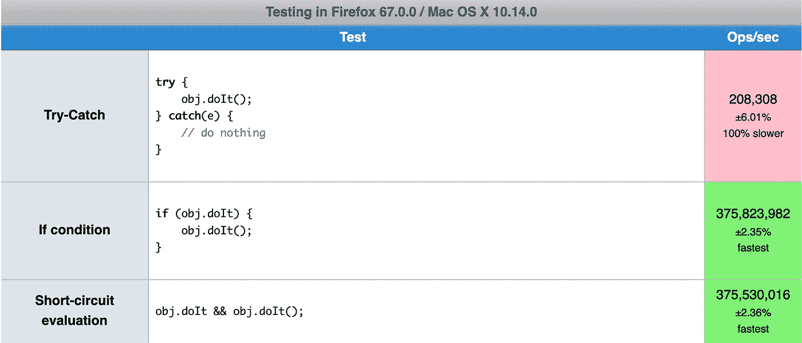
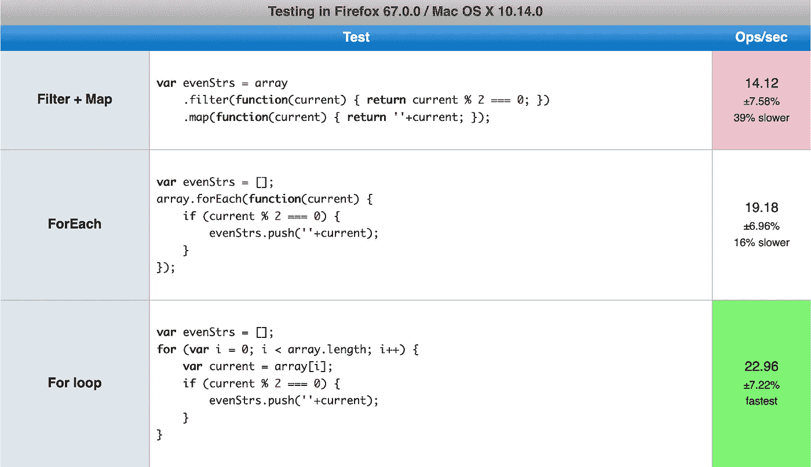
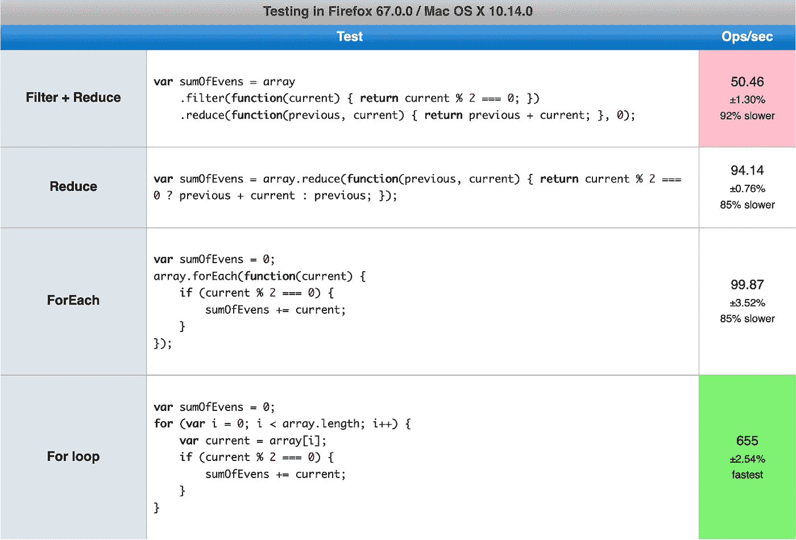
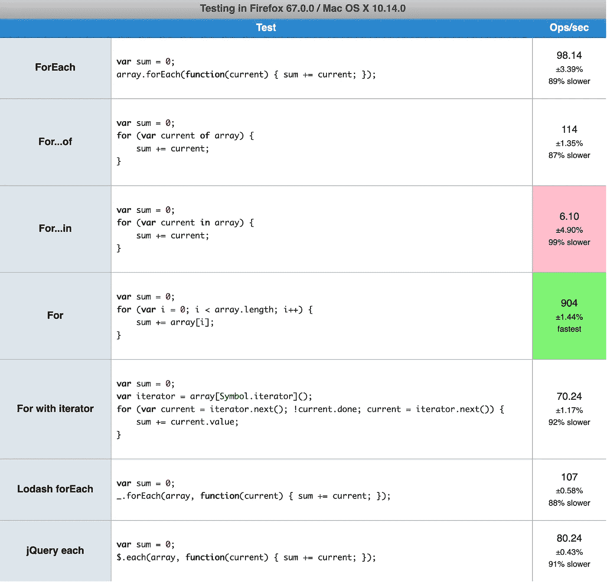
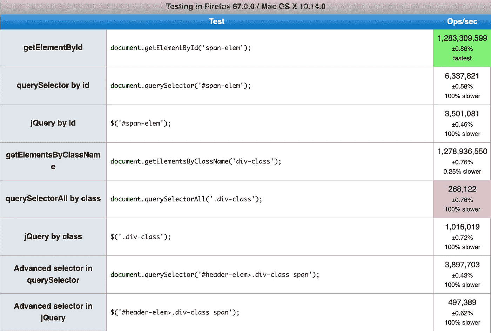

# 如何提高你的前端应用程序的性能——5 个编码技巧

> 原文：<https://itnext.io/how-to-increase-your-frontend-apps-performance-5-coding-tips-d92a56ca9c24?source=collection_archive---------0----------------------->

在我的许多前端项目中，有时我会遇到应用程序性能下降的问题。这样的事情时有发生——当解决方案的复杂性增加时，这很正常。但是，这仍然是我们开发人员需要注意的事情。在这篇文章中，我想向你展示 5 个帮助优化你的应用程序的技巧(我在项目中做过的事情)。有些看起来很明显，有些是编程基础，但我认为刷新我们的记忆总是好的。每个技巧都有基准支持，您可以自己运行并检查性能。

Paulina Niewiadomska 拍摄的图片

# 在你阅读这些提示之前

记住一件重要的事情:当你的代码不需要优化时，不要弄乱它。您应该总是编写快速的代码，但它也应该对其他开发人员可读，因为几乎总是有更快的方法来实现某些目标。Donald Knuth 在《作为艺术的计算机编程》中写道，关于优化代码，你应该知道的最重要的事情是:

> 真正的问题是程序员在错误的地方和错误的时间花了太多的时间担心效率；**过早的优化是编程中所有罪恶的根源**(或者至少是大部分)。

# 1.使用对象/映射代替数组进行查找

当我们处理数据时，我们经常会遇到“找到一个对象，用它做一些事情，找到另一个对象……”因为最常见的 JS 数据结构是数组，所以我们的数据存储在数组中是很正常的。然而，每次我们想在数组中找到一些东西时，我们都需要使用 find、indexOf、filter 之类的方法，或者我们可以用循环迭代——所以我们必须从一个结构的开头到结尾。因此，我们将使用线性搜索，其复杂度为 O(n)(这意味着在最坏的情况下，我们将需要执行与数组中的元素一样多的比较)。虽然在小数组中做几次可能不太明显，但是当元素很多，需要做很多次的时候，绝对会影响性能。

在这种情况下，将数组转换为对象或映射并基于键执行查找可能是个好主意。在这些数据结构中，我们可以访问一个复杂度为 O(1)的元素，所以无论大小，它总是只调用一次内存。这是因为在这两者背后有一个数据结构，叫做[散列表](https://en.wikipedia.org/wiki/Hash_table)。

你可以在这里执行一个基准:[https://jsperf.com/finding-element-object-vs-map-vs-array/1](https://jsperf.com/finding-element-object-vs-map-vs-array/1)。下面你可以看到我的结果:

差异是显著的——对于 map 和 object，我每秒获得了数百万次操作，而在数组中，最好的结果是略高于 100 次操作。当然，它没有考虑数据转换，但它仍然会快很多，即使当你必须转换时。

# 2.使用“if”条件，而不是捕捉异常

有时人们发现省略空检查更容易，只需在不存在时捕捉异常。当然，这是一种不好的做法，没有人应该这样做。所以，如果你的代码中有这样的部分，就替换它们。自然，您可能希望看到 100%确定的基准。在我的基准测试中，我决定检查三种方式——try-catch 表达式、if 条件和短路评估。

这里有一个基准:[https://jsperf.com/try-catch-vs-conditions/1](https://jsperf.com/try-catch-vs-conditions/1)。下面你可以看到我的结果:

我认为不言而喻，执行空值检查总是更好。此外，正如你所看到的，if 条件和短路评估之间几乎没有区别，所以只需使用更适合你的。

# 3.尽可能少用循环

这是另一个明显但有潜在争议的概念。因为我们在数组上有所有这些伟大的函数，比如 map、filter、reduce，所以使用它们很有诱惑力。它们通常使代码更干净，对其他开发人员来说更易读。但是，当性能下降时，我们可能会寻求拉平它。我决定创建两种情况:过滤然后映射和过滤比减少。我用函数链、forEach 和传统的 for 循环测试了每一种情况。为什么是这两个？正如您将看到的，好处可能并不显著。此外，对于第二个我决定也做过滤，同时减少。

过滤然后映射的基准:[https://jsperf . com/array-function-chains-vs-single-loop-filter-map/1](https://jsperf.com/array-function-chains-vs-single-loop-filter-map/1)。我的结果是:

当然单循环更快，但差别没那么大。那是因为推送操作，我们在贴图的时候不需要做。所以，在这种情况下你可能要考虑是否真的有必要。

那么，现在让我们用 reduce 来检查一下 filter:[https://jsperf . com/array-function-chains-vs-single-loop-filter-reduce/1](https://jsperf.com/array-function-chains-vs-single-loop-filter-reduce/1)。以下是我的结果:

这里的差异更为显著。将两个函数整合成一个函数使我们的执行速度提高了近 100%。然而，对传统 for 循环的改变极大地提高了速度。

# 4.使用 basic for 循环

这个可能也有点争议，因为开发者喜欢函数循环。它们看起来不错，可以提供一个很好的工作流程。然而，使用它们不如使用传统的循环有效。我想之前你可以看到使用 for 循环的区别，但是让我们来看看另一个基准:[https://jsperf.com/for-loops-in-few-different-ways/](https://jsperf.com/for-loops-in-few-different-ways/)。如您所见，除了内置的方法，我还测试了 Lodash 的 forEach 和 jQuery 的 Each。结果如下:

我们可以再次看到，最基本的 for 循环比其他任何方法都要快得多。但是，它们只适用于数组。在其他可迭代的情况下，我们应该直接使用 forEach、for…of 或 iterator。至于……在——嗯，最好不要用。除非绝对没有其他办法。此外，请记住，因为 for…in 接受所有对象属性(在数组中，属性是索引)，所以它可能会导致不可预知的结果。令人惊讶的是，从性能的角度来看，Lodash 和 jQuery 的方法并没有那么差，所以在某些情况下您不需要担心使用它们而不是内置的 forEach(在基准测试中令人惊讶的是，Lodash 的方法比内置的方法性能更好)。

# 5.使用内置 DOM 函数

你有没有看过别人的 JS 代码，看到 jQuery 被导入只是为了操纵 DOM？我很肯定你有，因为它是最流行的 JavaScript 库之一。当然，用库来管理 DOM 也不错——我们现在用 React 或者 Angular，他们也是这么做的。然而，有些人认为他们必须使用 jQuery 来完成从 DOM 中获取元素并对其进行微小修改的简单操作。

下面是针对三种不同用例比较 jQuery 和原生 DOM 函数的基准测试:【https://jsperf.com/native-dom-functions-vs-jquery/1】T2。以下是我的结果:

同样，最基本的函数— getElementById 和 getElementsByClassName —是遍历 DOM 的最快方法。对于 id 和高级选择器，querySelector 仍然比 jQuery 快。只有一种情况下 querySelectorAll 比 jQuery 慢(通过类名获取元素)。如果你想了解更多关于如何替换 jQuery 的信息，你可能想看看 http://youmightnotneedjquery.com 的[。](http://youmightnotneedjquery.com)

当然，请记住，当您使用库进行 DOM 管理时，强烈建议您坚持使用。但事实是，对于简单的情况，这是完全没有必要的。

# 下一步是什么？

这五个技巧无疑是用 JavaScript 编写更快代码的良好开端。如果你想走得更远，下面是一些需要检查的东西:

1.阅读关于使用 Webpack 优化 JavaScript 包的信息。这是一个非常广泛的话题，但是如果做得好，可以显著提高应用程序的加载时间。

2.了解数据结构、基本算法及其复杂性。许多人认为这仅仅是理论知识，但是在第一篇技巧文章中，我们看到了它在实践中是如何工作的。

3.在 [jsPerf](https://jsperf.com/popular) 页面上浏览测试用例。这是一个很好的地方，您可以在这里比较用 JavaScript 实现相同目标的不同方法，但是有最重要的实用信息——关于时差的细节。

> 这篇文章也发表在 Synergy Codes 的[博客上，Synergy Codes](https://www.synergycodes.com/blog/how-to-increase-your-frontend-apps-performance)是一家专注于流程可视化、映射和建模的软件公司。
> 你对创建数据可视化应用程序感兴趣吗？[点击这里了解 GoJS 库](https://synergycodes.com/gojs-ebook/)！