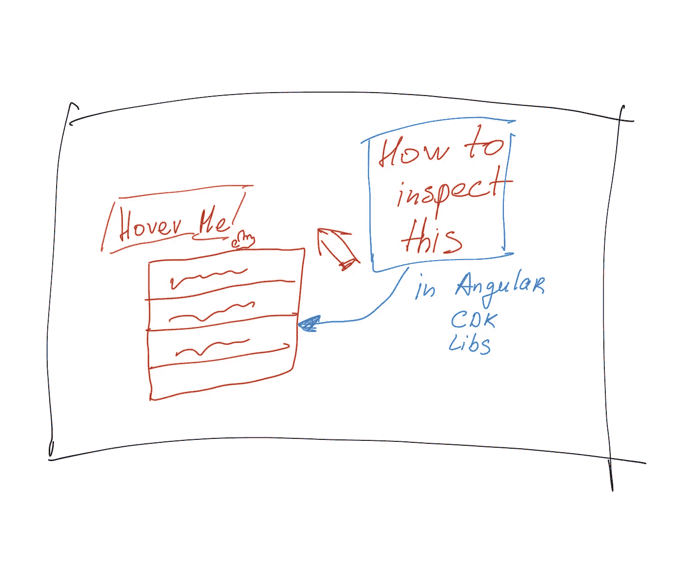
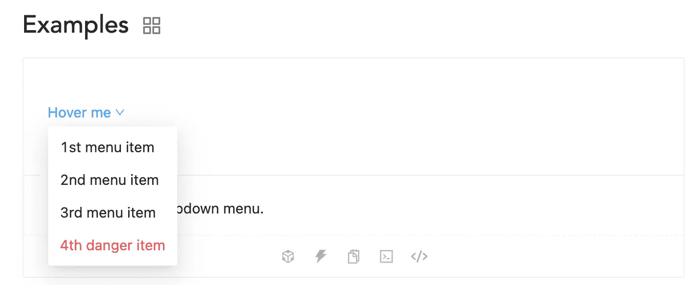
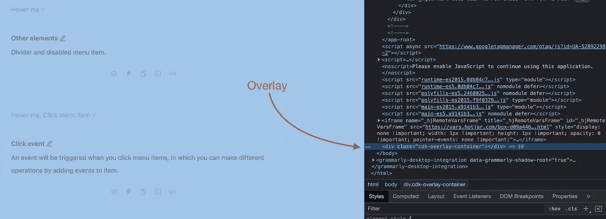
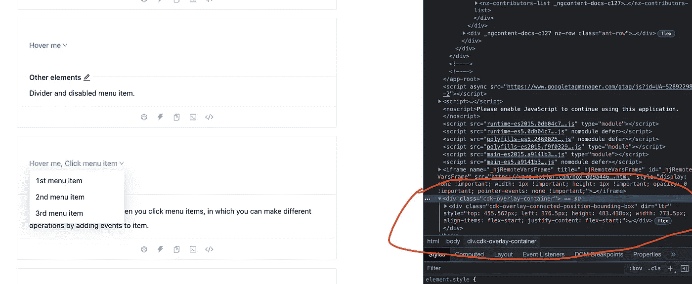
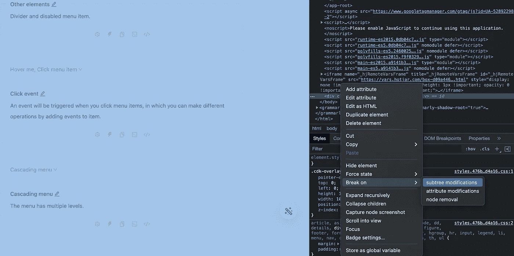
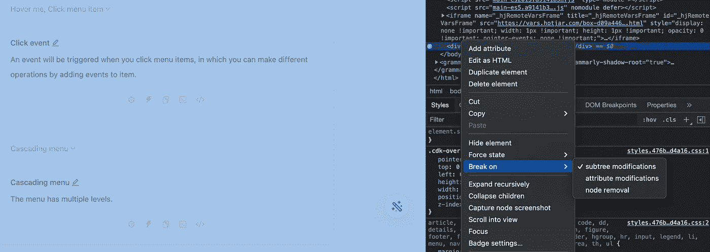
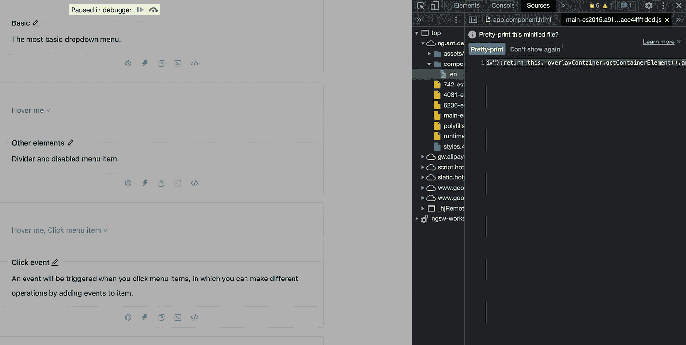
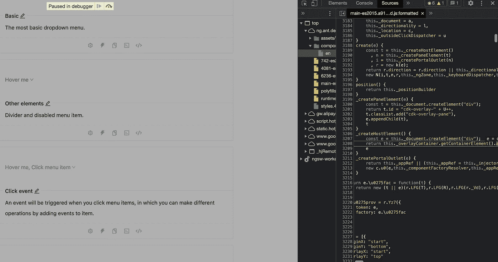
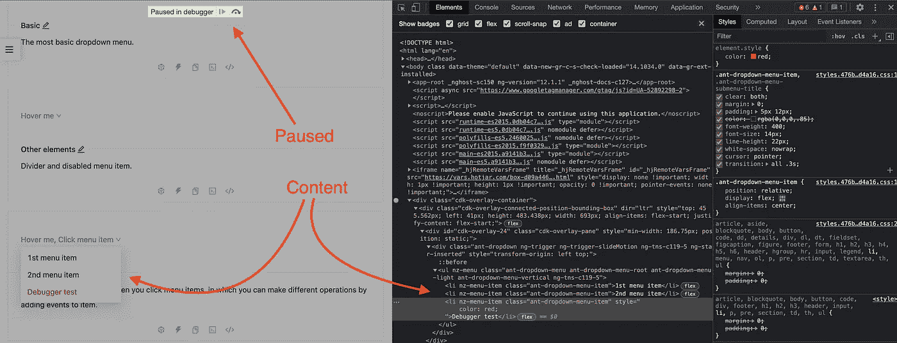

# 如何检查角度 CDK 库中的覆盖组件

> 原文：<https://itnext.io/how-to-inspect-overlay-components-in-angular-cdk-libs-b45ed06d447e?source=collection_archive---------2----------------------->

# 动机

我在其中一个应用程序中使用 Ng-zorro 库的[下拉组件](https://ng.ant.design/components/dropdown/en),我在想为什么在浏览器开发工具中检查动态添加的组件和应用一些样式会不舒服？例如，当我们将鼠标悬停在下拉菜单上并移动到浏览器检查器时，下拉菜单的内容就会消失。下拉列表的内容是动态创建的，并放置在 DOM 中。当鼠标悬停在下拉菜单上时，它将从 DOM 中移除。这种行为在具有角度 CDK 的库中的工具提示、模态、对话框和其他浮动面板中很常见。

来自 Ng-Zorro 库的下拉列表

在这篇文章中，我想描述我的解决方案，如何使用浏览器开发工具在带有[角度 CDK](https://material.angular.io/cdk/categories) 的库中检查覆盖组件。我将用 Ng-zorro 库中的一个[下拉示例来展示这一点，因为我有一个关于它的任务。](https://ng.ant.design/components/dropdown/en)

# 查找覆盖组件

呈现在页面底部的覆盖组件:

CDK-覆盖-容器

当我们悬停在下拉菜单上时，我们可以看到在 **cdk-overlay-container** 中添加了“一些东西”:

一些东西被添加到覆盖图中

如果我们能够在鼠标悬停在下拉菜单上的瞬间冻结时间，那该有多好。所以我们可以直接在开发工具中检查和修改内容。

# 调试子树修改

我们可以在覆盖 div 中修改 DOM 的时候运行一个调试器。我们可以通过开发工具的“子树修改”选项来实现。您可以在 **cdk-overlay-container** 的上下文菜单中找到该选项:

中断>子树修改

我们将启用此选项，并分析所有在 **cdk-overlay-container，**中发生变化时触发的操作，以便我们可以找到从 DOM 中分离覆盖内容的操作:

为覆盖中的子树修改启用调试器

再次悬停下拉菜单。代码将在调试器中暂停:

在调试器中暂停

按下“美化”,你会看到或多或少可以理解的代码:

我们将看到调用了 **createHostElement** 方法。大概这个方法的配合就是动态创建一个下拉列表。现在，我们需要在销毁下拉内容之前找到一些将被调用的方法。然后在其中设置一个断点。我们需要使用调试器检查所有设置的断点，并找到一些类似于“分离”的方法。

# 分离覆盖组件

在调查并找到 **detach** 事件后，我们可以在这里设置断点:

现在，当你完成断点队列并重复悬停时，当你从下拉菜单移动光标时，屏幕将被冻结。在此帮助下，您可以转到 Elements 选项卡，检查 overlay 中的元素，并尝试在浏览器中测试您的样式或其他逻辑。什么也不会消失:

您可以检查内容并将鼠标移动到屏幕的任何部分

# 摘要

这种方法不仅适用于有角度的 CDK 库，也适用于其他框架和库。要点是调试您的代码，并为删除覆盖组件的事件设置断点。