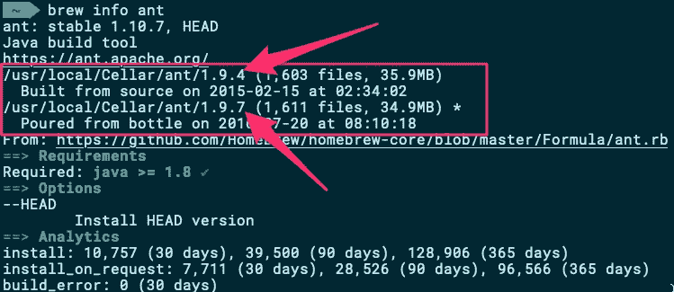
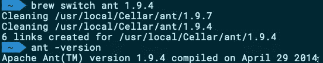
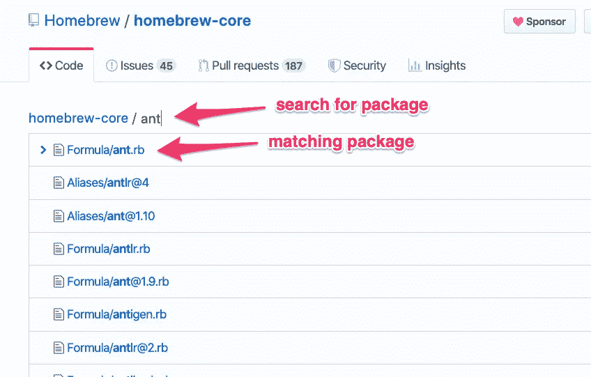
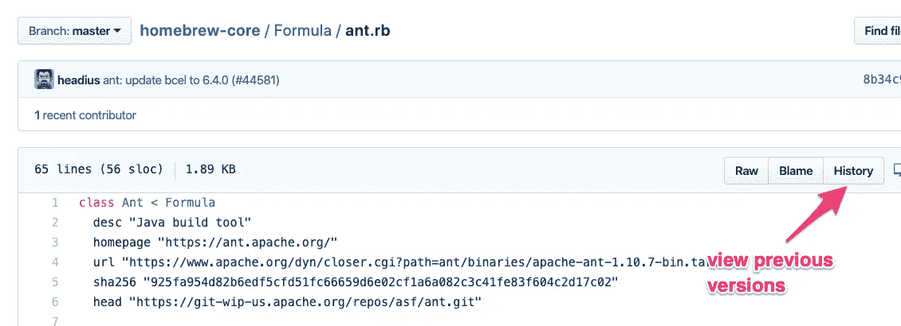
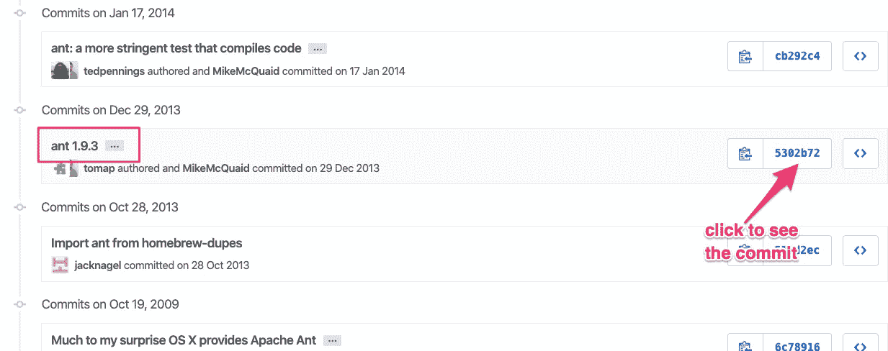
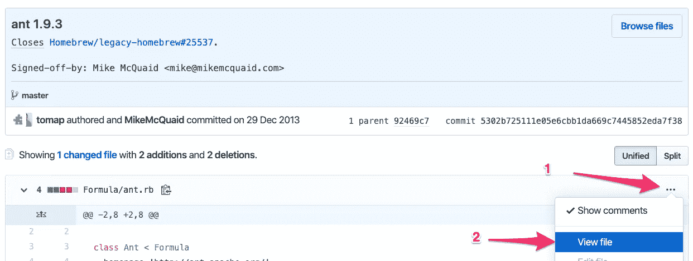
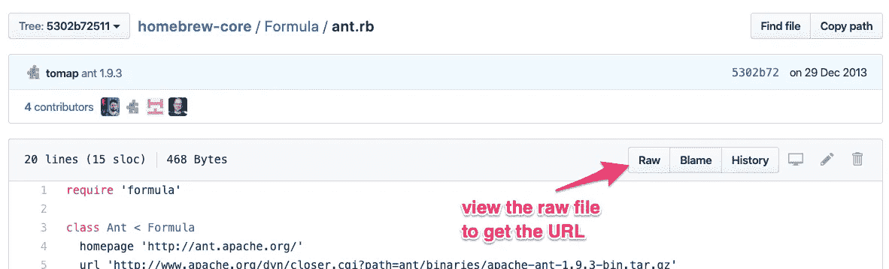

# 如何安装旧的 Brew 软件包

> 原文：<https://itnext.io/how-to-install-an-older-brew-package-add141e58d32?source=collection_archive---------0----------------------->


由[埃文·德沃金](https://unsplash.com/@evphotocinema?utm_source=medium&utm_medium=referral)在 [Unsplash](https://unsplash.com?utm_source=medium&utm_medium=referral) 上拍摄的照片

## 切换到过去的特定 Brew 配方版本

App Store 的简洁是苹果公司的天才之举，它简化了向最终用户交付软件的过程(并在此过程中赚了一大笔钱)。然而，并不是所有的应用程序和工具都能进入应用商店。对于所有这些非 App Store 特权软件，您需要从源代码构建它们或者通过第三方包管理器安装它们。这里是 [MacPorts](https://www.macports.org) 、 [Fink](http://www.finkproject.org/) 和 [Homebrew](https://brew.sh/) 填补空白的地方:

> Homebrew 是一个免费开源的软件包管理系统，它简化了在苹果 macOS 操作系统和 Linux 上安装软件的过程。这个名字意在暗示根据用户的喜好在 Mac 上构建软件的想法。

# 安装最新的软件包:简单

用`brew`安装再简单不过了。[搜索](https://formulae.brew.sh/)你需要的包，输入`brew install <package-name>`，就这样。几秒钟后，Homebrew 将选择与您的 macOS 相匹配的软件包的正确版本，并将其提供给您的 CLI。

家酿将使新安装的软件包可以在你的默认路径中访问，当你刚刚安装的软件包与苹果提供的软件包冲突时，它足够聪明地不这样做。

# 安装旧的软件包:不那么容易

不幸的是，家酿没有提供一个简单的，开箱即用的方法来安装旧版本的软件包。如果出于某种原因，您发现自己需要一个旧版本，您必须首先执行一些准备性的手动步骤。

## 安装您过去拥有的版本

如果你想换回的旧版本已经被自制软件安装过了，你很幸运。您可以通过发出以下命令来查看本地可用的版本:

```
brew info <package-name>
```

这里有一个[和](https://ant.apache.org/)的例子(为了不跑题，姑且说这些天有更好的[、](https://maven.apache.org/)[现代](https://gradle.org/)选择):



列出本地可用的自制软件包

选择一个现有的本地版本，并通过以下方式切换到该版本:

```
brew switch <package-name> <version>
```



切换回以前安装的旧版本

## 安装以前从未安装过的旧版本

这是事情变得更加复杂的地方。由于 Homebrew 没有提供任意选择一个版本进行安装的命令，所以你必须手动在 Homebrew 的 GitHub 资源库中找到你需要的版本，将 URL 复制到其中，并将其作为参数进行手动安装。

让我们看看如何做到这一切。

1.  去 https://github.com/Homebrew/homebrew-core/find/master[的](https://github.com/Homebrew/homebrew-core/find/master)，输入你要找的包的名字(我用`ant`包举例):



搜索自制软件包

2.点击以`.rb`结尾的匹配套餐公式，然后点击*历史*按钮查看其先前版本:



查看以前版本的自制公式

3.找到您想要的版本，然后单击提交 ID:



找到版本并查看各自的提交

4.单击省略号按钮“…”，选择“查看文件”，然后选择“原始文件”:



查看文件的完整源代码



获取的 URL。您需要的版本的 rb 文件

5.将浏览器中的(原始)URL 复制到剪贴板中。

6.最后，您可以通过执行以下命令来安装您在上面找到的版本:

```
brew install <raw-url>
```

Homebrew 允许你快速安装默认 macOS 发行版中没有的软件包，也不能从 App Store 下载。遵循这个指南，您可以从家酿安装任何版本，现在或过去。