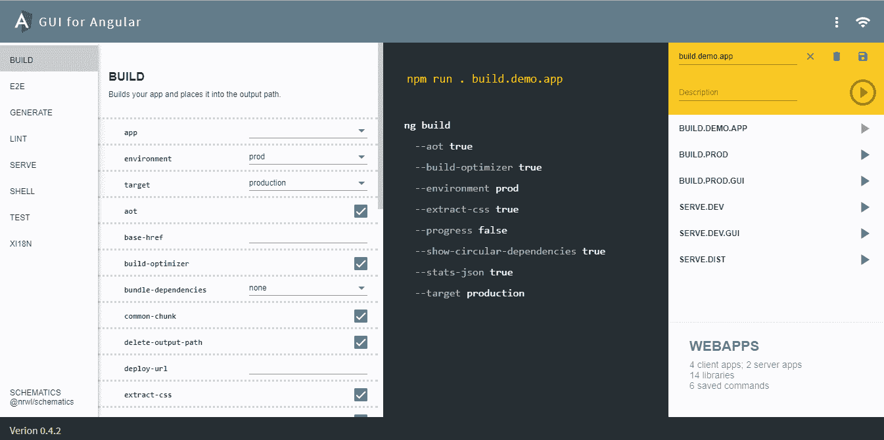

# 如何安装和使用 Angular CLI

> 原文：<https://itnext.io/how-to-install-and-use-the-angular-cli-ac8b5aae1d05?source=collection_archive---------3----------------------->

## 下面是安装 Angular CLI 并构建您的第一个 Angular 应用程序的分步指南


角度 CLI。

到底是什么？它的目的是什么？

也许更好的问题是*你能用 Angular CLI 做什么？*

本 Angular CLI 指南将向您介绍有关 Angular CLI 的所有知识。我们将介绍如何安装 Angular CLI，不同的 Angular CLI 版本，如何使用 Angular CLI 创建组件和整个 bang。

是的伙计。我将向你展示如何抓住 Angular CLI 的角，让它服从你的命令。🥳

[](https://school.danielk.tech/course/unleash-your-angular-testing-skills?utm_source=medium&utm_medium=banner&utm_campaign=unleash_testing_skills)

# 什么是角度 CLI？

Angular CLI 是由 Angular 团队创建的工具，用于管理、构建、维护和测试您的 Angular 项目。

你可以把它想象成棱角分明的框架的瑞士军刀。

Angular CLI 是一个命令行工具，可能会让你抱怨，因为你想要的是“T3”易于使用的。😋

实际上，有一个 [Visual Studio 代码扩展](https://marketplace.visualstudio.com/items?itemName=sasxa-net.angular-gui#:~:text=GUI%20for%20Angular%20helps%20you%20manage%20your%20Angular,allowing%20you%20to%20excute%20CLI%20commands%20from%20browser.)可供下载和安装。它添加了一个 GUI 界面，您可以使用它来代替终端。



然而，本指南特别关注通过命令行使用 Angular CLI，因为这是使用这一强大工具的最佳方式。

# 我必须使用角度 CLI 吗？

现在我们知道了 Angular CLI 是什么，也许您想知道是否必须使用它才能成为 Angular 开发者？

答案其实是*不，你不用* ***非得*** *用 Angular CLI* 。但是如果你不使用它，你将会是一个…嗯…愚蠢的有棱角的开发者。🙀

为什么？

因为 Angular CLI 的创建是为了将**你**变成一台高效的 Angular-cranking-code-machine，并自动完成所有耗时的任务。它生成初始角度应用程序，包括一个`.gitignore`文件。并生成应用程序的所有核心部分，如框架模块、组件等...以及处理测试、构建和其他常见操作。

好的，伙计！即使不必要，你也最好使用 Angular CLI。

# Angular CLI 版本

Angular CLI 的第一个测试版于 2017 年发布。自从 450 多个版本出现以来。

随着 Angular framework 的每一个新版本的发布，都会发布一个新的 Angular CLI 版本。因此，如果您使用 Angular 12，那么也会有 Angular CLI 12。这并不意味着 Angular CLI 版本必须与您的 Angular 项目版本相同。更多时候他们不是。您可以使用与 Angular 项目版本不同的 Angular CLI 版本。

# 如何安装 Angular CLI

在安装 Angular CLI 之前，您需要安装 [Node.js](https://node.js.org) 。

如果你用的是 Windows 或者 Mac [在这里](https://nodejs.org/en/download/)下载。对于喜欢 Linux 的人来说，[这里是安装 Node.js 的最好方法](https://github.com/nodesource/distributions)。

现在您已经安装了 Node.js，打开命令提示符或终端并键入以下命令。

```
npm install -g @angular/cli
```

这就是如何在全球范围内安装 Angular CLI。

当然，您需要将 Angular CLI 更新到最新版本。你是怎么做到的？

```
npm update -g @angular/cli
```

我们已经在全球范围内安装了 Angular CLI，这意味着它是作为一个工具安装的，您可以在机器上的任何地方使用。有趣的是，当我们创建一个新的 Angular 应用程序时，CLI 也将安装在本地，这意味着 Angular CLI 安装在 Angular 应用程序的 _node *modules/* 文件夹中，并且可用。

# 如何使用 Angular CLI

既然我们已经安装了 Angular CLI，那么如何使用它呢？

打开终端或命令提示符并运行此命令，查看 Angular CLI 的基本选项和可用命令。

有关特定命令的更多细节，您可以键入命令名，后跟`--help`。例如...

…将为您提供创建新角度应用程序的所有命令标志、详细信息和选项。

# 如何使用 CLI 创建角度应用程序

从头开始创建一个基本的 Angular 应用程序，生成所有的文件，安装所有的依赖项，等等……将会花费大量的时间。可能几天。

对于 Angular CLI，这是一个简单的命令。简单到足以让你吞下口香糖。

```
ng new MyApplicationName
```

这将为我们创建所有需要的文件并下载所有的依赖项，而我们则坐在椅子上喝咖啡。😎

是的，伙计，你最好用角度 CLI。😃

# 如何使用 CLI 启动 Angular 应用程序

既然我们已经创建了 Angular CLI，那么我们该如何开始呢？

第一步是通过命令行输入新目录。在我的情况下，这是我需要的命令。

```
cd MyApplicationName
```

现在我已经进入了存储我的应用程序的目录，下面是我如何启动我的 Angular 应用程序。

这个命令将编译我的 Angular 应用程序，设置实时重载并在浏览器中启动它。

是的，伙计，你最好用角度 CLI。😃

# 如何使用 Angular CLI 创建模块

角度模块用于模块化您的角度应用。换句话说，角度模块用于将您的角度应用划分为指定的部分。你可以阅读更多关于角度模块[这里](https://angular.io/guide/architecture-modules)。

下面是创建基本角度模块的 Angular CLI 命令。

```
ng generate module MyModuleName
```

根据具体情况，您可能想要的不仅仅是一个基本的角度模块。也许你想要一个有自己路由模块的角度模块？下面是如何让 Angular CLI 为您做到这一点。

```
ng generate module MyModuleName --routing
```

是的，伙计，你最好用角度 CLI。😃

# 如何使用 Angular CLI 创建组件

下面是创建新角度组件的角度 CLI 命令。

```
ng generate component MyComponentName
```

如果出于某种奇怪的原因，您需要为这个特定的组件指定模块，那么下面是如何做的。

```
ng generate component MyComponentName --module MyModuleName
```

是的，伙计，你最好用角度 CLI。😃

# 如何使用 Angular CLI 创建自定义管道

下面是创建角度管道的角度 CLI 命令。

```
ng generate pipe MyPipeName
```

是的，伙计，你最好用角度 CLI。😃

# 如何使用 Angular CLI 创建服务

下面是创建角度服务的角度 CLI 命令。

```
ng generate service MyServiceName
```

是的，伙计，你最好用角度 CLI。😃

# 酷角 CLI 命令值得记忆

想把你的 Angular app 变成 PWA (progressive web app)？下面是怎么做的。

```
ng add @angular/pwa
```

有关于角度特征的问题吗？可能是关于角管的问题？然后使用这个命令。

```
ng docs pipe
```

这将在 Angular 文档中查询您选择的任何关键字。最棒的是，它可以读取您的本地 Angular 版本，并在文档中查找 Angular 的特定版本。如果你正在使用 Angular 8，它将检查 Angular 8 的文档，即使最新的 Angular 版本是版本 12。

以下是如何检查你的角版。这将显示本地(如果存在)和全局版本。

生成一个[路线保护](https://angular.io/guide/router#preventing-unauthorized-access)，你可以用它来保护你的路线。

```
ng generate guard your-guard
```

是的，伙计，你最好用角度 CLI。😃

# 结论

在本文中，我们介绍了什么是 Angular CLI，它有什么用，以及如何使用它。

Angular CLI 是 Angular 开发者最重要的工具。没有它，构建有棱角的应用程序就像嚼玻璃一样。

**是啊！巴迪！你最好使用角度 CLI。😃**

有问题吗？评论？不要犹豫[伸出](https://danielk.tech/contact)。

[](https://school.danielk.tech/course/unleash-your-angular-testing-skills?utm_source=medium&utm_medium=banner&utm_campaign=unleash_testing_skills)

*最初发布于*[*https://www . danielk . tech*](https://www.danielk.tech/home/how-to-install-and-use-the-angular-cli)*。*