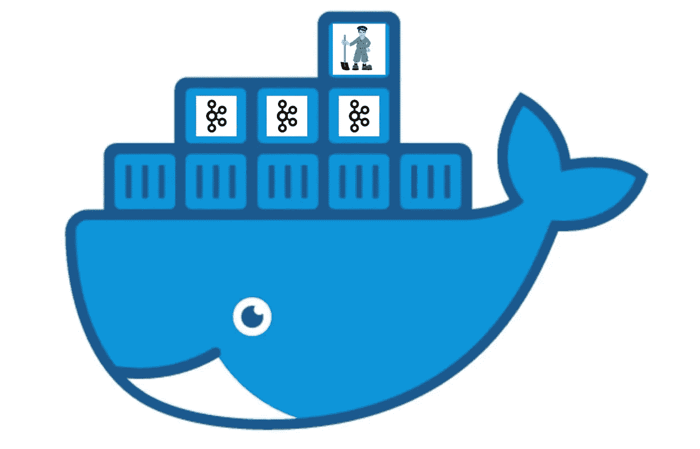
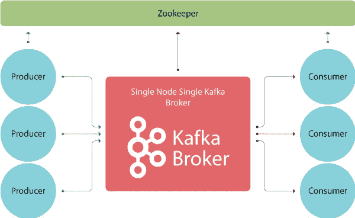
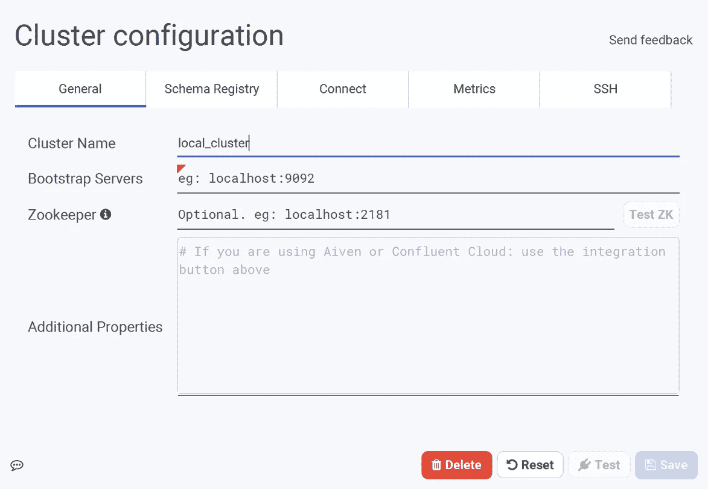

# 如何使用 Docker 安装 Kafka

> 原文：<https://itnext.io/how-to-install-kafka-using-docker-a2b7c746cbdc?source=collection_archive---------0----------------------->

## 为测试和开发目的设置 Kafka 集群



在我的上一篇文章中，我试图提供一个关于卡夫卡的能力和用法的大图。如果你想开始学习 Kafka 并测试它的特性，第一步是安装它。Kafka 是一款 [JVM](https://en.wikipedia.org/wiki/Java_virtual_machine) 应用，你只需安装 [JRE](https://sv.wikipedia.org/wiki/Java_Runtime_Environment) (你可以安装 [JDK](https://sv.wikipedia.org/wiki/Java_Development_Kit) )就可以在 Windows、macOS、Linux 等多种操作系统上运行。但是我们需要了解卡夫卡什么才能安装它呢？

# 阿帕奇动物园管理员

即使你想运行一个单一的代理 Kafka 安装或者一个巨大的集群，你也应该安装 [Apache ZooKeeper](https://zookeeper.apache.org/) 。虽然您可以使用 Kafka 发行版中包含的脚本运行 Zookeeper 服务器，而无需单独下载和安装 ZooKeeper，但最好安装完整版本的 ZooKeeper。出于测试目的，您可以安装一个独立的 Zookeeper 服务器，但是对于生产，您应该设置一个 ZooKeeper 集群。

Kafka 将关于集群和消费者的信息存储到 Zookeeper 中。动物园管理员在它们之间扮演协调者的角色。



动物园管理员与卡夫卡经纪人、消费者和生产者的关系——来自 Bitnine.net 的影像

# 什么是 Kafka broker & cluster？

在 Kafka 术语中，单个 Kafka 服务器(进程)被称为代理。代理的主要职责是:从生产者那里获得消息，将它们存储在磁盘上，并响应消费者的请求。

Kafka 代理可以是 Kafka 集群的一部分。代理可以是集群控制器，也可以不是，还可以是几个分区的领导者(所有者),并保留几个其他分区的冗余副本(用于复制)。

# 为什么是码头工人

对于开发人员、测试人员和部署人员来说，Docker 是一项革命性的技术。作为一名开发人员，docker 帮助我拥有了一个干净的操作系统，不需要直接在上面安装任何东西。另一方面，由于安装**的复杂性和依赖性**，安装一些系统或服务器非常困难，Kafka 是那些依赖 ZooKeeper 的系统之一，并且也有一些先决条件，我不想每次都设置它们。通过使用 Docker 和 Docker Compose，我们可以有一个单独的文件，允许我们运行一个测试单个 Kafka broker 或集群。

# 我们开始吧

我使用 [Bitnami](https://bitnami.com/stack/kafka) 图像为卡夫卡和ZooKeeper 创建容器:

[](https://bitnami.com/stack/kafka) [## 卡夫卡

### 关于 Bitnami Kafka Stack Kafka 是一个分布式流媒体平台，旨在构建实时管道，可以…

bitnami.com](https://bitnami.com/stack/kafka) 

Kafka 的 Bitnami 映像包含 Kafka 的最新错误修复和功能，并基于 minideb，minideb 是一个极简的基于 Debian 的容器映像(一个小的基本容器映像)。

正如我们所说，在任何情况下，如果你想安装和运行 Kafka，你应该运行一个 ZooKeeper 服务器。在使用 docker 运行 ZooKeep 容器之前，我们为集群创建了一个 docker 网络:

现在我们应该从 [Bitnami ZooKeeper](https://bitnami.com/stack/zookeeper) image 运行一个 ZooKeeper 容器:

默认情况下，ZooKeeper 运行在端口 2181 上，我们使用`-p` param 公开该端口，以便我们可以从测试主机上的客户端应用程序访问 ZooKeeper。我们将“*ALLOW _ ANONYMOUS _ log in”*配置设置为 true，因为我们希望允许用户轻松连接到 ZooKeeper(无需认证)，这种配置不适合生产使用。

如果您想确保 ZooKeeper 安装正确，并且可以从测试主机上访问，您可以使用`telnet`命令，然后使用`srvr`命令来获取 ZooKeeper 信息(如果您使用 [Docker 工具箱](https://docs.docker.com/toolbox/)，您应该使用`192.168.99.100`而不是`localhost`):

对于生产应用，您应该运行一个 ZooKeeper 实例集群(称为集成)。

现在一切都准备好了，可以运行我们的第一个代理并将其加入集群。为了向集群添加一个代理，我们需要将它引入 ZooKeeper。Kafka 代理通过了解 Zookeeper 服务器的 IP 地址向 Zookeeper 服务器(或集群)介绍自己:

我们使用“*KAFKA _ CFG _ ZOOKEEPER _ CONNECT*”配置发送 Zookeeper 服务器地址和端口，并通过将“*ALLOW _ PLAINTEXT _ LISTENER*”配置设置为 false，允许纯文本通信(例如，而不是 SSL)并设置“*KAFKA _ CFG _ ADVERTISED _ LISTENERS*”配置值，以便 Zookeeper 可以向客户端发布该代理的公共 IP 地址和端口。

现在我们有了一个单一的代理 Kafka 集群，我们可以工作和测试它。

# 使用 Kafka 桌面客户端连接到 Kafka 集群

[Conduktor](https://www.conduktor.io/) 是一个非常简单而强大的 Kafka 桌面客户端(GUI ),可以在 Mac OS X、Windows 和 Linux 上运行。为了使用 Conduktor 连接到 Kafka 集群，您需要知道至少一个代理地址和端口，并且您还可以使用 Conduktor 测试 ZooKeeper 服务器(或集群)。



Conduktor 有几个很棒的功能，例如监控 Kafka 集群状态，获取关于经纪人、主题和…的信息，创建生产者和消费者以及其他几个功能。对于测试和开发来说，它是一个非常好的工具。

您可以随时通过增加端口号向集群中添加更多代理:

# 使用 docker-compose 代替几个 docker 命令

您可以使用 docker Compose 更轻松地设置您的集群，而不是运行几个 Docker 命令来创建网络并运行 ZooKeeper 和 Kafka brokers 的容器。由于 docker-compose 会自动建立一个新的网络并将所有部署的服务连接到该网络，因此您不需要显式定义`kafka-net` network:

```
**version**: **'2'

networks**:
  **kafka-net**:
    **driver**: bridge

**services**:
  **zookeeper-server**:
    **image**: **'bitnami/zookeeper:latest'
    networks**:
      - kafka-net
    **ports**:
      - **'2181:2181'
    environment**:
      - ALLOW_ANONYMOUS_LOGIN=yes
  **kafka-server1**:
    **image**: **'bitnami/kafka:latest'
    networks**:
      - kafka-net    
    **ports**:
      - **'9092:9092'
    environment**:
      - KAFKA_CFG_ZOOKEEPER_CONNECT=zookeeper-server:2181
      - KAFKA_CFG_ADVERTISED_LISTENERS=PLAINTEXT://localhost:9092
      - ALLOW_PLAINTEXT_LISTENER=yes
    **depends_on**:
      - zookeeper-server
  **kafka-server2**:
    **image**: **'bitnami/kafka:latest'
    networks**:
      - kafka-net    
    **ports**:
      - **'9093:9092'
    environment**:
      - KAFKA_CFG_ZOOKEEPER_CONNECT=zookeeper-server:2181
      - KAFKA_CFG_ADVERTISED_LISTENERS=PLAINTEXT://localhost:9093
      - ALLOW_PLAINTEXT_LISTENER=yes
    **depends_on**:
      - zookeeper-server
```

现在，您只需执行一个命令就可以运行您的集群:`docker-compose up -d`和**等待几分钟**，然后您可以使用 [Conduktor](https://www.conduktor.io/) 连接到 Kafka 集群。如果您想在将来向这个集群添加一个新的 Kafka 代理，您可以使用以前的 docker run 命令。

# 结论

一切都准备好了，可以开始测试 Kafka 的概念，比如主题和分区，或者在其上开发您的应用程序，但是请注意，这些设置和配置只是为了测试和开发目的，而不是为了在生产环境中部署。

# ***资源***

*   [比特纳米码头工人卡夫卡](https://github.com/bitnami/bitnami-docker-kafka)
*   [卡夫卡:权威指南](https://www.confluent.io/resources/kafka-the-definitive-guide/)
*   [Conduktor](https://www.conduktor.io/)