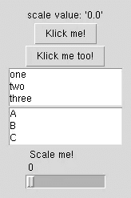

# 如何在 MacOS 上安装 simple GUI(python 3)

> 原文：<https://itnext.io/how-to-install-simplegui-on-macos-python3-f39f2242b4c0?source=collection_archive---------1----------------------->



长话短说， [simplegui](http://florian-berger.de/en/software/simplegui/) 是一个使用 Tkinter 的简化 gui 生成器。我参加了 Coursera 的一门课程，名为[Python 交互式编程入门(第一部分)](https://www.coursera.org/learn/interactive-python-1)。你可以通过使用在你的浏览器中运行 Python 程序的 [CodeSkulptor](http://www.codeskulptor.org/) 来跟踪这个练习。

或者您可以在您的机器上安装 simplegui 并运行它。在这种情况下，我将在装有 Python3 的 MacOS 机器上安装 simplegui。

我试图用 pip3 安装它，但是没有成功

```
dnguyen$ sudo pip3 install simplegui
Collecting simplegui
  Could not find a version that satisfies the requirement simplegui (from versions: )
No matching distribution found for simplegui
```

所以我不得不去 [simplegui 主网站](http://florian-berger.de/en/software/simplegui/)，下载这个包并在我的机器上运行它。

```
dnguyen$ python3 setup.py install
Traceback (most recent call last):
  File "setup.py", line 23, in <module>
    import simplegui
  File "/Users/dnguyen/Downloads/simplegui-0.1.0/simplegui.py", line 31, in <module>
    import Tkinter
ModuleNotFoundError: No module named 'Tkinter'
```

原来模块 **Tkinter** 在 MacOS 上有不同的名字，是 **tkinter** 。您可以从您的终端测试它。

```
dnguyen$ python3
Python 3.7.0 (v3.7.0:1bf9cc5093, Jun 26 2018, 23:26:24) 
[Clang 6.0 (clang-600.0.57)] on darwin
Type "help", "copyright", "credits" or "license" for more information.
>>> **import Tkinter**
Traceback (most recent call last):
  File "<stdin>", line 1, in <module>
ModuleNotFoundError: No module named 'Tkinter'
>>> **import tkinter**
>>> tkinter._test()
>>> exit()
```

所以，我做的就是打开下载的包，把所有的 **Tkinter** 替换成 **tkinter** 。之后，我重新安装 simplegui 包。瞧，:D

```
dnguyen$ sudo python3 setup.py install
Warning: the cx_Freeze module could not be imported. You will not be able to build binary packages.
regenerating MANIFEST.in for Python 2.x
/Library/Frameworks/Python.framework/Versions/3.7/lib/python3.7/distutils/dist.py:274: UserWarning: Unknown distribution option: 'executables'
  warnings.warn(msg)
running install
running build
running build_py
running install_lib
copying build/lib/simplegui.py -> /Library/Frameworks/Python.framework/Versions/3.7/lib/python3.7/site-packages
byte-compiling /Library/Frameworks/Python.framework/Versions/3.7/lib/python3.7/site-packages/simplegui.py to simplegui.cpython-37.pyc
running install_egg_info
Writing /Library/Frameworks/Python.framework/Versions/3.7/lib/python3.7/site-packages/simplegui-0.1.0-py3.7.egg-info
```

警告很少，但是让我们以后再处理它。现在，您可以尝试为此创建一个简单的测试。

```
# simplegui-test.pyimport simplegui
g = simplegui.GUI()
def buttoncallback():
    g.status("Button klicked!")
g.button("Klick me!", buttoncallback)
g.button("Klick me too!", buttoncallback)
def listboxcallback(text):
    g.status("listbox select: '{0}'".format(text))
g.listbox(["one", "two", "three"], listboxcallback)
g.listbox(["A", "B", "C"], listboxcallback)
def scalecallback(text):
    g.status("scale value: '{0}'".format(text))
g.scale("Scale me!", scalecallback)
g.run()
```

您可以在您的 MacOS 上运行这个测试，方法是在您的终端上键入以下代码

```
python3 simplegui-test.py
```

希望这有所帮助:)