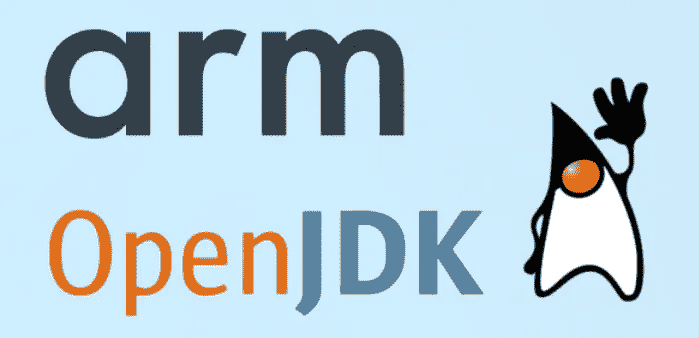
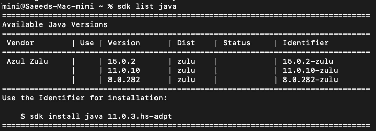
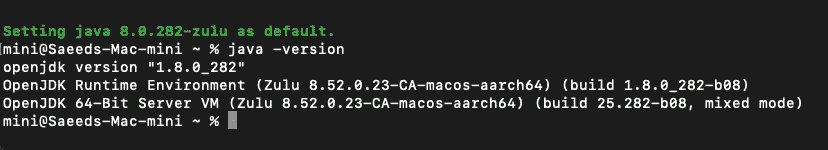
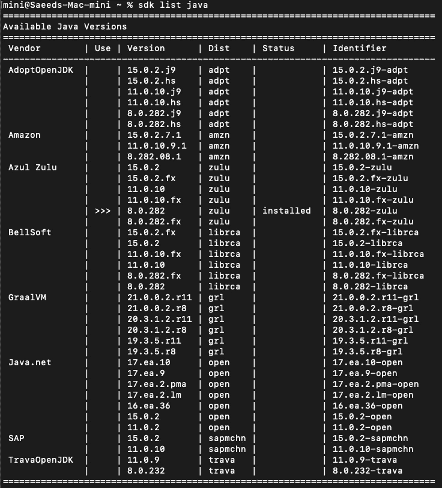

# 如何使用 SDKMAN 在 Mac M1(苹果硅)上安装 x86 和 Arm JDKs！

> 原文：<https://itnext.io/how-to-install-x86-and-arm-jdks-on-the-mac-m1-apple-silicon-using-sdkman-872a5adc050d?source=collection_archive---------0----------------------->

图片来自[微软开发者博客](https://devblogs.microsoft.com/)

过去我介绍过 [SDKMAN！](https://sdkman.io/)作为一个伟大的工具，安装和管理不同版本的 JDK 从不同的供应商很容易。

 [## 在你的操作系统上并行安装几个版本的 JDK、格拉德、科特林、Scala、Spark 和……

### 通用软件开发工具包管理器

itnext.io](/install-several-versions-of-jdk-gradle-kotlin-scala-spark-and-on-your-os-in-parallel-a7de30f691ad) 

通过发布基于 Arm 架构的 Apple Silicon，以及发布基于 m1 CPU 的新 Macbook 笔记本电脑和 Mac mini，一些开发人员被吸引购买其中一款。

我们知道，很久以前 Java 和 JDK 就支持 Arm 架构，您可以在基于 Arm 的 CPU(例如 Raspberry Pi)上轻松开发和运行您的 Java 应用程序，只需安装针对 Arm 架构编译的 JDK 或 JRE。

目前，一些 OpenJDK 供应商，如 [AdoptOpenJDK](https://adoptopenjdk.net/releases.html) 、 [Azul、](https://www.azul.com/downloads/zulu-community/?package=jdk)和[微软](https://github.com/microsoft/openjdk-aarch64)在其网站上提供 OpenJDK 的 MacOS ARM 版本。

SDKMAN！从版本`5.10.0`开始在苹果芯片上支持 Arm JDKs:

 [## 为 Silicon Mac sdkman/sdkman-cli 发布添加 Rosetta 2 功能切换

### 将新配置 sdkman_rosetta2_compatbile 添加到。用于打开/关闭 Rosetta 2 兼容模式的 SDK man/etc/config…

github.com](https://github.com/sdkman/sdkman-cli/releases/tag/5.10.0) 

他们给 SDKMAN 增加了一个新的配置`sdkman_rosetta2_*compatible*`！config 文件(`.sdkman/etc/config`)来打开或关闭 SDKMAN 的 Rosetta 2 兼容模式！目前，默认情况下，此标志是打开的。

> 截至 2021 年 11 月 1 日，我们(SDKMAN！团队)已经将`sdkman_rosetta2_compatible`旗帜默认为`false`。

## 我们开始吧

首先，打开 SDKMAN！使用文本编辑器创建一个配置文件(`.sdkman/etc/config`)，并将`sdkman_rosetta2_compatible`的配置值更改为`false`。之后，你必须关闭当前终端并打开另一个终端，然后运行`sdk list java`命令。通过执行`sdk list java`命令，您将看到 Arm 架构的可用 JDK 列表。正如你在下面看到的，现在，你只有三个来自 [Azul](https://www.azul.com/downloads/zulu-community/?package=jdk) 的选项。

`sdkman_rosetta2_compatible`是 SDKMAN 的临时旗帜！团队，直到更多 OpenJDK 供应商为 Arm 发布。

您可以使用`sdk install java IDENTIFIER`命令安装一个本地 Arm JDKs。

使用 SDKMAN 安装原生 Arm JDK 后！，通过执行`java -version`命令，可以看到当前安装的 JDK 的规格:

## 在 M1 上安装基于 x86 的 JDK

如果您将配置恢复为真(`sdkman_rosetta2_compatible=true`)，那么除了本地 Arm JDKs 之外，`sdk list java`命令还会显示基于 x86 的 JDK(使用 Rosetta 2 运行)。

如果您运行`sdk list java`命令，您可以看到列表中基于 Arm 和 x86 的 JDK 之间没有任何区别，这可能是因为这个标志(`sdkman_rosetta2_compatible`)在 SDKMAN 中是临时的！而且以后还会去掉。

但是如果有另外一个专栏来标识 JDK 的架构，那将会非常有帮助。

无论如何，现在您可以使用`sdk install java IDENTIFIER`命令安装一个 x86 JDK 和一个本地的，然后您可以通过`sdk default java IDENTIFIER`命令轻松地在它们之间切换。