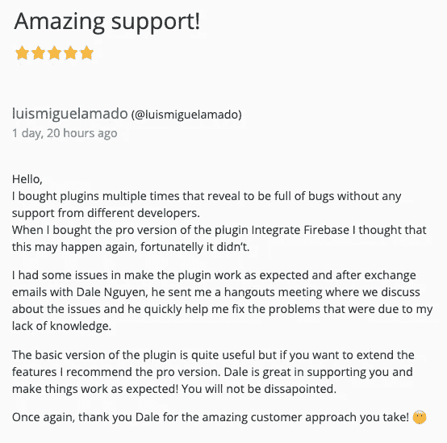
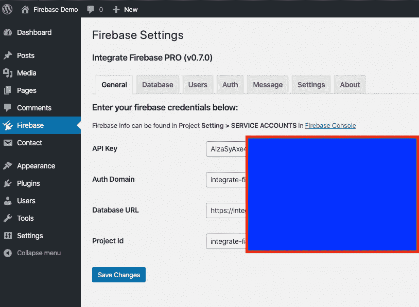

# 如何整合 Firebase 和 WordPress

> 原文：<https://itnext.io/how-to-integrate-firebase-and-wordpress-b017ee274687?source=collection_archive---------3----------------------->

> 如果你对 Integrate Firebase PRO 版本感兴趣，请阅读完整的更新文档:[https://firebase-wordpress-docs.readthedocs.io/](https://firebase-wordpress-docs.readthedocs.io/)

【https://wordpress.dalenguyen.me/】演示:[T5](https://wordpress.dalenguyen.me/)

*   第一篇: [**如何将 Firebase 整合到 WordPress**](/how-to-integrate-firebase-and-wordpress-b017ee274687)
*   第 2 篇:[如何从 Firestore 检索数据并显示在 WordPress 上](/how-to-retrieve-data-from-firestore-and-display-on-wordpress-8638854a762e)
*   第 3 篇:[如何在 WordPress 中使用 Firebase 自定义声明](https://medium.com/@dalenguyen/how-to-work-with-firebase-custom-claims-in-wordpress-aaf83965bd20?sk=85786e3739d42b18c3e2c7344bc5f436)
*   第 4 条:[将数据从 WordPress 保存到 Firebase(实时+ Firestore)](/how-to-save-data-from-wordpress-to-firebase-realtime-firestore-2eda917d01fb)
*   第五篇: [Firebase WordPress 用户集成](/firebase-wordpress-user-integration-c18a28e41cbd)
*   第六篇:[如何在 WordPress 仪表盘中管理 Firebase 用户](/firebase-users-management-in-wordpress-dashboard-61b4a1ca066#d4c2-1605c6edec5f)
*   第 7 篇:[如何将数据从 WordPress 同步到 Firebase](/sync-data-from-wordpress-to-firebase-d6e5860d3a06)
*   第 8 条:[一键登录 WordPress & Firebase 或通过电子邮件链接](https://medium.com/@dalenguyen/one-click-login-to-wordpress-firebase-or-via-email-link-d7610d71cd23)
*   第 9 条:[从 WordPress 上传文件到云存储](https://medium.com/@dalenguyen/upload-files-to-cloud-storage-from-wordpress-e8acc8ce70cd)
*   第十条:[远程 URL 登录到 Firebase & WordPress](/remote-url-login-to-firebase-wordpress-2027fad7c159)
*   第 11 条:[添加 Firebase 认证到 WordPress 的 2 种方法& WooCommerce](https://dalenguyen.medium.com/2-ways-to-add-firebase-authentication-to-wordpress-woocommerce-df500c3b104e)
*   第 12 条:[如何将 WooCommerce 购买数据发送到 Firebase](https://dalenguyen.medium.com/how-to-send-woocommerce-purchase-data-to-firebase-8c8b4c8cff39)
*   第 13 条:[从 WordPress](https://dalenguyen.medium.com/create-manage-firebase-database-from-wordpress-13347d8ffb2e) 创建&管理 Firebase 数据库

̶i̶'̶m̶̶n̶o̶t̶̶s̶u̶r̶e̶̶w̶h̶y̶̶y̶o̶u̶̶w̶a̶n̶t̶̶t̶o̶̶i̶n̶t̶e̶g̶r̶a̶t̶e̶̶f̶i̶r̶e̶b̶a̶s̶e̶̶a̶n̶d̶̶w̶o̶r̶d̶p̶r̶e̶s̶s̶.̶在与许多试图寻找将 Firebase 整合到 WordPress 网站或者相反的方法的客户合作后说道。我对业务需求和用例有了更多的理解。

为了弥补这个差距，我写了一个免费的 WordPress 插件，名为 [Integrate Firebase](https://wordpress.org/plugins/integrate-firebase/) ，和它的 PRO 版本，有更多的功能和安全性。我很高兴它确实帮助人们解决了他们的业务挑战。

这是一个开始，Firebase 可以给 WordPress 带来很多应用，比如查看或编辑数据库。或者，如果你有一个以 Firebase 为后端的移动应用，你希望用户能够通过 WordPress 控制网络上的数据库，你也可以做到这一点。

[集成 Firebase PRO](https://firebase.dalenguyen.me/) 插件的当前特性:

*   WordPress 仪表盘中的 Firebase 用户管理
*   移动应用的内容管理系统
*   从实时和 Firestore 检索数据
*   将数据保存到实时和 Firestore
*   将用户从 Firebase 同步到 WordPress
*   基于用户自定义声明的自定义内容显示管理
*   向主题发送通知
*   还有更多…

因此，如果您有任何可以在您的案例中进一步改进的想法，请通过 [github 问题跟踪器](https://github.com/dalenguyen/firebase-wordpress-plugin/issues)创建一个请求。

如何安装 Integrate Firebase 插件？

你必须登录到你的 WordPress 仪表盘，搜索集成 WordPress 插件并安装它。或者你可以直接从[Wordpress.org](https://wordpress.org/plugins/integrate-firebase/)下载插件，并将文件夹解压到你的插件文件夹。

激活插件后，需要在**设置> Firebase** 中输入 Firebase 凭证。

之后，您可以创建一个登录表单，显示数据，显示注销按钮…

请阅读 GitHub 资源库中的更多内容，以获得更多指导和新功能或问题的建议。

 [## dalen guyen/firebase-WordPress-plugin

### 一个帮助整合 firebase 到 wordpress 的插件

github.com](https://github.com/dalenguyen/firebase-wordpress-plugin) 

有了你的支持，我很高兴提高这个 Firebase WordPress 插件的能力:)

[**在 Twitter 上关注我**](https://twitter.com/dale_nguyen) 获取 Angular、JavaScript & WebDevelopment 的最新内容👐