# 如何整合 GameKit 和 Google play 服务——Flutter

> 原文：<https://itnext.io/how-to-integrate-gamekit-and-google-play-services-flutter-4d3f4a4a2f77?source=collection_archive---------2----------------------->

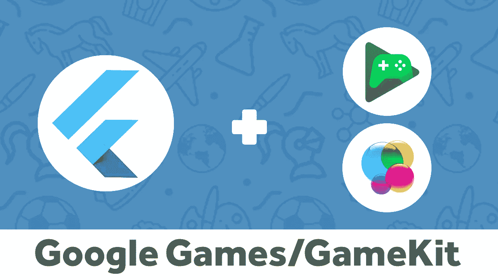

如今，商店里有数以百万计的游戏，很难与它们竞争，你在游戏中添加的任何小变化或功能都会推动它，让玩家一次又一次地回到你的游戏中。

这就是我们整合游戏中心和谷歌游戏服务等游戏服务的原因，这样我们就可以让玩家相互竞争，成为我们排行榜上的第一名，否则我们将触发用户内心的火焰，解锁所有成就并发现所有隐藏的成就。

# 这是什么？

它是苹果和谷歌的一组 API，用于简化一些游戏的基本功能，如排行榜、成就和在线比赛。

在本教程中，我将向您展示如何将 GameKit 和 Google Play 游戏服务集成到您的游戏中，这样您就可以添加成就并制作排行榜来显示顶级玩家。

# 开始吧！

在开始之前，我们需要在我们的 Android 和 iOS 项目上做一些工作，我们还需要启用这些功能，并将成就和排行榜添加到 Google play 和游戏中心。

# iOS 配置

首先，你需要打开 iOS 项目，你可以通过导航到 *ios* 文件然后右击`Runner.xcworkspace`来完成

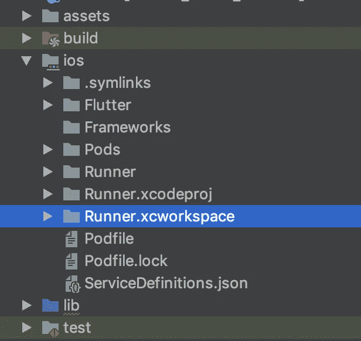

现在点击搜索器中的*显示*

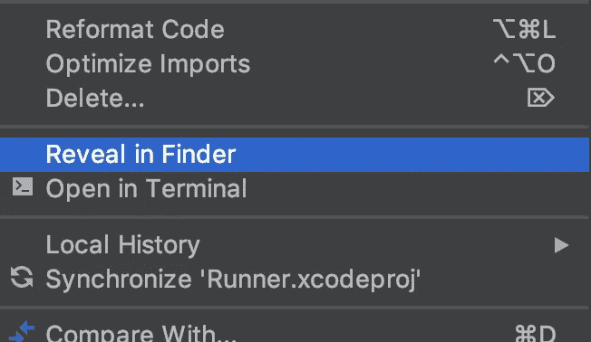

您将看到下图中的项目:

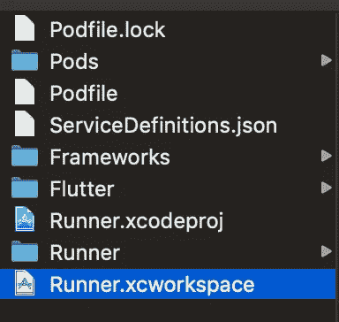

双击`Runner.xcworkspace`,然后从顶部选择项目

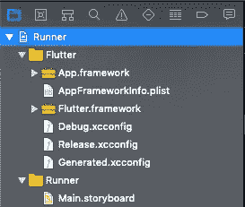

现在从右侧菜单中点击*跑步者*目标，然后选择*签名&能力*，点击*添加能力*按钮

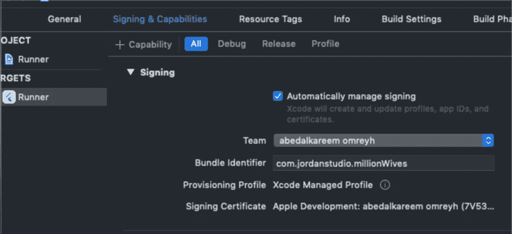

搜索*游戏中心*

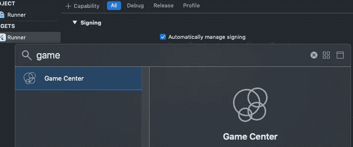

选择它。

现在你可以关闭 Xcode 了。

现在你需要进入 *iTunes Connect* ，然后选择你的应用，然后选择*功能*，然后*游戏中心*，现在从这里你可以添加一个*成就*或*排行榜*这是一个非常简单的过程。

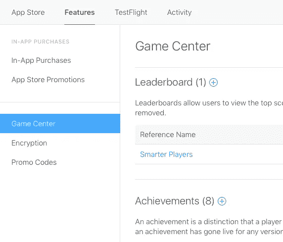

要添加新的排行榜，点击*添加图标*，然后选择*单个排行榜*，现在输入*名称*、 *id* 和*分数格式类型*，对于*分数提交类型*来说，它决定排行榜应该保留哪个分数，最新的分数还是最高的分数。最后一件事，你需要添加一种语言，进入*排行榜本地化*并点击*添加语言*，一个新的对话框将打开选择语言并输入*名称*、*分数格式*和*分数后缀*。

就像这样，我们增加了第一个*排行榜*。

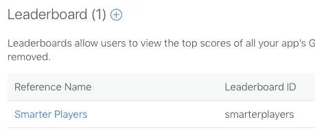

现在对于成就，几乎是同样的事情点击*添加成就图标*，输入*名称*、 *id* 和*点数*，不要忘记从*成就本地化*部分添加一种语言。

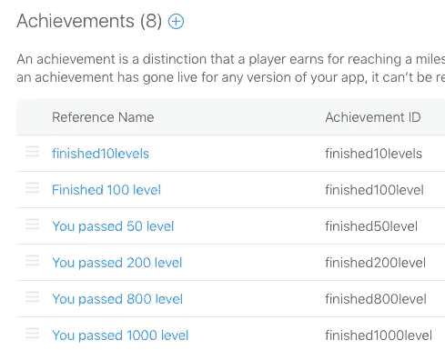

现在，就像这样，我们在 iOS 上完成了游戏的所有配置。

# Android 配置

首先，我们需要向我们的应用程序添加两个新的*元数据*，你可以通过导航到 android project manifest.xml 来完成

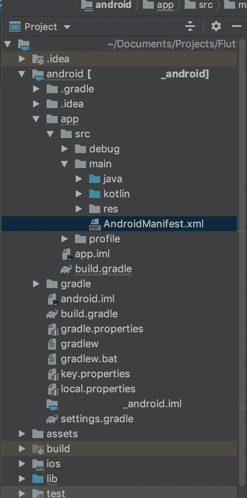

第一个元数据将有您的*应用 id* ，我们将在本教程的后面获得此 id，您将返回到这里替换您的 id，第二个元数据您将复制粘贴它。

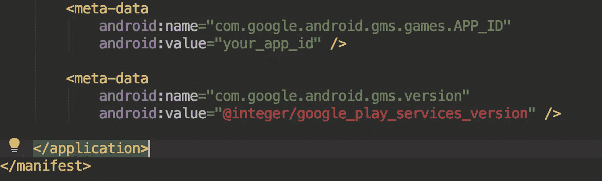

确保将元数据添加到应用程序标签中。

```
<meta-data
    android:name="com.google.android.gms.games.APP_ID"
    android:value="app_id" />

<meta-data
    android:name="com.google.android.gms.version"
    android:value="@integer/google_play_services_version" />
```

现在你需要进入 *Google play 控制台*，然后选择*游戏服务*，*添加新游戏*，输入*名称*和*类别*然后按*继续*。

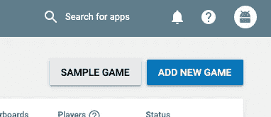

一个新游戏将被创建，进入游戏的*描述*，图标*和特征图形*。**

*获取应用程序 id 并在 android 项目`manifest.xml`中使用它。*

*接下来，你需要进入*链接的应用*，点击*安卓*，然后输入你的*包名*，再点击*保存并继续*。*

*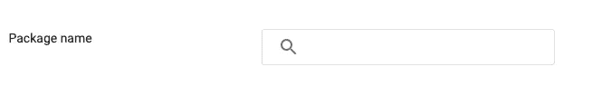*

*现在，点击*现在授权你的应用*按钮，一个对话框会询问你`*SHA1*` *，*你可以通过执行下面的命令行获得`SHA1`。*

```
*keytool -list -v -keystore ~/.android/debug.keystore -alias androiddebugkey -storepass android -keypass android*
```

> *这个`SHA1`是调试`SHA1`，当你在 google play 上发布你的应用时，你需要获得产品`SHA1`。*

*进入*发布*，然后点击*发布你的游戏*。*

*现在，我们需要添加一个新的排行榜，方法是转到*排行榜*，然后点击*添加排行榜*，输入排行榜名称，添加图标，然后保存。*

*要添加成就，请转到*成就*和*添加新成就*，输入成就的*名称*、*描述*和*图标*，然后点击保存。*

*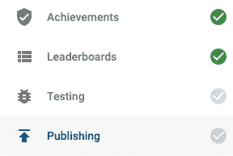*

*现在，你需要再次点击*发布你的游戏。**

*最后一件**重要的**事情！*

> *您确实需要使用 [Google 云平台 API 管理器](https://console.developers.google.com/)来启用您想要的 OAuth APIs。你还需要启用[谷歌人 API](https://developers.google.com/people/) 。*
> 
> *确保您已经填写了控制台中 [OAuth 同意屏幕](https://console.developers.google.com/apis/credentials/consent)的所有必填字段。否则，您可能会遇到`APIException`错误。*

*就这样，我们在 Android 上完成了我们游戏的所有配置！。*

*我知道！现在你觉得做所有这些配置很累，你渴望编码，我完全理解你，但等待最后一件事！*

# *游戏服务*

**

*`games_services`是我做的一个 flutter 插件，用来支持游戏中心和 google play 游戏服务。因此，您可以轻松地登录用户，提交分数，解锁成就，显示排行榜屏幕和成就屏幕。*

*要将插件添加到你的项目中，导航到`pubspec.yaml`，然后将游戏服务添加到应用依赖项中。*

```
*games_services: any*
```

*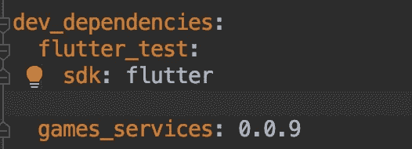*

*现在按下*上的包获取*，它将在右上方。*

*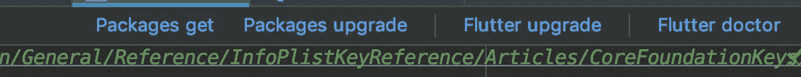*

# *密码！*

*您需要做的第一件事是在做任何事情之前登录用户，您可以通过调用*

```
*GamesServices.*signIn*();*
```

*不要忘记导入插件。*

```
*import 'package:games_services/games_services.dart';*
```

*可以调用`initState`方法中的签到函数。*

*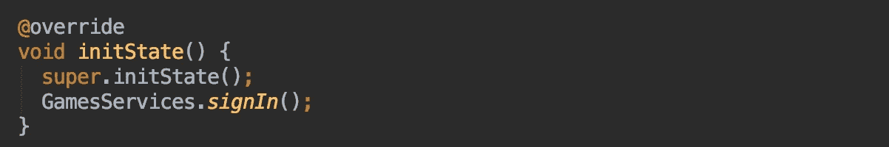*

# *排行榜屏幕*

*要显示排行榜屏幕，您只需调用`*showLeaderboards*` *功能**

```
*GamesServices.*showLeaderboards*(
    iOSLeaderboardID: "ios_leader_board");*
```

*您可以从 iTunes connect 获得`iOSLeaderboardID`(如果您记得我们为 iOS 创建了一个新的 leader board，您可以将该 leader board id 放在这里)。*

*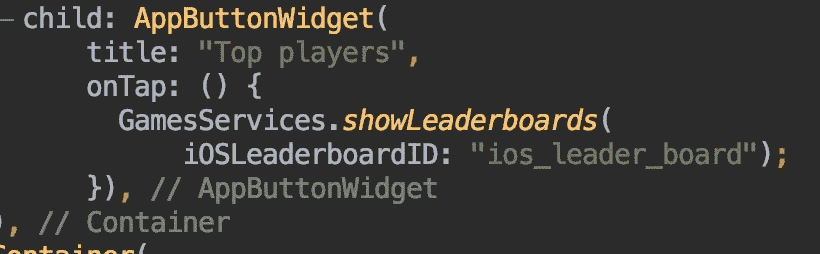*

***结果:***

*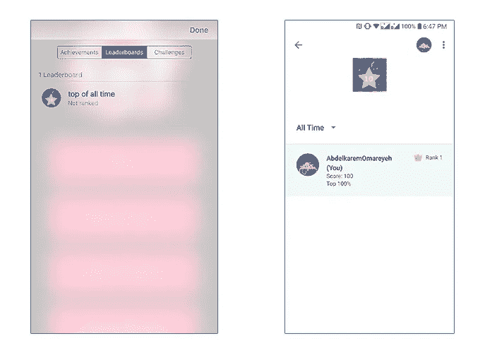*

# *成就屏幕*

*要显示成就屏幕，您需要调用`*showAchievements*` *函数**

```
*GamesServices.*showAchievements*();*
```

*当你调用它时，一个新的屏幕将会打开，并显示成就列表。*

***结果:***

*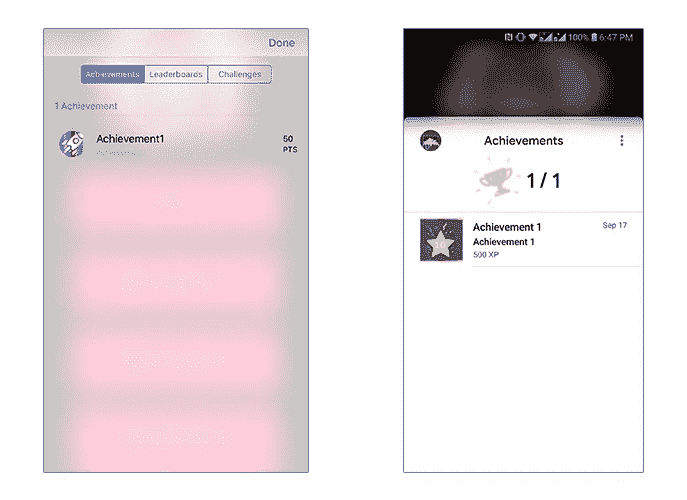*

# *提交分数*

*要提交一个`Score`到一个特定的引导板，你需要创建一个`Score`对象，并使用`*submitScore*` 函数发送它。
-`Score`类带三个参数:
-`androidLeaderboardID`:Android 情况下要发送分数的排行榜 id。
-`iOSLeaderboardID`iOS 情况下要发送分数的排行榜 id。
- `value`比分。*

```
*GamesServices.*submitScore*(
    score: Score(
        androidLeaderboardID: "android_leaderboard_id",
        iOSLeaderboardID: "ios_leaderboard_id",
        value: score));*
```

# *解锁成就*

*要解锁一个`Achievement`，需要向`unlock`函数发送一个`Achievement`对象。*

*`Achievement`有三个参数:
-`androidID`Android 的成就 id。
-`iOSID`iOS 的成就 id。
- `percentComplete`业绩的完成百分比，在 iOS 的情况下该参数可选。*

```
*GamesServices.unlock(achievement: Achievement(androidID: 'android_id', iOSID: 'ios_id', percentComplete: 100));*
```

**注意:iOS 需要* `*percentComplete*` *，android 不需要。**

*我在自己的游戏中试用了这个插件，它运行得非常好。要检查我的游戏:*

# *准备出发！*

*你的游戏现在已经准备好了，你可以发布新的更新给你的玩家，让他们享受这些新功能！。*

*如果你有任何问题，你可以在下面添加评论，或者在 Twitter 或 facebook 上给我发消息。*