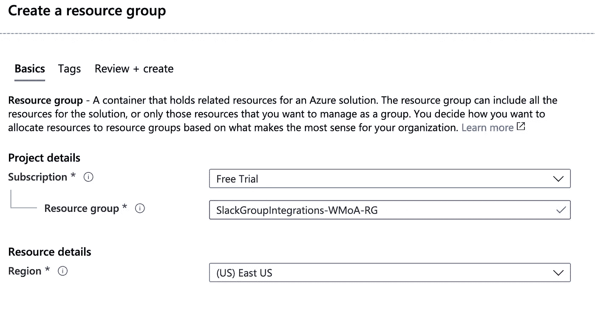
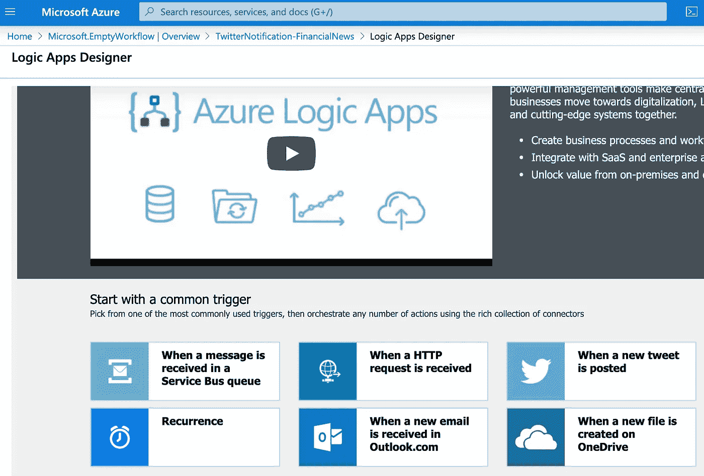
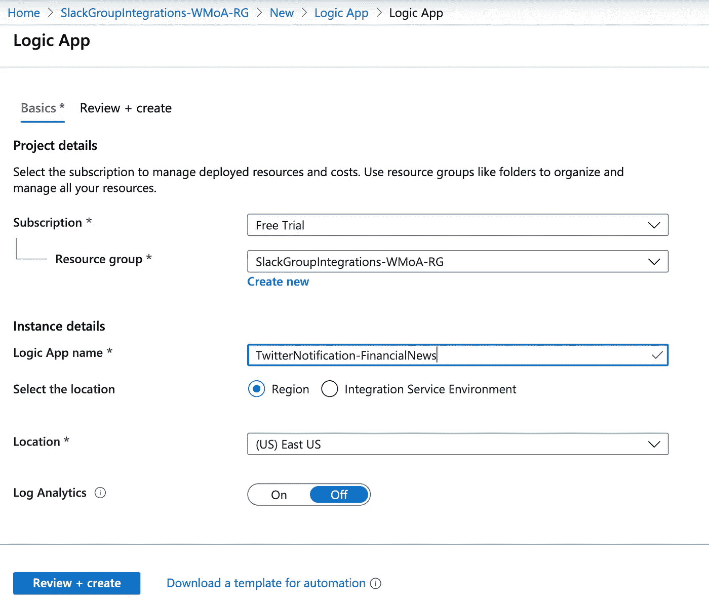
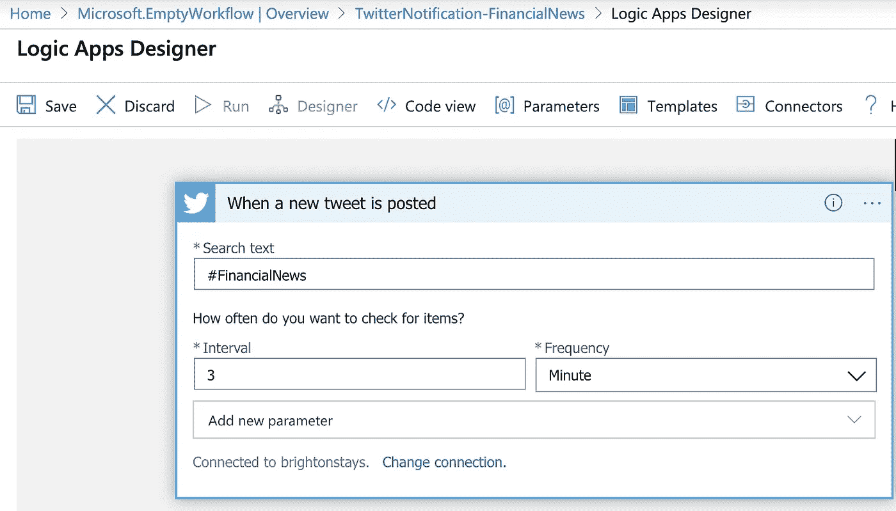
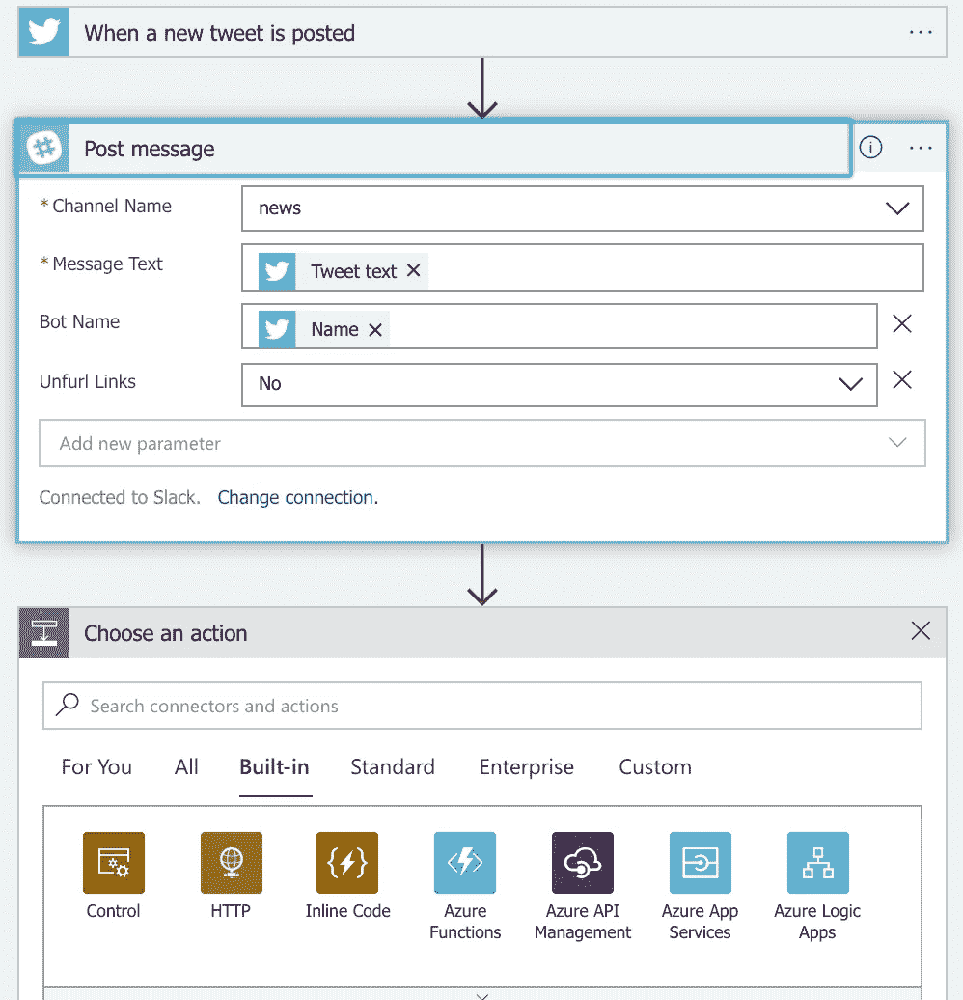

# 如何使用 Azure Cloud Logic 应用将社交媒体通知流式传输到您的 Slack

> 原文：<https://itnext.io/how-to-integrating-custom-social-media-event-streams-with-azure-cloud-for-your-slack-514fe40fe758?source=collection_archive---------4----------------------->

我们生活在动荡的时代。我们需要信息，正确的信息。

**信息很重要。
那么背景就很重要了。
时机很重要。**

你看，我经营着一个小型的 Slack 集团，旨在为**金融精明的投资者** *(都是一个词)*

在我们的小组中，我们讨论新闻、机遇和策略。这是一种爱好——但不是理财建议——:D

****挑战**是确保我们作为一个群体**跟上相关社会和经济发展的**——这是我们在更多相关渠道详细讨论的内容。我们有**#加密#股票#购买-出租#经济**频道等等。**

**有许多 slack 集成可用(付费)，但我的目的是在 Slack 上的相关 **#updates** 或 **#news** 频道中获得更多**定制** **Twitter** 更新，没有太多编码、faff，而且预算很少。因为它很聪明，所以只需为运行它所需的资源付费。我照做了。算下来，我所有的流媒体需求每月大约需要 0.40 美元。不过还是说说细节吧。**

**这就是我如何创建我的客户 twitter-to-slack feed 的，这就是 Azure Cloud 提供其手动产品的地方— [一个**逻辑应用**](https://azure.microsoft.com/en-gb/services/logic-apps/) 。这个方便的云功能提供了一个易于遵循的界面，它有一个非常棒的支持集成列表，Twitter 和 Slack 集成是其中的一部分。接下来您要做的是调整和定制 UI 中的配置以满足您的个人需求，就像我下面的集成示例步骤一样；**

# **操作指南**

**你可以在你自己的 Azure 账户中复制这一点——你可以在你的试用账户中获得 [150 英镑的初始资金进行实验，因此你可以免费开始。](https://azure.microsoft.com/en-gb/free/)**

****

1.  **创建相关的资源组——这是最佳实践分组，它使您能够在一个组(也称为项目)下创建所有必要的资源。这允许在你完成演示后方便的清理，以及账单监督。**
2.  **在您刚刚创建的资源组中搜索“Logic App”。这是您探索 Azure Logic 应用程序产品和集成选项的地方。有不少；HTTP 请求事件、Twitter 事件、OneDrive 中的新文件，或者定期重复运行的事件。**

****

**3.让我们从“当新推文发布时”的 Twitter 集成开始。这只是一个基本的申请手续。完成相关性，以便您可以进入定制阶段。**

****

**4.这是有趣的部分。第一步需要您点击 Twitter 栏并登录您的 Twitter 帐户，以完成集成过程的第一步。在那之后，你会看到下面的窗口，这个窗口让你可以“扫描”twitter，使用你的账户来扫描所选择的标签(或列表),以及使用`from: @twitter-account-name`方法捕获其他 twitter 账户的输出。有一个间隔应该谨慎使用，如果某个特定的 **#hashtag** 有大量的 feed，你想稍微放松一下间隔计时器，降低这个函数的成本——因为你是按函数的运行事件收费的。(不是说特别贵)**

****

**5.这将使你的“逻辑应用程序”能够通过你的账户抓取/输入 twitter 事件。然而，它不需要也不应该在你的 Twitter 账户上发布任何东西。这应该是只读访问。**

****

**以上整合的第二块，是为你的“逻辑 App”选择后续的“动作”。在这里，您可以选择在**预约** Twitter 事件发生后您想要做的事情，转发 Twitter 文本、名称、项目等，查看列表了解全部选项。**

**同样，您使用将出现的登录窗口登录到您的 slack org，并选择您希望发布消息的渠道。您可以选择无数选项来定制将这样的消息转发到 slack 通道。按照演示，我发布到#新闻频道。但你不必就此止步。您可以继续提供这个事件管道，并在您认为合适的时候推动/改变和处理最初的 Twitter 消息抓取事件。Ps 你也可以整合多个 Twitter 账户！。**

****

**6.将匹配的 twitter 社交媒体事件消息解析到其他合适的 Azure 云产品上。也许你正在尝试构建社交媒体标签情感机器学习引擎，但不知道从哪里开始。希望这有帮助。**

****

**哦，是的(7)，由此产生的消息被转发到 slack 频道，这是一个典型的悲伤事件，唉，还有垃圾邮件标签。您将需要花一些时间来调整和清理事件管道，以清除质量方面的干扰，从而使这项工作对您来说也很好。**

**祝你好运，希望这是有帮助的！**