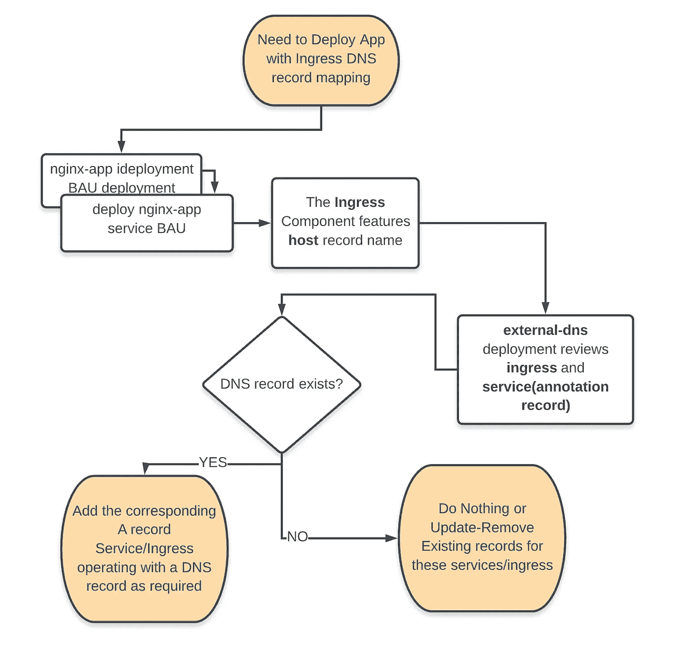

# How-to:使用 DNS 管理部署 Kubernetes 应用程序

> 原文：<https://itnext.io/how-to-kubernetes-application-deployment-with-dns-management-ddf63b559b67?source=collection_archive---------5----------------------->

当涉及到 GitOps 的工作时，在配置时要注意许多警告和各种障碍，其中之一就是 DNS 的麻烦。我已经拖了很久才得到这个 https://github.com/kubernetes-incubator/external-dns[外部 DNS](https://github.com/kubernetes-incubator/external-dns)的运行演示，唉，现在它终于来了。

它是如此的直截了当。

外部 DNS 承担所有的管理工作，将 **FQDN** 映射到服务和入口。尽管 Kubernetes 服务的 DNS 管理将需要一个公共 IP 地址，提供一个`loadBalancer`类型。这简化了 DNS 管理—随着您的 K8 服务的部署和删除，自动添加和删除记录。您可能不希望将 K8 服务与“external IP”DNS 映射一起使用，因为这将导致此类服务的 IP 供应成本。因此，我建议重用入口，主机路径路由，因为你会发现更合适。

对于大多数基础架构环境设计来说，这在很大程度上是`development`环境，也许`Staging`环境可以从版本控制和自动化的基础架构即代码供应流程中受益。



让我们来评估我们正在解决的问题— **解决我们的应用**的动态 DNS 映射配置需求。这可能是开发团队在部署和测试新的应用程序特性时所需要的。这在 *#GitOps* 环境中味道更好——在这里，您的 Git Repo 是所有自动供应的`"source of truth"`。这与**Weaveworks Flux**([https://github.com/fluxcd/flux](https://github.com/fluxcd/flux))相结合，可以自动应用你的 Kubernetes YAML 货单，为发布过程提供了很大程度的 **CD*** 。

我希望“解释它，就像对一个 10 岁的“”——用一个相当直接的演示。呃……


你会想，wowzers，对吧？别担心，其实也没那么糟:)

我希望你们这些亲身实践的读者能够复制这一成功，前提是你们确实在谷歌云 DNS 服务中映射和配置了自己的 DNS。如果是这样，尽一切办法，复制粘贴你心中的内容，并喜欢分享这些虚拟的*啤酒荣誉*。

# 您的系统要求

这可能是显而易见的，但是您将需要在运行它的系统上安装`git`、`google-cloud-sdk`和`kubectl`

已经尝试过了，现在设置这个。它相当简单，在服务供应方面有一些预期的 K8 和 GCP 延迟。当你自己进行复制粘贴测试时，请记住这一点。


展示一下 YAML 的魔力吧！

# 飞行前计划和健全性检查

我希望你有一个由谷歌云 DNS 管理的 DNS 名称，并在你复制的项目中启用云 DNS API。此外，我们将首先设置 DNS 区域管理，然后继续全新的集群设置。详情请关注进度。

*   我的测试域区域是`jpworks.squadzero.io`
*   确保正确的 NS 服务器映射到`jpworks.squadzero.io`区域的 google Cloud DNS 区域。

# 该过程

然而，这是一个工作演示，基于我的 GCP 项目名和我的域区域。您的设置会有所不同，因此请确保更新全局变量以及外部 DNS 部署参数列表。

# 设置全局 VAR

```
## This global will be used throughout the copy-paste scripts
## CHANGE THIS as required
PROJECT=jaroslav-pantsjoha-contino 
CLUSTER_NAME=jpworks-cluster
```

# DNS 区域

如果您还没有手动设置它，您可以通过编程方式创建一个我们希望外部 DNS 管理的区域，这对于让多个集群环境管理自己的独立区域来说是一个明显的好处。

```
cloud dns managed-zones create "jpworks-demo-squadzero-io"  \
   --dns-name "jpworks.squadzero.io."  \
   --description "Automatically managed zone by kubernetes.io/external-dns"Created [https://dns.googleapis.com/dns/v1/projects/jaroslav-pantsjoha-contino/managedZones/jpworks-demo-squadzero-io].
```

## DNS 注册商更新

用您的**注册器**更新 NS 记录，如果可能的话，更早地放弃 TTL，或者只是等待通常的 24 小时，直到记录更新传播。

再次检查，查看它们是否被正确传播并反映在`dig`查询中。

```
dig NS jpworks.squadzero.io
...
;; ANSWER SECTION:
jpworks.squadzero.io.	21600	IN	NS	ns-cloud-c1.googledomains.com.
jpworks.squadzero.io.	21600	IN	NS	ns-cloud-c2.googledomains.com.
jpworks.squadzero.io.	21600	IN	NS	ns-cloud-c3.googledomains.com.
jpworks.squadzero.io.	21600	IN	NS	ns-cloud-c4.googledomains.com.
...
```

## DNS —附加区域和验证

默认视图应该包含大约 2 条记录

```
jp$ gcloud dns record-sets list --zone "jpworks-demo-squadzero-io" 
NAME                        TYPE  TTL    DATA
jpworks.squadzero.io.       NS    21600  ns-cloud-c1.googledomains.com.,ns-cloud-c2.googledomains.com.,ns-cloud-c3.googledomains.com.,ns-cloud-c4.googledomains.com.
jpworks.squadzero.io.       SOA   21600  ns-cloud-c1.googledomains.com. cloud-dns-hostmaster.google.com. 1 21600 3600 259200 300
```

**Subzone Side Note** :如果您在主 zone 中有一个**子 zone** ，您也需要告诉根 zone 在哪里可以找到这些记录。

通过在父区域添加相应的 DNS 记录，告诉父区域在哪里可以找到该区域的 DNS 记录。假设新的区域是`demo.jpworks.squadzero.io`,域名是`jpworks.squadzero.io`,并且它也托管在 Google 上，我们将做以下事情；

```
$ gcloud dns record-sets transaction start --zone "$PROJECT"
$ gcloud dns record-sets transaction add ns-cloud-e{1..4}.googledomains.com. \
    --name "jpworks.squadzero.io." --ttl 300 --type NS --zone $PROJECT"
$ gcloud dns record-sets transaction execute --zone "$PROJECT"
```

# 演示集群设置

创建默认集群-演示集群。请注意您的潜在当前群集节点池附带的范围权限—需要 CloudDNS RW —如果您没有，您将被迫创建一个新的节点池。祝你好运。

但是，为了演示的简单，我允许所有的权限范围，但是您应该根据您的需要将权限减少到“最低特权要求”。

`A basic, default spec 2 node cluster with preemptible nodes`

```
gcloud beta container --project "$PROJECT" clusters create "$CLUSTER_NAME" \
--zone "us-central1-a" --no-enable-basic-auth \
--cluster-version "1.14.6-gke.2" --machine-type "n1-standard-2" \
--image-type "COS" --disk-type "pd-ssd" --disk-size "50" \
--metadata disable-legacy-endpoints=true \
--scopes "https://www.googleapis.com/auth/cloud-platform" \
--preemptible --num-nodes "2" \
--enable-cloud-logging \
--enable-stackdriver-kubernetes --enable-ip-alias \
--network "projects/$PROJECT/global/networks/default" \
--subnetwork "projects/$PROJECT/regions/us-central1/subnetworks/default" \
--default-max-pods-per-node "110" --addons HorizontalPodAutoscaling,HttpLoadBalancing \
--enable-autoupgrade \
--enable-autorepair
```

示例创建的集群

```
Creating cluster jpworks-cluster in us-central1-a... Cluster is being deployed...⠼kubeconfig entry generated for jpworks-cluster.
NAME             LOCATION       MASTER_VERSION  MASTER_IP      MACHINE_TYPE   NODE_VERSION  NUM_NODES  STATUS
jpworks-cluster  us-central1-a  1.13.7-gke.8    34.70.157.163  n1-standard-2  1.13.7-gke.8  2          RUNNING
```

## 连接到群集

配置本地环境以使用正确的项目，并获取用于登录的群集凭据。

```
gcloud config set project $PROJECT
gcloud container clusters get-credentials $CLUSTER_NAME --zone us-central1-a --project $PROJECT
```

# 准备部署应用程序

开始:下面的完整演示 YAML 应该是你所需要的。

创建一个文件夹，将所有这些 YAML 清单复制粘贴到该文件夹中。然后恰当地`kubectl apply -f .`

现在，组件；

## 进入

重要的一点——这是入口`host`记录将被`external-DNS`应用获取的地方。这将尝试执行 A 记录映射到分配给该入口(在 GCP 上)的所提供的 IP。

```
apiVersion: extensions/v1beta1
kind: Ingress
metadata:
  name: nginx-ingress-default
  annotations:
    nginx.ingress.kubernetes.io/rewrite-target: /
spec:
  rules:
  - host: nginx.jpworks.squadzero.io
    http:
      paths:
      - backend:
          serviceName: nginx-service
          servicePort: 80
```

## Nginx 演示应用部署+服务

```
apiVersion: extensions/v1beta1
kind: Deployment
metadata:
  labels:
    run: nginx-app
  name: nginx-app
spec:
  replicas: 1
  selector:
    matchLabels:
      run: nginx-app
  template:
    metadata:
      labels:
        run: nginx-app
    spec:
      containers:
        - name: nginx
          image: nginx:1.15.7-perl
          lifecycle:
            postStart:
              exec:
                command:
                  - "sh"
                  - "-c"
                  - >
                    mkdir -p /usr/share/nginx/html/ && echo '<h1>hello world</h1><p>flux-kubernetes-demos/nginx</p>' > /usr/share/nginx/html/index.html;
          ports:
          - containerPort: 80---
apiVersion: v1
kind: Service
metadata:
  labels:
    run: nginx-app
  name: nginx-service
  annotations:
    cloud.google.com/load-balancer-type: "Internal"
    external-dns.alpha.kubernetes.io/hostname: 'nginx-svc.jpworks.squadzero.io'
spec:
  type: LoadBalancer
  ports:
  - port: 80
  selector:
    run: nginx-app
```

服务组件就是一个例子——需要`annotation`,但允许您考虑相同的 DNS 管理。我特意用“ **type=loadbalancer** ”而不是`internal` loadbalancer 子类型来维护服务，所以没有`externalIP`开销。

## 外部-DNS 部署+ rbac +服务帐户

这个演示的最后一个关键部分。

```
apiVersion: extensions/v1beta1
kind: Deployment
metadata:
  name: external-dns
spec:
  strategy:
    type: Recreate
  template:
    metadata:
      labels:
        app: external-dns
    spec:
      serviceAccountName: external-dns
      containers:
      - name: external-dns
        image: registry.opensource.zalan.do/teapot/external-dns:latest
        args:
        - --source=service
        - --source=ingress
        - --domain-filter=jpworks.squadzero.io # will make ExternalDNS see only the hosted zones matching provided domain, omit to process all available hosted zones
        - --provider=google
        - --google-project=jaroslav-pantsjoha-contino # Use this to specify a project different from the one external-dns is running inside
        # - --policy=upsert-only # would prevent ExternalDNS from deleting any records, omit to enable full synchronization
        - --registry=txt
        - --txt-owner-id=my-jpworks-demo-domainapiVersion: v1
kind: ServiceAccount
metadata:
  name: external-dns
---
apiVersion: rbac.authorization.k8s.io/v1beta1
kind: ClusterRole
metadata:
  name: external-dns
rules:
- apiGroups: [""]
  resources: ["services"]
  verbs: ["get","watch","list"]
- apiGroups: [""]
  resources: ["pods"]
  verbs: ["get","watch","list"]
- apiGroups: ["extensions"]
  resources: ["ingresses"]
  verbs: ["get","watch","list"]
- apiGroups: [""]
  resources: ["nodes"]
  verbs: ["list"]
---
apiVersion: rbac.authorization.k8s.io/v1beta1
kind: ClusterRoleBinding
metadata:
  name: external-dns-viewer
roleRef:
  apiGroup: rbac.authorization.k8s.io
  kind: ClusterRole
  name: external-dns
subjects:
- kind: ServiceAccount
  name: external-dns
  namespace: default
---
```

在下面的代码片段中，再次展示了`external-DNS`部署值得注意的特性。

**您的待办事项**:您至少需要**指定**您自己的**域区域**和**项目名称**。

```
args:
        - --source=service # explicitly select your sources
        - --source=ingress - --domain-filter=jpworks.squadzero.io # will make ExternalDNS see only the hosted zones matching provided domain, omit to process all available hosted zones - --provider=google # can be aws,azure and many others - --google-project=jaroslav-pantsjoha-contino # Use this to specify a project different from the one external-dns is running inside
        - --policy=upsert-only # would prevent ExternalDNS from deleting any records, omit to enable full synchronization - --registry=txt
        - --txt-owner-id=my-jpworks-demo-domain
```

## 让我们开始吧！

`jp$ kubectl apply -f .`

更好的是，如果你采用 **#GitOps CICD 发布-部署方法论**，你可以让 [weaveworks flux](https://github.com/fluxcd/flux) 这样的**自动** - **发布**。

如果你想了解更多，请联系我们！

回到演示，让我们看看前面提到的在群集上“全部应用”的结果。

```
jp$ kubectl apply -f .
configmap/nginx-configuration configured
deployment.extensions/nginx-app configured
service/nginx-service configured
deployment.extensions/external-dns configured
serviceaccount/external-dns configured
clusterrole.rbac.authorization.k8s.io/external-dns configured
clusterrolebinding.rbac.authorization.k8s.io/external-dns-viewer configured
```

# 现在怎么办

`external-dns`演示的完全成功展示大约需要 3-5 分钟，主要是因为 GCP 控制面板上的入口 IP 设置需要一些时间。服务和入口完全配置后，您可以在上观看演示；

同时，您可以通过以下方式监控部署进度:

```
kubectl get po -w
```

然后是服务和入口

```
kubectl get svc,ing
```

您应该在服务和入口的`External IP`上查看 IP 地址。

**例如:**

```
kubectl get svc,ing
NAME                    TYPE           CLUSTER-IP   EXTERNAL-IP   PORT(S)        AGE
service/kubernetes      ClusterIP      10.0.0.1     <none>        443/TCP        28m
service/memcached       ClusterIP      None         <none>        11211/TCP      6m49s
service/nginx-service   LoadBalancer   10.0.1.243   10.128.0.16   80:30903/TCP   26mNAME                                       HOSTS                        ADDRESS        PORTS   AGE
ingress.extensions/nginx-ingress-default   nginx.jpworks.squadzero.io   34.96.92.237   80      26m
```

让我们确认一下`external-DNS`是否也按预期工作。

```
time="2019-09-27T10:06:40Z" level=info msg="Change zone: jpworks-demo-squadzero-io"time="2019-09-27T10:06:40Z" level=info msg="Add records: nginx.jpworks.squadzero.io. A [34.96.92.237] 300"time="2019-09-27T10:06:40Z" level=info msg="Add records: nginx.jpworks.squadzero.io. TXT [\"heritage=external-dns,external-dns/owner=my-jpworks-demo-domain,external-dns/resource=ingress/default/nginx-ingress-default\"] 300"time="2019-09-27T10:07:40Z" level=info msg="Change zone: jpworks-demo-squadzero-io"time="2019-09-27T10:07:40Z" level=info msg="Add records: nginx-svc.jpworks.squadzero.io. A [10.128.0.16] 300"time="2019-09-27T10:07:40Z" level=info msg="Add records: nginx-svc.jpworks.squadzero.io. TXT [\"heritage=external-dns,external-dns/owner=my-jpworks-demo-domain,external-dns/resource=service/default/nginx-service\"] 300"
```

让我们也确认一下域 zone 是否得到了所有相关的更新，就像`external-dns`所说的那样。

```
gcloud dns record-sets list     --zone "jpworks-demo-squadzero-io" NAME                             TYPE  TTL    DATAjpworks.squadzero.io.            NS    21600  ns-cloud-c1.googledomains.com.,ns-cloud-c2.googledomains.com.,ns-cloud-c3.googledomains.com.,ns-cloud-c4.googledomains.com.jpworks.squadzero.io.            SOA   21600  ns-cloud-c1.googledomains.com. cloud-dns-hostmaster.google.com. 1 21600 3600 259200 300nginx.jpworks.squadzero.io.      A     300    34.96.92.237nginx.jpworks.squadzero.io.      TXT   300    "heritage=external-dns,external-dns/owner=my-jpworks-demo-domain,external-dns/resource=ingress/default/nginx-ingress-default"nginx-svc.jpworks.squadzero.io.  A     300    10.128.0.16nginx-svc.jpworks.squadzero.io.  TXT   300    "heritage=external-dns,external-dns/owner=my-jpworks-demo-domain,external-dns/resource=service/default/nginx-service"
```

# 看起来不错，但是可以访问吗？

不幸的是，有些出乎意料的是，第一次进行入口设置和完全配置确实需要一段时间。在后台启动了许多进程，如 IP 请求和预订，以及后端映射、IP 转发规则等等。实际上，考虑到这种方法提供了生产级可伸缩架构，这种时间延迟真的没有那么糟糕。

为了明确和公平地对待入口供应延迟，如果您确实想将一个“普通的”服务`externalIP`映射到一个记录，这将立即可用和可访问。

然后，外部流量将直接影响您的 k8 服务，在部署配置的任意数量的 pod 上负载平衡`rr`这样的流量。就是这样。没有高级功能或逻辑；没有流量路由分割、WAF 或 SSL 卸载。

只需一分钟就可以添加一个记录。

一旦 ingress 完全准备就绪，这个 nginx 应用程序将可以公开访问`[http://nginx.jpworks.squadzero.io](http://nginx.jpworks.squadzero.io)`

```
curl nginx.jpworks.squadzero.io<h1>hello world</h1><p>flux-kubernetes-demos/nginx</p>
```


是的，它就像魔术一样，拉里欣喜若狂！大家拉里·戴快乐！

最后，Nginx 服务 A 记录也被记录，但那只是`internal` DNS。通过 dig 验证基于服务的 DNS 映射以进行确认。

```
jp$ dig A nginx-svc.jpworks.squadzero.io
...;; ANSWER SECTION:
;nginx-svc.jpworks.squadzero.io.   111 IN  A   10.128.0.16
```

# 希望你喜欢这个演示

如果你觉得有用，给个赞，分享一下，给点好印象*

*下次见，*

雅罗斯拉夫·潘特乔哈

## 可选:清理

```
Nuking cluster. Be careful not to nuke anything else by accident. *“Don’t do anything I would do”*jp$ gcloud container clusters list
NAME             LOCATION       MASTER_VERSION  MASTER_IP      MACHINE_TYPE   NODE_VERSION  NUM_NODES  STATUS
jpworks-cluster  us-central1-a  1.13.7-gke.8    34.70.157.163  n1-standard-2  1.13.7-gke.8  2          RUNNING jp$ gcloud container clusters delete jpworks-cluster --zone us-central1-a The following clusters will be deleted.- [jpworks-cluster] in [us-central1-a]Do you want to continue (Y/n)?  yDeleting cluster jpworks-cluster...⠏
```

Contino 正在开展一系列激动人心的 Kubernetes 项目。如果您正在寻找最新最棒的基础架构堆栈，或者正在寻找挑战，请联系我们！我们正在招聘！

我们在各个层面寻找聪明的人。在 Contino，我们自豪地为中型企业和大型企业提供最佳实践云转型项目。

[JP](https://www.linkedin.com/in/johas/)

# 顺便说一下，👏🏻*鼓掌*👏🏻如果你喜欢这篇文章，请举手(高达 50 倍)。它鼓励我继续写作，并帮助其他人找到它:)