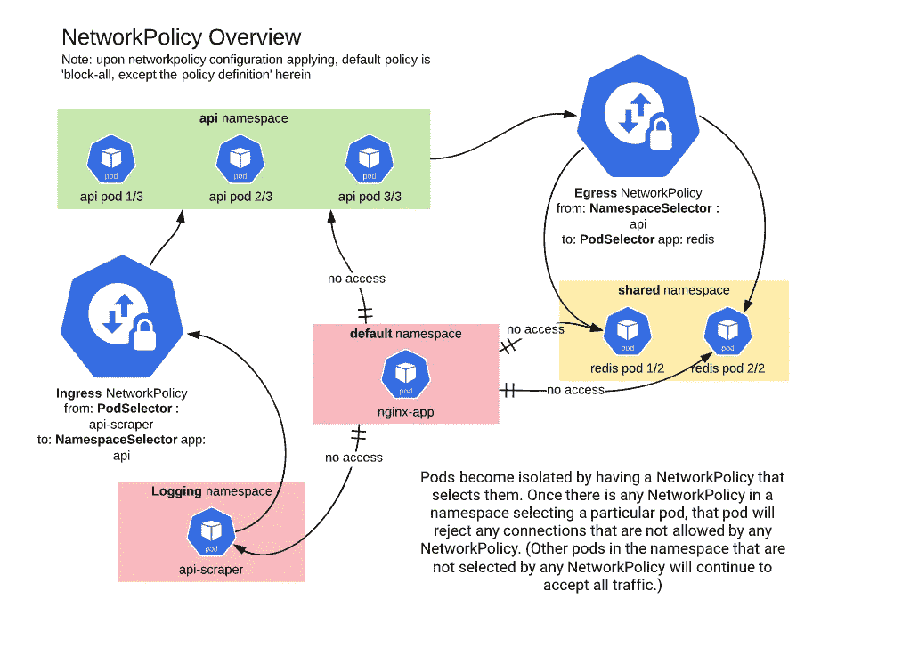

# 如何:Kubernetes 集群网络安全

> 原文：<https://itnext.io/how-to-kubernetes-cluster-network-security-f19bc99161f5?source=collection_archive---------4----------------------->

正如您现在可能已经意识到的,[任何] GKE 集群上的 POD(容器)到 POD(容器)通信对所有名称空间和所有 POD 都可用，主要限制因素是终端容器端口配置本身。否则，如果没有任何特定于容器的标头白名单，就可以不受任何限制地远程登录到其他容器端口。

这在用于质量保证和故障排除的**开发**和潜在**试运行**环境中是可以接受的，但应在生产 GKE 集群中进一步锁定



值得注意的是，虽然 GKE 集群附带了集群本地网络(IP 别名，在更大的谷歌云网络上持续存在，并受谷歌云平台防火墙规则的约束)，但鉴于 POD IP 的短暂性质，几乎没有提供粒度来管理应用程序到应用程序通信的细微差别。

默认选项以[网络策略](https://kubernetes.io/docs/concepts/services-networking/network-policies/)的形式在相关的 GKE 集群级别提供并实施。

# 防火墙规则和网络策略之间的一个重要区别是:

pod 通过选择它们的网络策略而变得孤立。一旦命名空间中的任何网络策略选择了特定的 pod，该 pod 将拒绝任何网络策略不允许的任何连接。(命名空间中未被任何网络策略选择的其他 pod 将继续接受所有流量。)

**网络策略“防火墙”方向和选择器**

您可以对两种类型的流量方向应用限制性策略，还可以使用两个选择器来选择特定的 pod 或命名空间

*   **出口** —用于离开指定 pod(通过 podSelector)或命名空间(通过 namespaceSelector)的流量
*   **入口** —用于到达指定 pod(通过 podSelector)或命名空间(通过 namespaceSelector)的流量

# 基于标记的“防火墙”网络策略示例

```
...
  ingress:
  - from:
    - namespaceSelector:
        matchLabels:
          app: api-proxy
    - podSelector:
        matchLabels:
          app: redis
  ...
```

*   默认情况下，这将把从该集群内的任何其他 POD(容器)对 POD(容器)的任何访问列入黑名单。
*   按照规定，这将把所有端口所有访问列入白名单，从名称空间:api-proxy 到标签为 app: redis 的 PODs(container ),后者可以在任何其他名称空间中。

# 精细的网络策略控制

您可以在一个 NetworkPolicy 定义中定义入口和出口规则，并对允许此类应用程序访问的端口进行一定程度的细化。

```
apiVersion: networking.k8s.io/v1
kind: NetworkPolicy
metadata:
  name: api-netpolicy
spec:
  podSelector:
    matchLabels:
      app: api
  policyTypes:
  - Ingress
  - Egress

  ingress:
  - from: [] # only accessible from the ALL on port 80
    ports:
     - port: 80
       protocol: TCP

  egress:
  - to:
    - podSelector:
        matchLabels:
          app: redis
    ports:
     - port: 6973
       protocol: TCP
  - to:
    - namespaceSelector:
        matchLabels:
          name: kube-system
      podSelector:
        matchLabels:
          k8s-app: kube-dns
    ports:
     - port: 53
       protocol: UDP
```

孔蒂诺有许多激动人心的 Kubernetes 项目。如果您正在寻找最新最棒的基础设施堆栈或寻找挑战，请联系我们！我们正在招聘，寻找各个层次的聪明人。在 Contino，我们自豪地为中型企业和大型企业提供最佳实践云转型项目。

[JP](https://www.linkedin.com/in/johas/)