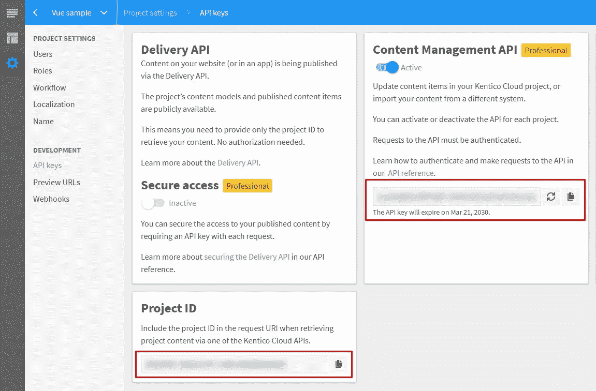
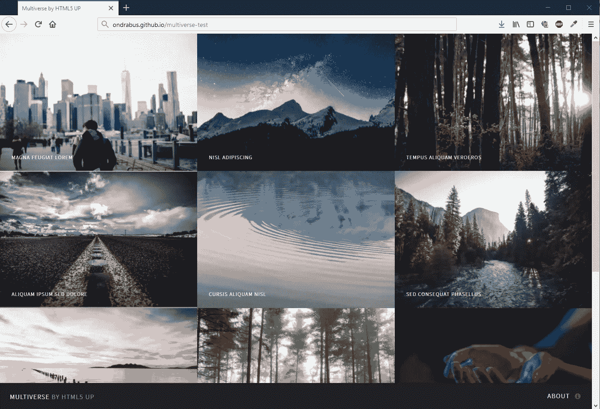

# 如何从无头网络模板中创建一个漂亮的网站

> 原文：<https://itnext.io/how-to-launch-a-beautiful-website-from-headless-web-templates-41049cbc41b4?source=collection_archive---------9----------------------->

*由 Jan Sedo 撰写—2019 年 5 月 22 日*

过去每当我面临快速创建页面的任务时，我都会使用 WordPress。我的机器上已经安装了一个支持 PHP 的服务器和一个数据库，所以我只需要创建一个新的数据库用户，做一些配置工作，然后它就工作了。几个小时到几天后，我就有了一个可以部署的工作网站。

这个过程对我来说很好，因为我有开发背景，过去经常使用 MySQL。对于我的一些前端同事来说，情况并非如此。让他们进入[phpMyAdmin](https://www.phpmyadmin.net/)(MySQL 的一个基于网络的管理界面)意味着数据库中的所有数据都处于危险之中，所以我必须为他们安装开发工具并配置他们的 WordPress 安装。另一项需要我关注的任务是将这些站点部署到远程服务器上。

反正现在已经不是 2010 年了。前端开发越来越普及，现在几乎人人都会写 JavaScript。与此同时，产生和使用网络模板的新方法也随之而来。

# 无头 CMS 的更好方法

听说过无头内容管理系统(CMS)吗？如今，我们喜欢把所有东西都放在云端，因为它更容易、更实惠，而且随处可用(前提是你有互联网连接)。使用无头 CMS 就是这样。您获得了一个现代化的内容管理界面，无需安装、维护或更新。

这为等式带来了一个全新的概念，因为您不再需要关心那个数据库。您的数据位于 headless CMS 之后，您可以使用 API 将它们拉到您的站点，这极大地释放了您的选择。由于您的内容与您的应用程序无关，网站实现变得只由前端实现本身来表示，这使您可以完全自由地使用您想要使用的技术。

# Web 模板 2.0

我已经承诺了一个更快的方法来创建简单的网站，所以足够拐弯抹角。这是一个小的模板。zip 文件:

[KC-template-multiverse-master . ZIP](https://github.com/ondrabus/kc-template-multiverse/archive/master.zip)(ZIP，4.6MB)

这个包包含了你实现一个完全响应的 HTML5 网站所需要的一切。它的第二部分是包含内容本身的数据导入包，包括内容模型和项目。你不需要了解 JavaScript 或者调用数据 API 的方法——这些都是为你准备的。此时，您离一个完整的站点只有两步之遥。你还能做什么？

1.  将内容部分导入 headless CMS 项目
2.  让你的网站知道在哪里可以找到它

**开始吧！**

# 进入肯蒂科云

上面提到过无头 CMS，Kentico Cloud 就是其中之一。有了对内容进行建模和限制、定义编辑内容的权限和简化的 UI 的能力，您和您的内容编辑人员将在这里大展身手。

就像我们习惯的其他云服务一样，你可以免费使用[无头 CMS](https://app.kenticocloud.com/sign-up)。Kentico Cloud 提供了一个名为“Starter”的永久免费计划，非常适合小型网站。一些高级功能与更高层的计划解锁，绝对值得探索，但这是一个不同的故事。如果你是 Kentico Cloud 的新手，你可以在 kenticocloud.com 的[创建一个免费账户。](https://app.kenticocloud.com/sign-up)

通常，当你安装一个 CMS，你会跳进去开始创建你的内容。然而，有了模板，我们已经有了一个良好的开端，这要感谢包中的内容。

那么怎么导入呢？Kentico Cloud 有一个 API，允许您以编程方式操作内容和模型，我们将在下一步中使用它。不过不要担心。没有必要弄脏您的手——其他人已经做了繁重的工作，所以我们可以通过一个漂亮的 UI 导入所有内容。

请务必记下您的项目 ID 和内容管理 API 密钥。你可以在应用程序的 API 键下的项目设置中找到它们。

# 导入内容

注意现在的时间。如果你花的时间超过几分钟，我会请你喝啤酒。要导入您的数据，请使用这个工具:【https://kentico.github.io/cloud-template-manager/ 

这就是模板的内容部分诞生的地方。该工具本身已经使用了 Kentico Cloud 的内容管理 API，所以您不必去弄清楚那个导入/导出脚本。

那么它到底能为我们做什么呢？

*   它可以创建数据导出包，您可以在以后导入
*   它可以在现有项目之间迁移项目
*   它可以将项目或 ZIP 包中的数据导入到新项目中

最后一个选项是我们所追求的。导出包只是一个大的数据 JSON，项目经理理解它，它包含项目中的所有内容模型和内容项。您可以将其视为某种 SQL 导入。

那么如何做导入呢？

1.  解压缩归档文件并找到数据导入包
2.  转到 KC 项目管理器工具的导入选项卡
3.  为工具提供上一段中的 API 键
4.  拖放导入包并确认导入

*注意:这个工具也是开源的，所以你可以在查看它的代码，最终你可以派生它并进行调整或者自己托管它。*

# 完成网站

当您现在打开 Kentico Cloud 时，您应该会看到所有导入的数据。最后一步，也是您需要做的唯一定制是让您的站点知道 Kentico Cloud 中项目的项目 ID。所以打开你最喜欢的代码编辑器，或者你知道，只是记事本，打开配置文件。它是哪个文件因模板而异，在这种情况下，它是/assets/js/kenticocloud.js。

就是这样！现在你可以在你最喜欢的浏览器中打开 index.html，点击你的新网站。每当你想更新一些内容时，打开 Kentico Cloud 并进行更改。你的网站会反映这些变化。

若要调整站点实现，可以编辑站点代码文件。它被分成特定的组件，所以很容易定制，很少或没有以前的知识。如果你懂一点 JavaScript，这对你来说就是小菜一碟。点击刷新后，您将立即看到您的代码更改。

# 让你的网站上线

现在，您有了一个在本地运行的网站，其动态内容易于更新和维护。待办清单上唯一剩下的事情就是向世界展示你的成就，并在网上发布。

像这样部署站点最简单的方法是将文件复制粘贴到远程服务器上。它只是一堆不需要额外配置的静态文件。如果你没有或无法访问一台服务器来托管你的新网站，也有更多的自动化部署方式和各种托管服务提供商，如 GitHub Pages、Surge 等，它们可以为你创造奇迹。如果你是一个真正的技术人员并想了解更多，[查看这篇文章](https://medium.freecodecamp.org/how-to-quickly-set-up-a-build-process-for-a-static-site-1a6e7923e105)。

# 摘要

所以你有它！一个随时可以实施的网站和一个出色的内容即服务平台，拥有您需要的所有内容管理功能，只需几次点击和文本文件编辑，全部免费。您唯一需要做的事情是将示例内容更改为您自己的数据。请随意查看我们所有模板的列表:

[Kentico 云网页模板库](https://kentico.github.io/cloud-template-manager/templates)

我们每周都会和我们优秀的社区成员一起添加新的模板，所以如果你没有立即找到适合你需要的模板，请确保每隔几天检查一次。如果你有，请告诉我们你是如何找到它的！

【https://kenticocloud.com】最初发表于**。**