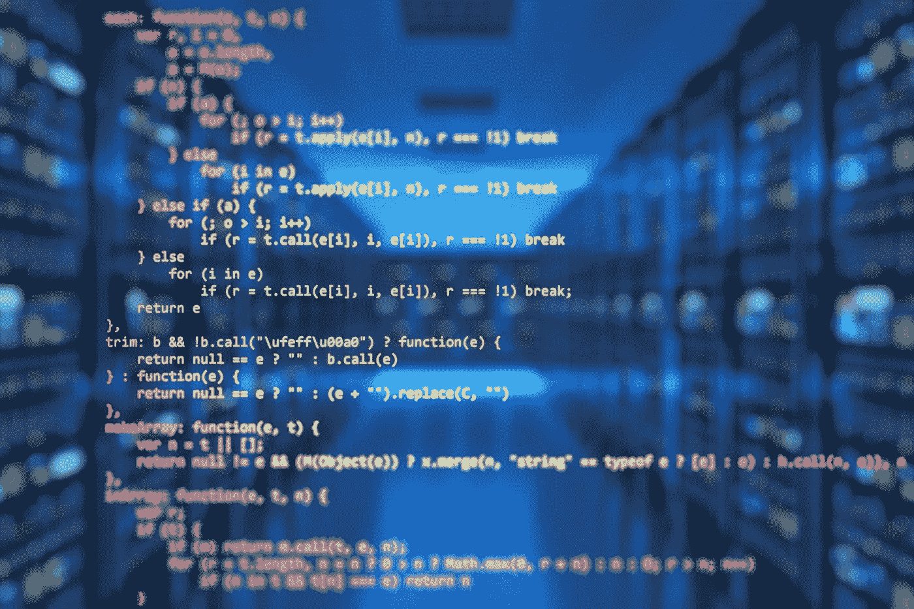
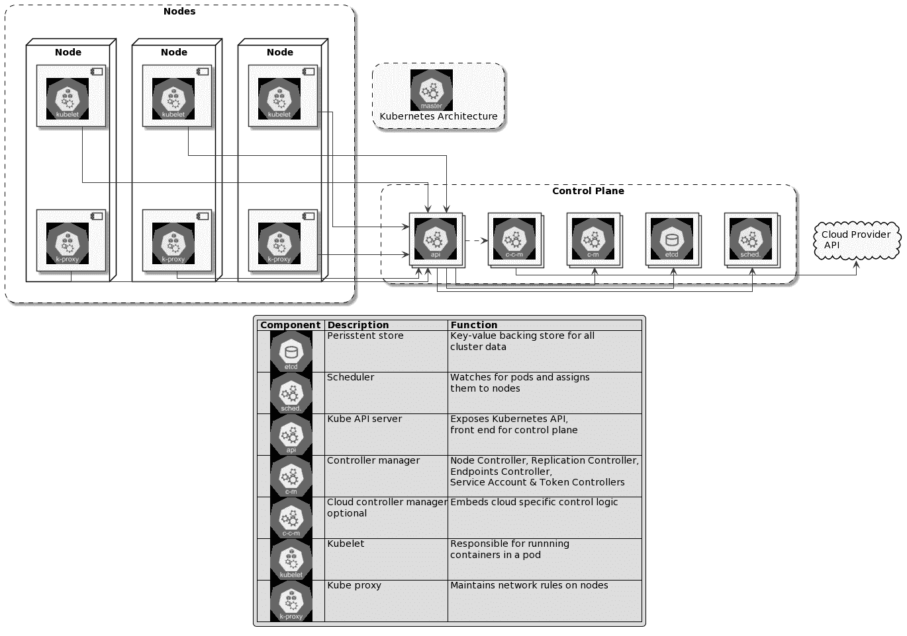
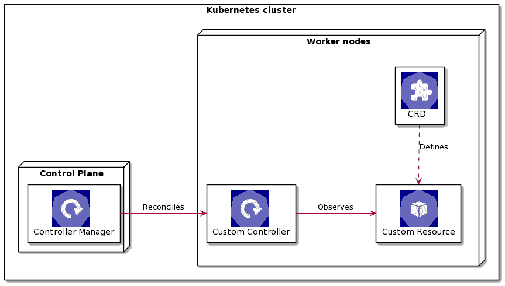
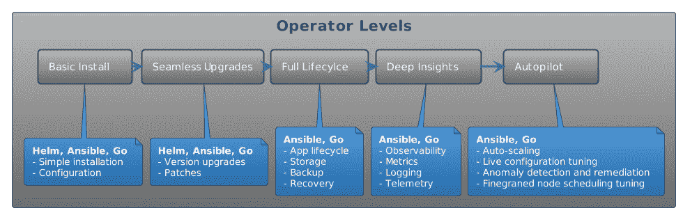

# 如何升级你的 Kubernetes 游戏

> 原文：<https://itnext.io/how-to-level-up-your-kubernetes-game-96f8f7ea50b9?source=collection_archive---------1----------------------->

皮沙贝

## 平台扩展性

## 介绍

随着集装箱化和集装箱编排的快速增长，

> *根据* [*云原生调查从 2020 年*](https://www.cncf.io/blog/2020/11/17/cloud-native-survey-2020-containers-in-production-jump-300-from-our-first-survey/) *开始，生产中集装箱的使用量跃升了 300%*

Kubernetes 的使用只会增加，但使用 Kubernetes 和能够扩展它是有区别的。

Kubernetes 的设计是作为一个平台来构建平台，而运营商是最终的扩展工具。

Kubernetes 的真正力量不仅仅是编排容器的能力，而是它的可扩展 API 和[控制平面](https://containerjournal.com/kubeconcnc/kubernetes-true-superpower-is-its-control-plane/)。Kubernetes 操作符和控制循环是每个人最喜欢的容器编排器的内部机制的工作方式。

在本文中，我们将研究操作符模式，了解什么时候使用操作符是合适的。最后，我们将探讨运营商的架构。

在您继续阅读之前，请注意 kubernetes 操作人员很难相处，需要时间来解决问题，并带来维护方面的挑战。然而，如果你找到一个好的用例，并且能够投入时间和资源来掌握它们，它将释放额外的强大功能。

## 库伯内特建筑

在我们开始研究运营商之前，让我们快速回顾一下 Kubernetes 架构:

来源:作者基于 Kubernetes 文档

在内部，Kubernetes 架构在闭环控制中使用[控制器](https://kubernetes.io/docs/concepts/architecture/controller/)，通过不断协调集群的实际状态与用户/管理员指定的期望状态，来确保集群健康和工作负载的正确性。

图上的一些控制器是:

*   管理所有 Kubernetes 本地控制循环的控制器管理器
*   云控制器，使云提供商能够插入他们的基础设施元素

如您所见，控制循环是 Kubernetes 确保状态协调和自我修复的核心。

# 运营商概述

理解操作员的最简单的方法是把他们看作是人类操作员的软件对应物。想象一下，有人在执行数据库备份、升级、模式更改等任务。要正确完成所有这些任务，需要大量复杂的操作知识。万一失败了呢？嗯，甚至需要更多的知识和经验来排除故障和恢复。

现在想象你有复杂的软件在你的集群上运行，比如 [couchbase](https://operatorhub.io/operator/couchbase-enterprise) 、 [apache spark](https://operatorhub.io/operator/radanalytics-spark) 甚至 [prometheus](https://operatorhub.io/operator/prometheus) 。正确操作所有这些组件所需的知识都包含在操作符中。

您可能还会发现自己处于供应商的一端，希望为您的客户提供额外的好处。编写和维护一个操作符是一项相当复杂的任务，但是如果有一个用例，这是非常值得的。

Kubernetes 运算符遵循[运算符模式](https://kubernetes.io/docs/concepts/extend-kubernetes/operator/)。简而言之，操作员模式自动执行通常由人工执行的操作，例如:

*   装置
*   更新和升级
*   配置
*   支持
*   收集指标
*   解决纷争

## 体系结构

运营商建立在 Kubernetes 架构之上，所有组件都是 Kubernetes 标准构建模块的一部分。正如您在下面的简化图中看到的，运行在控制平面节点上的控制器管理器负责协调和管理所有控制器，无论是内置的还是定制的。定制控制器只是一个作为程序运行的协调逻辑，用任何语言编写，部署到 Kubernetes 集群。

最简单的运算符包括:

*   在由部署或状态集控制的 pod 中运行的自定义控制器
*   定义自定义资源模式的 CRD(自定义资源定义)
*   形成 API 层的自定义资源，用户可以操纵该层与操作员进行交互

自定义资源遵循与其他 Kubernetes 资源相同的语义。

操作员组件图

## 成熟度级别

操作员可以像在集群上安装组件一样简单，也可以复杂得多，比如全生命周期管理，甚至是在应用程序运行时实时执行配置微调。

运营商成熟度分为 5 个级别:

## 实践中的运营商

你应该开始为每件事写操作符吗？不是，那么你应该什么时候？这里有几个适合运营商的用例

*   更新/升级有状态工作负载
*   与 Kubernetes 集群之外的外部资源交互
*   混沌工程
*   高级调度、配置和故障恢复能力

编写和维护一个操作符是一个非常复杂的过程，你需要:

*   对 Kubernetes 内部的深刻理解
*   精通任何编程语言(最好是 Go)
*   对“最终一致性”、“松耦合”、“事件驱动架构”等概念有很强的理解

> *在开始创建自己的运营商之前，请务必访问* [*运营商中心*](https://github.com/Piotr1215/kubernetes-operators/blob/master/operatorhub.io) *。您正在使用的软件可能已经有了一个操作员。*

## 控制器与操作员

管制员和操作员有什么区别？嗯，没有技术上的区别，而是在语义上。

> *控制器是一个控制回路，持续监视和协调集群的状态。Operator 也是一个控制器，但是它还封装了特定的领域知识。*

## 舵手与操作员

如果你仔细看看一个运营商在做什么，它看起来很像[掌舵](https://helm.sh/)，至少从包装的角度来看是这样。

> *每当一个问题涉及到“A 与 B”时，将它重新表述为“什么时候使用 A 更合适，什么时候使用 B 更合适”通常是一个很好的启发方法*

同样，helm 非常适合简单的安装和模板化，但是操作员可以在 helm 没有设计的资源上进行定制逻辑。

# 工具作业

有很多操作框架、SDK 和相关工具，但是我推荐看一下 [kubebuilder](https://github.com/kubernetes-sigs/kubebuilder) ，也可以以在线书籍[的形式获得](https://book.kubebuilder.io/)。

> *请参考本博客的最后一部分“参考资料”,在那里您可以找到关于可用工具的更多信息。*

# 演示场景

如果您想尝试操作符，有几个选择。我推荐浏览 kubebuilder 的快速入门。

*   如果您已经有了一个 Kubernetes 集群，并且想要在您的机器上尝试一些本地的东西，那么使用带有自包含开发环境的 [my repository](https://github.com/Piotr1215/kubernetes-oparators) 。请注意，这是一个容器化的环境，所以除了 Kubernetes 和 VS 代码，你不需要其他任何东西。
*   如果您不想在本地机器上安装任何东西，而更喜欢远程基础设施，请遵循由 [@javajon](https://github.com/javajon) 编写的一个出色的 [Katacoda 场景](https://www.katacoda.com/javajon/courses/kubernetes-extensibility/kubebuilder)。

如果您决定使用这个存储库，有几个先决条件:

*   使用[远程开发扩展](https://marketplace.visualstudio.com/items?itemName=ms-vscode-remote.vscode-remote-extensionpack)的 VS 代码
*   启用 Kubernetes 的 Docker 桌面。如果您的配置文件中有其他 Kubernetes 集群，请确保指向 docker-desktop

> *我已经用远程集群测试过了，它也能工作，但是不能和 k3s/k3d 一起工作。*

该图像将需要一段时间来加载，因为它拉 kubebuilder，Go 二进制文件和其他组件，所以请耐心等待

## 摘要

对我来说，学习 Kubernetes 操作者的主要收获是对 Kubernetes 体系结构有了更深刻的理解，但最重要的是认识到 Kubernetes 的真正力量在于它的可扩展 API 和通用控制平面。

无论是消费运营商还是创建自己的运营商，从 Kubernetes 是一个构建平台的平台的心态开始，是提升 Kubernetes 游戏的途径。

## 资源

这里是进一步研究的有用资源。

*   [Kubernetes 文档操作员模式](https://kubernetes.io/docs/concepts/extend-kubernetes/operator/)
*   [CNCF 运营商白皮书](https://github.com/cncf/tag-app-delivery/blob/master/operator-wg/whitepaper/Operator-WhitePaper_v1-0.md#)
*   [用于 pod 标签的 CNCF 博客控制器](https://kubernetes.io/blog/2021/06/21/writing-a-controller-for-pod-labels/)
*   [视频与动手操作的操作员构建](https://www.youtube.com/watch?v=08O9eLJGQRM&ab_channel=CloudNativeSkunkworks)
*   [构建一个 Kubernetes 操作符 RedHat](https://developers.redhat.com/articles/2021/09/07/build-kubernetes-operator-six-steps?sc_cid=7013a000002pkdsAAA#)
*   [操作员简介 RedHat](https://developers.redhat.com/articles/2021/06/11/kubernetes-operators-101-part-1-overview-and-key-features#operators_extend_kubernetes_to_automate_tasks)
*   [IBM 运营商简介](https://developer.ibm.com/articles/how-operators-extend-kubernetes-functionality/)
*   [Git Awesome 操作框架](https://github.com/pperzyna/awesome-operator-frameworks)
*   库伯 builder