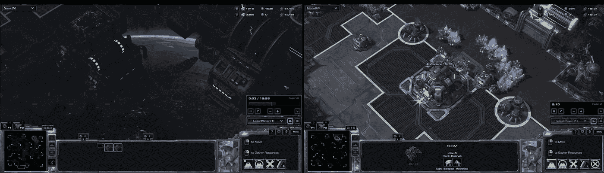

# 如何在 PySC2 中定位和选择单元

> 原文：<https://itnext.io/how-to-locate-and-select-units-in-pysc2-2bb1c81f2ad3?source=collection_archive---------0----------------------->

在我的[之前的教程](https://medium.com/@skjb/building-a-basic-pysc2-agent-b109cde1477c)中，我简要介绍了选择任何特定类型单位的过程，例如 SCV，但是我收到了一些关于如何选择特定单位的问题，我也收到了一些关于我用来确定屏幕上有多少特定单位的“神奇”公式的问题。因为这些是相关的，我想我可以在这里更详细地解释它们。

本教程中的所有代码都应该放在代理的`step()`方法中。如果你不确定这是什么意思，请先看看我的[构建一个基本的 PySC2 代理](https://medium.com/@skjb/building-a-basic-pysc2-agent-b109cde1477c)教程。

# 1.简单的单个单元选择

我在以前的教程中使用的过程相当简单，首先你检索一个特定单元类型的 *x* 和 *y* 坐标列表。例如，我们可以通过以下方式获得指挥中心的 *x* 和 *y* 坐标:

那实际上给了你什么？

太好了，很多数字。它们实际上代表了什么？

默认情况下，屏幕特征层的分辨率为 84x84 像素，可以将`cc_x`和`cc_y`的每一项组合起来，给出该单元消耗的每个像素的坐标。例如`cc_x[0]`是 45，`cc_y[0]`是 31，那么第一个像素位于(45，31)，`cc_x[1]`是 46，`cc_y[1]`是 31，那么第二个像素位于(46，31)，以此类推。在下图中，您可以根据这些坐标看到指挥中心的位置:

指挥中心的屏幕特征坐标

对于像指挥中心这样的单个单元，很容易确定单元的中心，只需取 *x* 坐标的平均值和 *y* 坐标的平均值:

结果将是`x`是 48，`y`是 40。这是我们指挥中心的中间。

# 2.从多个中随机选择单元

当屏幕上只有一个特定类型的单位时，这很容易，但是当一个类型有多个单位时呢？让我们用维斯彭间歇泉试试上面的技术:

这会产生以下值:

这些坐标产生以下内容:

维斯彭间歇泉的屏幕特征坐标

酷，现在让我们平均一下，看看会发生什么:

`x`值将是 43(向上取 42.5)，而`y`值将是 39(向上取 38.5)。给定 84×84 的屏幕尺寸，这将把位置放在屏幕的大约中间。不幸的是，这意味着这项技术不会选择任何东西。真扫兴。

不要担心，有一个解决方案！如果我们不在乎选择哪一个维斯彭间歇泉，我们可以简单地随机选择一个点。首先，我们需要在文件顶部导入随机模块:

然后把这个加入到你的`step()`方法中:

首先，我们选择一个随机索引`i`，然后使用该索引收集该索引处的`vespene_x`和`vespene_y`值。然后我们可以使用`x`和`y`坐标来选择单位。

这种技术的唯一问题是有时单位会互相重叠，例如，如果一个 SCV 站在维斯彭间歇泉旁边，你可能会意外地选择它而不是间歇泉(反之亦然)。因此，您应该检查以确保您选择的单位是您想要选择的单位。

要确保您选择了一个维斯彭间歇泉，您可以这样做:

这段代码获取`single_select`观察中的第一个单元(索引 0)，然后获取该单元中的第一个条目(索引 0)，这恰好是单元类型。如果是维斯彭间歇泉，我们知道我们做得很好，否则我们可能不得不选择另一个随机点。

# 3.计数单位

让我们快速跳到计数单位，因为这将使我们能够找到特定单位的中心。

很多人问我在我以前的教程中使用的“神奇”的计算来确定屏幕上有多少个仓库和兵营。

如果你知道你将只拥有一个特定的单位，例如指挥中心，那么计算就很容易:

这只是检查是否有任何 y 坐标返回。如果是，你有一个指挥中心，如果不是，那么你的基地就没了，你很快就会死。撕开。

对于一个以上的单位，事情变得有点棘手，但只是一点点。让我们从上一步中的 vespene 间歇泉中获取 *x* 和 *y* 坐标:

我们(人类)知道屏幕上有两个维斯佩内间歇泉。由于`vespene_y`中有 194 个值，我们可以假设每个 vespene 间歇泉覆盖 97 个像素。

**请注意:如果您使用的屏幕分辨率不是默认的 84x84，那么每个单元覆盖的像素数量将会不同。**

所以现在我们可以通过将`vespene_y`中的数值除以 97 来计算屏幕上的维斯佩内间歇泉的数量。首先，让我们确保导入文件顶部的数学模块:

然后将它添加到`step()`方法中:

我们将数值向上取整，因为有时单位会稍微重叠，从总数中减去一些数值。舍入通常会给我们正确的值，但是像 scv 这样明显重叠的单元很有可能计数不准确，幸运的是我们有工人计数。

# 4.选择特定单位

现在我们知道了屏幕上有多少个维斯佩内间歇泉，实际上我们可以使用 K-means 聚类法相当精确地找到每个间歇泉的中心。

首先，安装 [scikit-learn](http://scikit-learn.org/stable/) 模块，并在我们的文件顶部包含 K-means 聚类组件:

接下来，我们根据前面的例子得到 *x* 和 *y* 值:

现在让我们来数一下间歇泉的数量:

然后我们可以将 *x* 和 *y* 值组合成对:

现在我们可以应用 K-means 聚类方法来确定每个单元的中心:

从那里你可以得到每个单位的中心如下:

请记住，每个间歇泉的中心指数可能会改变，因为 K-means 算法是随机初始化的。例如，连续两次调用会产生以下结果:

不要认为使用`kmeans.cluster_centers_[0]`总是指(60，21)处的间歇泉。

如果你喜欢这个教程，请在上支持我。也请加入我的[不和谐](https://discord.gg/qTZ65sh)，或者关注我的 [Twitch](https://www.twitch.tv/skjb) 、 [Medium](https://medium.com/@skjb) 、 [GitHub](https://github.com/skjb) 、 [Twitter](https://twitter.com/theskjb) 和 [YouTube](https://www.youtube.com/channel/UCZcEvhpV4_6llcrWrWQ2wsg) 。