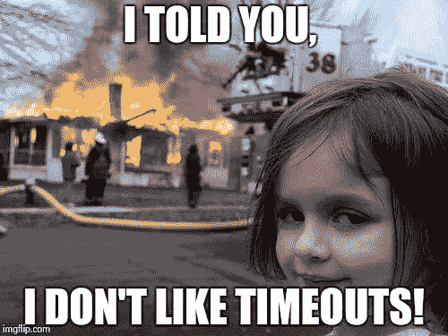

# 如何在不活动或空闲后注销— AngularJS

> 原文：<https://itnext.io/how-to-logout-after-inactivity-or-idle-angularjs-4b97789ba1ac?source=collection_archive---------2----------------------->



你正在开发一个很棒的应用程序，你想注销在一定时间内没有任何活动的用户——是的，这是他们应得的(只是和:D 开玩笑)

有一个包名 [**ng-idle**](https://github.com/HackedByChinese/ng-idle) 你可以在这种情况下使用，如果你想尝试一下，他们也有 Angular 2+的版本。然而，在这篇文章中，我将在 AngularJS 1.x 上做一个演示——是的，我现在正和那些过时的家伙一起工作。

如果你想看一眼最终产品，你可以在[广场](https://next.plnkr.co/plunk/Evsfb22xoDP6UjRJ)进行。

 [## AngularJS —自动注销

### 因不活动而注销用户

next.plnkr.co](https://next.plnkr.co/plunk/Evsfb22xoDP6UjRJ) 

**创建一个 AngularJS 项目**

嗯，你只需要一个 html 和/或 JavaScript 文件来运行 AngularJS 项目

```
// index.html<!doctype html>
<html **ng-app="myApp"**>
<head>
    **<script src="//ajax.googleapis.com/ajax/libs/angularjs/1.6.1/angular.js"></script>**
    <script src="//ajax.googleapis.com/ajax/libs/angularjs/1.6.1/angular-animate.js"></script>
    <script src="//ajax.googleapis.com/ajax/libs/angularjs/1.6.1/angular-sanitize.js"></script>
    <script src="//angular-ui.github.io/bootstrap/ui-bootstrap-tpls-2.5.0.js"></script>
    **<script src="**[**https://cdnjs.cloudflare.com/ajax/libs/ng-idle/1.3.2/angular-idle.min.js**](https://cdnjs.cloudflare.com/ajax/libs/ng-idle/1.3.2/angular-idle.min.js)**"></script>**
    **<script src="app.js"></script>**
    <link href="//netdna.bootstrapcdn.com/bootstrap/3.3.7/css/bootstrap.min.css" rel="stylesheet">
</head>
<body>
    <section **ng-controller="DemoCtrl"**>
        <p>
            <button type="button" class="btn btn-success" ng-hide="started" ng-click="start()">Start Demo</button>
            <button type="button" class="btn btn-danger" ng-show="started" ng-click="stop()">Stop Demo</button>
        </p>
    </section>
</body></html>
```

首先，我将 **angularjs** 和 **angular-idle** 嵌入到 html 文件的头部。其他的只是装饰。

```
// app.js angular.module('myApp', ['ngAnimate', 'ngSanitize', 'ui.bootstrap', 'ngIdle']);angular.module('myApp').config(['KeepaliveProvider', 'IdleProvider', function(KeepaliveProvider, IdleProvider) { // configure Idle settings
    IdleProvider.idle(5);
    IdleProvider.timeout(5);
    KeepaliveProvider.interval(10); IdleProvider.interrupt('keydown wheel mousedown touchstart touchmove scroll');
}]);angular.module('myApp').controller('DemoCtrl', function ($scope, Idle, Keepalive, $uibModal) {  $scope.$on('IdleStart', function() {
   // the user appears to have gone idle
 }); $scope.$on('IdleTimeout', function() {
   // the user has timed out, let log them out
 }); $scope.$on('IdleEnd', function() {
  // the user has come back from AFK and is doing stuff
 });});angular.module('myApp').config(function(IdleProvider, KeepaliveProvider) {
    IdleProvider.idle(5);
    IdleProvider.timeout(5);
    KeepaliveProvider.interval(10);
});
```

**创建警告和超时模式**

警告模式—这将在超时前显示

```
// warning-dialog.html<div class="modal-header">
    <h3 class="modal-title" id="modal-title">{{ pc.title }}</h3>
</div>
<div idle-countdown="countdown" ng-init="countdown=5" class="modal-body" id="modal-body">
        <uib-progressbar max="5" value="5" animate="false" class="progress-striped active">You'll be logged out in {{countdown}} second(s).</uib-progressbar>
</div>
<div class="modal-footer">
    <button class="btn btn-primary" type="button" ng-click="pc.ok()">OK</button>
    <button class="btn btn-warning" type="button" ng-click="pc.cancel()">Cancel</button>
</div>
```

超时模式—这将在警告模式之后显示，用户不做任何事情。在此阶段，用户已经注销。

```
// timeout-dialog.html<div class="modal-header">
    <h3 id="modal-title">You've Timed Out!</h3>
</div>
<div class="modal-body" id="modal-body">
    <p>
        You were idle too long...
    </p>
</div>
```

请检查[按钮](https://next.plnkr.co/plunk/Evsfb22xoDP6UjRJ)了解完整的工作项目。

希望这有所帮助:)