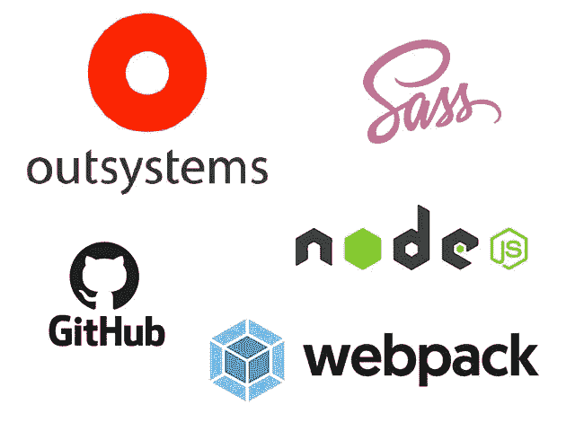
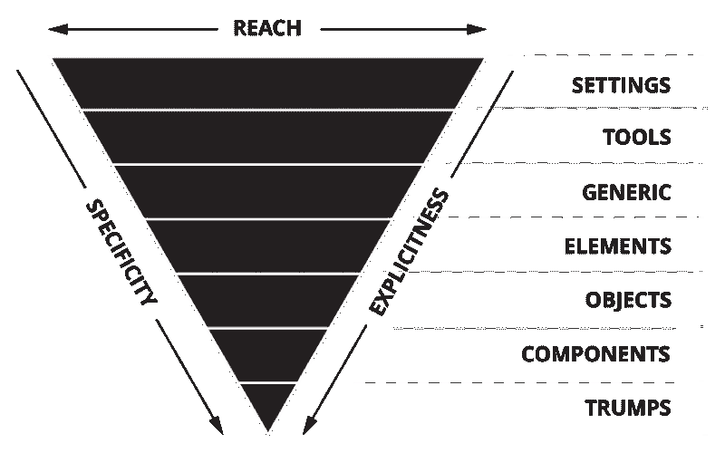

# 如何在复杂的外部系统工厂中维护和扩展前端架构

> 原文：<https://itnext.io/how-to-maintain-and-scale-a-frontend-architecture-in-a-complex-outsystems-factory-9a0f6455ebd1?source=collection_archive---------2----------------------->

如果你正在读这篇文章，很可能你正在参与由几十个经验丰富的外部系统工程师开发的有数百个应用程序和模块的大项目。

但是我的建议也适用于由 3 或 4 个开发人员组成的小型团队。

软件工程中最大的挑战之一是如何随着代码库的发展而伸缩和适应。新的需求将被实现，我们需要支持旧的特性。

通常情况下，开发人员来来去去，遵循行业标准来缓解不同人员之间的这种过渡很重要。

如果所有这些都是软件工程中被证实的事实，那么 OutSystems 也不例外。尽管 1CP 按钮背后发生了很多神奇的事情，但最终我们还是交付了代码。

当谈到前端，关于 CSS 或 JavaScript，它真的是高代码。

当我开始与 OutSystems 合作时，我面临着一个挑战:大工厂，数百个应用程序，多个主题，CSS 分散在各处，JavaScript 主要在全球范围内像爆米花一样碰撞和覆盖。

无论是对于 CSS 还是 JavaScript，封装和继承的概念都无处可寻。OutSystems 试图让我们的生活变得如此简单，以至于我们常常忘记了基础知识以及我们是如何来到这里的。

而万能浏览器，我们都依赖的工具，只懂 HTML，CSS，JavaScript。浏览器不关心后端数据库访问是在 1 个月内手工编码的还是用 Service Studio 在 1 周内开发的。

那么，现在我已经展示了丑陋的一面，我有什么建议来促进和改进关于外部系统前端开发的开发和可伸缩性呢？

# **主题上的所有 CSS**

在 OutSystems 中，我们可以将 CSS 放置在**主题**，在**网页块**和**屏幕**上。

我相信 CSS 这个词已经说了很多次了，但是我们往往会忘记“C”代表什么:*。确保全能浏览器正确的加载顺序和解释的最好方法是将所有的 CSS 放在一个地方，按照我们想要的顺序编写。*

*也就是说，在你的生态系统中有多个主题是很常见的，分离业务层，垂直细分，从另一个继承给定的主题…但是事实是:**所有的 CSS 都在主题上**。*

*有了这个，下一项才有可能。*

# *您代码版本*

*一个普通的主题可以很容易地包含数千行内容，包括基础、布局、组件和辅助类等等。*

> *手动维护 10K+代码行是错误的。句号。*

*软件行业和前端工程已经使用 GitHub 很多年了，外部系统的前端开发也应该这样做。*

*代码合并和审查要容易得多，如果没有适当的版本控制，不同开发人员之间的协作可能是一场噩梦。*

# ***CSS 架构***

*随着时间的推移，人们提出了在大型项目中组织 CSS 的不同方法。*

*ITCSS 代表**倒三角形 CSS** ，是一种常见的将我们的 CSS 分割成多个文件的方法，根据“可及性”、“特异性”和“明确性”设置它们导入的顺序。从上到下(更大的“范围”到更“具体”)，创建一个类似于倒三角形的图。*

**

*倒三角形 CSS*

*浏览器解释的正确顺序将减少覆盖的需要，并且不同的较小部分的分离将促进不同开发者之间的协作。*

*另一个最近的方法是立方体 CSS。看一看！【https://cube.fyi/ *

# ***使用 CSS 预处理器***

*现在是 2021 年。
如果你正在构建一个企业应用程序，而你仍然用普通的 CSS 写了几千行，你应该知道有一个更好的方法。*

*有几个 CSS 预处理程序可用，我推荐 SASS 作为首选。*

> *“CSS 本身很有趣，但是样式表变得越来越大、越来越复杂、越来越难维护。这就是预处理器可以提供帮助的地方。Sass 允许您使用 CSS 中不存在的功能，如变量、嵌套、混合、继承和其他漂亮的好东西，使编写 CSS 再次变得有趣。一旦你开始修改 Sass，它会把你的预处理过的 Sass 文件保存为一个普通的 CSS 文件，你可以在你的网站上使用。”[https://sass-lang.com/](https://sass-lang.com/)*

*一旦你开始在 SASS 中使用**函数**、**变量**和**循环**，你将很难回到 2010 年的做事方式。*

*为了实现一个预处理器，我们需要以下…*

# ***建造过程***

*为了实现运行预处理器的现代前端开发过程，我们需要一个服务器端运行时来编译和输出所需的 CSS 代码:meet **Node.js** 。*

*这个运行时允许我们执行服务器端代码，这些代码是用我们熟悉的语言编写的，并且已经在日常使用: **JavaScript** ！*

*这只是为了工具和构建过程，没有做任何后端操作的意图。*

*我们可以使用像 Gulp 这样的任务运行器来组装我们的 SASS 代码，或者甚至使用像 Webpack 这样的捆绑器，这给了我们更多的灵活性。*

*这个构建过程可以用来**自动**:*

*   *检查代码样式和林挺*
*   *实现一个自动前缀混合器来支持不同的浏览器*
*   *让我们的集中式代码库分发多个主题文件*
*   *优化图像和 svg 文件等资产*

*以下是一些有用的链接:*

*   *[开始使用 webpack](https://webpack.js.org/guides/getting-started/)*
*   *[如何为一个基础网站从头开始配置 Webpack 4 或 5](https://dev.to/antonmelnyk/how-to-configure-webpack-from-scratch-for-a-basic-website-46a5)*

*最后，你的 CSS 的 10K+行看起来像这样:*

**

*SASS 部分文件示例。*

# ***搞定***

*我们现在有了一个生成优化的 CSS 代码的设置，这些代码将在我们的多个主题中使用，由多个团队成员开发。*

*没有不必要的覆盖或复制粘贴错误。
集中化，更容易规模化。*

*这似乎是一个复杂的过程，但当我们分析结果时，这是非常值得的。*

# *【JavaScript 呢？*

*我相信你注意到我只提到了 CSS。以上所有内容也适用于 JavaScript。*

*将我们的 JavaScript 代码模块化到多个文件中，然后为浏览器组装，这就是 Webpack 被发明的原因。*

*如今，开发人员用 TypeScript 编写代码，然后将代码转换成 JavaScript，由全能的浏览器进行解释。*

*但是如果我们实现了这个工作流程，并且从解决 CSS 的问题开始，我相信接下来的事情就会水到渠成。*

*试一试吧。*

*你对此有什么想法？*

*你想让我在某个特定的话题上更进一步吗？*

*请在评论中联系我！*