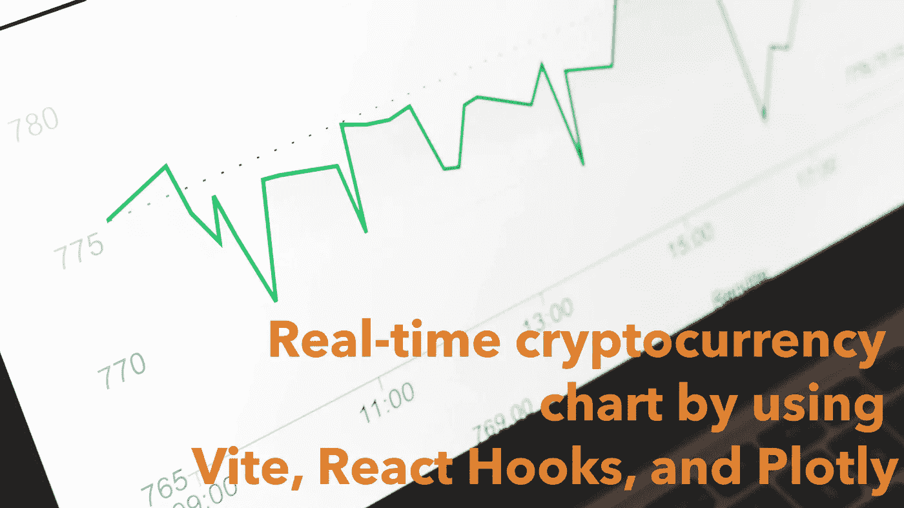
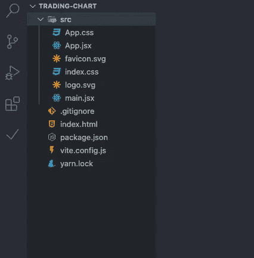
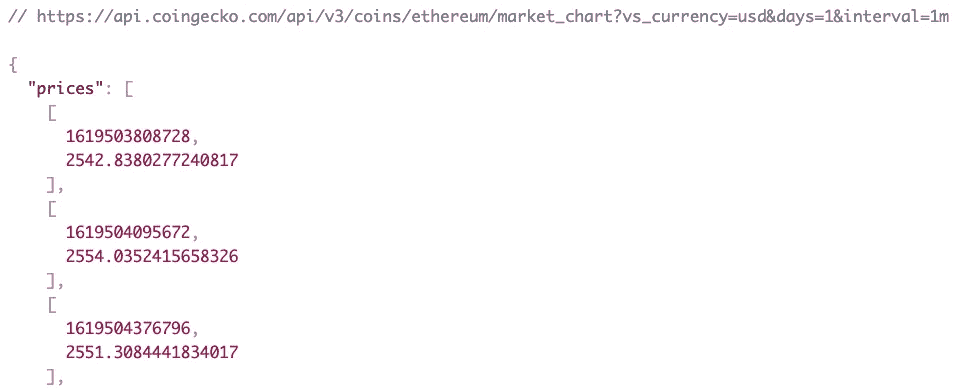
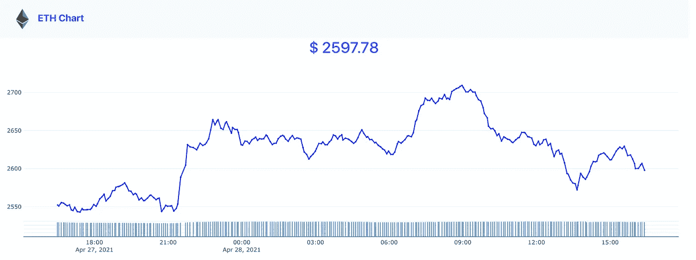

# 如何使用 React Hooks 和 Plotly 制作一个基本的(接近)实时更新的加密货币图表 app

> 原文：<https://itnext.io/how-to-make-a-basic-cryptocurrency-chart-app-with-near-real-time-updating-by-using-react-hooks-6a466529c2dc?source=collection_archive---------0----------------------->



最近，我通过当地的外汇市场对 ETH 加密货币进行了一笔小额投资。我想在业余时间检查我的投资，并打电话买多或卖多。不幸的是，外汇市场没有给我提供图表，但他们只有简单的 API 来跟踪投资组合的平衡，目前以当地货币为基础的要价和出价。结果就是一直跟踪趋势，挺烦的。最后，我决定写一个供我个人使用的基本价格图表(我已经结合了本地交易所的一些 API，为我的私人应用程序包含了更多的统计数据)。事实证明，制作这个图表项目比我预期的更有趣，当看到它实时运行时，我完全满足了。

首先，我做了一些研究来找到一个解决方案，为这个小型项目提供数据。有一些优秀的包，比如 Ran Aroussi 的 [yfinance](https://github.com/ranaroussi/yfinance) 。我已经做了一些原型，但是，这个解决方案需要一个后端服务器运行，我真的不想再为这样一个小应用程序维护一个服务器。幸运的是，CoinGecko 免费提供了一套精彩的[API](https://www.coingecko.com/en/api)。

让我们开始，或者你可以在这里看一下[现场演示](https://techika-cryptocurrency-chart.netlify.app/)。

首先，我使用我最喜欢的捆绑工具 [Vite](https://vitejs.dev/) 和 react 模板来搭建项目。你可以根据自己的喜好使用`create-react-app`。

```
yarn create [@vitejs/app](http://twitter.com/vitejs/app) trading-chart --template react
```

然后，进入`trading-chart`目录，在运行开发服务器之前安装所需的包:

```
cd trading-chart
yarn
yarn dev
```

下面是当前的目录结构



初始项目结构

然后，打开浏览器，输入`[http://localhost:3000](http://localhost:3000)`，你会看到来自 Vite 的演示页面。现在，我们将`index.html`文件改为包含第三方库和用于 UI 的引导 CSS 框架。

文件:index.html

# 初始化图表

在接下来的步骤中，我们将使用`useEffect`从 CoinGecko API 获取数据，然后在处理它到 Plotly.js 进行绘制之前对其进行处理。提取的 URL 是:

```
[https://api.coingecko.com/api/v3/coins/ethereum/market_chart?vs_currency=usd&days=1&interval=1m](https://api.coingecko.com/api/v3/coins/ethereum/market_chart?vs_currency=usd&days=1&interval=1m)
```

该响应将为我们提供价格、市场资本和总交易量(相对于美元)。单个项目将采用数组格式，其中`timestamp`和`value`如下图所示:



来自 CoinGecko API 的示例响应

由于这个项目的范围很小，我只是用一个包装器来处理我为以前的项目写的错误获取 API。我在`src`文件夹中创建了一个新文件`utils.js`。

然后，我在`App.jsx`中编写了一个函数，请求获取数据并处理到`data`字典中，如下所示，用于接下来的步骤:

另一个函数初始化图表，使用来自 Plotly.js 的 API，并将上面的`data`作为输入。你可能想看看它的官方文档[来探索更多的特性。基本上，在下面的代码块中，我通过`data`对象绘制了两个折线图，一个是价格，一个是交易量，x 轴是时间序列。](https://plotly.com/javascript/)

接下来，`useEffect`和`useState`将用于设置数据并计算 ETH 的最新价格。

事实上，传递给`useEffect`的空数组并不是一个好的设计模式。它通知`useEffect`调用一次函数，目前还不错。我们将在下一部分重构它。

现在，组装好一切，我们有了一个完整的`App.jsx`文件。

图表应显示在`[http://localhost:3000](http://localhost:3000)`



# 实时更新

好吧，老实说，这不是一种像 WebSocket 或服务器发送事件技术那样的实时发射。不使用它们有两个原因。首先，对于这样一个小项目来说，它们太复杂了。其次，我找不到任何支持那些接口的免费 API 提供者(如果你找到了，请建议我。)所以，为了简单起见，我只使用了`setInterval`函数在一段固定的时间(通常是 60 秒，因为我们从 API 获取数据)后继续更新图表。你得到的数据几乎是实时更新的。实际上，我们可以将间隔时间设置为 1 秒或更短，但是 CoinGeckco API 提供程序会禁止这样做。

要实现这个过程，我们需要一个自定义函数来更新 Plotly.js 中的图表，如下所示。

然后，我们给`useEffect`加上间隔时间

瞧，我们已经完成了一个美元/瑞士法郎的实时图表。又快又简单。在完成的代码中，我添加了每当图表更新时闪烁的效果，以及加载消息。

*本帖原帖来自* [*我的博客*](https://techika.com/2021/04/28/cryptocurrency-real-time-chart/) *。*

[现场演示](https://techika-cryptocurrency-chart.netlify.app/)
[源代码](https://github.com/infantiablue/cryptocurrency-chart)