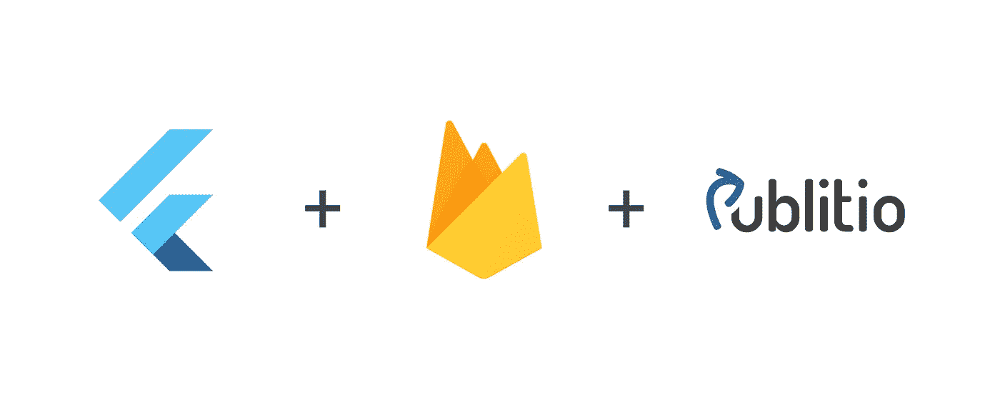
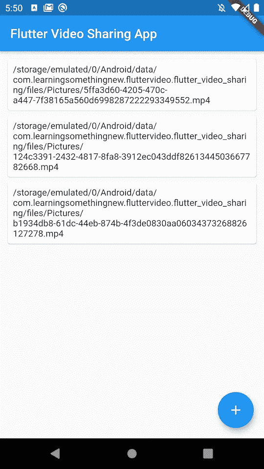
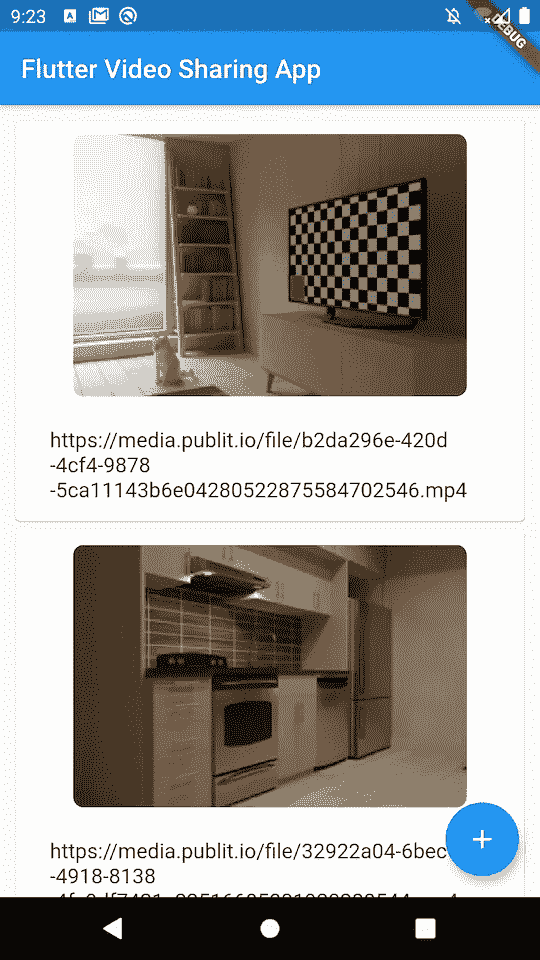
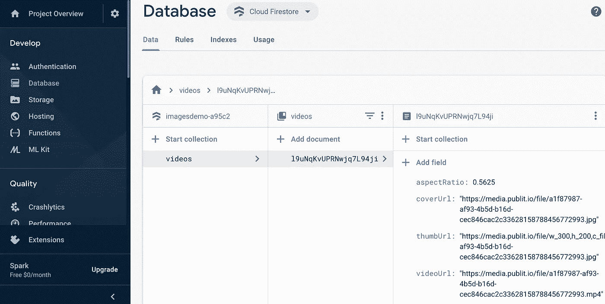
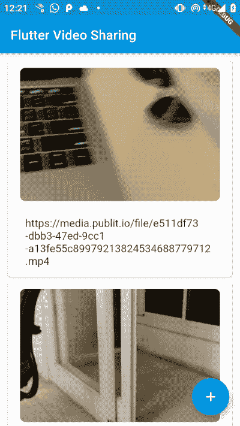

# 如何用 Flutter，Firebase，Publitio 做一个跨平台无服务器的视频分享 app

> 原文：<https://itnext.io/how-to-make-a-cross-platform-serverless-video-sharing-app-with-flutter-firebase-and-publitio-900a9fa0dd68?source=collection_archive---------7----------------------->



# 我们正在建造的东西

我们将看到如何构建一个跨平台的移动应用程序，允许用户上传和共享视频。


# 堆栈

*   [Flutter](https://flutter.dev/)——谷歌新的跨平台移动应用开发框架，使用 Dart 语言。
*   [Firebase](https://firebase.google.com/) —无服务器实时数据库，用于存储和同步客户端之间的视频元数据。
*   [Publitio](https://publit.io?fpr=jonathan43) —我们将用于存储和发布视频的托管平台。

## 摆动

Flutter 为我们提供了一种为 iOS 和 Android 编写一个代码库的方法，而不必复制逻辑或 UI。相对于 Cordova 等解决方案的优势在于，它针对移动性能进行了优化，提供了类似本机的响应。与 React Native 等产品相比，它的优势在于您可以编写一次 UI，因为它完全避开了 OS 原生 UI 组件。Flutter 还有一流的开发体验，包括热重装和在 VSCode 中调试，很牛逼。

## 重火力点

保持无服务器对应用程序的开发时间和可伸缩性有巨大的好处。我们可以专注于我们的应用程序，而不是服务器开发。Firebase 让我们无需服务器端代码就可以在客户端之间同步数据，包括离线同步功能(这很难实现)。Flutter 也有一组 firebase 插件，使它可以很好地与 Flutter 小部件配合使用，因此当另一个客户端更改数据时，我们可以实时同步客户端 UI。

## 公共报

我们将使用 Publitio 作为我们的媒体资产管理 API。Publitio 将负责托管我们的文件，使用其 CDN、缩略图/封面图像生成、转换/裁剪和其他视频处理功能将文件交付给客户。

通过使用 API，我们不用在内部重新发明视频处理。

## 安全警告

这个方法将您的 publitio API 密钥和机密存储在客户机上。这涉及到安全问题。除非你同意理论上所有客户端都可以查看和修改你的所有文件，否则你应该使用我在下一篇文章[中描述的云函数从服务器端调用 publitio。](/serverless-video-upload-and-encoding-with-firebase-storage-cloud-functions-and-publitio-a4b2997b1508)

# 我们开始吧

首先，使用 flutter 的[入门](https://flutter.dev/docs/get-started/install)，确保你已经建立了一个可用的 Flutter 环境。

现在让我们创建一个名为`flutter_video_sharing`的新项目。在终端运行中:

```
flutter create --org com.learningsomethingnew.fluttervideo --project-name flutter_video_sharing -a kotlin -i swift flutter_video_sharing
```

要检查项目是否已成功创建，请运行`flutter doctor`，并查看是否有任何问题。

现在使用`flutter run`运行基本项目，进行一点完整性检查(您可以使用仿真器或真实设备，Android 或 iOS)。

> *这是初始化 git 存储库并进行第一次提交的好时机。*

# 拍摄视频

为了使用设备摄像头拍摄视频，我们将使用[图像拾取器插件进行抖动](https://pub.dev/packages/image_picker)。

在`pubspec.yaml`依赖项部分，添加一行代码(更改为插件的最新版本):

```
image_picker: ^0.6.1+10
```

> *你可能会注意到，还有一个* [*相机插件*](https://pub.dev/packages/camera) *。我发现这个插件目前很不稳定，并且在许多 android 设备上有严重的视频质量限制，因为它只支持 camera2 API。*

## iOS 配置

对于 iOS，我们必须在`ios/Runner/Info.plist`中添加摄像头和麦克风的使用说明:

> *为了在 iOS 上测试摄像头，你必须使用真实的设备，因为模拟器没有摄像头*

## 使用插件

在`lib/main.dart`中用下面的代码编辑`_MyHomePageState`类:

这是怎么回事:

*   我们用`_takeVideo`代替了`_incrementCounter`方法，并把它变成了`async`。这就是当我们点击浮动操作按钮时发生的情况。
*   我们在和`await ImagePicker.pickVideo(source: ImageSource.camera);`拍视频。
*   我们将视频文件路径保存在小部件状态下的`_videos`列表中。我们调用`setState`,这样小部件将重新构建，更改将反映在 UI 中。
*   为了获得一些视觉反馈，我们用一个使用`ListView.builder`的`ListView`替换了脚手架的主`Column`，这将有效地呈现我们的动态列表。

在此阶段运行将如下所示:



# 添加出版物

在 [Publit.io](https://publit.io?fpr=jonathan43) 创建一个免费帐户，并从仪表盘获取您的凭证。

> *注意:上面的链接有我的推荐代码。如果我的写作对你有价值，你可以用这个链接来支持。当然，你可以创建一个没有我的账户😭*

## 添加包

将 [flutter_publitio](https://pub.dev/packages/flutter_publitio) 插件添加到您的`pubspec.yaml`依赖部分:

```
dependencies:
    flutter_publitio: ^1.0.0
```

## 创建一个环境文件

存储应用程序配置的一个好方法是使用`.env`文件，并用 [flutter_dotenv](https://pub.dev/packages/flutter_dotenv) 加载它们，这反过来又实现了来自[十二因素应用程序](http://www.12factor.net/)的指导方针。这个文件将包含我们的 API 密钥和秘密，因此不应该提交给源代码控制。因此，在项目的根目录下创建一个`.env`文件，并将您的凭证放入其中:

```
PUBLITIO_KEY=12345abcd
PUBLITIO_SECRET=abc123
```

现在添加`flutter_dotenv`作为依赖项，同时在`pubspec.yaml`中添加`.env`文件作为资产:

```
dependencies:
  flutter_dotenv: ^2.0.3

  ...

flutter:
  assets:
    - .env
```

## iOS 配置

对于 iOS，从`Info.plist`开始加载密钥。为了将我们的配置保存在我们的环境中，而不是提交到我们的存储库中，我们将从一个`xcconfig`文件中加载密钥:

*   在 XCode 中，打开`ios/Runner.xworkspace`(这是已经生成的 XCode 项目 Flutter)，右键点击 Runner - >新建文件- >其他- >配置设置文件- > Config.xcconfig
*   在`Config.xcconfig`中，像在`.env`文件中一样添加密钥:

```
PUBLITIO_KEY = 12345abcd
PUBLITIO_SECRET = abc123
```

现在，我们将从`ios/Flutter/Debug.xcconfig`和`ios/Flutter/Release.xcconfig`中导入这个配置文件，方法是将这一行添加到它们的底部:

```
#include "../Runner/Config.xcconfig"
```

> *将 Config.xcconfig 添加到。gitignore 这样你就不会在 git 中有你的密钥了*

最后一步是将配置键添加到`ios/Runner/Info.plist`:

```
<key>PublitioAPIKey</key>
<string>$(PUBLITIO_KEY)</string>
<key>PublitioAPISecret</key>
<string>$(PUBLITIO_SECRET)</string>
```

## Android 配置

在 Android 中，我们所要做的就是在`android/app/build.gradle`中将`minSdkVersion`从 16 改为 19。

> 是我的问题还是安卓系统总是让一切变得更简单？

## 上传文件

现在我们已经添加了 publitio，让我们上传从 ImagePicker 获得的文件。

在`main.dart`中，在`_MyHomePageState`类中，我们将添加一个保存上传状态的字段:

```
bool _uploading = false;
```

现在我们将覆盖`initState`并调用一个异步函数`configurePublitio`来加载 API 键:

我们将添加一个函数`_uploadVideo`来调用 publitio API 的`uploadFile`:

我们将调用代码添加到我们的`_takeVideo`函数中:

请注意，来自 publitio API 的响应将以键值映射的形式出现，从中我们只保存了`url_preview`，这是查看托管视频的 url。我们将它保存到我们的`_videos`集合中，并在上传完成后将`_uploading`返回 false。

最后，只要`_uploading`为真，我们就将浮动动作按钮改为微调按钮:

## 添加缩略图

Publitio 使之变得容易的一件事是服务器端视频缩略图提取。您可以使用它的 URL 转换特性来获取任意大小的缩略图，但是为此我们将使用上传响应中接收到的默认缩略图。

既然我们希望每个列表项都有一个 url 和一个缩略图，那么为每个视频条目提取一个简单的 POCO 类是有意义的。创建一个新文件`lib/video_info.dart`:

我们将把`_videos`系列从`String`改为`VideoInfo`:

```
List<VideoInfo> _videos = <VideoInfo>[];
```

在获得上传响应后，我们将添加一个包含 url 和缩略图 url 的 VideoInfo 对象:

最后，我们将缩略图显示添加到列表构建器项目:

这里有几件事:

*   我们使用`ClipRRect`给缩略图一个漂亮的圆形边框
*   我们正在显示一个`CircularProgressIndicator`，它在缩略图加载时显示(加载后它将被图像隐藏)
*   为了一个漂亮的淡入淡出效果，我们使用了包`transparent_image`中的`kTransparentImage`(需要添加到`pubspec.yaml`)

现在列表中有了漂亮的缩略图:



# 播放视频

现在我们有了视频列表，我们想在点击列表卡时播放每个视频。

我们将使用 [Chewie 插件](https://pub.dev/packages/chewie)作为我们的播放器。朱伊将 [video_player 插件](https://pub.dev/packages/video_player)包装成具有本机外观的 UI，用于播放、跳过和全屏。它还支持根据设备方向自动旋转视频。它不能做的(odly)，是自动计算出视频的长宽比。所以我们会从公开的结果中得到答案。

> *注意:Flutter 的 video_player 包还不支持缓存，所以重播视频会导致重新下载。这个应该很快就能解决:*[*https://github.com/flutter/flutter/issues/28094*](https://github.com/flutter/flutter/issues/28094)

所以补充到`pubspec.yaml`:

```
video_player: ^0.10.2+5
chewie: ^0.9.8+1
```

对于 iOS，我们还需要将以下内容添加到`Info.plist`中，以允许加载远程视频:

```
<key>NSAppTransportSecurity</key>
<dict>
  <key>NSAllowsArbitraryLoads</key>
  <true/>
</dict>
```

现在我们将添加一个新的小部件来容纳朱伊。创建新文件`chewie_player.dart`:

需要注意一些事情:

*   `ChewiePlayer`期望得到`VideoInfo`，即要播放的视频。
*   纵横比从输入`VideoInfo`开始初始化。我们将很快添加该字段。
*   当视频加载时，我们显示一个占位符图像。我们将使用 publitio API 来生成封面图像。
*   我们有一个`IconButton`将通过调用`Navigator.pop(context)`来关闭这个小部件
*   我们必须通过重写`dispose()`方法来处理`VideoPlayerController`和`ChewieController`

在`video_info.dart`中，我们将添加`aspectRatio`和`coverUrl`字段:

```
String coverUrl; 
double aspectRatio;
```

现在在`main.dart`中，我们将首先导入新的`chewie_player`:

```
import 'chewie_player.dart';
```

添加一个`aspectRatio`的计算:

添加一个从 publitio API 获取封面图像的方法(这只是将视频的扩展替换为`jpg`——publi TiO 完成所有工作):

用一个`GestureDetector`包装我们的列表项`Card`来响应卡片上的点击，并调用`Navigator.push`来路由到我们新的`ChewiePlayer`小部件:

# 添加 Firebase

既然我们可以上传和播放视频，我们希望应用程序的用户能够查看其他用户发布的视频。为了做到这一点(并保持应用程序无服务器)，我们将使用 Firebase。

## Firebase 设置

首先，按照此处所述[设置 Firebase。这包括创建一个 firebase 项目，在项目中注册您的移动应用程序(Android 和 iOS ),并为 Android 和 iOS 项目配置凭据。然后我们将添加颤振包](https://firebase.google.com/docs/flutter/setup) [firebase_core](https://pub.dev/packages/firebase_core) 和 [cloud_firestore](https://pub.dev/packages/cloud_firestore) 。

> *Cloud Firestore 是 Firebase 实时数据库的新版本。你可能需要在你的* `*build.gradle*` *中设置* `*multiDexEnabled true*` *。*

## 将视频信息保存到 Firebase

我们将把视频信息保存到`videos`集合中的一个新的 Firebase 文档中，而不是保存到我们自己的州:

`document()`方法将在`videos`集合中创建一个新的随机命名的文档。

这是文档在 Firebase 控制台中的外观:



## 显示 Firebase 中的视频列表

现在，在我们的`initState`方法中，我们想要启动一个 Firebase 查询来监听`videos`集合。每当 Firebase SDK 触发数据变化时，它将调用`updateVideos`方法，这将更新我们的`_videos`状态(并且 Flutter 将重建 UI):

现在所有的视频都分享了！



# 重构

现在一切都正常了，是时候进行一些重构了。这是一个非常小的应用程序，但仍然有一些明显的东西脱颖而出。我们将数据访问和业务逻辑都放在同一个地方，这绝不是一个好主意。最好将我们的 API/数据访问放在单独的模块中，为业务逻辑层提供所需的服务，同时它可以保持对实现细节的不可知性(以及与实现细节的松散耦合[】。](https://en.wikipedia.org/wiki/Loose_coupling)

为了保持这篇文章的简短，我不会在这里包括这些变化，但是你可以在 GitHub 的最终代码中看到它们

# 未来的改进:客户端编码

在上传之前，我们可以在客户端使用 FFMpeg 对视频进行编码。这将节省存储空间并加快传送速度，但需要患者上传用户。如果你想知道如何做到这一点，请在下面写下评论。

感谢阅读！完整代码可以在 [GitHub](https://github.com/syonip/flutter_video_sharing) 上找到。如有疑问，欢迎留言评论！

*最初发表于*[T5【https://www.learningsomethingnew.com】](https://www.learningsomethingnew.com/how-to-make-a-cross-platform-video-sharing-app-with-flutter-and-firebase)*。*