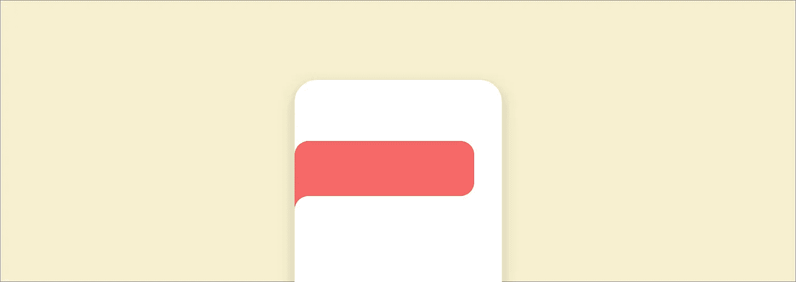
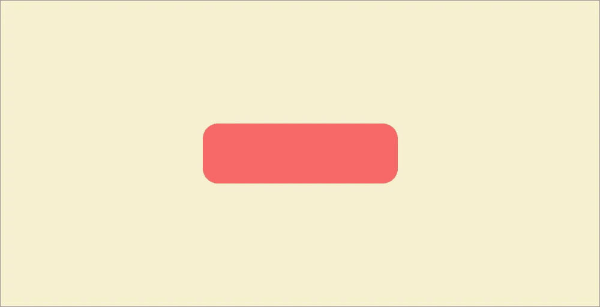
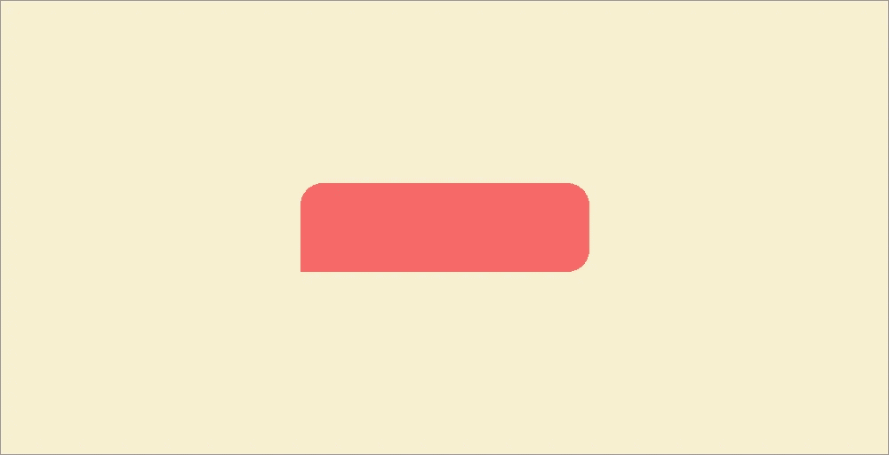
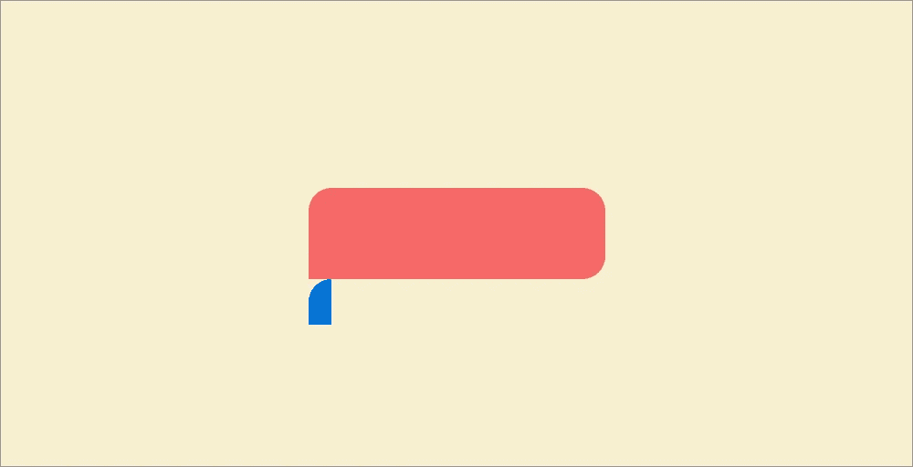
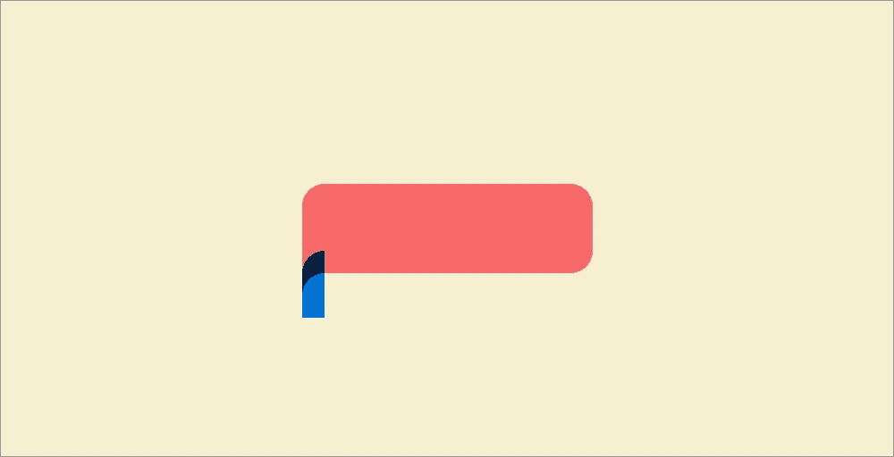
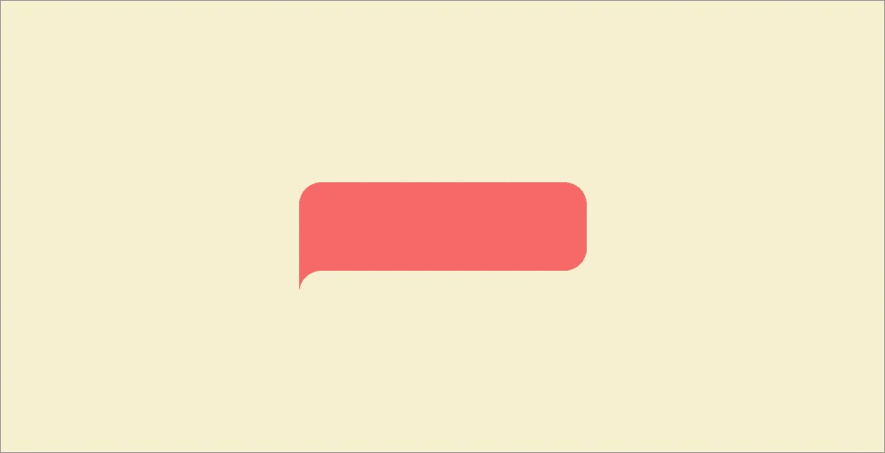

# 如何在 CSS 中制作一个花哨的倒边框半径

> 原文：<https://itnext.io/how-to-make-a-fancy-inverted-border-radius-in-css-5db048a53f95?source=collection_archive---------0----------------------->

“反向边界半径”的经典案例

不久前，我看到了一篇由 [Emre Mazursky](https://dribbble.com/emred) 写的有趣的 [Dribbble post](https://dribbble.com/shots/6785639-Itinerary) ，它使用了我称之为反向边界半径的东西(因为我大脑中的术语部门缺乏更好的灵感)。让我们来看看如何只用一些 CSS 就能做出这些美丽的东西！

## 起始代码

我们的出发位置([代号](https://codepen.io/jeroenknol/pen/wVdLYE))

起始代码非常简单。向主体添加一个 div 和一些用于 div 和主体本身的 css，我们得到一个具有正常边框半径的框。现在让我们来点反转！

## 1.把拐角弄直

我们要做的第一步实际上是非常小的一步，但我们已经完成了一半:我们必须从要添加倒角的角上去掉边界半径。我们可以简单地通过更新 css 中的 border-radius 值来做到这一点。

已经做了一半了！( [Codepen](https://codepen.io/jeroenknol/pen/qemeZX) )

## 2.创建伪元素

制作反向边界半径的诀窍(至少使用这种方法)是创建一个伪元素，然后从该元素中切出一个正常的边界半径。让我们设置伪元素，同时让我们已经添加了边界半径，以加快生活一点点！

*(伪元素中的背景颜色应该是透明的，在这里我将其设置为蓝色，以使其可见)。*

这看起来有点古怪，但我知道我们要去哪里！( [Codepen](https://codepen.io/jeroenknol/pen/dxRoyw) )

## 3.向伪元素添加阴影

这就是让边框半径向外的原因！我们要做的是填充 div 和伪元素之间的空间，这样如果我们给它和 div 一样的颜色，它看起来就像一个反转的边界半径！对我们来说，填充这种颜色的最好方法是使用阴影。通过给伪元素添加一个方框阴影并向上移动，没有任何模糊，我们得到了我们想要的效果！

快到了，快到了！( [Codepen](https://codepen.io/jeroenknol/pen/JgJdYa)

当我们改变颜色到它们应该的样子，伪元素背景色为透明，阴影色为红色，我们得到了闪亮的反转边框半径！

我们做到了！([代码笔](https://codepen.io/jeroenknol/pen/wVeaMM))

下面你会发现这个例子的完整的 CSS 代码。

大家好，我的名字是**耶鲁安·知识单元**，我是一名软件开发人员，目前在阿姆斯特丹的@themainingredient 工作，除了在 mainingredient 做一些很棒的东西之外，我想和大家分享这种棒。

如果你喜欢这篇文章，并想了解我们更多，请访问我们的网站！www.themainingredient.co

或者查看我的个人 Linkedin:【www.linkedin.com/in/jeroen-knol 