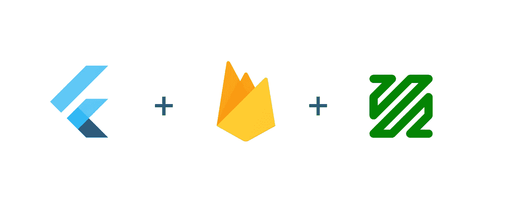
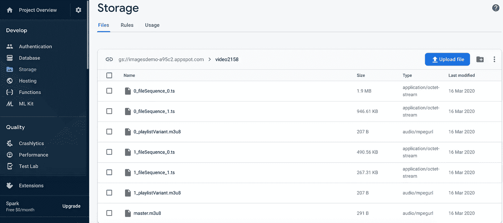
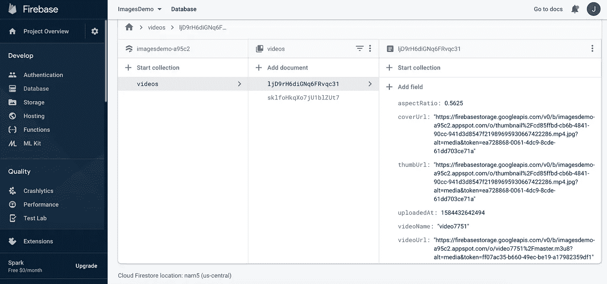
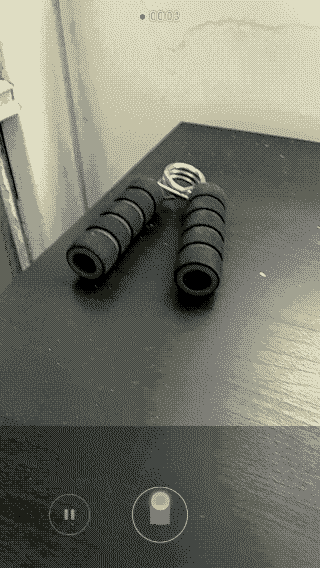

# 如何用 Firebase 存储制作一个无服务器的 Flutter 视频分享 app，包括 HLS 和客户端编码

> 原文：<https://itnext.io/how-to-make-a-serverless-flutter-video-sharing-app-with-firebase-storage-including-hls-and-411e4fff68fa?source=collection_archive---------0----------------------->



# 我们正在建造的东西

我们将看到如何为 iOS/Android 构建一个 flutter 应用程序，允许用户查看和共享视频。在我的[上一篇文章](/how-to-make-a-cross-platform-serverless-video-sharing-app-with-flutter-firebase-and-publitio-900a9fa0dd68)中，我展示了如何用 [Publitio](https://publit.io?fpr=jonathan43) 作为我们的视频存储 API 来实现这一点。在本教程中，我们将使用 [Firebase 云存储](https://firebase.google.com/docs/storage)来托管视频。我们还将添加客户端编码和 HLS 支持，因此客户端可以以自适应比特率传输视频。


# 堆栈

*   [Flutter](https://flutter.dev/)——用于制作跨平台 app。
*   [Firebase Cloud Firestore](https://firebase.google.com/docs/firestore) —用于存储视频元数据(URL)和客户端之间的同步(无需编写服务器代码)。
*   [Firebase 云存储](https://firebase.google.com/docs/storage) —用于托管实际视频。
*   [FFmpeg](https://www.ffmpeg.org/) —用于运行客户端视频编码。

# 为什么要客户端编码？

在大多数视频工作流中，会有一个转码服务器或无服务器云功能，将视频编码为各种分辨率和比特率，以便在所有设备和网络速度下实现最佳观看效果。

如果你不想使用转码服务器或 API(这可能非常昂贵)，并且取决于你的应用程序需要上传和查看的视频类型，你可以选择完全放弃服务器端转码，只在客户端对视频进行编码。这将节省大量成本，但会将视频编码的负担加在客户端上。

即使您*确实*使用了某种服务器端代码转换解决方案，您也可能希望在客户端执行最少的编码。原始视频的大小(尤其是在 iOS 上)可能很大，你不想浪费用户的数据计划，或者强迫他们不必要地等待 WiFi。

> 要了解如何使用云函数和专用 API 进行服务器端编码，请阅读下一篇文章

# 视频编码引物

这是我们将要使用的一些术语的简要介绍。

## X264 编解码器/编码器

这是用于将视频编码为 H.264/MPEG-4 AVC 格式的软件。还有许多其他编解码器，但鉴于 H.264 格式是目前唯一一种在 iOS 和 Android 上都受到本机支持的编解码器，这是我们将使用的。

## 自适应比特率流

一种将视频编码成多种比特率(不同质量)，并将每种比特率编码成许多小块的方法。*流协议*将允许玩家根据网络速度选择下一个块的质量。因此，如果您从 WiFi 转向蜂窝数据，您的播放器可以相应地调整比特率，而无需重新加载整个视频。

有许多流媒体协议，但 iOS 和 Android 原生支持的是苹果的 *HLS* — HTTP 直播流媒体。在 HLS 中，视频以`.ts`文件的形式被分割成块，一个`.m3u8`播放列表文件用于指向块。对于每种质量，或者说*变体流*，都有一个播放列表文件和一个主播放列表来管理它们💍。

# 配置

## 安装 flutter_ffmpeg

我们将使用 [flutter_ffmpeg](https://pub.dev/packages/flutter_ffmpeg) 包在 iOS/Android 上运行编码作业。`flutter_ffmpeg`要求选择一个编解码器`package`，根据你想要使用的。这里我们将使用`min-gpl-lts`包，因为它包含 x264 编解码器，并且可以在发布版本中使用。

将以下内容添加到您的`android/build.gradle`:

```
ext { 
  flutterFFmpegPackage = "min-gpl-lts" 
}
```

在你的`Podfile`中替换这一行:

```
pod name, :path => File.join(symlink, 'ios')
```

有了这个:

```
if name == 'flutter_ffmpeg'
  pod name+'/min-gpl-lts', :path => File.join(symlink, 'ios')
else
  pod name, :path => File.join(symlink, 'ios')
```

## 云存储配置

如果你已经在你的项目中设置了 [firebase，正如](https://firebase.google.com/docs/flutter/setup)[上一篇文章](/how-to-make-a-cross-platform-serverless-video-sharing-app-with-flutter-firebase-and-publitio-900a9fa0dd68)中所讨论的，那么你只需要添加`cloud_firestore`包。

现在我们需要配置视频文件的公共读取权限，这样我们就可以在没有令牌的情况下访问它们(见[评论](https://www.learningsomethingnew.com/flutter-video-upload-firebase-storage-hls#public-access-to-stored-videos))。在这个例子中，为了简单起见，我没有添加任何身份验证，所以我们也允许公共写访问，但这应该在生产应用程序中进行更改。因此，在 Firebase 控制台中，转到存储- >规则并将其更改为:

```
service firebase.storage { 
  match /b/{bucket}/o { 
    match /{allPaths=**} { 
      allow read; allow write; 
    } 
  } 
}
```

# 客户端视频处理中的阶段

这是我们对每个视频要做的一系列步骤:

*   从`image_picker`获取原始视频路径
*   获取纵横比
*   使用 ffmpeg 生成缩略图
*   将原始视频编码到 HLS 文件中
*   上传缩略图 jpg 到云存储
*   将编码文件上传到云存储
*   将视频元数据保存到云 Firestore

我们来过一遍每一步，看看怎么实现。

# 编码提供商

我们将创建一个封装编码逻辑的`EncodingProvider`类。该类将保存所需的`flutter_ffmpeg`实例。

```
class EncodingProvider {
  static final FlutterFFmpeg _encoder = FlutterFFmpeg();
  static final FlutterFFprobe _probe = FlutterFFprobe();
  static final FlutterFFmpegConfig _config = FlutterFFmpegConfig();

...
}
```

## 生成缩略图

我们将使用编码器生成一个缩略图，稍后保存到云存储中。我们告诉 FFmpeg 从尺寸为`width x height` ( `-s`选项)的`videoPath` ( `-i`选项)中取出一帧(`-vframes`选项)。我们检查结果代码以确保操作成功完成。

## 获取视频长度和纵横比

我们将使用`FlutterFFprobe.getMediaInformation`并计算纵横比(flutter 视频播放器需要的)并获得视频长度(计算编码进度需要的):

## 编码视频

现在是实际的视频编码。对于这个例子，我使用了这个优秀的 [HLS 教程](https://hlsbook.net/creating-a-master-playlist-with-ffmpeg/)中的参数。我们正在创建两个不同的流，一个有`2000k`比特率，一个有`365k`比特率。这将为每个不同质量流生成多个`fileSequence.ts`文件(视频块),并为每个流生成一个`playlistVariant.m3u8`文件(播放列表)。它还会生成一个列出所有`playlistVariant.m3u8`文件的`master.m3u8`。

> 注意:这是一个简单的编码示例，但是选项是无穷无尽的。完整名单:【https://ffmpeg.org/ffmpeg-formats.html】[](https://ffmpeg.org/ffmpeg-formats.html)

## *显示编码进度*

*编码可能需要很长时间，向用户展示正在发生的事情是很重要的。我们将使用 FFmpeg 的`enableStatisticsCallback`来获得当前编码帧的时间，并除以视频持续时间来获得进度。然后我们将更新连接到`LinearProgressBar`的`_progress`状态字段。*

# *上传文件*

*既然编码已经完成，我们需要将文件上传到云存储。*

## *将单个文件上传到云存储*

*上传到云存储非常简单。我们用`FirebaseStorage.instance.ref().child(folderName).child(fileName)`将一个`StorageReference`放入我们想要存储文件的路径中。然后我们调用`ref.putFile(file)`，用`_onUploadProgress`监听事件流，在那里我们更新`_progress`状态字段，就像我们对编码所做的那样。上传完成后，`await taskSnapshot.ref.getDownloadURL()`将返回我们可以用来访问文件的 url。*

## *修复 HLS 文件*

*现在我们需要检查所有生成的 HLS 文件(`.ts`和`.m3u8`)，并将它们上传到云存储文件夹中。但在此之前，我们需要修复它们，以便它们指向与它们在云存储中的位置相关的正确 URL。以下是在客户端创建`.m3u8`文件的方式:*

```
*#EXTM3U
#EXT-X-VERSION:3
#EXT-X-TARGETDURATION:3
#EXT-X-MEDIA-SEQUENCE:0
#EXTINF:2.760000,
1_fileSequence_0.ts
#EXT-X-ENDLIST*
```

*注意这条线`1_fileSequence_0.ts`。这是播放列表中`.ts`块的相对路径。但是当我们将它上传到一个文件夹时，它在 URL 中缺少文件夹名称。它还缺少`?alt=media`查询参数，该参数是从 Firebase 获取实际文件而不仅仅是元数据所必需的。它应该是这样的:*

```
*#EXTM3U
#EXT-X-VERSION:3
#EXT-X-TARGETDURATION:3
#EXT-X-MEDIA-SEQUENCE:0
#EXTINF:2.760000,
video4494%2F1_fileSequence_0.ts?alt=media
#EXT-X-ENDLIST*
```

*因此，我们需要一个函数将这两样东西添加到主播放列表中的每个`.ts`条目和每个`.m3u8`条目:*

## *上传 HLS 文件*

*最后，我们将检查所有生成的文件并上传它们，必要时修复`.m3u8`文件:*

*这是上传的文件在云存储中的样子:*

**

# *将元数据保存到 Firestore*

*获得视频的存储 url 后，我们可以将元数据保存在 Firestore 中，这样我们就可以在用户之间即时共享视频。正如我们在[上一篇文章](/how-to-make-a-cross-platform-serverless-video-sharing-app-with-flutter-firebase-and-publitio-900a9fa0dd68)中看到的，将元数据保存到 Firestore 很容易:*

*这是 Firestore 中视频文档的外观:*

**

# *把所有的放在一起*

*现在将它们放在一个处理函数中，该函数将经历我们看到的所有阶段，并更新状态以显示当前的作业状态(输入来自输出):*

# *显示视频列表*

*我们在[之前的帖子](/how-to-make-a-cross-platform-serverless-video-sharing-app-with-flutter-firebase-and-publitio-900a9fa0dd68)中看到了如何收听 Firestore 并显示视频列表视图。简而言之，我们使用`snapshots().listen()`来监听更新流，使用`ListView.builder()`来创建一个列表，通过 _videos 状态字段对流中的变化做出反应。*

*对于每个视频，我们显示一个包含显示视频的`thumbUrl`的`adeInImage.memoryNetwork`的`Card`，在它旁边是`videoName`和`uploadedAt`字段。我使用了 [timeago](https://pub.dev/packages/timeago) 插件以友好的方式显示上传时间。*

*现在我们有了:*

**

*限制*

# *限制*

## *邱建*

*视频编码是一项 CPU 密集型工作。因为 flutter 是单线程的，所以运行 ffmpeg 编码会在运行时导致 jank(不连贯的 UI)。解决方案当然是将编码卸载到后台进程。遗憾的是，我还没有找到用 flutter_ffmpeg 轻松做到这一点的方法。如果你有一个在后台长时间运行的视频编码工作的工作方法，请让我知道！(为了减轻 jank 效应，您可以显示一个编码进度条，并且在它完成之前不允许对 UI 的任何其他使用。)*

## *提前终止*

*长时间编码/上传作业的另一个问题是，在作业完成之前，操作系统可以决定在最小化时关闭应用程序的进程。您必须管理作业状态，并从作业停止的地方重新启动/恢复作业。*

## *公众对存储视频的访问*

*使用这种方法从云存储中提供 HLS 服务需要对所有文件的公共读取权限。如果您需要对视频进行认证访问，您必须找到一种方法，在每次客户端下载文件时用 Firebase 令牌动态更新`.m3u8`播放列表(因为令牌会不同)。*

## *贮藏*

*flutter `video_player`插件目前不支持缓存。可以尝试用[这个支持缓存的 fork](https://github.com/syonip/plugins.git) (我在我的 app 里用的)，但是我没有用 HLS 测试过。*

*要使用它，请将它添加到“pubspec.yaml”中:*

```
*video_player:
  git:
    url: git://github.com/syonip/plugins.git
    ref: a669b59
    path: packages/video_player*
```

# *包裹*

*我认为这是一个很好的 DIY 视频托管方法，主要有两个原因:*

1.  *最少的编码量——无需编写或维护服务器代码。*
2.  *非常便宜——如果你正在做一个副业项目，想要零成本开始，你可以。Firebase 的免费计划有 1GB 存储和 10gb/月的传输限制，这是一个很好的开始。*

*感谢阅读！和往常一样，完整的源代码可以在 [GitHub](https://github.com/syonip/flutter_fbstorage_video_upload) 上找到。*

*如有疑问，欢迎留言评论！*

**最初发表于*[T5【https://www.learningsomethingnew.com】](https://www.learningsomethingnew.com/flutter-video-upload-firebase-storage-hls)*。**