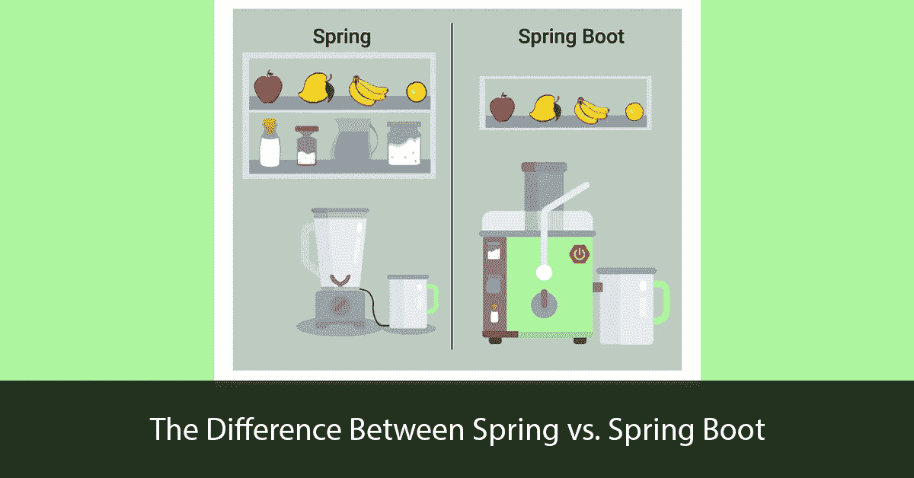
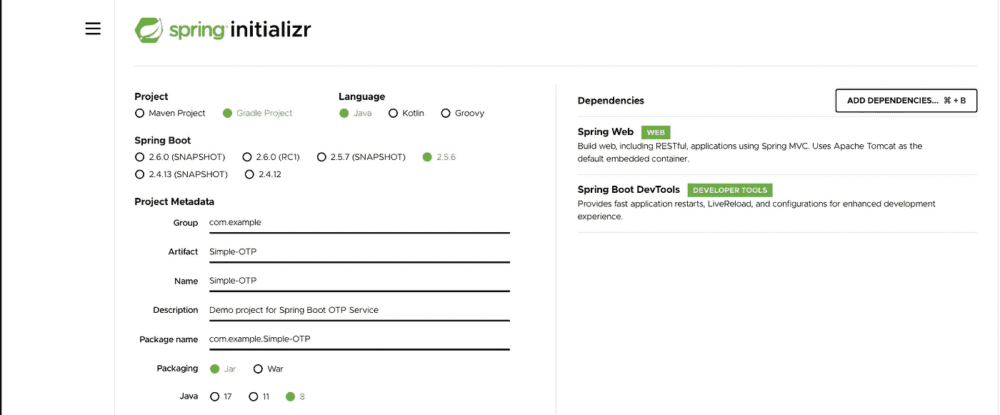
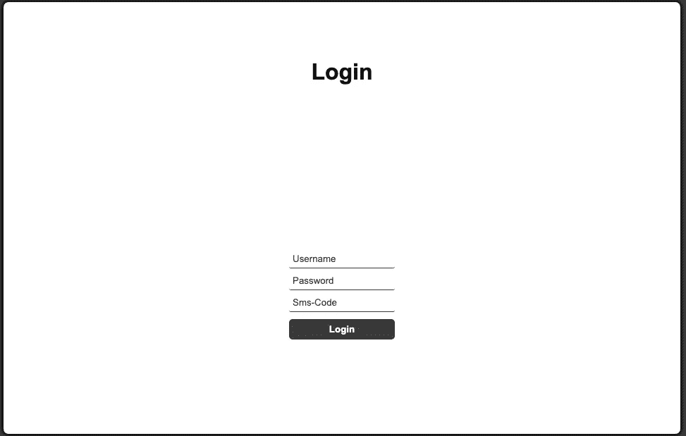

# 如何用 Spring Boot 做一个简单的一次性密码服务？

> 原文：<https://itnext.io/how-to-make-a-simple-one-time-password-service-with-spring-boot-ebe640a7be7b?source=collection_archive---------1----------------------->


李·坎贝尔的照片

在发表了上一篇[文章](/how-to-use-otp-service-in-your-automation-scripts-with-selenium-web-driver-fe81607232b5)之后，我收到消息抱怨这篇文章提供了一个复杂的例子。如果我能描述一种更简单的方法来创建一次性密码服务。

在本文中，我决定部分重复我的关于创建一次性密码的文章，并实现一种不同的方法。

在本文中，我将考虑使用 Spring boot 创建一个一次性密码微服务。我们还将使用 Selenium WebDriver 4 分析与该服务交互的实现。

最初，我们需要弄清楚什么是[弹簧靴](https://spring.io/projects/spring-boot)。

Spring Boot 是一个有用的项目，旨在简化基于 Spring 的应用程序的创建。它允许您最简单地创建一个 web 应用程序，只需要开发人员最少的努力来配置它和编写代码。

由于依赖项的繁琐配置，为企业应用程序配置 Spring 已经成为一项非常繁琐且容易出错的任务。对于同时使用几个第三方库的应用程序来说尤其如此。

每次创建另一个基于 Spring 的企业 Java 应用程序时，都需要重复相同的例行步骤来配置它:

*   这取决于所创建的应用程序的类型(Spring MVC、Spring JDBC、Spring ORM 等)。)，导入必要的 Spring 模块。
*   导入 web 容器库。
*   导入必要的第三方库(比如 Hibernate，Jackson)。
*   配置 DAO 组件，如数据源、事务管理等。
*   配置 web 层组件。
*   定义一个将加载所有必要配置的类。

Spring 的作者决定为开发人员提供一些工具，这些工具可以自动完成配置过程，并加速创建和部署 Spring 应用程序的过程，这些工具的通用名为 **Spring Boot**



Spring Boot 有很多功能，但是它最重要的特性是依赖管理、自动配置和内置的 servlet 容器。

你需要的帽子。

如上所述，我们将创建一个项目，使用 Spring Boot 和格雷来模拟 OTP 服务的操作。因此，对于我们的项目，我们必须具备以下工具和技术:

*   Spring Boot 版本 2.5.6+
*   Java8+
*   Gradle 7.2+
*   你选择的任何 IDE。(我更喜欢 IntelliJ IDEA)

使用 Spring Boot 创建任何项目都必须从以下几点开始:

[**https://start . spring . io**](https://start.spring.io)**/**

这个门户是由 Spring boot 开发人员创建的，可以在创纪录的时间内创建基于 Spring boot 的项目。

我建议您在项目创建阶段添加几个依赖项:

*   Spring Boot 的开发工具。Spring Boot 提供了一个叫做 Spring Boot 开发工具的模块。DevTools 代表开发者工具。本模块的目的是在使用 Spring Boot 应用程序的同时，尝试缩短开发时间。Spring Boot DevTools 获取更改并重启应用程序。
*   **弹簧网**。这个组包括 Web、Web-Servlet、Web-Struts 和 Web-Portlet。这些模块为创建 web 应用程序提供支持。



创建项目后，您可以在 IDE 中打开它。将自动安装所有必需的依赖项。

对于成熟的工作，我们需要创建一个控制器类。在这个类中，将集中处理 HTTP 请求的所有逻辑。姑且称之为家庭控制器吧。

RestController 批注必须添加到该类中。我们使用[**@ REST controller**](http://twitter.com/RestContoller)注释告诉 Spring 这个类是 Spring REST 应用程序的控制器。

Spring MVC 中第二个重要的注释是[**@ request mapping**](http://twitter.com/RequestMapping)。我们使用该注释将客户端请求与服务请求的适当方法进行映射。在 RequestMapping 注释的括号中，我们指定了 URL 路径。例如**@ request mapping("/API/OTP ")**

这种控制器的一个例子可能是这样的:

在 URL:[http://localhost:8080/API/OTP](http://localhost:8080/api/otp)上启动服务后，我们收到响应:

```
{"is_successful":"true","code":"1234","parameter_errors":"null","server_datetime":"Sun Nov 07 13:12:29 MSK 2021"}
```

我们的一次性密码运行良好，并返回实际结果。

但是在这个实现中，逻辑的分解出现了问题。控制器应该只处理请求。HomeController 类中不应该有无关的逻辑。为了将我们的业务逻辑从控制器中分离出来，有必要创建一个服务。每个实体必须有一个单独的服务。让我们创建一个家庭服务类。

服务组件是包含[**@服务**](http://twitter.com/Service) 注释的类文件。这些类文件用于在不同的层中编写业务逻辑，与 [**@RestController**](http://twitter.com/RestController) 类文件分开。

我们的示例 Home Service 中的服务类是一个独立的抽象层，它与我们的业务逻辑一起工作。创建服务组件类文件的逻辑如下所示:

在我们将逻辑移动到单独的服务之后，控制器数量如下所示:

让我们再次打开 URL:[http://localhost:8080/API/OTP](http://localhost:8080/api/otp)并确保结果没有改变并且服务继续正常工作:

```
{"is_successful":"true","code":"1234","parameter_errors":"null","server_datetime":"Sun Nov 07 13:12:29 MSK 2021"}
```

S 元素项目。

要检查如何使用一次性密码服务，您必须制作一个带有 OTP 字段的示例登录页面。例如，这个 HTML 页面看起来像这样:



用于处理用户在登录页面上输入的数据的 JavaScript 代码可能如下所示:

为了在框架的 UI 端使用一次性密码服务，我们需要创建一个如下所示的服务助手:

Selenium 的登录页面类可能如下所示:

自动化脚本如下所示:

C **结论**。

恭喜你完成了你的第一个春装项目。在本文中，您了解了 Spring boot 的基础知识，如何设置项目，添加项目依赖项，启动您的第一个 REST API 服务，以及如何创建简单的一次性密码服务。在本文中，我试图重点创建一个简单的 OTP 服务。这篇文章的主要目的是学习 Spring Boot 的初始能力。我们还查看了 Selenium Webdriver 与 REST API 服务交互的解决方案示例。在下一篇文章中，我计划给出一个例子，在 SpringBoot 上创建一个成熟的一次性密码，并在前端与它交互。


[https://test-engineer.site/](https://test-engineer.site/)

# 作者[安东·斯米尔诺夫](https://www.linkedin.com/in/vaskocuturilo/)