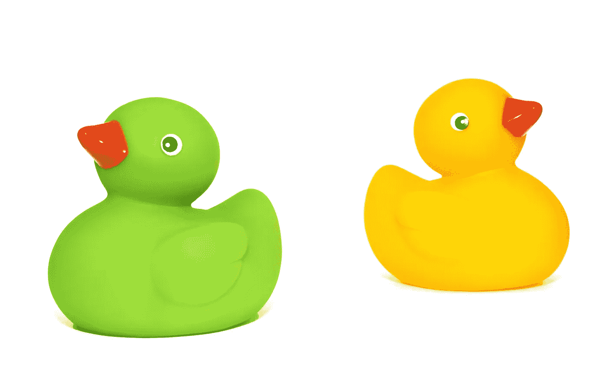
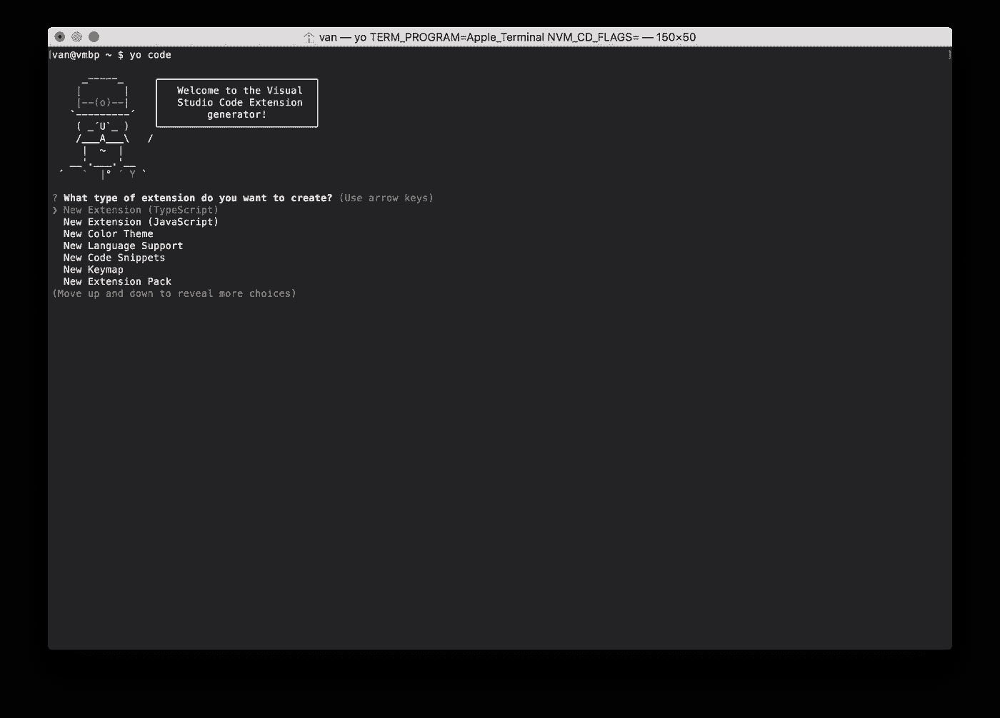

# 如何做一个 Visual Studio 代码扩展[生成鸭子]

> 原文：<https://itnext.io/how-to-make-a-visual-studio-code-extension-77085dce7d82?source=collection_archive---------3----------------------->



术语“ducks”指的是您必须使用 [re-ducks](https://github.com/alexnm/re-ducks) 模式创建的用于管理 redux 状态的文件夹和文件。

每只鸭子都需要有六到八个文件，在 Visual Studio 代码(VS 代码)中，每次向项目中添加新的鸭子时手动创建它们是很痛苦的。

```
/* A typical duck structure from re-ducks *//state
  /ducks
    /quack
      - actions.js
      - index.js
      - operations.js
      - reducers.js
      - selectors.js // Optional, still generated
      - test.js
      - types.js  
      - utils.js // Not generated
```

## 设置

您需要安装以下工具来创建 VS 代码的扩展:

*   [Visual Studio 代码](https://code.visualstudio.com/)
*   [Nodejs LTS(目前是 8.11.x)和 NPM 5.x](https://nodejs.org/en/)

从终端安装 Yeoman 和 Visual Studio 代码扩展生成器。

```
npm install -g yo generator-code
```

我们将使用 Yeoman 创建一个项目模板，使用微软的首选结构和设置来开发扩展。

在项目文件夹中打开一个终端，运行`yo code`来启动扩展的生成器。选择“新扩展名(TypeScript)”选项。



回答约曼代码生成器提出的所有问题。


约曼发电机将产生一个“鸭子发电机”项目，其结构如下:

```
/duck-generator
  /src
    /test
      - extension.test.ts
      - index.ts
    - extension.ts
  - package.json
  - tsconfig.json
  - tslint.json
  - CHANGELOG.MD
  - README.MD
  - vsc-extension-quickstart.md
```

这些是项目模板中的关键文件:

*   `package.json` —描述扩展以及在哪里可以找到它的入口点和激活触发器。
*   `tsconfig.json`—TypeScript 编译器的配置文件。
*   `tslint.json` —打字稿林挺规则。
*   `CHANGELOG.MD` —扩展的变更日志。这将显示在扩展库的“Changelog”部分。
*   `README.MD` —对您的扩展的描述。这将显示在扩展图库的“详细信息”部分。
*   `src/**` —扩展的存根代码。我们将删除并更改此目录中的文件。

## 开发依赖性

默认模板包括 Mocha 测试框架，根据[文档](https://code.visualstudio.com/docs/extensions/testing-extensions)，它的行为更像集成测试而不是单元测试:

> …本文档主要关注 VS 代码集成测试。对于单元测试，你可以使用任何流行的测试框架，比如 [Mocha](https://mochajs.org/) 或者 [Jasmine](https://jasmine.github.io/) 。

我将使用 [Jest](https://facebook.github.io/jest/) 代替摩卡或茉莉，因为我对它最熟悉。

通过 NPM 安装工具以在 TypeScript 中使用 Jest:

```
npm install --save-dev jest ts-jest @types/jest
```

包装:

*   `[jest](https://facebook.github.io/jest/)` —单元测试框架。
*   `[ts-jest](https://www.npmjs.com/package/ts-jest)` —允许运行用 TypeScript 编写的 jest 测试的预处理器。
*   `@types/jest`—jest 测试框架的打字稿定义。这个包将在用 TypeScript 编写 jest 测试时提供智能感知。

## 鸭子发电机

我们将创建一个包含创建鸭子的逻辑的类。

首先在`src`目录下创建一个名为`duck-generator.ts`的文件。打开文件并存根函数。为简单起见，让它们都成为公共函数。

此类测试可在找到[。](https://github.com/vanister/duck-generator/blob/master/src/test/duck-generator.test.ts)

当扩展执行时，它将调用`DuckGenerator.execute()`函数来启动提示输入名称、验证输入、创建本地目录的绝对路径，最后为 duck 创建文件的流程。

让我们实现这些功能，从最简单的开始。

构造函数将接受我们从主扩展文件传入的两个参数。这将允许我们为`DuckGenerator`编写测试，而不必担心模仿 vscode sdk 模块中的`import`语句或模块。

注意:由于我们不想导入整个 vscode sdk，我们将创建一个自定义接口(`[VSCodeWindow](https://github.com/vanister/duck-generator/blob/master/src/vscode.interfaces.ts)`)，为 sdk 的窗口命名空间提供智能感知。

`toAbsolutePath`功能。

`validate`功能。

`prompt`功能。

`create`功能。

`execute`功能。

我决定将单元测试代码排除在文章之外，因为我认为这会使文章代码太多。如果你想看这个文件的测试，可以在这里找到。

## 实用程序、接口和错误

我们将添加一个带有函数的实用模块，我们可以使用它来确定工作区文件夹在项目的当前上下文中的位置。我们将这段代码放入它自己的模块中，这样我们就可以独立于生成器和扩展入口点来测试它。

创建一个名为`utils`的文件夹，并向其中添加一个名为`workspace-util.ts`的文件。从中导出一个函数，该函数将允许我们从扩展入口点调用来获取工作区根。

此处的[为该模块的测试](https://github.com/vanister/duck-generator/blob/master/src/test/utils/workspace-util.test.ts)。

`DuckGenerator`实现了一个`IDisposable`接口，这样当扩展被销毁时，就会调用一个 dispose 函数。即使我们不打算使用它，让我们添加它，这样，如果我们确实从 sdk 或节点引入了任何稍后需要清理的资源，我们可以在 dispose 函数中这样做。

当用户试图创建一只已经存在的鸭子时，我们在类型`DuckExistError`上抛出一个错误，这是一个我们需要创建的自定义错误。

对该错误的测试是[这里是](https://github.com/vanister/duck-generator/blob/master/src/test/errors/duck-exists.error.test.ts)。

## 扩展

扩展的入口点在用 Yeoman 项目模板创建的`extension.ts`文件中。让我们编辑它，以便在激活扩展时调用我们的`DuckGenerator`。

我们没有向入口点文件添加任何功能。它的主要目的是充当我们编写和测试的代码的驱动程序，以及由 vscode sdk 提供的代码，以使扩展工作。

## 包扎

也就是说，扩展已经准备好进行测试、打包并发布到 Visual Studio 代码扩展库中。

如果你想在本地测试扩展，只需选择“扩展调试”，启动设置并按下调试(播放按钮)或`F5`。

您可以通过安装来自 NPM 的`vsce`包来打包扩展。

```
npm install -g vsce// package locally, run from extension project root
vsce package
```

如果您想发布该扩展，请查看微软的发布指南:[https://code . visual studio . com/docs/extensions/publish-extension](https://code.visualstudio.com/docs/extensions/publish-extension)。

这篇文章的代码可以在 GitHub 上找到:[https://GitHub . com/vanister/duck-generator/tree/medium-article](https://github.com/vanister/duck-generator/tree/medium-article)。

我发表这个扩展到画廊:【https://marketplace.visualstudio.com/items? itemName = vanister . duck generator。

享受制作和发布扩展！